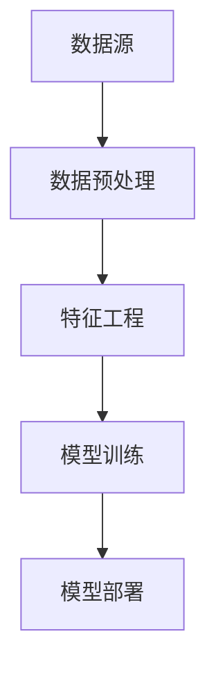
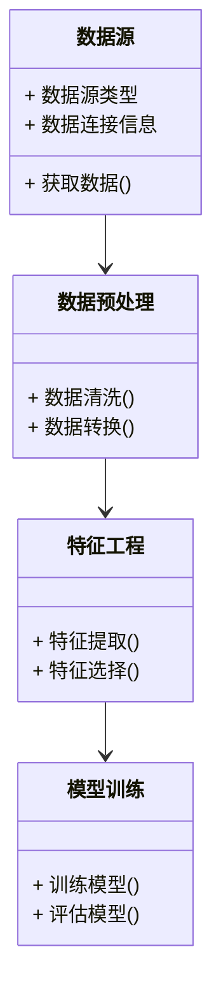
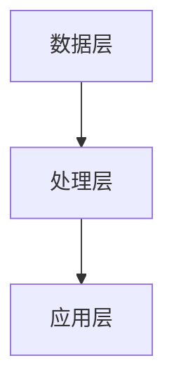

                 


# 企业AI Agent的大数据处理框架

## 关键词：
- 企业AI Agent
- 大数据处理框架
- 数据预处理
- 模型训练
- 系统架构设计

## 摘要：
随着企业数字化转型的不断深入，AI Agent（人工智能代理）在大数据处理中的应用越来越广泛。本文将详细探讨企业AI Agent如何与大数据处理框架相结合，分析其核心概念、算法原理、系统架构设计以及实际项目中的应用。通过本文，读者将能够理解企业AI Agent在大数据处理中的关键作用，并掌握构建高效大数据处理框架的方法。

---

# 第1章: 引言

## 1.1 企业AI Agent与大数据处理框架的背景
随着企业规模的不断扩大，数据量呈指数级增长。企业需要处理的数据来源多样，包括结构化数据、非结构化数据以及实时流数据。如何高效地处理这些数据，并将其转化为企业的决策支持工具，成为了企业面临的重要挑战。

AI Agent作为一种智能代理，能够自动化地感知环境、理解需求并执行任务。在大数据处理框架中，AI Agent可以作为数据处理的核心驱动力，帮助企业在复杂的数据环境中快速提取有价值的信息。

## 1.2 问题背景与目标
企业面临的主要问题包括：
- 数据量大：企业每天产生的数据量可能以GB或TB计，传统的数据处理方法难以应对。
- 数据复杂性：数据来源多样，格式复杂，需要进行清洗和预处理。
- 处理效率：如何在有限的时间内高效处理数据并生成实时反馈。

本书的目标是通过构建企业AI Agent的大数据处理框架，解决上述问题，提升企业的数据处理能力。具体目标包括：
- 提供一个高效的大数据处理框架，支持多种数据源和数据格式。
- 利用AI Agent实现数据处理的自动化和智能化。
- 提供可扩展的架构设计，适应企业数据规模的增长。

## 1.3 本书的结构
本书将从理论到实践，逐步讲解企业AI Agent的大数据处理框架。内容包括：
- 核心概念：企业AI Agent与大数据处理框架的定义、特点及相互关系。
- 算法原理：数据预处理、特征工程、模型训练与部署的详细流程。
- 系统架构设计：从问题场景分析到系统功能设计，再到架构图的绘制。
- 项目实战：通过实际案例，讲解环境搭建、代码实现、案例分析等。

---

# 第2章: 企业AI Agent的核心概念

## 2.1 AI Agent的定义与特点
### 2.1.1 AI Agent的定义
AI Agent（人工智能代理）是一种智能系统，能够感知环境、理解任务需求并执行操作。它能够通过与环境的交互，动态调整自身的行为以达到目标。

### 2.1.2 AI Agent的特点
- **自主性**：AI Agent能够自主决策，无需人工干预。
- **反应性**：能够实时感知环境变化并做出响应。
- **学习能力**：通过机器学习算法不断优化自身的处理能力。

### 2.1.3 企业AI Agent的独特性
在企业环境中，AI Agent需要具备以下独特能力：
- **多任务处理**：能够同时处理多种数据类型和任务。
- **高可用性**：确保在复杂环境下的稳定运行。
- **可扩展性**：能够适应企业数据规模的增长。

## 2.2 大数据处理框架的组成
### 2.2.1 数据源与数据流
大数据处理框架通常涉及多种数据源，如数据库、文件系统、实时流数据等。数据流的处理流程包括数据采集、清洗、转换和存储。

### 2.2.2 数据预处理与特征工程
数据预处理是大数据处理的关键步骤，包括数据清洗（去除噪声数据）、数据转换（如格式转换）和数据增强（如特征提取）。

### 2.2.3 模型训练与部署
模型训练是利用机器学习算法对数据进行训练，生成可用于预测或分类的模型。部署阶段则将模型集成到实际系统中，提供实时服务。

## 2.3 AI Agent与大数据处理框架的关系
AI Agent在大数据处理框架中扮演着核心角色。它不仅负责数据的采集和预处理，还负责模型的训练和部署。通过AI Agent的智能化处理，企业能够实现数据到决策的自动化流程。

### 2.3.1 数据处理流程
1. **数据采集**：从多种数据源采集数据。
2. **数据预处理**：清洗、转换和增强数据。
3. **特征工程**：提取特征，为模型训练做准备。
4. **模型训练**：利用机器学习算法训练模型。
5. **模型部署**：将模型部署到生产环境中，提供实时服务。

### 2.3.2 框架的可扩展性与灵活性
企业AI Agent的大数据处理框架需要具备良好的可扩展性和灵活性。通过模块化设计，框架能够轻松扩展以适应不同的数据规模和类型。

## 2.4 核心概念对比表
| 概念       | 描述                                                                 |
|------------|----------------------------------------------------------------------|
| 数据源     | 数据输入的来源，如日志文件、数据库等                                   |
| 数据预处理 | 对数据进行清洗、转换和标准化的步骤                                 
| 模型训练   | 利用机器学习算法对数据进行训练，生成可用于预测的模型              

## 2.5 实体关系图（Mermaid）


---

# 第3章: 算法原理

## 3.1 数据预处理算法
### 3.1.1 数据清洗
数据清洗是数据预处理的重要步骤，包括去除噪声数据、处理缺失值和重复值。

#### 示例代码：
```python
import pandas as pd
data = pd.read_csv('data.csv')
data.dropna(inplace=True)
data.drop_duplicates(inplace=True)
```

### 3.1.2 数据转换
数据转换包括数据标准化、归一化和特征编码。

#### 示例代码：
```python
from sklearn.preprocessing import StandardScaler
scaler = StandardScaler()
data_scaled = scaler.fit_transform(data)
```

## 3.2 特征工程
特征工程是通过提取和选择特征，提高模型的性能。

### 3.2.1 特征提取
特征提取可以通过主成分分析（PCA）等方法实现。

#### 数学公式：
$$
PCA: Y = X \cdot P
$$

### 3.2.2 特征选择
特征选择可以通过统计方法或模型评估方法实现。

## 3.3 模型训练算法
### 3.3.1 线性回归
线性回归是一种简单的回归算法，适用于线性关系的数据。

#### 数学公式：
$$
y = \beta_0 + \beta_1x + \epsilon
$$

### 3.3.2 支持向量机（SVM）
支持向量机是一种常用的分类算法。

#### 示例代码：
```python
from sklearn.svm import SVC
model = SVC()
model.fit(X_train, y_train)
```

---

# 第4章: 系统架构设计

## 4.1 问题场景分析
企业AI Agent需要处理多种数据源，包括结构化数据、非结构化数据和实时流数据。

## 4.2 系统功能设计
### 4.2.1 领域模型
领域模型是系统功能设计的基础，通常通过类图表示。



## 4.3 系统架构设计
### 4.3.1 分层架构
系统架构通常采用分层设计，包括数据层、处理层和应用层。



### 4.3.2 接口设计
系统需要定义清晰的接口，便于模块间的交互。

---

# 第5章: 项目实战

## 5.1 环境安装
安装必要的库，如Python的pandas、scikit-learn等。

## 5.2 核心代码实现
### 5.2.1 数据预处理
```python
import pandas as pd
from sklearn.preprocessing import StandardScaler

data = pd.read_csv('data.csv')
data.dropna(inplace=True)
data.drop_duplicates(inplace=True)

scaler = StandardScaler()
data_scaled = scaler.fit_transform(data)
```

### 5.2.2 模型训练
```python
from sklearn.linear_model import LinearRegression

model = LinearRegression()
model.fit(X_train, y_train)
```

## 5.3 案例分析
通过实际案例，展示企业AI Agent在大数据处理中的应用。

---

# 第6章: 总结与展望

## 6.1 总结
本文详细介绍了企业AI Agent的大数据处理框架，包括核心概念、算法原理、系统架构设计和项目实战。

## 6.2 未来展望
未来，随着人工智能和大数据技术的不断发展，企业AI Agent的大数据处理框架将更加智能化和自动化。

---

通过本文的学习，读者将能够深入了解企业AI Agent在大数据处理中的应用，并掌握构建高效大数据处理框架的方法。

