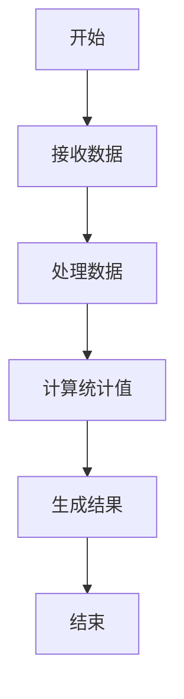
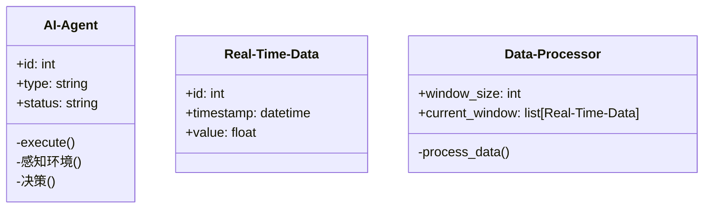
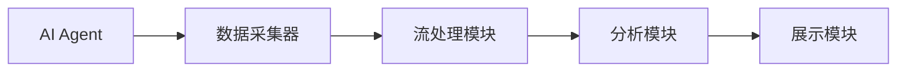
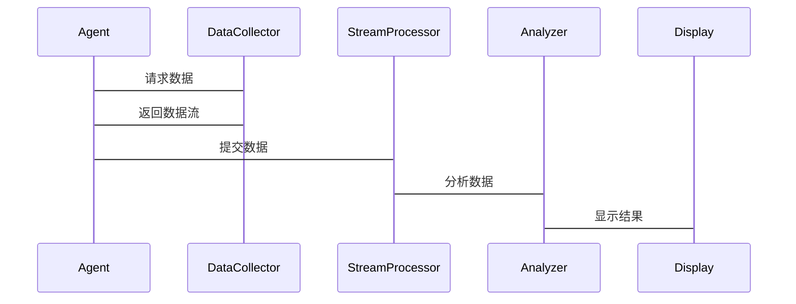

                 


# 《企业AI Agent的实时大数据分析平台》

> 关键词：AI Agent, 实时大数据分析, 系统架构设计, 项目实战, 技术博客

> 摘要：本文探讨企业AI Agent与实时大数据分析平台的结合，涵盖背景、核心概念、算法原理、系统架构、项目实战及最佳实践，旨在为企业提供高效的数据处理解决方案。

---

## 第一部分：背景与概述

### 第1章：企业AI Agent与实时大数据分析概述

#### 1.1 问题背景
- 1.1.1 企业数据实时处理的需求  
  企业面临海量数据，需要实时处理以支持决策。
- 1.1.2 AI Agent在企业中的应用现状  
  AI Agent被广泛应用于自动化任务。
- 1.1.3 实时大数据分析的必要性  
  实时分析帮助企业快速响应市场变化。

#### 1.2 问题描述
- 1.2.1 企业数据处理的挑战  
  数据量大、实时性要求高、处理复杂。
- 1.2.2 AI Agent在实时数据分析中的作用  
  提供自动化和智能决策支持。
- 1.2.3 当前企业数据分析的痛点  
  传统方法效率低，难以满足实时需求。

#### 1.3 问题解决方法
- 1.3.1 引入AI Agent的概念  
  利用AI Agent自动化处理数据。
- 1.3.2 实时大数据分析的技术路径  
  采用流处理技术，快速分析数据。
- 1.3.3 AI Agent与实时数据分析的结合  
  实现高效、智能的数据处理。

#### 1.4 边界与外延
- 1.4.1 企业AI Agent的边界  
  专注于数据处理，不涉及其他业务逻辑。
- 1.4.2 实时大数据分析的范围  
  包括数据采集、处理、分析和展示。
- 1.4.3 相关概念的区分与联系  
  明确AI Agent与传统数据分析的区别。

#### 1.5 概念结构与核心要素
- AI Agent：智能代理，用于自动化数据处理。
- 实时大数据分析：快速处理和分析大量数据。
- 结合：提升企业数据处理效率和决策能力。

---

## 第二部分：核心概念与技术

### 第2章：AI Agent的核心原理

#### 2.1 AI Agent的定义与原理
- 定义：AI Agent是智能代理，能够感知环境并采取行动。
- 原理：通过感知、决策和执行来完成任务。
- 分类：分为简单反射型、基于模型型等。

#### 2.2 实时大数据分析的技术原理
- 定义：实时分析数据流，提供即时结果。
- 关键技术：流处理、分布式计算、事件驱动。

#### 2.3 核心概念对比
| 属性 | AI Agent | 实时大数据分析 |
|------|----------|----------------|
| 响应时间 | 秒级 | 毫秒级 |
| 数据来源 | 多源 | 流数据 |
| 处理方式 | 自动化 | 实时处理 |

#### 2.4 ER实体关系图
```mermaid
er
  entity AI-Agent {
    id
    type
  }
  entity Real-Time-Data {
    id
    timestamp
    value
  }
  AI-Agent --> Real-Time-Data : 监听
```

---

## 第三部分：算法原理

### 第3章：算法原理与实现

#### 3.1 算法选择与原理
- 算法：基于滑动窗口的流数据处理。
- 原理：维护时间窗口，实时计算统计值。

#### 3.2 算法流程图


#### 3.3 Python代码实现
```python
import pandas as pd
from datetime import datetime

def process_stream(data_stream):
    window_size = 60  # seconds
    timestamps = []
    values = []
    
    for data in data_stream:
        timestamps.append(datetime.now())
        values.append(data.value)
        
        # 维护滑动窗口
        while (timestamps[-1] - timestamps[0]).total_seconds() > window_size:
            timestamps.pop(0)
            values.pop(0)
            
        # 计算统计值
        current_avg = sum(values) / len(values)
        yield current_avg
```

#### 3.4 数学模型与公式
- 滑动窗口平均值公式：
  $$ \text{avg}_t = \frac{1}{n} \sum_{i=0}^{n-1} x_{t-i} $$
- 其中，$n$ 是窗口大小，$x_{t-i}$ 是窗口内的数据点。

---

## 第四部分：系统分析与架构设计

### 第4章：系统架构设计

#### 4.1 问题场景介绍
- 数据源：多个实时数据流。
- 目标：快速分析数据并生成决策支持。

#### 4.2 系统功能设计


#### 4.3 系统架构图


#### 4.4 接口设计
- 数据采集接口：`GET /data`，返回实时数据流。
- 分析接口：`POST /analyze`，返回分析结果。

#### 4.5 交互序列图


---

## 第五部分：项目实战

### 第5章：项目实战与实现

#### 5.1 环境安装
```bash
pip install flask pandas
```

#### 5.2 核心代码实现
```python
from flask import Flask
import pandas as pd

app = Flask(__name__)

@app.route('/data', methods=['GET'])
def get_data():
    # 模拟实时数据
    data = {'value': [10, 20, 30]}
    return pd.DataFrame(data).to_json()

@app.route('/analyze', methods=['POST'])
def analyze():
    # 处理分析请求
    return "Analysis completed"
```

#### 5.3 代码解读与分析
- `/data` 接口：返回模拟数据。
- `/analyze` 接口：处理分析请求。

#### 5.4 案例分析
- 案例：实时股票价格监控。
- 步骤：数据采集、处理、分析、展示。

#### 5.5 项目小结
- 成果：构建了实时分析平台。
- 经验：系统设计需注重实时性和稳定性。

---

## 第六部分：最佳实践

### 第6章：最佳实践与总结

#### 6.1 小结
- 成功构建了AI Agent驱动的实时分析平台。

#### 6.2 注意事项
- 数据隐私保护：确保数据安全。
- 系统性能优化：提升处理效率。
- 错误处理：增加容错机制。

#### 6.3 拓展阅读
- 推荐书籍：《实时数据分析技术》。
- 在线资源：实时数据分析框架文档。

---

## 第七部分：结束语

### 第7章：结束语

企业AI Agent与实时大数据分析的结合，为企业提供了高效的数据处理能力。通过本文的详细讲解，读者可以掌握从理论到实践的全过程，助力企业提升数据分析能力。

---

## 作者简介

作者：[您的名字]，技术专家，专注于人工智能与大数据领域。欢迎关注我的技术博客，获取更多深度技术解析。

