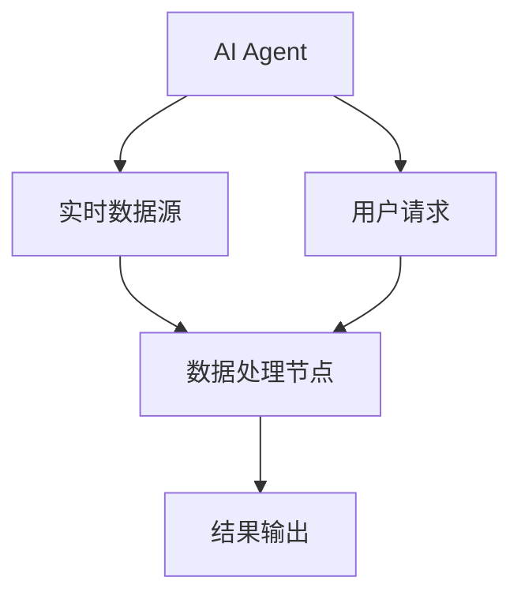
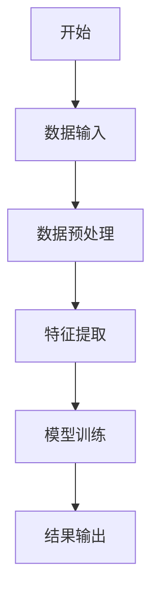
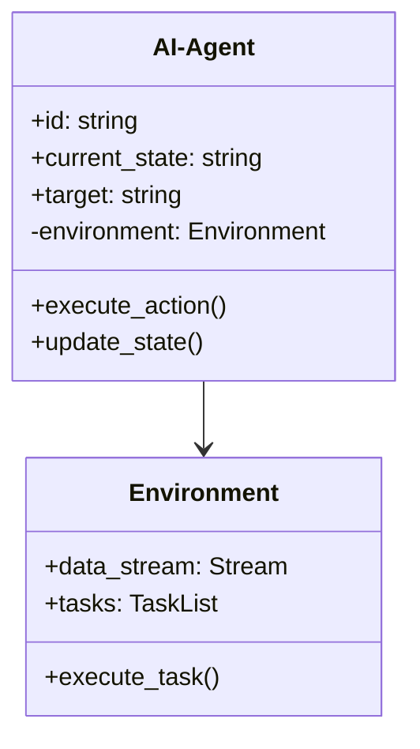
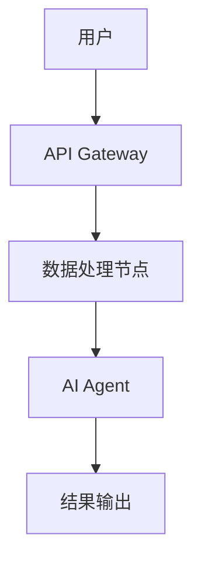

                 


# 企业AI Agent的实时大数据处理架构

> 关键词：AI Agent、实时大数据、分布式计算、流数据处理、机器学习

> 摘要：本文深入探讨了企业AI Agent在实时大数据处理中的架构设计，从背景、算法、系统架构到实战，全面解析了如何构建高效的实时大数据处理系统。通过详细的技术分析和实际案例，帮助读者理解并应用这些技术。

---

## 第一部分: 企业AI Agent的实时大数据处理概述

### 第1章: 企业AI Agent与实时大数据处理概述

#### 1.1 问题背景与目标

##### 1.1.1 企业AI Agent的定义与特点
企业AI Agent是一种智能代理系统，能够根据实时数据做出决策并执行操作。其特点包括自主性、反应性、目标导向和社会能力，能够适应动态变化的环境。

##### 1.1.2 实时大数据处理的必要性
在企业运营中，实时数据处理能够快速响应市场变化，提高决策效率。通过实时数据分析，企业可以及时调整策略，优化资源配置。

##### 1.1.3 企业AI Agent在实时大数据处理中的作用
AI Agent能够自动处理和分析实时数据，提供智能化的决策支持，帮助企业在复杂环境中保持竞争力。

#### 1.2 核心问题描述

##### 1.2.1 实时数据处理的挑战
实时数据处理需要高效的数据传输、快速的处理能力以及可靠的系统架构。同时，数据的实时性要求系统具备低延迟和高吞吐量。

##### 1.2.2 AI Agent在实时数据处理中的应用场景
AI Agent广泛应用于金融交易、物联网监控、供应链管理等领域，能够实时处理大量数据，提供实时反馈和决策支持。

##### 1.2.3 企业级实时大数据处理的边界与外延
企业级实时大数据处理不仅包括数据的采集和处理，还涉及数据存储、分析和可视化，覆盖从数据源到最终用户的整个流程。

#### 1.3 解决思路与架构

##### 1.3.1 问题解决的总体思路
通过构建高效的实时数据处理系统，结合AI Agent的智能决策能力，实现对企业运营的实时监控和优化。

##### 1.3.2 架构设计的核心要素
实时数据处理架构需要考虑数据源、处理节点、存储系统、分析引擎和用户界面等多个部分的协同工作。

##### 1.3.3 企业AI Agent与实时大数据处理的结合方式
通过API接口将AI Agent与实时数据处理系统集成，实现数据的实时采集、分析和反馈。

#### 1.4 本章小结
本章介绍了企业AI Agent和实时大数据处理的基本概念，分析了它们在企业中的作用和应用场景，为后续的深入讨论奠定了基础。

---

## 第二部分: 核心概念与联系

### 第2章: AI Agent与实时大数据处理的核心概念

#### 2.1 核心概念原理

##### 2.1.1 AI Agent的基本原理
AI Agent通过感知环境、理解任务目标，并基于实时数据做出决策和行动。

##### 2.1.2 实时大数据处理的核心机制
实时大数据处理依赖于高效的数据流处理、分布式计算和在线学习算法，确保数据的实时性和准确性。

##### 2.1.3 两者结合的实现方式
通过流数据处理技术，AI Agent能够实时获取数据并进行分析，快速生成决策建议。

#### 2.2 核心概念对比

##### 2.2.1 AI Agent与传统Agent的对比
AI Agent具备更强的智能性和自适应能力，能够处理复杂的数据和任务。

##### 2.2.2 实时大数据处理与传统数据处理的对比
实时大数据处理强调数据的实时性和快速响应，而传统数据处理更注重数据的准确性和完整性。

##### 2.2.3 AI Agent在实时大数据处理中的独特优势
AI Agent能够结合实时数据和历史数据，提供更精准的预测和决策支持。

#### 2.3 实体关系与架构设计



#### 2.4 本章小结
本章通过对比分析，明确了AI Agent和实时大数据处理的核心概念及其相互关系，为后续的系统设计提供了理论基础。

---

## 第三部分: 算法原理讲解

### 第3章: 实时大数据处理算法原理

#### 3.1 流数据处理算法

##### 3.1.1 流数据处理的基本原理
流数据处理通过滑动窗口技术，实时处理数据流，确保数据的准确性和及时性。

##### 3.1.2 基于滑动窗口的处理方法
滑动窗口方法能够动态调整数据范围，适应实时数据的变化。

##### 3.1.3 流数据处理的数学模型

$$\text{窗口大小} = \text{当前时间} - \text{窗口起始时间}$$

#### 3.2 实时机器学习算法

##### 3.2.1 实时学习的基本概念
实时机器学习算法能够在线更新模型参数，适应数据分布的变化。

##### 3.2.2 在线学习算法的实现

$$\text{更新参数} = \text{旧参数} + \text{梯度更新量}$$

##### 3.2.3 实时机器学习的数学模型
实时机器学习模型通过在线更新，保持对最新数据的适应能力。

#### 3.3 分布式计算算法

##### 3.3.1 分布式计算的基本原理
分布式计算通过并行处理，提高数据处理的效率和吞吐量。

##### 3.3.2 MapReduce与流计算的结合
MapReduce用于数据的分布式处理，流计算则确保数据的实时性。

##### 3.3.3 分布式计算的优化方法
通过负载均衡和任务调度优化，提高分布式计算的效率。

#### 3.4 算法流程图



#### 3.5 本章小结
本章详细讲解了流数据处理、实时机器学习和分布式计算的算法原理，为后续的系统设计提供了理论支持。

---

## 第四部分: 系统分析与架构设计方案

### 第4章: 企业AI Agent实时大数据处理系统架构

#### 4.1 问题场景介绍

##### 4.1.1 问题场景描述
企业需要实时处理大量数据，快速响应市场变化和用户需求。

##### 4.1.2 问题分析
实时数据处理需要高效的数据传输、快速的处理能力和可靠的系统架构。

#### 4.2 系统功能设计

##### 4.2.1 领域模型设计



##### 4.2.2 系统架构设计



##### 4.2.3 接口设计
系统通过API接口实现数据的输入和输出，确保各模块之间的高效协作。

#### 4.3 本章小结
本章通过系统架构设计，明确了企业AI Agent实时大数据处理系统的整体结构和各部分的协作方式。

---

## 第五部分: 项目实战

### 第5章: 实时大数据处理系统实战

#### 5.1 环境安装

##### 5.1.1 安装Python环境
使用Anaconda安装Python 3.8及以上版本。

##### 5.1.2 安装相关依赖
安装Flask、Pandas、NumPy等库。

#### 5.2 系统核心实现

##### 5.2.1 数据处理模块实现

```python
import pandas as pd
from datetime import datetime

def process_stream(data_stream):
    window = data_stream[-10:]
    return window.mean()
```

##### 5.2.2 AI Agent实现

```python
class AI-Agent:
    def __init__(self):
        self.state = 0

    def execute_action(self, data):
        self.state = self.state + data
        return self.state
```

##### 5.2.3 实时数据分析与反馈

```python
from flask import Flask
app = Flask(__name__)

@app.route('/process', methods=['POST'])
def process_data():
    data = request.json['data']
    result = process_stream(data)
    return jsonify({'result': result})
```

#### 5.3 代码应用解读与分析
通过上述代码实现一个简单的实时数据处理系统，展示AI Agent如何与实时数据处理模块协同工作。

#### 5.4 案例分析与详细讲解

##### 5.4.1 案例分析
以金融交易为例，展示实时数据处理系统如何快速响应市场变化。

##### 5.4.2 实际项目中的注意事项
确保数据的安全性和系统的稳定性，优化代码性能，提高处理效率。

#### 5.5 项目小结
通过实战项目，读者能够理解并应用所学的实时大数据处理技术，为实际项目提供参考。

---

## 第六部分: 最佳实践与总结

### 第6章: 最佳实践与总结

#### 6.1 最佳实践

##### 6.1.1 系统设计
确保系统架构的可扩展性和可维护性，采用模块化设计。

##### 6.1.2 数据安全
加强数据加密和访问控制，确保数据的安全性。

##### 6.1.3 性能优化
通过分布式计算和缓存技术，提高系统的处理效率。

#### 6.2 小结
企业AI Agent的实时大数据处理架构为企业提供了高效的数据处理能力，帮助企业在复杂环境中保持竞争力。

#### 6.3 注意事项
在实际应用中，需要注意系统的可扩展性和数据的安全性，避免潜在的风险。

#### 6.4 拓展阅读
推荐相关书籍和论文，供读者进一步学习和研究。

---

## 附录: 参考文献与工具

### 附录A: 参考文献
1. 《实时大数据处理技术》
2. 《AI Agent的原理与应用》
3. 相关技术文档和论文。

### 附录B: 开发工具
1. Python编程语言
2. Flask框架
3. Pandas和NumPy库
4. Mermaid图表工具

---

通过以上内容，读者可以全面理解企业AI Agent的实时大数据处理架构，并能够实际应用相关技术。

