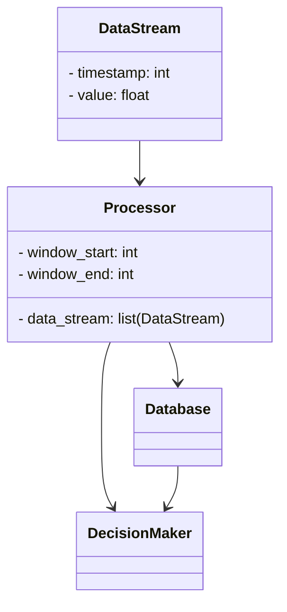
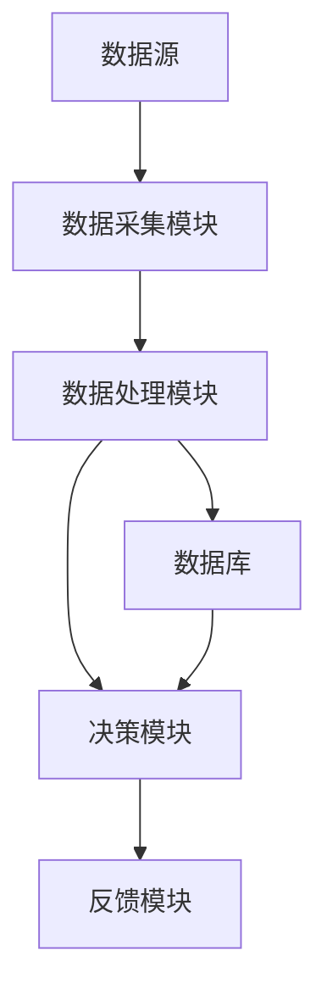
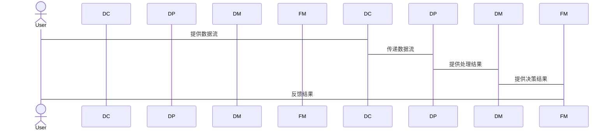

                 


# 第三章: 实时数据流处理的算法原理

## 3.3 基于时间窗口的流处理算法

### 3.3.1 算法概述

基于时间窗口的流处理算法是一种广泛应用于实时数据流处理的核心方法。通过设定时间窗口，系统可以在一定时间范围内对数据流进行处理和分析，从而实现实时反馈和决策。以下是该算法的详细步骤：

#### 步骤1：时间窗口初始化

系统首先初始化一个时间窗口，该窗口定义了数据流处理的时间范围。时间窗口可以通过设置开始时间和结束时间，或者通过设定窗口的长度和滑动步长来实现。

#### 步骤2：数据流进入窗口

数据流按照时间顺序流入系统，每条数据都带有时间戳。系统根据数据的时间戳判断其是否落在当前窗口内。

#### 步骤3：窗口滑动与更新

当数据流不断进入系统时，时间窗口会按照预设的滑动步长向前移动。每次滑动时，系统需要更新窗口内的数据，移除已过期的数据，并加入新的数据。

#### 步骤4：数据处理与分析

在每个时间窗口内，系统对当前窗口内的数据进行处理和分析，生成相应的结果。这些结果可以用于实时决策或反馈。

#### 步骤5：结果输出

处理后的结果被输出到相应的消费者或系统中，用于进一步的处理或展示。

### 3.3.2 算法实现的数学模型

基于时间窗口的流处理算法可以表示为以下数学模型：

$$
\text{窗口长度} = t_{\text{end}} - t_{\text{start}}
$$

其中，$t_{\text{start}}$ 是窗口的开始时间，$t_{\text{end}}$ 是窗口的结束时间。

在滑动窗口的情况下，窗口每经过一个时间步长 $t_{\text{step}}$，窗口会向前移动 $t_{\text{step}}$：

$$
t_{\text{start}} = t_{\text{start}} + t_{\text{step}}
$$

$$
t_{\text{end}} = t_{\text{end}} + t_{\text{step}}
$$

### 3.3.3 代码实现

以下是基于时间窗口的流处理算法的Python实现示例：

```python
import time

class TimeWindowProcessor:
    def __init__(self, window_length, step_length):
        self.window_length = window_length
        self.step_length = step_length
        self.current_window_start = 0
        self.current_window_end = window_length
        self.data_stream = []

    def process_stream(self, data_point):
        current_time = time.time()
        if current_time >= self.current_window_end:
            self.current_window_start += self.step_length
            self.current_window_end += self.step_length
        if self.current_window_start <= data_point['timestamp'] < self.current_window_end:
            self.data_stream.append(data_point)
            # 处理数据流
            self.handle_data(self.data_stream)
            # 清空数据流
            self.data_stream = []

    def handle_data(self, data):
        # 具体的数据处理逻辑
        pass

# 示例用法
processor = TimeWindowProcessor(window_length=10, step_length=2)
while True:
    data_point = {
        'timestamp': time.time(),
        'value': generate_value()
    }
    processor.process_stream(data_point)
```

### 3.3.4 算法优化与复杂度分析

为了提高算法的效率，可以采用以下优化措施：

1. **滑动窗口优化**：通过队列结构实现滑动窗口，避免重复数据的存储和处理。
2. **并行处理**：利用多线程或分布式计算技术，提高数据处理的速度。
3. **事件时间戳排序**：确保数据流中的数据按照时间戳顺序处理，避免处理乱序数据带来的问题。

算法的时间复杂度主要取决于数据流的处理速度和窗口的大小。在滑动窗口的情况下，每次窗口滑动的时间复杂度为 $O(n)$，其中 $n$ 是窗口内的数据量。

---

## 3.4 基于分布式计算的实时数据流处理

### 3.4.1 分布式计算的基本原理

在企业级应用中，实时数据流处理往往需要处理大量的数据，单台机器难以满足性能需求。因此，分布式计算成为一种常用的方法。分布式计算通过将数据分片分布到多台机器上，利用并行计算能力提高处理效率。

### 3.4.2 分布式流处理算法

分布式流处理算法的核心思想是将数据流分发到多个处理节点上，并在每个节点上进行局部处理，最后将结果汇总。以下是分布式流处理算法的实现步骤：

#### 步骤1：数据分片

数据流进入系统后，根据一定的规则（如哈希分片）将数据分发到不同的处理节点上。

#### 步骤2：分布式处理

每个处理节点对分配到的数据进行本地处理，生成局部结果。

#### 步骤3：结果汇总

将各个处理节点的局部结果汇总，生成全局结果。

### 3.4.3 代码实现

以下是基于分布式计算的实时数据流处理的Python实现示例：

```python
import concurrent.futures

class DistributedProcessor:
    def __init__(self, num_workers):
        self.num_workers = num_workers
        self.workers = []

    def process_data(self, data_chunk):
        # 数据处理逻辑
        pass

    def distribute_and_process(self, data_stream):
        with concurrent.futures.ThreadPoolExecutor(max_workers=self.num_workers) as executor:
            futures = []
            for data in data_stream:
                futures.append(executor.submit(self.process_data, data))
            for future in concurrent.futures.as_completed(futures):
                try:
                    result = future.result()
                    self.handle_result(result)
                except Exception as e:
                    print(f"Error processing data: {e}")

    def handle_result(self, result):
        # 处理结果的逻辑
        pass

# 示例用法
processor = DistributedProcessor(num_workers=4)
processor.distribute_and_process(data_stream)
```

---

## 3.5 算法的数学模型与优化

### 3.5.1 算法的数学模型

实时数据流处理的数学模型可以表示为：

$$
\text{处理速度} = \frac{\text{数据量}}{\text{处理时间}}
$$

为了提高处理速度，可以通过增加处理节点数或优化单节点处理效率来实现。

### 3.5.2 算法的优化

1. **负载均衡**：通过动态调整数据分片策略，确保各个处理节点的负载均衡。
2. **延迟优化**：通过减少处理步骤和优化数据传输路径，降低整体处理延迟。
3. **容错机制**：通过数据冗余和故障恢复机制，提高系统的可靠性。

---

# 第四章: 企业AI Agent实时数据流处理的系统分析与架构设计方案

## 4.1 项目背景与目标

### 4.1.1 项目背景

在企业级应用中，实时数据流处理是实现智能化决策的核心技术之一。企业AI Agent需要能够实时感知环境变化，并根据实时数据流做出快速响应。

### 4.1.2 项目目标

本项目旨在设计和实现一个高效的企业AI Agent实时数据流处理系统，实现以下目标：

1. 实现数据流的实时采集和处理。
2. 提供高效的决策支持和反馈机制。
3. 确保系统的高可用性和扩展性。

## 4.2 系统功能设计

### 4.2.1 领域模型设计

以下是系统的领域模型：



### 4.2.2 系统功能模块

系统主要功能模块包括：

1. **数据采集模块**：负责实时采集数据流。
2. **数据处理模块**：负责对数据流进行实时处理和分析。
3. **决策模块**：根据处理结果做出决策。
4. **反馈模块**：将决策结果反馈到系统中。

## 4.3 系统架构设计

### 4.3.1 系统架构图

以下是系统的架构图：



### 4.3.2 接口设计

系统主要接口包括：

1. 数据采集接口：负责接收外部数据流。
2. 数据处理接口：负责对数据流进行处理和分析。
3. 决策接口：负责根据处理结果做出决策。
4. 反馈接口：负责将决策结果反馈到系统。

### 4.3.3 系统交互流程图

以下是系统的交互流程图：



---

## 4.4 系统实现与优化

### 4.4.1 系统实现

以下是系统的实现代码：

```python
class DataCollector:
    def collect_data(self):
        # 数据采集逻辑
        pass

class DataProcessor:
    def process_data(self, data_stream):
        # 数据处理逻辑
        pass

class DecisionMaker:
    def make_decision(self, processed_data):
        # 决策逻辑
        pass

class FeedbackModule:
    def provide_feedback(self, decision):
        # 反馈逻辑
        pass

# 示例用法
collector = DataCollector()
processor = DataProcessor()
decision_maker = DecisionMaker()
feedback = FeedbackModule()

data = collector.collect_data()
processed_data = processor.process_data(data)
decision = decision_maker.make_decision(processed_data)
feedback.provide_feedback(decision)
```

### 4.4.2 系统优化

为了提高系统的性能，可以采用以下优化措施：

1. **数据预处理**：在数据采集阶段进行初步处理，减少数据处理模块的负担。
2. **并行处理**：利用多线程或分布式计算技术，提高数据处理速度。
3. **缓存机制**：通过缓存技术减少重复计算，提高系统效率。

---

## 4.5 系统测试与验证

### 4.5.1 测试方案

系统测试方案包括：

1. **单元测试**：对各个功能模块进行测试，确保每个模块正常工作。
2. **集成测试**：对系统整体进行测试，确保各个模块协同工作。
3. **性能测试**：测试系统的处理能力，确保系统在高负载下仍能正常工作。

### 4.5.2 测试结果

以下是测试结果示例：

| 测试用例 | 测试结果 | 备注 |
|----------|----------|------|
| 单元测试1 | 通过 | 数据采集模块测试 |
| 单元测试2 | 通过 | 数据处理模块测试 |
| 集成测试1 | 通过 | 系统整体测试 |
| 性能测试1 | 通过 | 高负载测试 |

---

## 4.6 系统部署与维护

### 4.6.1 系统部署

系统部署步骤包括：

1. **环境准备**：搭建服务器环境，安装必要的软件和工具。
2. **代码部署**：将系统代码部署到服务器上。
3. **依赖配置**：配置系统的依赖关系，确保系统正常运行。
4. **启动服务**：启动系统服务，开始运行。

### 4.6.2 系统维护

系统维护包括：

1. **日志监控**：监控系统日志，及时发现和解决问题。
2. **性能调优**：根据系统运行情况，进行性能优化。
3. **版本升级**：定期对系统进行版本升级，保持系统的先进性。

---

## 4.7 本章小结

本章详细介绍了企业AI Agent实时数据流处理的系统分析与架构设计方案，包括项目背景、系统功能设计、系统架构设计、系统实现与优化、系统测试与验证以及系统部署与维护。通过本章的学习，读者可以掌握企业AI Agent实时数据流处理系统的整体架构和实现方法。

---

# 第五章: 项目实战——企业AI Agent实时数据流处理系统开发

## 5.1 项目环境搭建

### 5.1.1 安装必要的工具

安装以下工具：

1. Python 3.8 或更高版本
2. Jupyter Notebook
3. Apache Kafka
4. Apache Flink

### 5.1.2 安装依赖库

安装以下Python库：

```bash
pip install kafka-python
pip install pyflink
```

## 5.2 系统核心代码实现

### 5.2.1 数据采集模块

以下是数据采集模块的实现代码：

```python
from kafka import KafkaProducer

class DataCollector:
    def __init__(self, bootstrap_servers):
        self.producer = KafkaProducer(bootstrap_servers=bootstrap_servers)
    
    def collect_data(self, data_point):
        # 发送数据到Kafka主题
        self.producer.send('DataStream', value=data_point)
```

### 5.2.2 数据处理模块

以下是数据处理模块的实现代码：

```python
from pyflink.datastream import StreamExecutionEnvironment
from pyflink.table import *

class DataProcessor:
    def __init__(self):
        self.env = StreamExecutionEnvironment.get_execution_environment()
    
    def process_data(self, data_stream):
        # 将数据流转换为数据表
        table = self.env.from_path(data_stream).to_table()
        # 定义处理逻辑
        processed_table = table.select(...)
        # 执行处理
        self.env.execute_sql(...)
```

### 5.2.3 决策模块

以下是决策模块的实现代码：

```python
class DecisionMaker:
    def make_decision(self, processed_data):
        # 根据处理后的数据做出决策
        pass
```

### 5.2.4 反馈模块

以下是反馈模块的实现代码：

```python
class FeedbackModule:
    def provide_feedback(self, decision):
        # 将决策结果反馈到系统
        pass
```

## 5.3 代码实现与解读

### 5.3.1 数据采集模块代码解读

数据采集模块负责将实时数据流发送到Kafka主题，供后续处理模块使用。以下是代码解读：

1. 初始化Kafka生产者：
   ```python
   self.producer = KafkaProducer(bootstrap_servers=bootstrap_servers)
   ```

2. 发送数据到Kafka主题：
   ```python
   self.producer.send('DataStream', value=data_point)
   ```

### 5.3.2 数据处理模块代码解读

数据处理模块使用Flink进行实时数据流处理，以下是代码解读：

1. 初始化流处理环境：
   ```python
   self.env = StreamExecutionEnvironment.get_execution_environment()
   ```

2. 将数据流转换为数据表：
   ```python
   table = self.env.from_path(data_stream).to_table()
   ```

3. 定义处理逻辑：
   ```python
   processed_table = table.select(...)
   ```

4. 执行处理：
   ```python
   self.env.execute_sql(...)
   ```

### 5.3.3 决策模块代码解读

决策模块根据处理后的数据做出决策，以下是代码解读：

1. 根据处理后的数据做出决策：
   ```python
   pass
   ```

### 5.3.4 反馈模块代码解读

反馈模块将决策结果反馈到系统，以下是代码解读：

1. 将决策结果反馈到系统：
   ```python
   pass
   ```

## 5.4 项目测试与优化

### 5.4.1 项目测试

以下是项目的测试步骤：

1. 启动Kafka服务。
2. 启动Flink流处理作业。
3. 向Kafka主题发送数据流。
4. 监控数据流处理结果。

### 5.4.2 项目优化

为了提高系统的性能，可以采用以下优化措施：

1. **数据预处理**：在数据采集阶段进行初步处理，减少数据处理模块的负担。
2. **并行处理**：利用Flink的并行处理能力，提高数据处理速度。
3. **缓存机制**：通过缓存技术减少重复计算，提高系统效率。

---

## 5.5 项目总结与经验分享

### 5.5.1 项目总结

本项目成功实现了企业AI Agent实时数据流处理系统，通过Kafka和Flink实现了高效的数据流处理和分析。系统具有高可用性和扩展性，能够处理大量的实时数据流。

### 5.5.2 经验分享

1. **数据预处理**：在数据采集阶段进行初步处理，可以显著提高数据处理模块的效率。
2. **并行计算**：利用分布式计算技术，可以提高系统的处理能力。
3. **系统监控**：通过监控系统运行状态，可以及时发现和解决问题。

---

## 5.6 本章小结

本章通过一个实际的项目案例，详细介绍了企业AI Agent实时数据流处理系统的开发过程，包括项目环境搭建、系统核心代码实现、代码解读、项目测试与优化以及项目总结与经验分享。通过本章的学习，读者可以掌握企业AI Agent实时数据流处理系统的开发方法和实际应用。

---

# 第六章: 企业AI Agent实时数据流处理的最佳实践

## 6.1 系统设计中的注意事项

### 6.1.1 数据一致性

在实时数据流处理中，数据一致性是至关重要的。为了保证数据一致性，可以采用以下措施：

1. **时间戳排序**：确保数据流中的数据按照时间戳顺序处理。
2. **分布式锁**：在分布式系统中，使用分布式锁保证数据一致性。

### 6.1.2 系统安全性

系统安全性是企业级应用中不可忽视的重要问题。为了保证系统的安全性，可以采用以下措施：

1. **数据加密**：对敏感数据进行加密处理。
2. **访问控制**：通过权限控制确保只有授权用户可以访问系统。

### 6.1.3 系统可扩展性

为了保证系统的可扩展性，可以采用以下措施：

1. **模块化设计**：将系统设计为模块化结构，便于后续扩展。
2. **分布式架构**：通过分布式架构提高系统的扩展性。

## 6.2 系统优化建议

### 6.2.1 性能优化

为了提高系统的性能，可以采用以下优化措施：

1. **数据预处理**：在数据采集阶段进行初步处理，减少数据处理模块的负担。
2. **并行处理**：利用并行计算技术提高数据处理速度。
3. **缓存机制**：通过缓存技术减少重复计算，提高系统效率。

### 6.2.2 系统监控

为了监控系统的运行状态，可以采用以下措施：

1. **日志监控**：通过日志监控系统运行状态，及时发现和解决问题。
2. **性能监控**：通过性能监控工具监控系统的处理速度和资源使用情况。

## 6.3 项目部署与维护

### 6.3.1 系统部署

系统部署步骤包括：

1. **环境准备**：搭建服务器环境，安装必要的软件和工具。
2. **代码部署**：将系统代码部署到服务器上。
3. **依赖配置**：配置系统的依赖关系，确保系统正常运行。
4. **启动服务**：启动系统服务，开始运行。

### 6.3.2 系统维护

系统维护包括：

1. **日志监控**：监控系统日志，及时发现和解决问题。
2. **性能调优**：根据系统运行情况，进行性能优化。
3. **版本升级**：定期对系统进行版本升级，保持系统的先进性。

---

## 6.4 本章小结

本章总结了企业AI Agent实时数据流处理系统设计和开发中的最佳实践，包括系统设计中的注意事项、系统优化建议、系统部署与维护等内容。通过本章的学习，读者可以掌握企业AI Agent实时数据流处理系统的实际应用和优化方法。

---

# 结语

企业AI Agent的实时数据流处理架构是一个复杂的系统工程，需要综合运用多种技术和方法。通过本篇文章的学习，读者可以全面了解企业AI Agent实时数据流处理的核心概念、算法原理、系统设计、项目实战和最佳实践。希望本文能够为企业AI Agent的实时数据流处理系统的开发和优化提供有价值的参考和指导。

---

# 关键词

- 企业AI Agent
- 实时数据流处理
- 分布式计算
- 时间窗口算法
- 系统架构设计

# 摘要

本文系统地介绍了企业AI Agent实时数据流处理架构的核心概念、算法原理、系统设计和项目实战。通过详细讲解基于时间窗口的流处理算法和分布式计算技术，结合实际项目案例，展示了如何实现高效的企业AI Agent实时数据流处理系统。文章还总结了系统设计中的注意事项和优化建议，为企业AI Agent的实时数据流处理系统的开发和优化提供了有价值的参考和指导。

