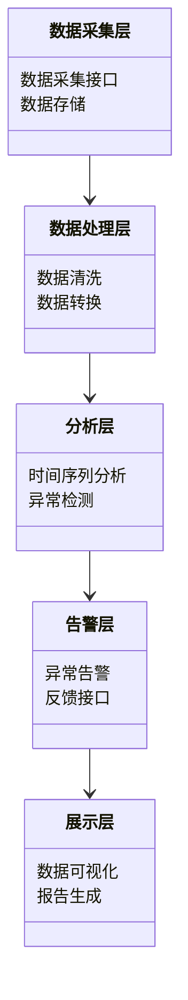
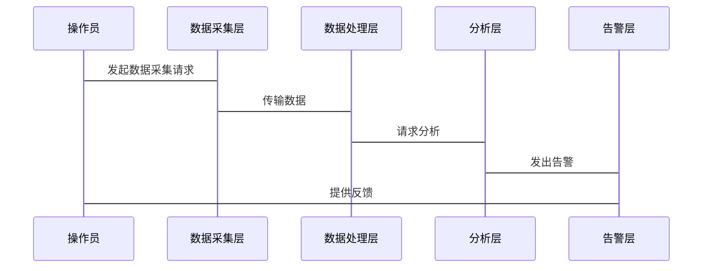

                 


# 《企业AI Agent的实时监控系统》

## 关键词：企业AI Agent，实时监控，系统设计，算法原理，系统架构

## 摘要：本文深入探讨了企业AI Agent实时监控系统的设计与实现，分析了其核心概念、算法原理、系统架构，并通过具体案例展示了系统在实际场景中的应用。文章结构清晰，内容详实，旨在为企业技术人员提供实用的技术指导和参考。

---

# 第一部分: 企业AI Agent实时监控系统概述

## 第1章: 企业AI Agent实时监控系统背景介绍

### 1.1 问题背景

#### 1.1.1 企业AI Agent的定义与特点
AI Agent（人工智能代理）是一种能够感知环境、自主决策并执行任务的智能系统。它具备以下特点：
- **自主性**：无需外部干预，自主完成任务。
- **反应性**：能够实时感知环境变化并做出响应。
- **目标导向**：以明确的目标为导向，优化决策过程。
- **学习能力**：通过数据学习和优化，提升任务执行效率。

#### 1.1.2 实时监控系统的需求与挑战
在企业环境中，AI Agent的应用场景日益广泛，但其实时监控系统面临以下需求与挑战：
- **实时性**：需要快速采集、处理和分析数据，确保监控的实时性。
- **准确性**：监控系统需要准确识别异常情况，避免误报或漏报。
- **可扩展性**：系统需要支持大规模数据处理和高并发请求。
- **复杂性**：企业环境复杂，涉及多系统、多业务的协同，增加了监控的难度。

#### 1.1.3 企业AI Agent实时监控的必要性
实时监控AI Agent的运行状态，能够帮助企业及时发现和解决问题，确保系统的稳定运行，同时优化资源利用率，提升整体业务效率。

### 1.2 问题描述

#### 1.2.1 AI Agent在企业中的应用场景
AI Agent在企业中的应用十分广泛，例如：
- **智能客服**：通过自然语言处理技术，为用户提供实时的在线支持。
- **自动化运维**：监控系统运行状态，自动修复故障。
- **智能风控**：实时监测交易数据，防范金融风险。

#### 1.2.2 实时监控的核心问题
实时监控AI Agent的核心问题包括：
- **数据采集**：如何高效采集多源异构数据。
- **数据处理**：如何对海量数据进行实时分析和处理。
- **异常检测**：如何准确识别异常情况并发出警报。

#### 1.2.3 系统边界与外延
系统边界包括：
- **输入边界**：接收来自AI Agent的各种数据流。
- **输出边界**：向业务系统或用户反馈监控结果。
- **外部依赖**：依赖于数据源、计算资源等外部条件。

### 1.3 问题解决

#### 1.3.1 AI Agent实时监控的目标
- 实时采集和处理数据。
- 准确识别异常情况。
- 提供实时反馈和优化建议。

#### 1.3.2 监控系统的功能定位
- 数据采集与传输。
- 数据分析与处理。
- 异常检测与告警。
- 可视化展示与报告。

#### 1.3.3 系统实现的关键技术
- **实时数据采集**：使用高效的数据采集技术，如消息队列（Kafka）。
- **流数据处理**：采用流处理框架（如Apache Flink）进行实时分析。
- **异常检测算法**：应用机器学习算法（如Isolation Forest、LSTM）进行异常检测。

### 1.4 核心概念结构与组成

#### 1.4.1 AI Agent的核心要素
- **感知模块**：负责环境感知和数据采集。
- **决策模块**：基于感知数据进行决策。
- **执行模块**：根据决策执行操作。
- **学习模块**：通过反馈优化自身性能。

#### 1.4.2 实时监控系统的组成模块
- **数据采集层**：负责采集AI Agent的运行数据。
- **数据处理层**：对数据进行清洗、转换和存储。
- **分析层**：利用算法进行实时分析和异常检测。
- **告警层**：根据分析结果发出告警。
- **展示层**：以可视化的方式展示监控结果。

#### 1.4.3 系统与业务流程的关系
AI Agent实时监控系统与企业业务流程紧密相关，能够实时反馈业务运行状态，优化业务流程，提升企业效率。

### 1.5 本章小结
本章主要介绍了企业AI Agent实时监控系统的背景、核心概念、功能定位和技术实现，为后续章节的深入分析奠定了基础。

---

## 第2章: 企业AI Agent实时监控系统的核心概念与联系

### 2.1 核心概念原理

#### 2.1.1 AI Agent的工作原理
AI Agent通过感知环境、分析数据、做出决策并执行操作来完成任务。其实时监控系统需要实时采集这些操作的数据，分析其状态，并提供反馈。

#### 2.1.2 实时监控系统的运行机制
实时监控系统通过数据采集、处理、分析和告警等环节，实现对AI Agent的实时监控。其运行机制包括：
- **数据采集**：从AI Agent获取实时数据。
- **数据处理**：对数据进行清洗、转换和存储。
- **数据分析**：利用算法进行实时分析，识别异常情况。
- **告警与反馈**：根据分析结果发出告警，并反馈给AI Agent进行优化。

#### 2.1.3 系统与AI Agent的交互方式
实时监控系统通过API接口与AI Agent进行交互，实现数据的实时传输和状态反馈。

### 2.2 核心概念属性对比表

| 概念       | 输入 | 输出 | 学习 |
|------------|------|------|------|
| AI Agent   | 感知数据 | 决策 | 历史数据反馈 |
| 监控系统   | 实时数据 | 数据分析结果 | 数据处理规则 |

### 2.3 ER实体关系图
```mermaid
er
actor: 监控系统
agent: AI Agent
interaction
actor --> agent: 实
```

### 2.4 本章小结
本章详细分析了AI Agent和实时监控系统的核心概念及其之间的关系，为后续章节的系统设计提供了理论基础。

---

## 第3章: 企业AI Agent实时监控系统的算法原理

### 3.1 算法原理概述
实时监控系统需要对AI Agent的运行数据进行实时分析，常用算法包括时间序列分析和异常检测算法。

### 3.2 时间序列分析

#### 3.2.1 算法步骤
1. 数据预处理：去除噪声，平滑数据。
2. 模型选择：选择适合的时间序列模型（如ARIMA、LSTM）。
3. 模型训练：利用历史数据训练模型。
4. 预测与监控：根据模型预测未来值，并与实际值进行对比，发现异常。

#### 3.2.2 算法实现
```python
import numpy as np
from statsmodels.tsa.arima.model import ARIMA

# 示例数据
data = np.array([1, 2, 3, 4, 5, 6, 7, 8, 9, 10])

# 训练模型
model = ARIMA(data, order=(1, 1, 1))
model_fit = model.fit()

# 预测未来值
forecast = model_fit.forecast(steps=5)
print(forecast)
```

#### 3.2.3 算法优缺点
- **优点**：适用于时间相关数据，能够捕捉趋势和周期性。
- **缺点**：对异常值敏感，需要数据预处理。

### 3.3 异常检测算法

#### 3.3.1 基于统计的方法
使用Isolation Forest算法进行异常检测：
```python
from sklearn.ensemble import IsolationForest

# 示例数据
X = np.random.normal(loc=0, scale=1, size=100)
X[50] = 100  # 异常值

# 训练模型
clf = IsolationForest(n_estimators=100, random_state=42)
clf.fit(X.reshape(-1, 1))

# 预测异常值
y_pred = clf.predict(X.reshape(-1, 1))
print(y_pred)
```

#### 3.3.2 基于深度学习的方法
使用LSTM进行异常检测：
```python
import tensorflow as tf
from tensorflow.keras import layers

# 示例数据
X_train = np.random.rand(100, 1, 1)
X_test = np.random.rand(20, 1, 1)

# 模型定义
model = tf.keras.Sequential()
model.add(layers.LSTM(64, input_shape=(1, 1)))
model.add(layers.Dense(1))
model.compile(optimizer='adam', loss='mse')

# 训练模型
model.fit(X_train, X_train, epochs=10, batch_size=32)
```

### 3.4 算法选择与优化
根据具体场景选择合适的算法，并通过参数调优和模型优化提升检测准确率。

### 3.5 本章小结
本章详细介绍了时间序列分析和异常检测算法的原理与实现，为企业AI Agent实时监控系统的算法选择提供了参考。

---

## 第4章: 企业AI Agent实时监控系统的系统分析与架构设计

### 4.1 问题场景介绍
企业AI Agent实时监控系统需要处理多源异构数据，实时分析并提供反馈。

### 4.2 系统功能设计

#### 4.2.1 领域模型设计


#### 4.2.2 系统架构设计


#### 4.2.3 系统接口设计
- **数据采集接口**：接收AI Agent的实时数据。
- **分析接口**：提供数据处理和分析功能。
- **告警接口**：根据分析结果发出告警。

#### 4.2.4 系统交互设计


### 4.3 系统优化与扩展

#### 4.3.1 系统扩展性设计
- **模块化设计**：各层独立设计，便于扩展。
- **弹性扩展**：利用云原生技术实现弹性伸缩。

#### 4.3.2 系统性能优化
- **数据压缩**：减少数据传输和存储开销。
- **并行处理**：利用多线程或分布式计算提升性能。

### 4.4 本章小结
本章从系统架构和设计的角度，详细分析了企业AI Agent实时监控系统的实现方案，并提供了优化建议。

---

## 第5章: 企业AI Agent实时监控系统的项目实战

### 5.1 项目介绍

#### 5.1.1 项目目标
实现一个实时监控AI Agent运行状态的系统，能够采集数据、分析异常并发出告警。

### 5.2 系统核心实现

#### 5.2.1 环境安装
```bash
pip install numpy pandas scikit-learn tensorflow
```

#### 5.2.2 核心代码实现
```python
import numpy as np
from sklearn.ensemble import IsolationForest
from tensorflow.keras import layers
import tensorflow as tf

# 示例数据
data = np.random.rand(100, 1)
data[50] = 100  # 异常值

# 异常检测模型
clf = IsolationForest(n_estimators=100, random_state=42)
clf.fit(data)

# LSTM模型
model = tf.keras.Sequential()
model.add(layers.LSTM(64, input_shape=(1, 1)))
model.add(layers.Dense(1))
model.compile(optimizer='adam', loss='mse')
model.fit(data.reshape(100, 1, 1), data, epochs=10, batch_size=32)
```

#### 5.2.3 代码应用解读与分析
- **数据采集**：从AI Agent获取实时数据。
- **数据处理**：对数据进行清洗和转换。
- **模型训练**：训练异常检测和预测模型。
- **实时监控**：持续采集数据并进行分析，发现异常后发出告警。

### 5.3 实际案例分析

#### 5.3.1 案例背景
假设某企业AI Agent出现性能下降，需要实时监控系统找出问题。

#### 5.3.2 数据分析与处理
```python
import pandas as pd
import numpy as np

# 示例数据
data = pd.DataFrame({
    'timestamp': pd.date_range(start='2023-01-01', periods=100),
    'value': np.random.rand(100) * 100
})
data.loc[50, 'value'] = 1000  # 异常值
```

#### 5.3.3 案例解读与优化
通过分析数据，发现异常值并定位问题原因，优化AI Agent的性能。

### 5.4 项目小结
本章通过实际案例展示了企业AI Agent实时监控系统的实现过程，帮助读者更好地理解系统设计与应用。

---

## 第6章: 企业AI Agent实时监控系统的总结与展望

### 6.1 总结
本文详细介绍了企业AI Agent实时监控系统的核心概念、算法原理、系统设计和项目实现。通过理论与实践相结合，为企业技术人员提供了实用的技术指导。

### 6.2 未来展望
未来，随着AI技术的不断发展，实时监控系统将更加智能化和自动化，可能的发展方向包括：
- **智能化监控**：利用更先进的AI算法实现智能监控。
- **边缘计算**：将监控系统部署在边缘设备，实现更低延迟的实时监控。
- **自适应优化**：系统能够根据环境变化自动调整监控策略。

### 6.3 最佳实践

#### 6.3.1 小结
- 系统设计要注重模块化和可扩展性。
- 数据采集和处理是系统的核心，需确保其高效性和准确性。
- 异常检测算法的选择要根据具体场景进行优化。

#### 6.3.2 注意事项
- 确保数据安全，防止数据泄露。
- 定期维护系统，优化性能。
- 建立完善的日志系统，便于问题排查。

### 6.4 拓展阅读
- 《实时数据分析与处理》
- 《AI Agent在企业中的应用》
- 《异常检测算法研究与实现》

---

## 附录: 企业AI Agent实时监控系统相关工具与资源

### 1. 工具列表
- **数据采集工具**：Kafka、Flafka
- **数据处理工具**：Apache Spark、Apache Flink
- **数据分析工具**：NumPy、Pandas、TensorFlow、Scikit-learn
- **可视化工具**：Matplotlib、Seaborn、Grafana

### 2. 开源项目与资源
- **AI Agent框架**：OpenAI、Rasa、Dialogflow
- **实时监控框架**：Prometheus、Grafana、ELK Stack
- **流处理框架**：Apache Flink、Kafka Streams

---

通过本文的系统介绍，企业技术人员可以深入了解AI Agent实时监控系统的实现细节，并将其应用到实际项目中，提升企业的智能化水平。

