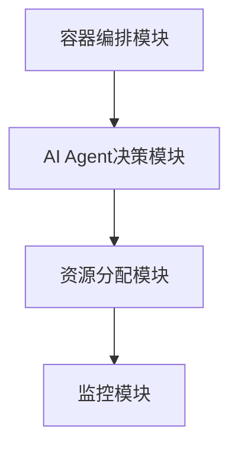

                 


# 企业AI Agent的容器化部署策略

> 关键词：企业AI Agent，容器化部署，Docker，Kubernetes，容器编排，资源分配，算法实现

> 摘要：随着人工智能技术的快速发展，企业AI Agent的应用场景越来越广泛。本文将深入探讨企业AI Agent的容器化部署策略，从核心概念到算法实现，从系统架构设计到项目实战，全面解析企业AI Agent的容器化部署方法。通过本文，读者可以掌握企业AI Agent容器化部署的关键技术，并能够实际操作相关项目。

---

# 引言

## 1.1 企业AI Agent的概念与背景

### 1.1.1 什么是企业AI Agent
企业AI Agent（Artificial Intelligence Agent）是一种能够感知环境、自主决策并执行任务的智能实体。它通常用于企业内部的自动化运维、智能客服、供应链优化等领域。AI Agent通过与企业系统和外部环境交互，实现任务的自动化执行。

### 1.1.2 AI Agent在企业中的作用
AI Agent能够提高企业的运营效率，降低人工成本，同时增强企业的智能化水平。例如，在供应链管理中，AI Agent可以实时监控库存状态，并根据需求预测自动调整采购策略。

### 1.1.3 容器化技术的引入与意义
容器化技术（如Docker、Kubernetes）为企业AI Agent的部署提供了灵活、高效的方式。通过容器化，AI Agent可以快速部署、弹性扩展，并能够在不同的环境中无缝运行。

---

## 1.2 企业AI Agent的容器化部署背景

### 1.2.1 当前企业IT架构的演变
传统的企业IT架构通常基于虚拟机（VM）部署，这种方式资源利用率低、部署复杂。随着云计算和微服务架构的普及，企业开始采用容器化技术来优化IT架构。

### 1.2.2 容器化技术对企业AI Agent部署的影响
容器化技术使得企业AI Agent的部署更加灵活。通过容器编排工具（如Kubernetes），企业可以实现AI Agent的自动化部署、动态扩展和自愈合。

### 1.2.3 企业AI Agent容器化部署的必要性
在现代企业中，AI Agent的应用场景日益复杂，传统的部署方式难以满足高可用性和弹性扩展的需求。容器化部署成为企业的必然选择。

---

## 1.3 本章小结
本章介绍了企业AI Agent的概念及其在企业中的作用，并分析了容器化技术对企业AI Agent部署的影响。容器化技术的引入使得企业AI Agent的部署更加高效和灵活。

---

# 第二部分: 企业AI Agent的容器化部署核心概念

## 2.1 企业AI Agent的核心概念与原理

### 2.1.1 AI Agent的功能模块
AI Agent通常包括感知模块、决策模块、执行模块和通信模块。感知模块负责获取环境信息，决策模块负责制定决策，执行模块负责执行任务，通信模块负责与其他系统或用户交互。

### 2.1.2 AI Agent的决策机制
AI Agent的决策机制基于环境信息和预设的规则或模型。例如，可以使用强化学习算法来优化决策过程。

### 2.1.3 AI Agent的通信机制
AI Agent通过API或消息队列与外部系统交互。例如，可以使用Kafka或RabbitMQ实现异步通信。

---

## 2.2 容器化技术的核心原理

### 2.2.1 容器与容器编排的基本概念
容器是一种轻量级的虚拟化技术，能够运行用户空间的程序。容器编排是指通过工具（如Kubernetes）管理容器的生命周期，包括部署、扩展和负载均衡。

### 2.2.2 容器化部署的优势与挑战
容器化部署的优势包括快速启动、资源利用率高、环境一致性等。挑战包括容器编排的复杂性和容器资源分配的优化问题。

### 2.2.3 容器化与企业AI Agent的结合
企业AI Agent可以通过容器化部署到云平台或本地服务器，实现弹性扩展和高可用性。

---

## 2.3 企业AI Agent容器化部署的核心要素

### 2.3.1 容器化平台的选择
选择容器化平台时需要考虑平台的扩展性、支持的插件以及社区支持。例如，Kubernetes是一个流行的容器编排平台。

### 2.3.2 容器编排工具的作用
容器编排工具（如Kubernetes）能够自动化管理容器的生命周期，包括自动扩展、负载均衡和自愈合。

### 2.3.3 企业AI Agent的资源分配策略
企业AI Agent的资源分配需要考虑计算资源、存储资源和网络资源。例如，可以通过弹性伸缩策略动态分配计算资源。

---

## 2.4 核心概念对比分析

### 2.4.1 AI Agent与传统服务的对比
AI Agent具有自主决策能力，而传统服务通常按照预设逻辑执行任务。

### 2.4.2 容器化部署与传统部署的对比
容器化部署具有更高的资源利用率和灵活性，而传统部署通常基于虚拟机，资源利用率较低。

### 2.4.3 企业AI Agent容器化部署的优劣势分析
优势：高效、灵活、高可用性。劣势：容器编排复杂、资源分配优化困难。

---

## 2.5 本章小结
本章详细介绍了企业AI Agent的核心概念与容器化部署的核心要素，并通过对比分析，帮助企业理解容器化部署的优势与挑战。

---

# 第三部分: 企业AI Agent容器化部署的算法与数学模型

## 3.1 企业AI Agent容器化部署的算法原理

### 3.1.1 容器编排算法的基本原理
容器编排算法通常包括任务分配、负载均衡和资源调度。例如，Kubernetes使用的是基于资源利用率的动态调度算法。

### 3.1.2 企业AI Agent决策算法的实现
企业AI Agent的决策算法可以基于强化学习或监督学习。例如，可以使用深度强化学习（Deep RL）来优化决策过程。

---

## 3.2 算法实现的代码示例

### 3.2.1 容器编排算法的Python实现
以下是一个简单的容器编排算法示例，用于模拟任务分配：

```python
import random

def assign_task(tasks, workers):
    worker_load = {worker: 0 for worker in workers}
    for task in tasks:
        selected_worker = random.choice(workers)
        worker_load[selected_worker] += 1
    return worker_load

tasks = ["task1", "task2", "task3"]
workers = ["worker1", "worker2", "worker3"]
result = assign_task(tasks, workers)
print(result)
```

### 3.2.2 AI Agent决策算法的代码示例
以下是一个简单的AI Agent决策算法示例，用于模拟库存管理：

```python
import numpy as np

def decide_action(state, model):
    if state["inventory"] < state["demand"]:
        return "order"
    else:
        return "do nothing"

state = {"inventory": 10, "demand": 15}
action = decide_action(state, None)
print(action)
```

---

## 3.3 算法的优化与调优

### 3.3.1 算法优化策略
可以通过增加更多的特征、优化模型结构或引入强化学习来提高算法的性能。

### 3.3.2 调优方法
可以通过监控资源利用率、分析任务分配情况和优化算法参数来实现算法的调优。

---

## 3.4 本章小结
本章通过代码示例和算法分析，详细介绍了企业AI Agent容器化部署的算法实现及其优化方法。

---

# 第四部分: 企业AI Agent容器化部署的系统架构设计

## 4.1 系统功能模块设计

### 4.1.1 系统功能模块
企业AI Agent容器化部署系统包括容器编排模块、AI Agent决策模块、资源分配模块和监控模块。

### 4.1.2 功能模块之间的关系
容器编排模块负责管理容器的生命周期，AI Agent决策模块负责制定决策，资源分配模块负责动态分配资源，监控模块负责实时监控系统的运行状态。

---

## 4.2 系统架构设计

### 4.2.1 系统架构图
以下是企业AI Agent容器化部署系统的架构图：



### 4.2.2 系统组件之间的交互流程
容器编排模块接收任务请求，通过AI Agent决策模块制定决策，然后通过资源分配模块分配资源，最后通过监控模块实时监控系统的运行状态。

---

## 4.3 系统接口设计

### 4.3.1 系统接口
系统包括API接口和消息队列接口。API接口用于接收外部请求，消息队列接口用于模块之间的通信。

### 4.3.2 接口交互流程
外部请求通过API接口发送到容器编排模块，容器编排模块通过消息队列接口与AI Agent决策模块交互，AI Agent决策模块通过消息队列接口与资源分配模块交互，资源分配模块通过消息队列接口与监控模块交互。

---

## 4.4 本章小结
本章通过系统功能模块设计和架构图，详细介绍了企业AI Agent容器化部署的系统架构设计。

---

# 第五部分: 企业AI Agent容器化部署的项目实战

## 5.1 项目环境安装

### 5.1.1 安装Docker
在Linux系统上安装Docker：

```bash
sudo apt-get update
sudo apt-get install docker.io
sudo systemctl start docker
sudo systemctl enable docker
```

### 5.1.2 安装Kubernetes
在Linux系统上安装Kubernetes：

```bash
sudo apt-get install kubectl
```

---

## 5.2 系统核心实现

### 5.2.1 容器编排模块的实现
以下是容器编排模块的Python代码示例：

```python
import kubernetes.client as k8s_client

def deploy_container(app_name, image):
    api = k8s_client.BatchApi()
    # 创建Job对象
    job = k8s_client.V1Job(
        api_version="batch/v1",
        kind="Job",
        metadata=k8s_client.V1ObjectMeta(name=app_name),
        spec=k8s_client.V1JobSpec(
            completions=1,
            parallelism=1,
            template=k8s_client.V1PodTemplateSpec(
                metadata=k8s_client.V1ObjectMeta(labels={"app": app_name}),
                spec=k8s_client.V1PodSpec(
                    containers=[k8s_client.V1Container(
                        name=app_name,
                        image=image,
                        ports=[k8s_client.V1ContainerPort(container_port=80)]
                    )]
                )
            )
        )
    )
    api.create_namespaced_job("default", job)
```

### 5.2.2 AI Agent决策模块的实现
以下是AI Agent决策模块的Python代码示例：

```python
import numpy as np

def decide_action(state):
    if state["inventory"] < state["demand"]:
        return "order"
    else:
        return "do nothing"

state = {"inventory": 10, "demand": 15}
action = decide_action(state)
print(action)
```

---

## 5.3 项目小结
本章通过项目实战，详细介绍了企业AI Agent容器化部署的环境安装和系统核心实现。读者可以参考这些代码示例，实现自己的企业AI Agent容器化部署系统。

---

# 结语

## 6.1 最佳实践 tips
- 在选择容器化平台时，建议优先选择Kubernetes。
- 在实现AI Agent决策算法时，可以尝试使用强化学习来优化决策过程。
- 在监控系统运行状态时，建议使用Prometheus和Grafana。

## 6.2 总结
本文从企业AI Agent的容器化部署背景到系统架构设计，再到项目实战，全面解析了企业AI Agent的容器化部署策略。通过本文的讲解，读者可以掌握企业AI Agent容器化部署的关键技术，并能够实际操作相关项目。

## 6.3 注意事项
- 在实现容器化部署时，需要注意容器资源分配的优化问题。
- 在实现AI Agent决策算法时，需要注意算法的可解释性和可调优性。

## 6.4 拓展阅读
- Kubernetes官方文档
- Docker官方文档
- 强化学习相关书籍和论文

--- 

通过本文的深入分析和实践，相信读者对企业AI Agent的容器化部署有了全面的理解，并能够将其应用到实际的企业场景中。

