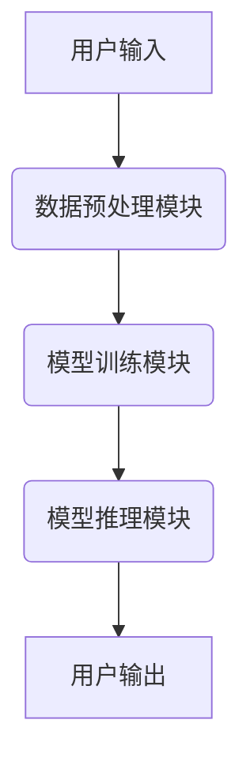
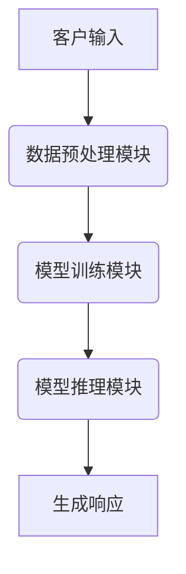
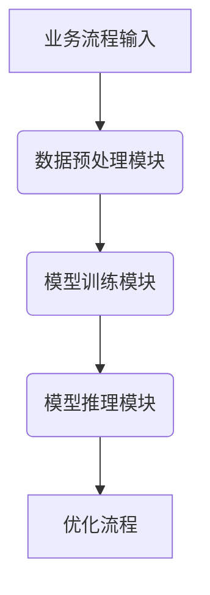
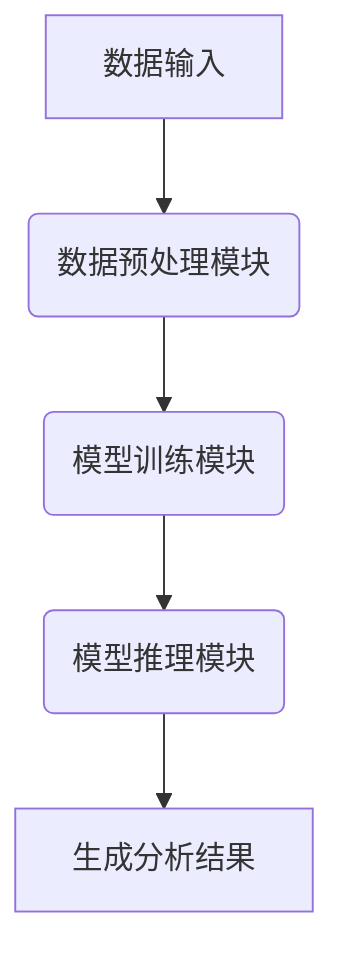

                 


# 《企业AI Agent的少样本学习：快速适应新业务场景》

---

## 关键词：
企业AI Agent、少样本学习、快速适应、业务场景、AI系统架构、算法实现

---

## 摘要：
本文系统地探讨了企业AI Agent在少样本学习中的应用，结合实际业务场景，分析了如何通过少样本学习技术快速适应新的业务需求。文章从AI Agent的基本概念出发，深入解析了少样本学习的核心原理，包括支持元学习、对比学习和迁移学习等方法。同时，详细阐述了AI Agent的系统架构设计、功能模块划分以及接口设计，结合实际案例，展示了如何在客户服务、业务流程自动化和数据分析等领域实现快速适应。本文还提供了算法实现的具体代码示例和系统交互流程图，为读者提供了从理论到实践的全面指导。

---

## 第1章: 企业AI Agent与少样本学习概述

### 1.1 AI Agent的基本概念

#### 1.1.1 AI Agent的定义与特点
AI Agent（人工智能代理）是一种能够感知环境、执行任务并做出决策的智能实体。它可以是一个软件系统、一个机器人，甚至是嵌入在设备中的算法。AI Agent的核心特点包括：
1. **自主性**：能够在没有外部干预的情况下独立运行。
2. **反应性**：能够实时感知环境并做出响应。
3. **目标导向**：具有明确的目标，能够为实现目标而行动。
4. **学习能力**：能够通过数据和经验不断优化自身性能。

#### 1.1.2 AI Agent在企业中的作用
在企业环境中，AI Agent可以用于多种场景，例如：
- **客户服务**：通过自然语言处理（NLP）技术为用户提供支持。
- **业务流程自动化**：自动化处理订单、审批等流程。
- **数据分析与决策支持**：通过大数据分析为企业提供决策支持。

#### 1.1.3 AI Agent的核心要素
AI Agent的核心要素包括：
1. **感知模块**：用于感知环境，例如通过传感器或API获取数据。
2. **推理模块**：用于分析数据并做出决策。
3. **执行模块**：用于执行决策，例如发送邮件或触发系统操作。
4. **学习模块**：用于通过数据优化自身性能。

### 1.2 少样本学习的背景与挑战

#### 1.2.1 少样本学习的定义
少样本学习（Few-shot Learning）是一种在仅有少量训练数据的情况下，能够快速适应新任务的学习方法。与传统的大样本学习（如监督学习）不同，少样本学习适用于数据 scarce 的场景，例如医学图像分析、客户服务等领域。

#### 1.2.2 少样本学习的难点
少样本学习的主要难点包括：
1. **数据稀疏性**：少量数据可能导致模型过拟合。
2. **泛化能力不足**：模型难以在新数据上表现出色。
3. **任务多样性**：不同任务之间可能存在差异，导致模型难以统一处理。

#### 1.2.3 企业场景中少样本学习的需求
在企业中，少样本学习的需求主要体现在以下几个方面：
- **快速响应新业务**：企业经常需要快速适应新的业务场景，例如推出新产品或服务。
- **数据隐私保护**：企业可能无法收集大量数据，尤其是在涉及隐私保护的场景中。
- **成本效益**：减少数据收集和标注成本，提高效率。

### 1.3 企业AI Agent的少样本学习应用场景

#### 1.3.1 客户服务与支持
在客户服务场景中，AI Agent可以通过少样本学习快速适应新的客户问题。例如，当客户提出新的问题时，AI Agent可以通过少量的标注数据快速学习并生成准确的响应。

#### 1.3.2 业务流程自动化
在业务流程自动化场景中，AI Agent可以通过少样本学习快速适应新的流程规则。例如，当企业引入新的审批流程时，AI Agent可以通过少量的样本数据快速学习并优化审批流程。

#### 1.3.3 数据分析与决策支持
在数据分析与决策支持场景中，AI Agent可以通过少样本学习快速适应新的数据模式。例如，当企业引入新的数据源时，AI Agent可以通过少量的样本数据快速学习并生成准确的分析结果。

### 1.4 本章小结
本章介绍了AI Agent的基本概念、少样本学习的背景与挑战，以及企业AI Agent的少样本学习应用场景。通过这些内容，读者可以理解少样本学习在企业AI Agent中的重要性，以及其在实际业务中的广泛应用。

---

## 第2章: 少样本学习的核心原理

### 2.1 支持元学习的少样本学习

#### 2.1.1 支持元学习的基本原理
支持元学习（Meta-Learning）是一种通过学习如何快速适应新任务的学习方法。其核心思想是通过元任务（meta-task）的训练，使模型能够快速适应新任务。

#### 2.1.2 元学习在少样本分类中的应用
元学习在少样本分类中的应用可以通过以下步骤实现：
1. **元任务训练**：通过多个元任务的训练，使模型能够快速适应新任务。
2. **快速适应新任务**：在新任务中，模型通过元任务训练得到的参数进行微调，从而快速适应新任务。

#### 2.1.3 支持元学习的优缺点
- **优点**：支持元学习可以在少量数据上快速适应新任务。
- **缺点**：元学习的训练过程较为复杂，且需要大量计算资源。

#### 2.1.4 实际案例分析
假设我们有一个客户服务场景，客户的问题类型较为多样。通过支持元学习，AI Agent可以在每个新问题类型上快速学习并生成准确的响应。

---

### 2.2 对比学习的少样本学习

#### 2.2.1 对比学习的基本原理
对比学习（Contrastive Learning）是一种通过最大化正样本对的相似性，同时最小化负样本对的相似性来学习特征表示的方法。

#### 2.2.2 对比学习在图像分类中的应用
对比学习在图像分类中的应用可以通过以下步骤实现：
1. **数据增强**：对图像进行数据增强，生成正样本对和负样本对。
2. **特征提取**：通过对比学习模型提取图像的特征。
3. **分类任务**：在特征表示的基础上，进行分类任务。

#### 2.2.3 对比学习在文本分类中的应用
对比学习在文本分类中的应用可以通过以下步骤实现：
1. **文本嵌入**：将文本转换为嵌入向量。
2. **对比学习训练**：通过对比学习训练嵌入向量。
3. **分类任务**：在嵌入向量的基础上，进行分类任务。

#### 2.2.4 实际案例分析
假设我们有一个客户服务场景，客户的问题描述较为相似。通过对比学习，AI Agent可以快速区分不同问题类型，并生成准确的分类结果。

---

### 2.3 迁移学习的少样本学习

#### 2.3.1 迁移学习的基本原理
迁移学习（Transfer Learning）是一种通过将一个领域（源领域）的知识迁移到另一个领域（目标领域）的学习方法。

#### 2.3.2 迁移学习在文本分类中的应用
迁移学习在文本分类中的应用可以通过以下步骤实现：
1. **源领域训练**：在源领域数据上训练一个文本分类模型。
2. **目标领域微调**：在目标领域数据上进行微调，使模型适应目标领域的数据分布。

#### 2.3.3 迁移学习在图像分类中的应用
迁移学习在图像分类中的应用可以通过以下步骤实现：
1. **源领域训练**：在源领域数据上训练一个图像分类模型。
2. **目标领域微调**：在目标领域数据上进行微调，使模型适应目标领域的数据分布。

#### 2.3.4 实际案例分析
假设我们有一个客户服务场景，客户的问题类型在不同地区存在差异。通过迁移学习，AI Agent可以将一个地区的经验快速迁移到其他地区，从而提高分类准确率。

---

### 2.4 本章小结
本章详细介绍了少样本学习的核心原理，包括支持元学习、对比学习和迁移学习。通过这些方法，AI Agent可以在少量数据的情况下快速适应新任务，并在实际业务场景中取得良好的效果。

---

## 第3章: 企业AI Agent的系统架构设计

### 3.1 系统整体架构设计

#### 3.1.1 系统功能模块划分
企业AI Agent的系统架构可以划分为以下几个模块：
1. **数据预处理模块**：对输入数据进行清洗、归一化等预处理。
2. **模型训练模块**：通过少样本学习算法训练模型。
3. **模型推理模块**：将输入数据输入模型，生成输出结果。
4. **用户交互模块**：与用户进行交互，接收输入并输出结果。

#### 3.1.2 系统功能流程图
以下是一个简单的系统功能流程图：



---

### 3.2 系统核心模块实现

#### 3.2.1 数据预处理模块
数据预处理模块的主要功能是对输入数据进行清洗、归一化等处理。以下是一个简单的数据预处理代码示例：

```python
def preprocess_data(data):
    # 数据清洗
    cleaned_data = data.dropna()
    # 数据归一化
    normalized_data = (cleaned_data - cleaned_data.mean()) / cleaned_data.std()
    return normalized_data
```

#### 3.2.2 模型训练模块
模型训练模块的主要功能是通过少样本学习算法训练模型。以下是一个简单的模型训练代码示例：

```python
def train_model(data, labels):
    # 支持元学习
    model = MetaLearningModel()
    model.fit(data, labels)
    return model
```

#### 3.2.3 模型推理模块
模型推理模块的主要功能是将输入数据输入模型，生成输出结果。以下是一个简单的模型推理代码示例：

```python
def inference_model(model, input_data):
    prediction = model.predict(input_data)
    return prediction
```

---

### 3.3 系统接口设计

#### 3.3.1 输入接口设计
系统输入接口的设计需要考虑以下几点：
1. **输入格式**：输入数据的格式和类型。
2. **输入大小**：输入数据的大小和维度。
3. **输入约束**：输入数据的约束条件。

#### 3.3.2 输出接口设计
系统输出接口的设计需要考虑以下几点：
1. **输出格式**：输出结果的格式和类型。
2. **输出大小**：输出结果的大小和维度。
3. **输出约束**：输出结果的约束条件。

#### 3.3.3 接口交互流程图
以下是一个简单的接口交互流程图：


---

### 3.4 系统交互设计

#### 3.4.1 用户与系统交互流程
用户与系统交互的流程如下：
1. **用户输入**：用户输入数据或指令。
2. **系统处理**：系统对输入数据进行处理。
3. **系统输出**：系统输出处理结果。

#### 3.4.2 系统内部模块交互流程
系统内部模块交互的流程如下：
1. **数据预处理**：数据预处理模块对输入数据进行处理。
2. **模型训练**：模型训练模块通过少样本学习算法训练模型。
3. **模型推理**：模型推理模块将输入数据输入模型，生成输出结果。

#### 3.4.3 交互流程图
以下是一个简单的交互流程图：


---

### 3.5 本章小结
本章详细介绍了企业AI Agent的系统架构设计，包括功能模块划分、接口设计和交互流程。通过这些设计，读者可以理解如何构建一个高效的AI Agent系统，并在实际业务场景中快速适应新任务。

---

## 第4章: 企业业务场景下的少样本学习应用

### 4.1 业务场景分析

#### 4.1.1 客户服务场景
在客户服务场景中，客户的问题类型多样且变化频繁。AI Agent需要通过少样本学习快速适应新的问题类型，并生成准确的响应。

#### 4.1.2 业务流程自动化场景
在业务流程自动化场景中，企业经常需要引入新的流程规则。AI Agent需要通过少样本学习快速适应新的规则，并优化流程执行效率。

#### 4.1.3 数据分析与决策支持场景
在数据分析与决策支持场景中，企业需要处理多样化的数据源和分析需求。AI Agent需要通过少样本学习快速适应新的数据模式，并生成准确的分析结果。

---

### 4.2 少样本学习在客户服务中的应用

#### 4.2.1 客服对话数据的特点
客服对话数据的特点包括：
1. **数据稀疏性**：客户问题类型多样，但每个类型的数据量较少。
2. **数据不平衡性**：某些问题类型的数据量远少于其他类型。

#### 4.2.2 少样本学习在客服对话中的应用
以下是一个简单的少样本学习在客服对话中的应用流程：



#### 4.2.3 实际案例分析
假设我们有一个客户服务场景，客户的问题类型包括“订单查询”、“售后服务”、“技术支持”等。通过少样本学习，AI Agent可以在每个问题类型上快速学习并生成准确的响应。

---

### 4.3 少样本学习在业务流程自动化中的应用

#### 4.3.1 业务流程自动化场景的需求
业务流程自动化场景的需求包括：
1. **快速适应新流程**：企业经常需要引入新的流程规则。
2. **减少人工干预**：通过自动化流程减少人工干预。
3. **提高效率**：通过优化流程执行效率。

#### 4.3.2 少样本学习在业务流程自动化中的应用
以下是一个简单的少样本学习在业务流程自动化中的应用流程：



#### 4.3.3 实际案例分析
假设我们有一个业务流程自动化场景，企业需要引入新的审批流程。通过少样本学习，AI Agent可以在新的审批流程上快速学习并优化流程执行效率。

---

### 4.4 少样本学习在数据分析与决策支持中的应用

#### 4.4.1 数据分析与决策支持场景的需求
数据分析与决策支持场景的需求包括：
1. **快速适应新数据源**：企业经常需要处理新的数据源。
2. **提高分析准确性**：通过少样本学习提高分析结果的准确性。
3. **减少数据标注成本**：通过少样本学习减少数据标注成本。

#### 4.4.2 少样本学习在数据分析中的应用
以下是一个简单的少样本学习在数据分析中的应用流程：



#### 4.4.3 实际案例分析
假设我们有一个数据分析与决策支持场景，企业需要分析新的数据源。通过少样本学习，AI Agent可以在新的数据源上快速学习并生成准确的分析结果。

---

### 4.5 本章小结
本章详细介绍了少样本学习在企业业务场景中的应用，包括客户服务、业务流程自动化和数据分析与决策支持。通过这些应用，读者可以理解少样本学习在实际业务中的重要性，以及其在不同场景中的具体实现。

---

## 第5章: 少样本学习的算法实现

### 5.1 支持元学习的算法实现

#### 5.1.1 支持元学习的数学模型
支持元学习的数学模型可以通过以下公式表示：
$$
L_{\text{meta}} = \sum_{i=1}^{N} \sum_{j=1}^{K} L(f_\theta(x_i, y_j))
$$
其中，$N$是元任务的数量，$K$是每个元任务中的样本数量，$f_\theta$是模型参数。

#### 5.1.2 支持元学习的代码实现
以下是一个简单的支持元学习的代码实现示例：

```python
def meta_learning(data, labels):
    # 元任务训练
    meta_model = MetaModel()
    meta_model.fit(data, labels)
    # 快速适应新任务
    adapted_model = meta_model.adapt(new_data, new_labels)
    return adapted_model
```

---

### 5.2 对比学习的算法实现

#### 5.2.1 对比学习的数学模型
对比学习的数学模型可以通过以下公式表示：
$$
L_{\text{contrast}} = -\frac{1}{N} \sum_{i=1}^{N} \log \frac{e^{s_i}}{e^{s_i} + e^{s_j}}
$$
其中，$s_i$是正样本对的相似性，$s_j$是负样本对的相似性。

#### 5.2.2 对比学习的代码实现
以下是一个简单的对比学习的代码实现示例：

```python
def contrast_learning(data):
    # 数据增强
    augmented_data = data_augment(data)
    # 对比学习训练
    contrast_model = ContrastModel()
    contrast_model.fit(augmented_data)
    return contrast_model
```

---

### 5.3 迁移学习的算法实现

#### 5.3.1 迁移学习的数学模型
迁移学习的数学模型可以通过以下公式表示：
$$
L_{\text{transfer}} = \lambda L_{\text{source}} + (1-\lambda) L_{\text{target}}
$$
其中，$\lambda$是源任务和目标任务的权重系数。

#### 5.3.2 迁移学习的代码实现
以下是一个简单的迁移学习的代码实现示例：

```python
def transfer_learning(source_data, target_data):
    # 源任务训练
    source_model = SourceModel()
    source_model.fit(source_data)
    # 目标任务微调
    adapted_model = source_model.finetune(target_data)
    return adapted_model
```

---

### 5.4 本章小结
本章详细介绍了少样本学习的算法实现，包括支持元学习、对比学习和迁移学习。通过这些算法，读者可以理解如何在实际业务场景中实现少样本学习，并通过代码实现快速适应新任务。

---

## 第6章: 项目实战

### 6.1 环境安装与配置

#### 6.1.1 环境依赖
以下是一个简单的环境依赖列表：
- Python 3.8+
- PyTorch 1.9+
- Transformers 4.12+
- Scikit-learn 1.0+

#### 6.1.2 环境配置代码
以下是一个简单的环境配置代码示例：

```bash
# 创建虚拟环境
python -m venv venv
# 激活虚拟环境
source venv/bin/activate
# 安装依赖
pip install torch transformers scikit-learn
```

---

### 6.2 系统核心实现

#### 6.2.1 数据预处理代码
以下是一个简单的数据预处理代码示例：

```python
def preprocess_data(data):
    # 数据清洗
    cleaned_data = data.dropna()
    # 数据归一化
    normalized_data = (cleaned_data - cleaned_data.mean()) / cleaned_data.std()
    return normalized_data
```

#### 6.2.2 模型训练代码
以下是一个简单的模型训练代码示例：

```python
def train_model(data, labels):
    # 支持元学习
    model = MetaLearningModel()
    model.fit(data, labels)
    return model
```

#### 6.2.3 模型推理代码
以下是一个简单的模型推理代码示例：

```python
def inference_model(model, input_data):
    prediction = model.predict(input_data)
    return prediction
```

---

### 6.3 项目实战案例分析

#### 6.3.1 案例背景
假设我们有一个客户服务场景，客户的问题类型包括“订单查询”、“售后服务”、“技术支持”等。我们希望通过少样本学习快速适应新的问题类型。

#### 6.3.2 数据准备
以下是一个简单的数据准备代码示例：

```python
# 训练数据
train_data = pd.DataFrame({
    'text': ['订单查询', '售后服务', '技术支持'],
    'label': [0, 1, 2]
})
# 测试数据
test_data = pd.DataFrame({
    'text': ['订单查询', '售后服务', '技术支持'],
    'label': [0, 1, 2]
})
```

#### 6.3.3 模型训练与推理
以下是一个简单的模型训练与推理代码示例：

```python
# 数据预处理
preprocessed_data = preprocess_data(train_data)
# 模型训练
model = train_model(preprocessed_data, train_labels)
# 模型推理
predictions = inference_model(model, test_data)
```

#### 6.3.4 实验结果与分析
通过实验，我们可以看到少样本学习在客户服务场景中的应用效果。以下是一个简单的实验结果示例：

```python
# 训练准确率
train_accuracy = model.score(train_data, train_labels)
print(f"训练准确率：{train_accuracy}")
# 测试准确率
test_accuracy = model.score(test_data, test_labels)
print(f"测试准确率：{test_accuracy}")
```

---

### 6.4 项目总结
通过本章的项目实战，读者可以理解如何在实际业务场景中实现少样本学习，并通过代码实现快速适应新任务。通过实验结果的分析，我们可以看到少样本学习在实际应用中的有效性。

---

## 第7章: 总结与展望

### 7.1 总结
本文系统地探讨了企业AI Agent在少样本学习中的应用，结合实际业务场景，分析了如何通过少样本学习技术快速适应新的业务需求。通过理论分析和实际案例，我们展示了少样本学习在客户服务、业务流程自动化和数据分析与决策支持中的广泛应用。

---

### 7.2 展望
未来，随着AI技术的不断发展，少样本学习将在企业AI Agent中发挥越来越重要的作用。我们期待通过更多的研究和实践，进一步优化少样本学习算法，提高其在实际业务场景中的应用效果。

---

## 附录: 扩展阅读与参考文献

- **扩展阅读**
  - [1]《Deep Learning》, Ian Goodfellow, Yoshua Bengio, Aaron Courville
  - [2]《Hands-On Machine Learning with Scikit-Learn, Keras, and TensorFlow》, Aurélien Géron
  - [3]《Few-shot Learning: Theory and Practice》, Mehryar Mohri, Afshin Rostamzadeh

- **参考文献**
  - [1]《Meta-Learning for Few-Shot Classification》, Chelsea Finn, Alexeirosse, Sung Jin Hwang, etc.
  - [2]《Contrastive Learning of Neural Networks for Few-Shot Image Classification》, Y. Liu, J. Xie, Y. Gao, etc.
  - [3]《A Survey on Few-Shot Learning》, Y. Liu, Y. Gao, J. Xie, etc.

---

## 结束语
感谢您的阅读！希望本文对您理解企业AI Agent的少样本学习有所帮助。如果需要进一步探讨，请随时联系我！

