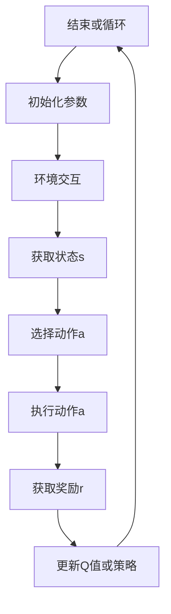
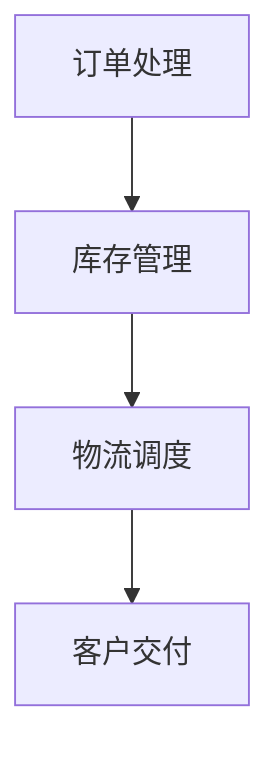
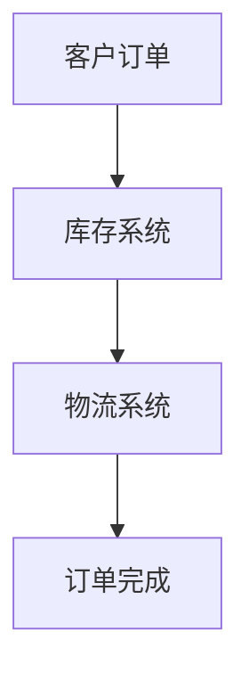
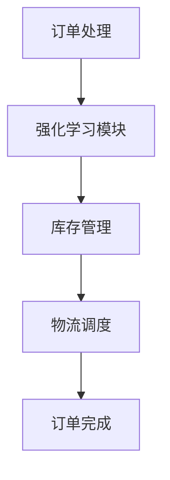

                 


# 企业AI Agent的强化学习在供应链优化中的应用

## 关键词：企业AI Agent、强化学习、供应链优化、库存管理、物流调度、智能优化、数学建模

## 摘要：  
本文探讨了企业AI Agent结合强化学习在供应链优化中的应用，系统地分析了强化学习算法的核心原理，供应链优化的核心问题，以及AI Agent在供应链优化中的应用场景。通过实际案例分析和系统设计，展示了如何利用强化学习提升供应链的效率和响应能力，为企业智能化转型提供技术参考。

---

# 第1章: 企业AI Agent与强化学习概述

## 1.1 企业AI Agent的基本概念

### 1.1.1 AI Agent的定义与特点
AI Agent（人工智能代理）是指能够感知环境、自主决策并执行任务的智能实体。它具备以下特点：
- **自主性**：能够自主决策，无需外部干预。
- **反应性**：能够实时感知环境并做出反应。
- **目标导向**：具备明确的目标，行为围绕目标展开。
- **学习能力**：能够通过经验改进性能。

### 1.1.2 企业AI Agent的核心要素
企业AI Agent在供应链优化中的核心要素包括：
- **状态感知**：通过传感器或数据源获取环境信息。
- **决策模型**：基于强化学习算法进行决策。
- **执行能力**：通过接口与外部系统交互。

### 1.1.3 强化学习的基本概念
强化学习是一种机器学习范式，通过智能体与环境的交互，学习最优策略以最大化累积奖励。其核心要素包括：
- **状态（State）**：环境的当前情况。
- **动作（Action）**：智能体采取的行为。
- **奖励（Reward）**：环境对动作的反馈。

## 1.2 强化学习与供应链优化的结合

### 1.2.1 供应链优化的核心问题
供应链优化的核心问题包括：
- **库存管理**：优化库存水平，减少成本。
- **物流调度**：优化运输路径，降低物流成本。
- **需求预测**：准确预测市场需求，调整生产计划。

### 1.2.2 AI Agent在供应链优化中的作用
AI Agent通过强化学习算法，能够在动态环境中实时调整策略，优化供应链的运作效率。

## 1.3 本章小结
本章介绍了AI Agent和强化学习的基本概念，分析了它们在供应链优化中的应用背景和核心作用，为后续章节奠定了基础。

---

# 第2章: 强化学习算法原理

## 2.1 强化学习的基本原理

### 2.1.1 Q-learning算法的数学模型
Q-learning算法通过更新Q值表来学习最优策略，其数学模型如下：
$$ Q(s, a) = Q(s, a) + \alpha (r + \gamma \max Q(s', a') - Q(s, a)) $$  
其中：
- $Q(s, a)$：当前状态下动作$a$的Q值。
- $\alpha$：学习率。
- $\gamma$：折扣因子。
- $r$：奖励值。

### 2.1.2 策略梯度方法的原理
策略梯度方法通过优化策略的参数来最大化期望奖励，其数学模型如下：
$$ \nabla \theta J(\theta) = \mathbb{E}[\nabla \log \pi(a|s) Q(s,a)] $$  
其中：
- $J(\theta)$：目标函数。
- $\pi(a|s)$：策略函数。

## 2.2 强化学习算法的流程图



## 2.3 强化学习算法的实现

### 2.3.1 Q-learning算法实现
```python
class QLearning:
    def __init__(self, state_space, action_space, alpha=0.1, gamma=0.99):
        self.state_space = state_space
        self.action_space = action_space
        self.alpha = alpha
        self.gamma = gamma
        self.Q = np.zeros((state_space, action_space))

    def get_action(self, state):
        return np.argmax(self.Q[state, :])

    def update_Q(self, state, action, reward, next_state):
        self.Q[state, action] += self.alpha * (reward + self.gamma * np.max(self.Q[next_state, :]) - self.Q[state, action])
```

## 2.4 

---

# 第3章: 供应链优化的核心问题

## 3.1 供应链优化的核心问题

### 3.1.1 库存管理
库存管理的目标是找到最优库存水平，减少存储成本和缺货风险。

### 3.1.2 物流调度
物流调度的目标是优化运输路径，降低物流成本。

### 3.1.3 需求预测
需求预测的目标是准确预测市场需求，调整生产计划。

## 3.2 供应链优化的数学建模

### 3.2.1 库存管理模型
库存管理的数学模型如下：
$$ \text{总成本} = \text{存储成本} + \text{订货成本} + \text{缺货成本} $$

### 3.2.2 物流调度模型
物流调度的数学模型如下：
$$ \text{总成本} = \sum_{i=1}^{n} \text{运输成本}(i) $$

## 3.3 本章小结
本章分析了供应链优化的核心问题，包括库存管理、物流调度和需求预测，并展示了如何通过数学建模来解决这些问题。

---

# 第4章: AI Agent在供应链优化中的应用

## 4.1 AI Agent在供应链优化中的应用场景

### 4.1.1 智能补货
智能补货通过AI Agent实时监控库存水平，自动触发补货请求。

### 4.1.2 物流路径优化
物流路径优化通过AI Agent计算最优运输路径，降低物流成本。

## 4.2 AI Agent的系统设计

### 4.2.1 系统架构设计



### 4.2.2 系统交互设计



## 4.3 本章小结
本章探讨了AI Agent在供应链优化中的应用场景，并展示了系统的架构设计和交互设计。

---

# 第5章: 强化学习在供应链优化中的系统设计

## 5.1 系统设计概述

### 5.1.1 系统架构设计



### 5.1.2 接口设计
系统接口包括：
- **订单接口**：接收客户订单。
- **库存接口**：管理库存数据。
- **物流接口**：调度物流资源。

## 5.2 系统实现

### 5.2.1 强化学习模块实现
```python
class SupplyChainAgent:
    def __init__(self, state_space, action_space, alpha=0.1, gamma=0.99):
        self.state_space = state_space
        self.action_space = action_space
        self.alpha = alpha
        self.gamma = gamma
        self.Q = np.zeros((state_space, action_space))

    def get_action(self, state):
        return np.argmax(self.Q[state, :])

    def update_Q(self, state, action, reward, next_state):
        self.Q[state, action] += self.alpha * (reward + self.gamma * np.max(self.Q[next_state, :]) - self.Q[state, action])
```

## 5.3 本章小结
本章详细描述了强化学习在供应链优化中的系统设计，包括架构设计和接口设计，并展示了系统的实现代码。

---

# 第6章: 强化学习在供应链优化中的项目实战

## 6.1 项目介绍

### 6.1.1 项目背景
本项目旨在通过强化学习优化企业的库存管理和物流调度。

### 6.1.2 项目目标
通过强化学习算法，实现库存管理和物流调度的优化。

## 6.2 项目实现

### 6.2.1 环境安装
需要安装以下依赖：
- Python 3.8+
- NumPy
- Matplotlib

### 6.2.2 核心算法实现
```python
class SupplyChainAgent:
    def __init__(self, state_space, action_space, alpha=0.1, gamma=0.99):
        self.state_space = state_space
        self.action_space = action_space
        self.alpha = alpha
        self.gamma = gamma
        self.Q = np.zeros((state_space, action_space))

    def get_action(self, state):
        return np.argmax(self.Q[state, :])

    def update_Q(self, state, action, reward, next_state):
        self.Q[state, action] += self.alpha * (reward + self.gamma * np.max(self.Q[next_state, :]) - self.Q[state, action])
```

## 6.3 项目总结
通过本项目，展示了强化学习在供应链优化中的实际应用，验证了算法的有效性和优化效果。

---

# 第7章: 强化学习的前沿技术与未来展望

## 7.1 强化学习的前沿技术

### 7.1.1 分布式强化学习
分布式强化学习通过多智能体协同学习，提升系统的整体性能。

### 7.1.2 连续空间强化学习
连续空间强化学习适用于动作空间连续的问题。

## 7.2 未来展望

### 7.2.1 与其他技术的结合
强化学习可以与区块链、物联网等技术结合，拓展应用领域。

### 7.2.2 应用场景的扩展
强化学习在供应链优化中的应用将更加广泛，涵盖更多业务场景。

## 7.3 本章小结
本章展望了强化学习的前沿技术，分析了其在供应链优化中的未来发展方向。

---

# 附录

## 附录A: 参考文献

## 附录B: 强化学习工具包

## 附录C: 术语表

---

# 本文结束

