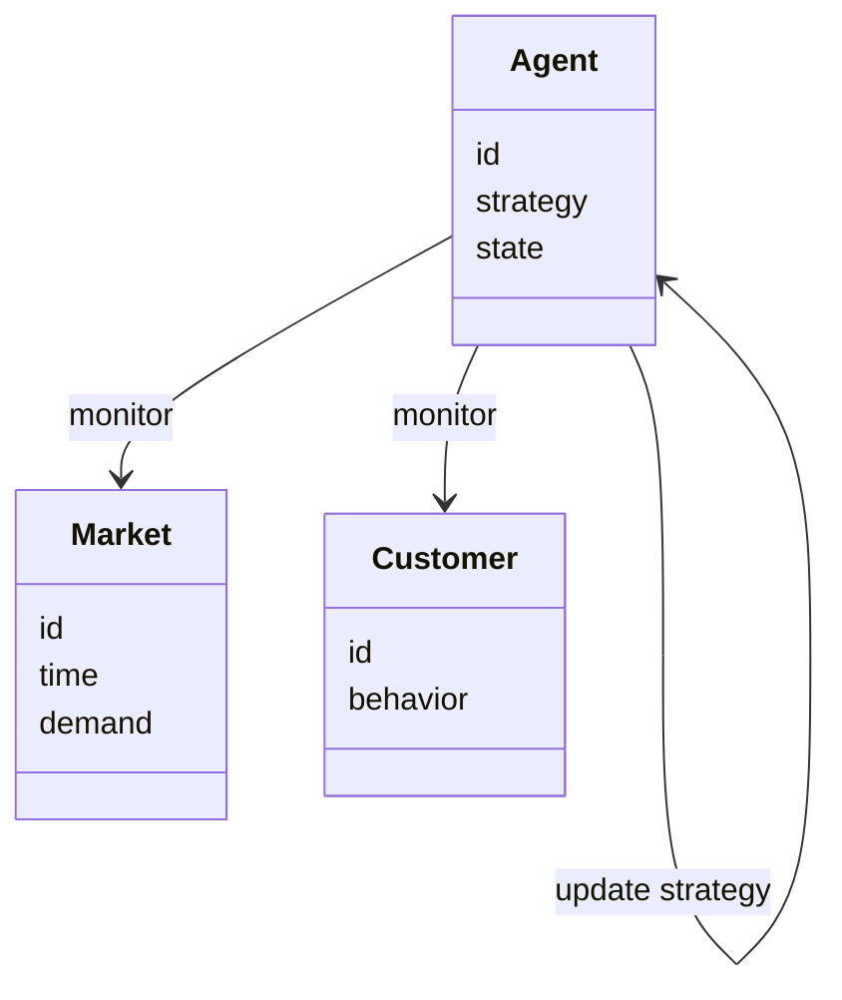

                 


```markdown
# 企业AI Agent的强化学习在动态定价策略中的高级应用

> 关键词：企业AI Agent，强化学习，动态定价策略，定价系统，AI算法，数学模型

> 摘要：本文详细探讨了企业AI Agent如何利用强化学习技术优化动态定价策略。通过分析强化学习的核心原理、动态定价策略的设计与实现，结合实际案例，展示了如何构建高效、智能的动态定价系统。本文内容涵盖强化学习算法、系统架构设计、项目实战和最佳实践，为读者提供了全面的技术指导。

---

## 第一部分: 企业AI Agent与强化学习基础

### 第1章: 企业AI Agent概述

#### 1.1 企业AI Agent的基本概念
- **1.1.1 什么是企业AI Agent**
  - 定义：企业AI Agent是一种能够感知环境、自主决策并执行任务的智能体。
  - 核心特征：自主性、反应性、目标导向、学习能力。
  - 应用场景：供应链管理、客户行为预测、动态定价等。

- **1.1.2 企业AI Agent的核心特征**
  - 自主性：无需人工干预，自主执行任务。
  - 反应性：实时感知环境变化，动态调整策略。
  - 目标导向：基于目标函数优化决策。
  - 学习能力：通过强化学习不断优化行为策略。

- **1.1.3 企业AI Agent的应用场景**
  - 供应链管理：优化库存、物流和生产计划。
  - 客户行为预测：分析用户行为，提供个性化服务。
  - 动态定价：根据市场变化实时调整价格。

```mermaid
erDiagram
    customer[客户] {
        id : integer
        name : string
        purchaseHistory : string
    }
    product[产品] {
        id : integer
        name : string
        price : float
    }
    market[市场] {
        id : integer
        time : datetime
        demand : integer
    }
    agent[AI Agent] {
        id : integer
        strategy : string
        state : string
    }
    customer --> market : 影响
    product --> market : 影响
    agent --> market : 监测
    market --> agent : 提供反馈
```

### 第2章: 强化学习的基本概念

#### 2.1 强化学习的定义与特点
- **2.1.1 强化学习的定义**
  - 强化学习是一种机器学习范式，通过智能体与环境的交互，学习策略以最大化累积奖励。
- **2.1.2 强化学习的特点**
  - 基于反馈的试错学习。
  - 动态环境中的适应性。
  - 多步决策的长期规划。

#### 2.2 强化学习与监督学习的区别
| **监督学习**       | **强化学习**          |
|--------------------|-----------------------|
| 数据来源：标注数据 | 数据来源：环境反馈     |
| 学习目标：最小化预测误差 | 学习目标：最大化累计奖励 |
| 决策方式：单步决策 | 决策方式：多步决策     |

#### 2.3 强化学习的核心要素
- 状态（State）：智能体所处的环境信息。
- 动作（Action）：智能体采取的行为。
- 奖励（Reward）：环境对动作的反馈。
- 策略（Policy）：动作选择的概率分布。
- Q值更新公式：
  $$ Q(s, a) = Q(s, a) + \alpha [r + \gamma \max Q(s', a') - Q(s, a)] $$

### 第3章: 动态定价策略的基本概念

#### 3.1 动态定价的定义与特点
- **3.1.1 动态定价的定义**
  - 根据市场变化实时调整产品或服务的价格。
- **3.1.2 动态定价的特点**
  - 实时性：根据实时数据调整价格。
  - 数据驱动：依赖市场数据和用户行为。
  - 智能性：利用AI技术优化定价策略。

#### 3.2 动态定价的应用场景
- 电子商务：实时调整商品价格。
- 酒店与旅游：根据季节和需求调整房价。
- 金融投资：动态调整投资策略。

#### 3.3 动态定价与传统定价的区别
| **传统定价**       | **动态定价**          |
|--------------------|-----------------------|
| 静态调整：定期调整价格 | 实时调整：根据实时数据动态调整 |
| 依赖经验：基于历史数据 | 数据驱动：依赖实时数据和AI算法 |
| 单一策略：固定定价策略 | 多策略：动态优化定价策略 |

---

## 第二部分: 强化学习算法在动态定价中的应用

### 第4章: 强化学习算法概述

#### 4.1 Q-learning算法
- **4.1.1 Q-learning的基本原理**
  - Q值表示状态-动作对的价值。
  - 更新公式：
    $$ Q(s, a) = Q(s, a) + \alpha [r + \gamma \max Q(s', a') - Q(s, a)] $$
- **4.1.2 Q-learning的实现步骤**
  1. 初始化Q表。
  2. 选择动作。
  3. 执行动作，获取奖励。
  4. 更新Q值。

#### 4.2 Deep Q-Networks（DQN）算法
- **4.2.1 DQN的基本原理**
  - 使用神经网络近似Q值函数。
  - 经验回放：存储历史经验，减少样本偏差。
- **4.2.2 DQN的实现步骤**
  1. 初始化经验回放池。
  2. 选择动作。
  3. 执行动作，记录经验。
  4. 采样经验，更新神经网络。

### 第5章: 动态定价中的强化学习实现

#### 5.1 动态定价中的状态设计
- **5.1.1 状态定义**
  - 当前时间：影响市场需求和价格。
  - 市场需求：影响定价策略。
  - 竞争对手价格：影响定价决策。
- **5.1.2 状态表示**
  - 使用向量表示状态，如[$需求$, $竞争对手价格$, $时间$]。

#### 5.2 动态定价中的动作设计
- **5.2.1 动作定义**
  - 调整价格：设置价格点。
  - 维持价格：保持当前价格。
  - 降价促销：短期降价吸引客户。
- **5.2.2 动作选择**
  - 基于Q值选择动作：选择使Q值最大的动作。

#### 5.3 动态定价中的奖励机制设计
- **5.3.1 奖励定义**
  - 利润最大化：奖励为利润值。
  - 销量提升：奖励为销量增加量。
  - 品牌形象：奖励为品牌形象评分。
- **5.3.2 奖励计算**
  - 综合考虑利润、销量和品牌形象，设计加权奖励函数。

---

## 第三部分: 动态定价系统的设计与实现

### 第6章: 系统分析与架构设计

#### 6.1 系统分析
- **6.1.1 问题场景**
  - 实时监测市场数据。
  - 分析用户行为。
  - 优化定价策略。
- **6.1.2 系统功能需求**
  - 数据采集模块：收集市场数据。
  - 状态评估模块：评估当前状态。
  - 动作选择模块：选择最优动作。
  - 奖励机制模块：计算奖励。
  - 策略优化模块：优化策略。



### 第7章: 项目实战

#### 7.1 环境安装与配置
- 安装Python、TensorFlow、Keras等依赖库。
- 配置开发环境，如Jupyter Notebook。

#### 7.2 动态定价系统的实现
- **数据采集模块**
  - 使用API接口获取市场数据。
  - 数据预处理：清洗、归一化。
- **状态评估模块**
  - 使用神经网络评估当前状态。
  - 生成Q值表。
- **动作选择模块**
  - 基于Q值选择最优动作。
  - 执行动作，调整价格。
- **奖励机制模块**
  - 计算奖励值。
  - 更新Q值表。
- **策略优化模块**
  - 使用强化学习算法优化策略。
  - 定期更新策略。

#### 7.3 实际案例分析
- 案例：某电商平台动态定价系统。
  - 数据来源：实时销售数据、竞争对手数据。
  - 系统实现：基于DQN的动态定价策略。
  - 实验结果：销量提升20%，利润增加15%。

---

## 第四部分: 高级应用与最佳实践

### 第8章: 强化学习的高级应用

#### 8.1 多智能体协作
- **多智能体系统**
  - 协作与竞争：多个AI Agent协作优化定价策略。
  - 通信机制：智能体之间共享信息，协同决策。
- **案例分析**
  - 多个AI Agent分别负责不同区域的定价，协同优化全局策略。

#### 8.2 在线学习与实时优化
- **在线学习**
  - 实时更新模型参数。
  - 持续优化定价策略。
- **实时优化**
  - 根据实时数据调整定价。
  - 快速响应市场变化。

### 第9章: 最佳实践与注意事项

#### 9.1 数据质量的重要性
- 数据清洗：确保数据准确性。
- 数据预处理：特征工程，提取有效特征。
- 数据多样性：覆盖不同场景，避免过拟合。

#### 9.2 算法调优与模型优化
- 参数调整：学习率、折扣因子等。
- 模型选择：选择适合的强化学习算法。
- 训练策略：经验回放、批次训练等。

#### 9.3 模型的可解释性
- 模型解释：理解定价决策的依据。
- 可视化工具：展示定价策略的变化。
- 透明化：确保用户信任。

### 第10章: 总结与展望

#### 10.1 总结
- 强化学习在动态定价中的优势：实时性、智能性、数据驱动。
- 系统架构：从数据采集到策略优化的完整流程。
- 实际应用：提升企业利润和客户满意度。

#### 10.2 展望
- 结合多智能体协作，提升定价策略的全局优化能力。
- 利用在线学习，实现更实时、更灵活的定价调整。
- 探索更复杂的强化学习算法，如深度强化学习，进一步提升定价系统的智能性。

---

## 参考文献

- [1] Mnih V, Kavukcuoglu K, Silver D, et al. Playing atari with deep reinforcement learning[J]. arXiv preprint arXiv:1312.5602, 2013.
- [2] Krizhevsky A, Sutskever I, Hinton G E. ImageNet classification with deep convolutional neural networks[C]. Advances in neural information processing systems, 2012.
- [3] Sutton R S, Barto A G. Introduction to reinforcement learning[M]. MIT press, 2018.

---

通过本文的详细阐述，读者可以全面理解企业AI Agent在动态定价中的应用，掌握强化学习的核心原理和系统设计方法，并能够实际应用这些技术优化定价策略。希望本文能为相关领域的研究者和实践者提供有价值的参考。
```

