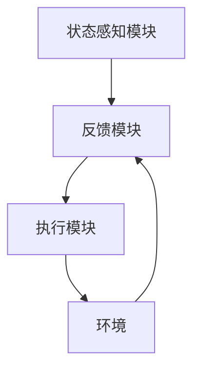
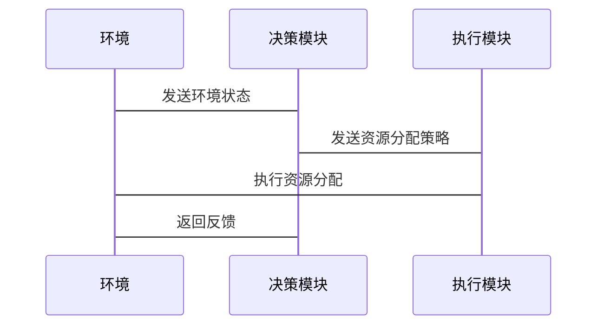

                 


# 企业AI Agent的强化学习在动态资源分配中的应用

> **关键词**：企业AI Agent、强化学习、动态资源分配、Q-learning算法、Deep Q-Network、系统架构设计

> **摘要**：  
> 在企业环境中，资源分配问题复杂且动态多变，传统的静态分配方法难以应对。本文探讨如何利用强化学习（Reinforcement Learning，RL）技术，通过企业AI Agent实现动态资源分配的优化。文章从强化学习的基本概念出发，详细分析动态资源分配的背景、挑战及强化学习的优势，结合具体的算法原理、系统架构设计、项目实战案例，深入探讨AI Agent在动态资源分配中的应用，并提出优化建议和未来发展方向。

---

## 引言

在现代企业中，资源分配是一个复杂而动态的过程，涉及计算资源、人力资源、资金等多种资源的合理配置。传统的静态资源分配方法难以应对环境的不确定性，而强化学习（Reinforcement Learning，RL）作为一种基于试错的学习方法，能够通过与环境的交互不断优化决策。本文将结合AI Agent和强化学习，探讨如何在动态环境中实现资源分配的智能化优化。

---

## 第一部分：企业AI Agent的概述

### 第1章：AI Agent的基本概念与特点

#### 1.1 AI Agent的定义
AI Agent（人工智能代理）是指能够感知环境、自主决策并采取行动以实现目标的智能体。它能够根据环境反馈调整行为，适应动态变化的需求。

#### 1.2 AI Agent的核心特点
- **自主性**：AI Agent能够在没有外部干预的情况下自主决策。
- **反应性**：能够实时感知环境变化并做出响应。
- **目标导向**：以明确的目标为导向，优化决策过程。
- **学习能力**：通过与环境交互不断优化自身策略。

#### 1.3 AI Agent在企业中的应用前景
AI Agent在企业中的应用广泛，包括任务分配、资源调度、供应链优化等领域。通过强化学习，AI Agent能够更好地应对动态环境中的复杂决策问题。

---

### 第2章：强化学习的基本概念与特点

#### 2.1 强化学习的定义
强化学习是一种通过试错机制，使智能体在与环境的交互中学习最优策略的学习方法。智能体通过选择动作并接收奖励或惩罚来优化其行为。

#### 2.2 强化学习的核心特点
- **试错性**：通过不断尝试动作并根据反馈调整策略。
- **延迟奖励**：奖励可能在多个动作之后才给出。
- **环境动态性**：环境可能根据智能体的动作发生变化。

#### 2.3 强化学习与监督学习的区别
| 特性 | 监督学习 | 强化学习 |
|------|----------|----------|
| 数据 | 标签数据 | 状态和奖励 |
| 目标 | 最小化预测误差 | 最大化累积奖励 |
| 决策 | 确定性 | 概率性 |

---

## 第二部分：动态资源分配的背景与挑战

### 第3章：动态资源分配的背景

#### 3.1 动态资源分配的定义
动态资源分配是指在动态变化的环境中，根据实时需求和资源可用性，动态调整资源分配策略的过程。

#### 3.2 动态资源分配的场景
- **云计算资源分配**：根据实时计算需求动态分配计算资源。
- **任务调度优化**：在多任务环境中优化任务的执行顺序和资源分配。
- **供应链管理**：根据市场需求动态调整生产和库存资源。

#### 3.3 动态资源分配的重要性
- 提高资源利用率。
- 快速响应环境变化。
- 实现最优资源分配策略。

### 第4章：动态资源分配的挑战

#### 4.1 环境的不确定性
动态环境中，资源需求和可用性可能随时变化，导致决策的不确定性。

#### 4.2 多目标优化问题
资源分配通常涉及多个目标（如成本、效率、公平性等），需要在多个目标之间进行权衡。

#### 4.3 实时性要求
动态资源分配需要快速响应，对系统的实时性要求较高。

---

## 第三部分：强化学习在动态资源分配中的应用

### 第5章：强化学习的核心算法

#### 5.1 Q-learning算法
Q-learning是一种经典的强化学习算法，适用于离散动作空间的问题。

##### Q-learning的数学模型
$$ Q(s, a) = Q(s, a) + \alpha [r + \max_{a'} Q(s', a') - Q(s, a)] $$
其中，$Q(s, a)$表示状态$s$下动作$a$的Q值，$\alpha$为学习率，$r$为奖励，$s'$为下一状态。

##### Q-learning的优缺点
- **优点**：简单易实现，适用于离散动作空间。
- **缺点**：收敛速度较慢，难以处理连续状态空间。

#### 5.2 Deep Q-Network (DQN) 算法
DQN通过深度神经网络近似Q值函数，适用于连续动作空间的问题。

##### DQN的数学模型
$$ Q(s, a) = \theta \cdot \phi(s, a) $$
其中，$\theta$为网络参数，$\phi(s, a)$为特征函数。

##### DQN的优缺点
- **优点**：能够处理高维状态空间。
- **缺点**：训练过程复杂，需要目标网络和经验回放机制。

### 第6章：动态资源分配的问题建模

#### 6.1 问题场景介绍
假设我们需要在一个动态环境中分配计算资源，资源需求随时间变化，目标是最大化资源利用率并最小化成本。

#### 6.2 状态空间设计
状态空间包括当前资源需求、可用资源、历史分配情况等。

#### 6.3 动作空间设计
动作空间包括分配资源、调整资源分配策略等。

#### 6.4 奖励函数设计
奖励函数定义为：
$$ R = \text{资源利用率} - \text{分配成本} $$

#### 6.5 数学模型构建
构建强化学习模型，将动态资源分配问题转化为一个马尔可夫决策过程（MDP）。

---

## 第四部分：系统架构与实现

### 第7章：系统架构设计

#### 7.1 系统功能模块
- **状态感知模块**：感知环境状态。
- **决策模块**：基于强化学习算法进行决策。
- **执行模块**：执行决策动作。
- **反馈模块**：接收环境反馈并更新模型。

#### 7.2 系统架构图


#### 7.3 系统接口设计
- 输入接口：接收环境状态和资源需求。
- 输出接口：输出资源分配策略。

#### 7.4 系统交互流程


---

## 第五部分：项目实战

### 第8章：云服务器资源分配案例

#### 8.1 环境配置
- 安装Python和深度学习框架（如TensorFlow）。
- 配置云服务器资源模拟环境。

#### 8.2 核心代码实现
```python
import numpy as np
import gym
from tensorflow.keras import layers

# 定义环境
class ResourceAllocationEnv(gym.Env):
    def __init__(self):
        # 状态空间定义
        self.observation_space = gym.spaces.Box(low=0, high=1, shape=(1,))
        # 动作空间定义
        self.action_space = gym.spaces.Discrete(5)
        # 状态初始化
        self.state = 0

    def step(self, action):
        # 执行动作
        reward = self.calculate_reward(action)
        next_state = self.calculate_next_state(action)
        return next_state, reward, False, {}

    def calculate_reward(self, action):
        # 计算奖励
        return action * 2 - 1

    def calculate_next_state(self, action):
        # 计算下一个状态
        return np.random.uniform(0, 1)

    def reset(self):
        # 初始化环境
        self.state = 0
        return self.state
```

#### 8.3 代码应用解读
上述代码定义了一个资源分配环境，包括状态空间、动作空间和奖励函数。通过强化学习算法，AI Agent可以在环境中学习最优资源分配策略。

---

## 第六部分：优化与展望

### 第9章：优化建议

#### 9.1 算法优化
- 使用更高效的强化学习算法（如PPO）。
- 引入经验重放机制，提高学习效率。

#### 9.2 系统优化
- 优化系统架构，提高实时响应能力。
- 引入分布式计算，提高资源分配效率。

### 第10章：未来展望

#### 10.1 强化学习的未来发展
- 更复杂的动态环境。
- 更高效的强化学习算法。

#### 10.2 AI Agent的未来应用
- 更广泛的应用场景。
- 更智能的决策能力。

---

## 附录

### A. 数据集与工具栈

- **数据集**：公开可用的资源分配数据集。
- **工具栈**：TensorFlow、PyTorch、OpenAI Gym。

### B. 参考文献
1. Mnih, V., et al. "Human-level control through deep reinforcement learning." Nature, 2015.
2. Sutton, R. S., & Barto, A. G. "Reinforcement learning: An introduction." MIT Press, 2018.

### C. 扩展阅读
- 《强化学习：理论与应用》
- 《AI Agent的设计与实现》

---

## 结语

通过本文的探讨，我们深入分析了强化学习在动态资源分配中的应用，结合理论、算法、系统设计和项目实战，为读者提供了全面的视角。未来，随着技术的不断发展，强化学习和AI Agent将在更多领域发挥重要作用。

