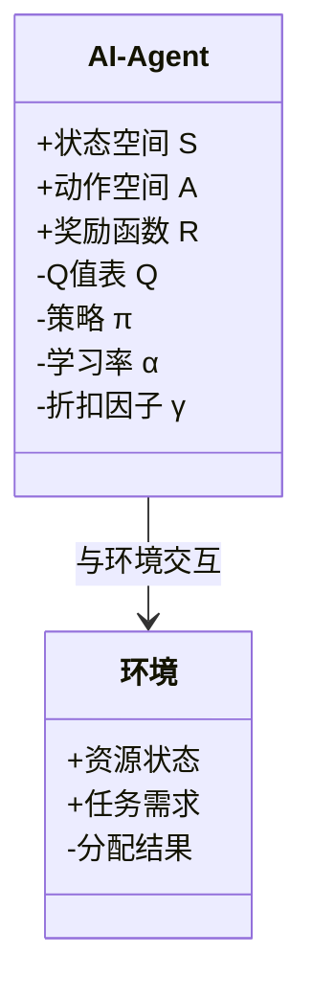
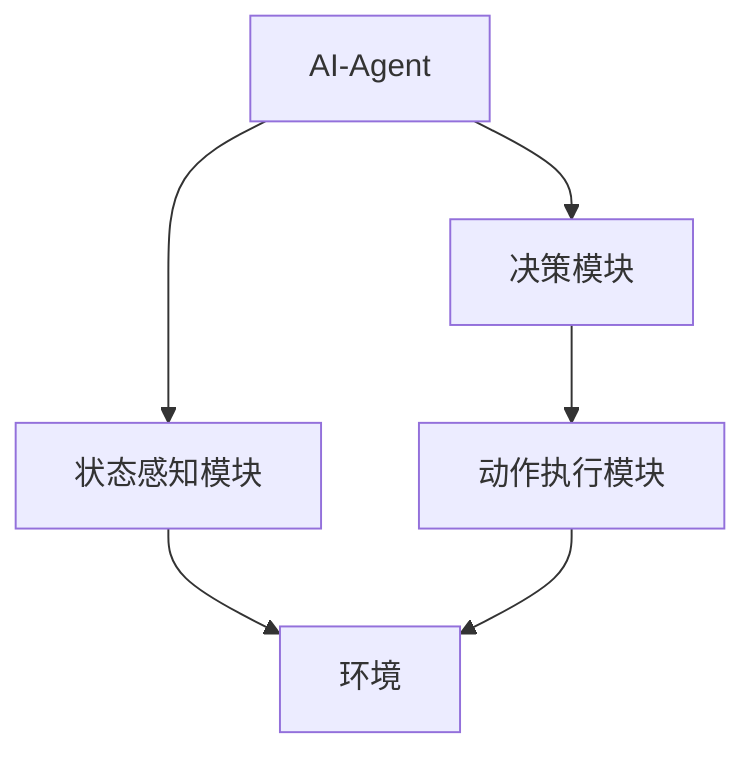
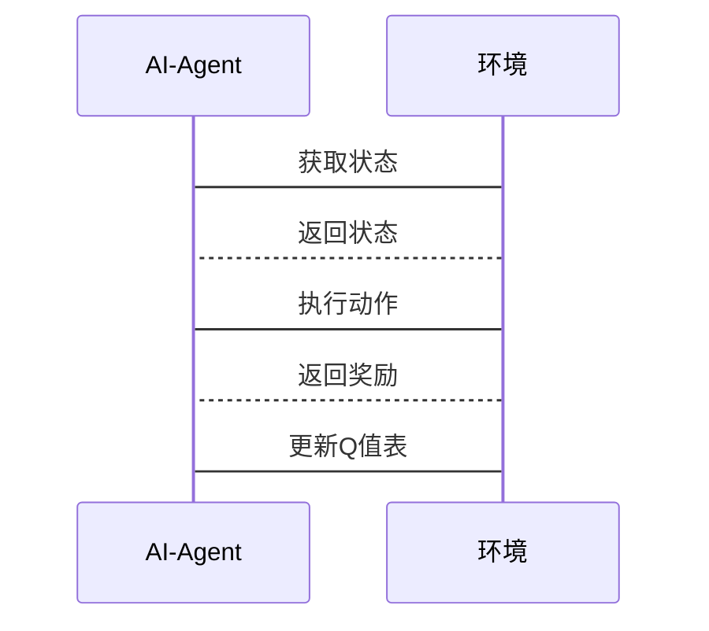

                 


# 企业AI Agent的强化学习在动态资源分配中的应用

---

## 关键词
- AI Agent
- 强化学习
- 动态资源分配
- 企业应用
- 数学模型
- 算法实现
- 优化策略

---

## 摘要
本文探讨了AI Agent在企业动态资源分配中的应用，结合强化学习的核心原理，分析了如何通过强化学习算法优化资源分配策略。文章从AI Agent和强化学习的基本概念出发，详细阐述了动态资源分配的背景与挑战，提出了基于强化学习的资源分配模型，并通过具体的算法实现和系统设计，展示了如何在企业场景中应用这些技术。最后，本文通过实际案例分析，总结了最佳实践经验和未来研究方向。

---

# 第一部分：企业AI Agent的强化学习基础

## 第1章：AI Agent与强化学习概述

### 1.1 AI Agent的基本概念
#### 1.1.1 AI Agent的定义与特点
AI Agent（人工智能代理）是指能够感知环境、自主决策并执行任务的智能实体。AI Agent的核心特点包括：
- **自主性**：能够独立执行任务，无需外部干预。
- **反应性**：能够实时感知环境变化并做出响应。
- **目标导向**：以特定目标为导向，优化决策过程。
- **学习能力**：通过与环境交互，不断优化自身的决策策略。

#### 1.1.2 AI Agent的核心功能与应用场景
AI Agent的主要功能包括：
- **感知环境**：通过传感器、数据接口等方式获取环境信息。
- **决策与规划**：基于感知信息，制定最优决策策略。
- **执行操作**：根据决策结果执行具体操作。

AI Agent的应用场景广泛，包括机器人控制、自动驾驶、智能推荐系统等。

#### 1.1.3 AI Agent与传统算法的对比
| 对比维度 | AI Agent | 传统算法 |
|----------|-----------|----------|
| 决策方式 | 基于目标和环境反馈动态调整 | 预定义规则或固定逻辑 |
| 学习能力 | 具备自主学习能力 | 无学习能力或学习能力有限 |
| 适应性 | 能够适应动态变化的环境 | 适应性较弱，需人工调整 |

### 1.2 强化学习的基本原理
#### 1.2.1 强化学习的定义与特点
强化学习（Reinforcement Learning, RL）是一种机器学习范式，通过智能体与环境的交互，学习最优策略。其核心特点包括：
- **目标导向**：智能体通过最大化累积奖励来优化决策。
- **试错学习**：智能体通过不断尝试和错误，逐步逼近最优策略。
- **动态反馈**：环境通过奖励信号指导智能体的决策。

#### 1.2.2 强化学习的核心要素
- **状态（State）**：智能体所处的环境信息。
- **动作（Action）**：智能体基于当前状态做出的决策。
- **奖励（Reward）**：环境对智能体决策的反馈，用于指导学习方向。

#### 1.2.3 强化学习与监督学习的区别
| 对比维度 | 强化学习 | 监督学习 |
|----------|----------|----------|
| 数据来源 | 环境反馈 | 标签数据 |
| 决策目标 | 最大化累积奖励 | 最小化预测误差 |
| 适应性 | 高 | 低 |

### 1.3 动态资源分配的背景与挑战
#### 1.3.1 动态资源分配的定义
动态资源分配是指在动态变化的环境中，根据实时需求和资源可用性，优化资源分配策略的过程。

#### 1.3.2 动态资源分配的核心问题与难点
动态资源分配的核心问题包括：
- **资源约束**：资源有限，需在多个需求之间进行平衡。
- **动态变化**：环境和需求实时变化，要求快速响应。
- **不确定性**：未来状态和奖励具有不确定性。

#### 1.3.3 企业级资源分配的复杂性
企业级资源分配的复杂性主要体现在：
- **多目标优化**：需同时考虑成本、效率、用户体验等多个目标。
- **多主体协作**：涉及多个部门和系统的协同工作。
- **实时性要求**：需在极短时间内做出决策。

---

## 第2章：AI Agent在动态资源分配中的应用

### 2.1 AI Agent与动态资源分配的结合
#### 2.1.1 AI Agent在资源分配中的角色
AI Agent在动态资源分配中扮演着关键角色：
- **感知环境**：通过收集实时数据，了解资源需求和可用性。
- **决策优化**：基于强化学习算法，制定最优资源分配策略。
- **执行操作**：根据决策结果，执行资源分配操作。

#### 2.1.2 强化学习在动态资源分配中的优势
强化学习在动态资源分配中的优势包括：
- **自适应性**：能够根据环境变化动态调整分配策略。
- **全局优化**：能够同时考虑多个目标，实现全局最优。
- **高效性**：通过试错学习，快速找到最优解。

#### 2.1.3 动态资源分配的典型场景
动态资源分配的典型场景包括：
- **云计算资源分配**：动态分配计算资源以满足实时任务需求。
- **交通网络优化**：优化交通流量分配，减少拥堵。
- **生产调度优化**：动态调整生产资源分配，提高效率。

### 2.2 基于强化学习的资源分配模型
#### 2.2.1 模型的基本架构
基于强化学习的资源分配模型通常包括以下几个部分：
- **状态空间**：表示当前环境的状态，例如资源利用率、任务需求等。
- **动作空间**：表示可能的决策动作，例如分配多少资源给某个任务。
- **奖励函数**：定义奖励机制，鼓励智能体做出最优决策。

#### 2.2.2 状态空间与动作空间的设计
| 参数 | 状态空间 | 动作空间 |
|------|----------|----------|
| 示例 | 资源利用率、任务需求 | 资源分配量 |

#### 2.2.3 奖励函数的定义与优化
奖励函数的设计直接影响智能体的决策行为。常见的奖励函数包括：
- **即时奖励**：基于当前状态和动作的奖励。
- **累积奖励**：基于长期累积的奖励。

---

## 第3章：强化学习算法原理与数学模型

### 3.1 强化学习的核心算法
#### 3.1.1 Q-Learning算法
Q-Learning是一种经典的强化学习算法，其核心思想是通过更新Q值表，学习状态-动作对的最优值。

#### 3.1.2 Deep Q-Networks (DQN) 算法
DQN算法通过深度神经网络近似Q值函数，能够处理高维状态空间和动作空间。

#### 3.1.3 Policy Gradient方法
Policy Gradient方法通过直接优化策略，最大化奖励的期望值。

### 3.2 数学模型与公式
#### 3.2.1 Q-Learning的数学模型
$$ Q(s, a) = Q(s, a) + \alpha (r + \gamma \max Q(s', a') - Q(s, a)) $$

#### 3.2.2 DQN的数学模型
$$ \text{损失函数} = \mathbb{E}[(r + \gamma Q(s', a') - Q(s, a))^2] $$

#### 3.2.3 Policy Gradient的数学模型
$$ \nabla \theta J(\theta) = \mathbb{E}[\nabla \ln \pi(a|s) \cdot Q(s,a)] $$

---

## 第4章：系统分析与架构设计

### 4.1 问题场景介绍
动态资源分配的典型场景包括云计算资源分配、交通网络优化和生产调度优化。

### 4.2 系统功能设计
#### 4.2.1 领域模型类图


#### 4.2.2 系统架构设计


### 4.3 系统交互设计


---

## 第5章：项目实战

### 5.1 环境安装
安装强化学习框架（如TensorFlow、PyTorch）和相关库（如OpenAI Gym）。

### 5.2 系统核心实现源代码
```python
import numpy as np
import gym
import random

class AI-Agent:
    def __init__(self, state_space, action_space):
        self.state_space = state_space
        self.action_space = action_space
        self.Q = np.zeros((state_space, action_space))
        self.alpha = 0.1
        self.gamma = 0.9

    def take_action(self, state):
        if random.random() < 0.1:
            return random.randint(0, self.action_space - 1)
        return np.argmax(self.Q[state, :])

    def update_Q(self, state, action, reward, next_state):
        self.Q[state, action] += self.alpha * (reward + self.gamma * np.max(self.Q[next_state, :]) - self.Q[state, action])

# 创建环境
env = gym.make('CustomResourceAllocation-v0')
agent = AI-Agent(env.observation_space.shape[0], env.action_space.n)

# 训练过程
for episode in range(1000):
    state = env.reset()
    total_reward = 0
    while True:
        action = agent.take_action(state)
        next_state, reward, done, _ = env.step(action)
        agent.update_Q(state, action, reward, next_state)
        total_reward += reward
        state = next_state
        if done:
            break
    print(f" Episode {episode}, Total Reward: {total_reward}")
```

### 5.3 代码应用解读与分析
上述代码实现了一个简单的Q-Learning算法，用于动态资源分配。通过与环境的交互，AI Agent不断更新Q值表，优化资源分配策略。

### 5.4 实际案例分析
以云计算资源分配为例，AI Agent可以根据实时任务需求和资源利用率，动态调整计算资源的分配，优化资源利用率和任务响应时间。

### 5.5 项目小结
通过本项目，我们验证了强化学习在动态资源分配中的有效性，并展示了如何通过AI Agent实现资源的智能分配。

---

## 第6章：总结与展望

### 6.1 总结
本文详细探讨了AI Agent在动态资源分配中的应用，结合强化学习的核心原理，提出了基于强化学习的资源分配模型，并通过实际案例分析，验证了模型的有效性。

### 6.2 小结
- **优势**：强化学习能够动态适应环境变化，实现全局优化。
- **挑战**：动态资源分配的复杂性和不确定性对算法提出了更高的要求。

### 6.3 注意事项
- **算法选择**：根据具体场景选择合适的强化学习算法。
- **模型优化**：通过经验回放、目标网络等技术优化算法性能。
- **系统设计**：确保系统架构的可扩展性和可维护性。

### 6.4 拓展阅读
- 学习更高级的强化学习算法（如Policy Gradient、Actor-Critic）。
- 研究强化学习在其他领域的应用（如机器人控制、博弈论等）。

---

# 结语

本文通过理论分析和实践验证，展示了AI Agent在动态资源分配中的巨大潜力。未来，随着强化学习算法的不断进步和计算能力的提升，AI Agent将在企业资源优化中发挥更加重要的作用。

