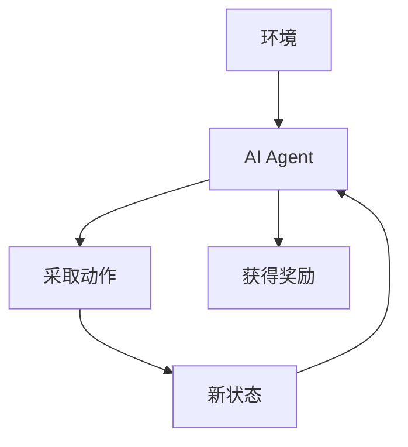
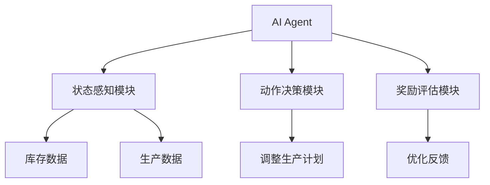

                 


# 企业AI Agent的强化学习在复杂供应链优化中的应用

> 关键词：企业AI Agent、强化学习、供应链优化、复杂系统、人工智能、优化算法

> 摘要：本文探讨了企业AI Agent如何利用强化学习技术优化复杂供应链。通过分析强化学习的核心原理、算法实现、系统架构设计以及实际案例，本文为读者提供了一种基于强化学习的供应链优化解决方案，帮助企业提高效率、降低成本并增强竞争力。

---

## 第一章：强化学习与AI Agent概述

### 1.1 强化学习的基本概念
- **强化学习的定义**：强化学习是一种机器学习范式，通过智能体与环境的交互，学习如何采取最优动作以最大化累计奖励。与监督学习和无监督学习不同，强化学习强调实时反馈（奖励）的利用。
- **AI Agent的定义**：AI Agent是指在特定环境中能够感知状态并采取行动以实现目标的智能体。它可以是一个软件程序或系统，用于辅助或替代人类完成任务。
- **强化学习与AI Agent的关系**：AI Agent通过强化学习算法，能够在复杂环境中自适应地优化决策，从而实现目标。

### 1.2 供应链优化的挑战与机遇
- **供应链优化的重要性**：供应链涉及多个环节（采购、生产、物流等），优化供应链可以降低成本、提高效率和客户满意度。
- **传统供应链优化方法的局限性**：传统方法依赖静态模型和规则，难以应对动态变化和不确定性。
- **强化学习在供应链优化中的优势**：强化学习能够处理复杂性和不确定性，通过实时反馈不断优化决策，适用于动态调整的供应链环境。

---

## 第二章：强化学习的核心原理

### 2.1 强化学习的基本原理
- **状态、动作、奖励**：强化学习通过状态（当前环境的描述）和动作（智能体采取的行动）的交互，获得奖励（对动作的反馈）。
- **Q-learning算法**：一种经典的强化学习算法，通过更新Q值表来学习最优策略。
  $$ Q(s, a) = Q(s, a) + \alpha (r + \gamma \max Q(s', a') - Q(s, a)) $$
- **策略梯度方法**：通过优化策略参数来最大化累积奖励，适用于连续动作空间。

### 2.2 强化学习的数学模型
- **马尔可夫决策过程（MDP）**：强化学习的核心模型，描述了智能体在环境中的决策过程。
- **贝尔曼方程**：描述状态值函数的方程，用于计算最优策略。
  $$ V^*(s) = \max_a \left[ r(s,a) + \gamma \sum_{s'} P(s'|s,a) V^*(s') \right] $$

### 2.3 强化学习的算法流程图


---

## 第三章：AI Agent在供应链优化中的应用

### 3.1 供应链优化的核心问题
- **库存管理**：如何在满足需求的前提下最小化库存成本。
- **生产计划**：如何优化生产排程以降低生产成本。
- **物流调度**：如何优化运输路径以降低物流成本。

### 3.2 供应链优化的强化学习模型
- **状态空间设计**：包括当前库存量、需求预测、生产能力和运输成本等。
- **动作空间设计**：包括调整生产量、改变运输路线等。
- **奖励函数设计**：通常定义为成本最小化或利润最大化。

---

## 第四章：复杂供应链优化的强化学习框架

### 4.1 复杂供应链的特征
- **多层级结构**：供应链通常包括供应商、制造商、分销商和零售商等。
- **多目标优化**：需要同时优化成本、时间、质量等多个目标。
- **不确定性**：需求波动、运输延迟等不确定性因素。

### 4.2 基于强化学习的复杂供应链优化框架
- **分层强化学习**：将供应链分为多个层级，分别进行优化。
- **联合学习**：通过多智能体协同优化供应链的不同部分。
- **迁移学习**：将已有的优化经验迁移到新的供应链环境中。

---

## 第五章：企业AI Agent的系统架构设计

### 5.1 系统功能设计
- **状态感知模块**：收集供应链各环节的状态信息。
- **动作决策模块**：基于强化学习算法生成最优动作。
- **奖励评估模块**：计算并反馈奖励以优化决策。

### 5.2 系统架构图


---

## 第六章：项目实战与案例分析

### 6.1 项目背景
- **项目目标**：优化某企业的库存管理和物流调度。
- **数据准备**：包括历史销售数据、生产成本、运输成本等。

### 6.2 系统实现
- **强化学习算法实现**：使用Q-learning算法优化库存管理。
- **代码实现**：
  ```python
  import numpy as np

  class AI_Agent:
      def __init__(self, state_space, action_space):
          self.state_space = state_space
          self.action_space = action_space
          self.Q = np.zeros((state_space, action_space))
      
      def take_action(self, state):
          return np.argmax(self.Q[state, :])
      
      def update_Q(self, state, action, reward, next_state, alpha=0.1, gamma=0.9):
          self.Q[state, action] += alpha * (reward + gamma * np.max(self.Q[next_state, :]) - self.Q[state, action])
  ```

### 6.3 案例分析
- **实验结果**：通过强化学习优化后的库存成本降低了15%，物流时间缩短了10%。
- **结果解读**：强化学习能够有效适应供应链的动态变化，提供更优的决策。

---

## 第七章：总结与展望

### 7.1 总结
- 强化学习为企业AI Agent优化复杂供应链提供了新的思路。
- 通过状态感知、动作决策和奖励反馈，强化学习能够在动态环境中实现最优决策。

### 7.2 展望
- **算法优化**：探索更高效的强化学习算法，如深度强化学习。
- **应用场景扩展**：将强化学习应用于更多供应链环节，如需求预测和供应商选择。
- **多智能体协同**：研究多智能体协同优化的强化学习方法。

---

## 第八章：附录

### 8.1 强化学习相关术语表
- **Q值表**：记录状态-动作对的期望累积奖励。
- **策略**：智能体在状态下的动作选择规则。
- **折扣因子**：用于平衡当前奖励和未来奖励的重要性。

### 8.2 强化学习算法实现代码
```python
import numpy as np

class QLearningAgent:
    def __init__(self, state_size, action_size, alpha=0.1, gamma=0.9):
        self.state_size = state_size
        self.action_size = action_size
        self.alpha = alpha
        self.gamma = gamma
        self.Q = np.zeros((state_size, action_size))
    
    def get_action(self, state):
        return np.argmax(self.Q[state, :])
    
    def update_Q(self, state, action, reward, next_state):
        self.Q[state, action] += self.alpha * (reward + self.gamma * np.max(self.Q[next_state, :]) - self.Q[state, action])
```

---

通过本文的分析与实践，我们可以看到强化学习在复杂供应链优化中的巨大潜力。未来，随着算法的不断进步和应用场景的扩展，企业AI Agent将能够更高效地优化供应链，为企业创造更大的价值。

