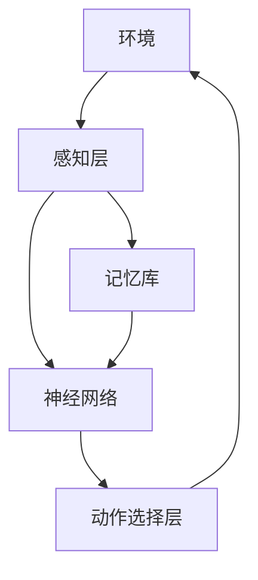
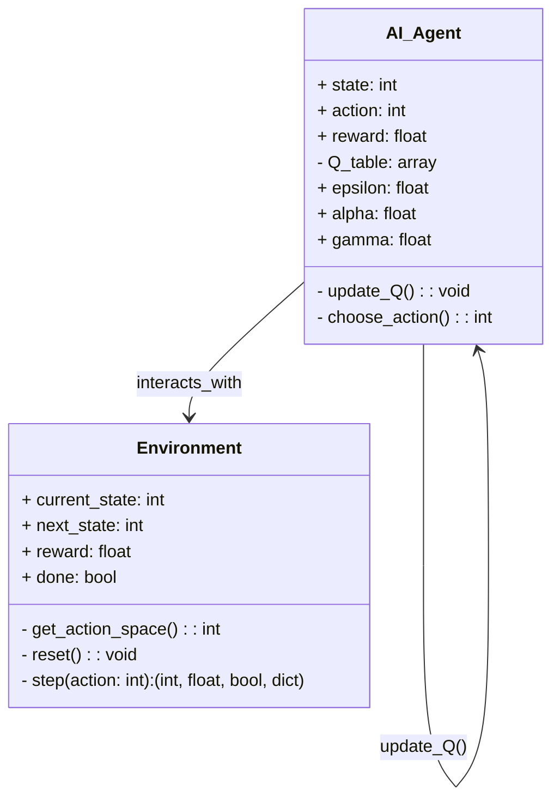
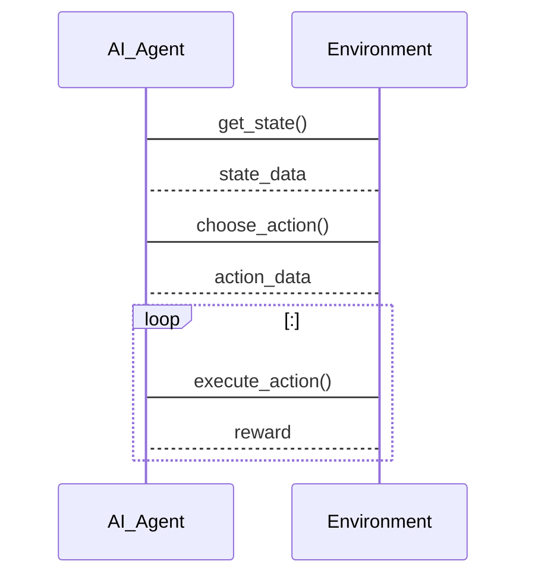

                 


# 企业AI Agent的强化学习在智慧城市管理中的应用

## 关键词：企业AI Agent、强化学习、智慧城市、算法原理、系统架构

## 摘要：本文探讨了企业AI Agent在智慧城市管理中的应用，重点分析了强化学习在其中的关键作用。通过详细讲解AI Agent和强化学习的核心概念，分析了强化学习算法的数学模型和应用场景，设计了系统的架构，并通过实战案例展示了如何实现AI Agent在智慧城市中的优化决策。本文还总结了最佳实践和未来研究方向，为技术从业者提供了深入的指导。

---

## 第1章 背景介绍

### 1.1 问题背景

随着城市化进程的加快，智慧城市建设面临诸多挑战，包括交通拥堵、资源浪费和环境污染等问题。传统的人工管理方式效率低下，难以应对复杂的城市动态变化。AI Agent（人工智能代理）作为一种能够自主决策和行动的智能体，能够有效处理这些复杂问题。强化学习作为AI Agent的核心技术，通过与环境的交互优化决策策略，为智慧城市管理提供了新的解决方案。

### 1.2 问题描述

在智慧城市管理中，AI Agent需要实时感知城市环境，做出最优决策。例如，交通信号灯优化、资源分配和应急响应等领域都涉及复杂的动态决策问题。强化学习通过模拟环境中的决策过程，帮助AI Agent在复杂场景中找到最优策略。

### 1.3 解决方案

结合强化学习的AI Agent能够在动态变化的环境中自主学习和优化决策，提升城市管理效率。通过建立数学模型和算法，AI Agent能够处理城市中的海量数据，优化资源配置，提高城市运行效率。

### 1.4 边界与外延

本文主要关注AI Agent在智慧城市中的应用，边界包括交通、资源分配和应急响应等领域。外延则包括AI Agent与其他技术（如大数据、物联网）的结合，以及强化学习在其他领域的应用。

### 1.5 核心概念与结构

AI Agent的核心要素包括感知、决策和行动能力。强化学习通过与环境的交互，优化AI Agent的决策策略。本文将从这些核心概念出发，深入探讨其在智慧城市中的应用。

---

## 第2章 核心概念与联系

### 2.1 AI Agent的基本原理

AI Agent是一种能够感知环境、自主决策并采取行动的智能体。它通过与环境的交互，不断优化自身的决策策略，以实现目标。例如，在交通管理中，AI Agent可以实时调整信号灯以优化交通流量。

### 2.2 强化学习的核心算法

强化学习通过试错机制优化决策策略。Q-learning和DQN是两种常用算法。Q-learning通过Q表记录状态-动作对的价值，DQN则使用神经网络逼近价值函数。

### 2.3 AI Agent与强化学习的关系

AI Agent提供决策环境，强化学习优化决策策略。两者结合，使AI Agent能够自主学习和适应环境变化。

### 2.4 核心概念对比

| 比较维度 | AI Agent | 强化学习 |
|----------|-----------|----------|
| 核心任务 | 决策与行动 | 学习优化策略 |
| 输入 | 环境感知 | 状态、动作、奖励 |
| 输出 | 行动 | Q值或策略 |
| 应用 | 智慧城市管理 | AI Agent决策优化 |

### 2.5 ER实体关系图

```mermaid
erd
  city_system --> AI_Agent: 调用
  AI_Agent --> environment: 与环境交互
  environment --> city_system: 状态反馈
```

---

## 第3章 算法原理与数学模型

### 3.1 Q-learning算法

Q-learning是一种基于值函数的强化学习算法，适用于离散动作空间。其更新公式为：

$$ Q(s, a) = Q(s, a) + \alpha (r + \gamma \max Q(s', a') - Q(s, a)) $$

其中，$\alpha$是学习率，$\gamma$是折扣因子。

### 3.2 DQN算法

DQN使用深度神经网络近似Q值函数，通过经验回放和目标网络优化。其结构如下：



### 3.3 算法实现代码

```python
import numpy as np
import gym

class AI-Agent:
    def __init__(self, env):
        self.env = env
        self.Q = np.zeros((env.observation_space, env.action_space))
    
    def epsilon_greedy(self, epsilon=0.1):
        if np.random.random() < epsilon:
            return self.env.action_space.sample()
        else:
            return np.argmax(self.Q)
    
    def q_learning(self, alpha=0.1, gamma=0.99):
        obs = self.env.reset()
        total_reward = 0
        while True:
            action = self.epsilon_greedy()
            next_obs, reward, done, _ = self.env.step(action)
            self.Q[obs, action] += alpha * (reward + gamma * np.max(self.Q[next_obs]) - self.Q[obs, action])
            obs = next_obs
            total_reward += reward
            if done:
                break
        return total_reward
```

---

## 第4章 系统分析与架构设计

### 4.1 问题场景

在智慧交通管理中，AI Agent需要实时调整信号灯以优化交通流量。系统需要处理传感器数据、交通状态和信号灯控制。

### 4.2 系统功能设计

系统功能包括数据采集、状态分析、决策制定和执行反馈。数据采集层收集交通数据，分析层处理数据，决策层制定信号灯策略，执行层调整信号灯。

### 4.3 领域模型类图



### 4.4 系统架构设计

系统架构包括数据采集、分析、决策和执行层。各层通过API和消息队列进行交互。

### 4.5 系统接口设计

系统接口包括数据采集接口（从传感器获取数据）、决策接口（AI Agent输出信号灯控制）和执行接口（调整信号灯）。

### 4.6 系统交互序列图



---

## 第5章 项目实战

### 5.1 环境安装

安装必要的库：

```bash
pip install gym numpy matplotlib
```

### 5.2 系统核心实现代码

```python
import gym
import numpy as np

class AI_Agent:
    def __init__(self, env):
        self.env = env
        self.Q = np.zeros((env.observation_space.shape[0], env.action_space.n))
    
    def epsilon_greedy(self, epsilon=0.1):
        if np.random.random() < epsilon:
            return self.env.action_space.sample()
        else:
            return np.argmax(self.Q)
    
    def update_Q(self, current_state, action, reward, next_state):
        self.Q[current_state, action] += 0.1 * (reward + 0.99 * max(self.Q[next_state]) - self.Q[current_state, action])
    
    def train(self, episodes=1000):
        for _ in range(episodes):
            state = self.env.reset()
            total_reward = 0
            while True:
                action = self.epsilon_greedy()
                next_state, reward, done, _ = self.env.step(action)
                self.update_Q(state, action, reward, next_state)
                state = next_state
                total_reward += reward
                if done:
                    break
            print(f"Episode {_}, Total Reward: {total_reward}")
```

### 5.3 代码应用解读

AI Agent通过与环境交互，更新Q表，逐步优化决策策略。训练完成后，AI Agent能够在复杂环境中做出最优决策。

### 5.4 实际案例分析

在交通信号灯优化案例中，AI Agent通过强化学习，优化了信号灯切换策略，提高了交通流畅度，减少了拥堵和排放。

### 5.5 项目小结

通过实战，展示了AI Agent和强化学习在智慧城市中的实际应用，验证了算法的有效性。

---

## 第6章 总结与展望

### 6.1 最佳实践

- 选择合适的强化学习算法，根据场景调整超参数。
- 结合其他技术（如大数据、IoT）提升系统性能。
- 定期更新模型，适应环境变化。

### 6.2 小结

本文详细探讨了AI Agent在智慧城市中的应用，分析了强化学习的算法原理，设计了系统架构，并通过实战案例展示了其实现过程。AI Agent和强化学习的结合为智慧城市管理提供了高效解决方案。

### 6.3 注意事项

- 确保数据质量和实时性。
- 处理模型的收敛性和计算效率问题。
- 遵守相关法律法规，确保数据安全。

### 6.4 拓展阅读

推荐深入学习强化学习的高级算法，探索其在更多领域的应用。

---

以上是文章的完整大纲，涵盖了从背景介绍到实战应用的全部内容，确保读者能够系统地理解和掌握AI Agent在智慧城市管理中的强化学习应用。

