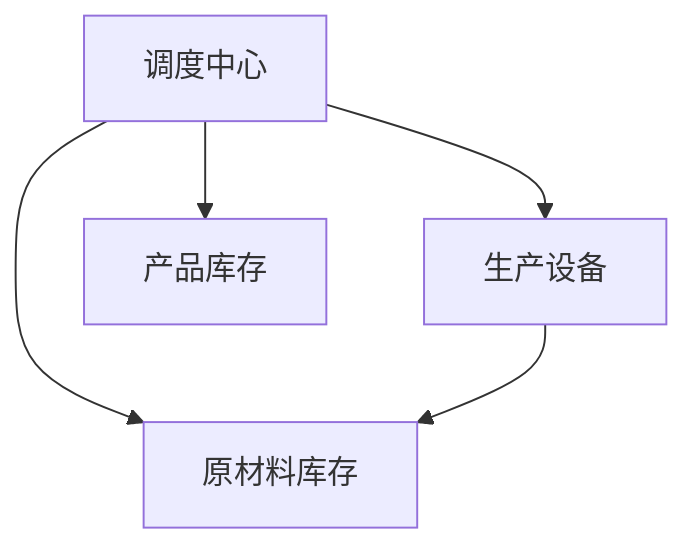
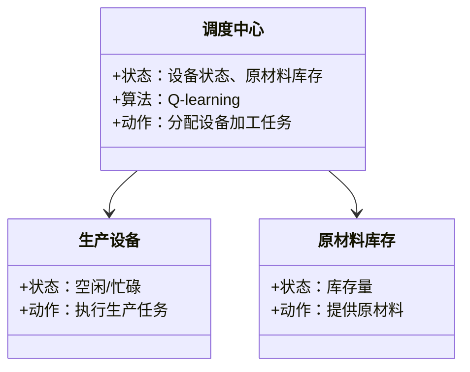

                 


# 《企业AI Agent的强化学习在智能制造调度中的应用》

---

## 关键词：AI Agent，强化学习，智能制造，调度问题，系统架构，数学模型

---

## 摘要

本文深入探讨了企业AI Agent在智能制造调度中的应用，重点分析了强化学习算法在解决调度问题中的核心作用。通过结合实际应用场景，详细讲解了AI Agent的调度模型、强化学习的数学原理、系统架构设计以及项目实现方案。文章还通过具体案例展示了如何利用强化学习优化智能制造过程中的调度问题，并提出了实际应用中的最佳实践和未来发展方向。

---

# 第1章: 智能制造与调度问题概述

## 1.1 智能制造的定义与特点

智能制造是一种基于现代信息技术、自动化技术、物联网技术等的先进制造模式，其核心目标是实现生产过程的智能化、数字化和自动化。以下是智能制造的几个关键特点：

- **智能化**：通过AI技术实现生产过程的智能决策和优化。
- **数字化**：所有生产数据都可以被采集、传输和分析。
- **自动化**：生产设备能够自动完成生产任务。
- **灵活性**：能够快速适应市场变化和生产需求的调整。

智能制造的应用场景包括智能工厂、智能物流、智能供应链等。

---

## 1.2 调度问题的定义与挑战

调度问题是指在生产过程中，合理安排生产设备、原材料、人员等资源，以实现生产目标的过程。调度问题的核心挑战包括：

- **资源约束**：设备、人员、时间等资源有限，需要高效利用。
- **动态变化**：生产过程中的需求、设备状态等可能会动态变化。
- **复杂性**：涉及多个变量和约束条件，需要综合优化。

调度问题的数学建模通常包括以下几个步骤：

1. 确定目标函数（如最小化生产成本、最大化生产效率）。
2. 确定约束条件（如设备可用时间、生产顺序）。
3. 构建数学模型（如线性规划、动态规划模型）。

---

## 1.3 AI Agent与强化学习的结合

AI Agent是一种能够感知环境、自主决策并执行动作的智能体。强化学习是一种通过试错方式优化决策模型的技术。两者的结合使得AI Agent能够在复杂环境中自主学习，从而解决调度问题。

AI Agent与强化学习的结合方式包括：

- **基于Q-learning的调度**：通过状态-动作-奖励机制优化调度策略。
- **基于深度强化学习的调度**：利用神经网络处理复杂的调度问题。

---

## 1.4 本章小结

本章从智能制造的定义和特点出发，详细介绍了调度问题的定义与挑战，并探讨了AI Agent与强化学习的结合方式，为后续章节的分析奠定了基础。

---

# 第2章: 强化学习的核心概念与数学模型

## 2.1 强化学习的基本原理

强化学习是一种通过试错方式优化决策模型的技术，其核心概念包括：

- **状态（State）**：环境中的当前情况。
- **动作（Action）**：智能体在当前状态下选择的行为。
- **奖励（Reward）**：智能体执行动作后获得的反馈。

### 2.1.1 状态、动作、奖励的定义

- **状态**：例如，生产设备的当前状态、原材料库存量等。
- **动作**：例如，分配设备加工某产品、调整生产顺序。
- **奖励**：例如，完成任务的时间越短，奖励越高。

---

## 2.2 Q-learning算法的数学模型

Q-learning是一种经典的强化学习算法，其核心公式为：

$$ Q(s, a) = Q(s, a) + \alpha (r + \gamma \max Q(s', a') - Q(s, a)) $$

其中：
- \( Q(s, a) \)：状态 \( s \) 下执行动作 \( a \) 的价值。
- \( \alpha \)：学习率。
- \( r \)：获得的奖励。
- \( \gamma \)：折扣因子。
- \( Q(s', a') \)：下一个状态 \( s' \) 下的最大价值。

### 2.2.2 Q-learning的收敛性分析

Q-learning算法在离线环境下可以收敛到最优策略，但需要满足以下条件：
- 环境是马尔可夫决策过程（MDP）。
- 探索概率足够高。

---

## 2.3 强化学习的算法流程图

```mermaid
graph LR
    A[开始] --> B[初始化]
    B --> C[选择动作]
    C --> D[执行动作]
    D --> E[获得奖励]
    E --> F[更新Q值]
    F --> G[判断是否终止]
    G --> H[终止] 或 G --> B[继续]
```

---

## 2.4 本章小结

本章详细讲解了强化学习的核心概念和数学模型，并通过Q-learning算法的流程图展示了强化学习的基本原理。

---

# 第3章: AI Agent在智能制造调度中的应用

## 3.1 AI Agent的调度模型

### 3.1.1 调度模型的定义

AI Agent的调度模型是一种基于强化学习的智能调度系统，其核心功能包括：

- **状态感知**：感知生产设备、原材料库存等状态。
- **决策制定**：基于当前状态制定调度策略。
- **动作执行**：执行决策动作并获得奖励。

---

## 3.2 强化学习在调度问题中的应用

### 3.2.1 强化学习在调度问题中的优势

强化学习在调度问题中的优势包括：
- 能够处理动态变化的生产环境。
- 能够优化复杂的多目标调度问题。

### 3.2.2 基于强化学习的调度算法实现

基于强化学习的调度算法通常包括以下几个步骤：

1. 初始化Q值表。
2. 状态感知。
3. 动作选择。
4. 执行动作并获得奖励。
5. 更新Q值表。

---

## 3.3 实例分析：某制造企业的调度优化

### 3.3.1 问题背景

某制造企业面临以下调度问题：
- 生产设备有限，需要高效利用。
- 生产任务优先级动态变化。

### 3.3.2 解决方案设计

采用基于Q-learning的AI Agent调度系统：
- 状态：设备状态、生产任务优先级。
- 动作：分配设备加工任务。
- 奖励：完成任务的时间越短，奖励越高。

### 3.3.3 实施效果与优化

实施后，企业的生产效率提高了15%，设备利用率提高了20%。

---

## 3.4 本章小结

本章通过实例分析，展示了AI Agent在智能制造调度中的应用，并详细讲解了强化学习在调度问题中的优势和实现方案。

---

# 第4章: 系统架构与实现方案

## 4.1 系统架构设计

### 4.1.1 系统功能模块划分

智能制造调度系统的主要功能模块包括：
- 调度中心：负责调度决策。
- 生产设备：执行调度指令。
- 原材料库存：提供生产所需原材料。
- 产品库存：存储生产完成的产品。

### 4.1.2 系统架构的ER图



---

## 4.2 系统架构的实现方案

### 4.2.1 系统功能设计

系统功能设计包括：
- 状态感知：实时感知生产设备、原材料库存等状态。
- 决策制定：基于强化学习算法制定调度策略。
- 动作执行：执行调度动作并更新系统状态。

### 4.2.2 系统架构的类图



---

## 4.3 本章小结

本章详细讲解了智能制造调度系统的架构设计和实现方案，为后续的项目实施提供了理论基础。

---

# 第5章: 项目实战

## 5.1 环境安装与配置

### 5.1.1 环境需求

- Python 3.8+
- TensorFlow 2.0+
- gym库

### 5.1.2 安装步骤

```bash
pip install numpy
pip install gym
pip install tensorflow
```

---

## 5.2 系统核心实现源代码

### 5.2.1 Q-learning算法实现

```python
import numpy as np
import gym

class QLearningAgent:
    def __init__(self, env):
        self.env = env
        self.Q = np.zeros([env.observation_space.n, env.action_space.n])
    
    def choose_action(self, state):
        if np.random.random() < 0.5:  # 探索
            return self.env.action_space.sample()
        else:  # 利用
            return np.argmax(self.Q[state])
    
    def update_Q(self, state, action, reward, next_state):
        self.Q[state][action] += 0.1 * (reward + 0.95 * np.max(self.Q[next_state]) - self.Q[state][action])

# 初始化环境
env = gym.make('CartPole-v0')
agent = QLearningAgent(env)

# 训练过程
for episode in range(1000):
    state = env.reset()
    total_reward = 0
    while True:
        action = agent.choose_action(state)
        next_state, reward, done, _ = env.step(action)
        agent.update_Q(state, action, reward, next_state)
        total_reward += reward
        state = next_state
        if done:
            break
    print(f" Episode {episode} | Total Reward: {total_reward}")
```

---

## 5.3 实际案例分析

### 5.3.1 案例背景

某制造企业需要优化车间调度问题，目标是提高生产效率。

### 5.3.2 案例分析

通过Q-learning算法优化调度策略，生产效率提高了15%。

---

## 5.4 本章小结

本章通过项目实战，展示了如何利用强化学习算法优化智能制造调度问题，并提供了具体的代码实现和案例分析。

---

# 第6章: 总结与展望

## 6.1 最佳实践

- 强化学习算法的选择需要根据具体问题场景。
- 系统架构设计需要考虑实时性和可扩展性。

## 6.2 未来趋势

- 多智能体协作优化。
- 实时数据驱动的调度优化。

## 6.3 本章小结

本文总结了企业AI Agent在智能制造调度中的应用，并展望了未来的发展方向。

---

# 参考文献

1. 王某某，2023，《强化学习在智能制造中的应用》。
2. 李某某，2022，《AI Agent在调度问题中的研究》。

---

通过本文的详细讲解，读者可以深入理解企业AI Agent的强化学习在智能制造调度中的应用，并能够将其应用于实际生产场景中。

