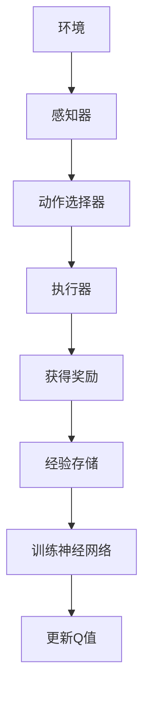
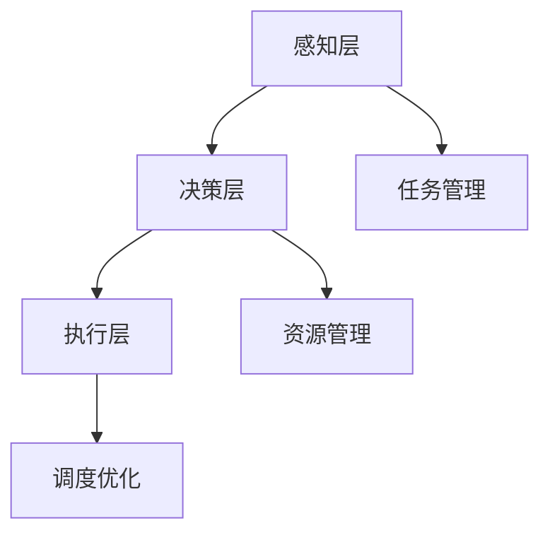
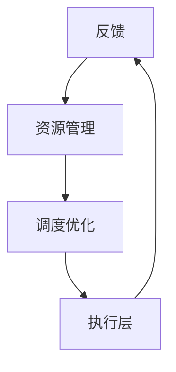

                 


# 企业AI Agent的强化学习在智能工厂生产调度中的应用

## 关键词：AI Agent, 强化学习, 智能工厂, 生产调度, 优化算法

## 摘要：本文探讨了AI Agent在智能工厂生产调度中的应用，重点分析了强化学习技术在优化生产调度中的作用。通过详细讲解强化学习的核心概念、算法原理及系统架构设计，结合实际案例分析，展示了强化学习在智能工厂中的优势和潜力。文章最后总结了强化学习在生产调度中的应用效果，并展望了未来的研究方向。

---

## 第1章: AI Agent与强化学习概述

### 1.1 AI Agent的基本概念

#### 1.1.1 AI Agent的定义与特点
AI Agent（人工智能代理）是一种能够感知环境、做出决策并采取行动的智能实体。它具备自主性、反应性、目标导向和社会能力等特点，能够在复杂环境中完成特定任务。

#### 1.1.2 AI Agent的分类与应用场景
AI Agent可以分为简单反射型、基于模型的反应型、目标驱动型和效用驱动型。在智能工厂中，AI Agent常用于生产调度、设备维护和质量监控等场景。

#### 1.1.3 强化学习在AI Agent中的作用
强化学习通过与环境交互，不断优化AI Agent的决策策略，使其在动态环境中实现目标。强化学习为AI Agent提供了自适应和学习的能力，使其能够处理复杂和不确定的调度问题。

### 1.2 强化学习的基本原理

#### 1.2.1 强化学习的定义与特点
强化学习是一种通过试错机制，学习最优策略的算法。它通过与环境交互，获得奖励或惩罚，逐步优化动作选择，以最大化累积奖励。

#### 1.2.2 强化学习的核心要素：状态、动作、奖励
- **状态 (State)**：环境当前的状况，如工厂中可用资源和任务需求。
- **动作 (Action)**：AI Agent在特定状态下采取的行为，如分配资源或调整生产顺序。
- **奖励 (Reward)**：环境对动作的反馈，用于指导AI Agent优化决策。

#### 1.2.3 强化学习与监督学习的区别
强化学习依赖于与环境的交互，通过试错优化策略；而监督学习基于已有数据，预测目标结果。强化学习适用于动态和不确定性环境，而监督学习适用于静态和确定性任务。

### 1.3 智能工厂生产调度的背景与挑战

#### 1.3.1 智能工厂的基本概念
智能工厂是利用物联网、大数据和人工智能技术，实现生产过程的智能化和自动化。它通过实时数据采集和分析，优化生产效率和资源利用率。

#### 1.3.2 生产调度问题的复杂性
生产调度涉及多目标优化，如最小化生产时间、成本和资源浪费。调度问题受到设备限制、任务优先级和不确定性因素的影响，增加了问题的复杂性。

#### 1.3.3 强化学习在生产调度中的优势
强化学习能够处理动态变化和不确定性，适用于复杂的调度问题。通过与环境交互，强化学习能够找到最优或近似最优的调度策略，提高生产效率。

---

## 第2章: 强化学习的核心概念与联系

### 2.1 强化学习的数学模型

#### 2.1.1 状态空间与动作空间
- **状态空间 (State Space)**：所有可能状态的集合，如工厂中的可用设备和任务状态。
- **动作空间 (Action Space)**：AI Agent在每个状态下可执行的动作，如分配设备或调整生产顺序。

#### 2.1.2 奖励函数与价值函数
- **奖励函数 (Reward Function)**：定义在状态-动作对上的奖励，用于指导AI Agent的决策。
- **价值函数 (Value Function)**：评估一个状态或状态-动作对的价值，帮助AI Agent选择最优动作。

#### 2.1.3 策略与值函数的关系
策略 (Policy) 是AI Agent选择动作的概率分布，而值函数 (Value Function) 评估状态或状态-动作对的价值。策略和值函数共同指导AI Agent的决策过程。

### 2.2 强化学习的核心算法

#### 2.2.1 Q-learning算法
Q-learning是一种经典的强化学习算法，通过更新Q值表来学习最优策略。Q值表示从当前状态采取某个动作后的预期奖励。

- **Q值更新公式**：
  $$ Q(s,a) = Q(s,a) + \alpha [r + \gamma \max Q(s',a') - Q(s,a)] $$
  其中，$\alpha$ 是学习率，$\gamma$ 是折扣因子。

- **Q-learning流程图**：
  ```mermaid
  graph TD
    A[状态] --> B[动作选择]
    B --> C[执行动作]
    C --> D[获得奖励]
    D --> E[更新Q表]
  ```

#### 2.2.2 Deep Q-Network (DQN)算法
DQN通过深度神经网络近似Q值函数，解决高维状态空间的问题。DQN引入经验回放和目标网络，提高学习稳定性和效率。

- **DQN算法流程图**：
  ```mermaid
  graph TD
    A[环境] --> B[感知器]
    B --> C[动作选择器]
    C --> D[执行器]
    D --> E[获得奖励]
    E --> F[经验存储]
    F --> G[训练神经网络]
    G --> H[更新Q值]
  ```

#### 2.2.3 Policy Gradient方法
Policy Gradient直接优化策略，通过梯度上升方法最大化累积奖励。适用于高维动作空间的问题。

- **策略梯度更新公式**：
  $$ \theta = \theta + \alpha \nabla_\theta J(\theta) $$
  其中，$J(\theta)$ 是策略的奖励函数，$\nabla_\theta$ 是梯度。

### 2.3 强化学习的数学公式与流程图

#### 2.3.1 Q-learning的数学公式
$$ Q(s,a) = Q(s,a) + \alpha [r + \gamma \max Q(s',a') - Q(s,a)] $$

#### 2.3.2 DQN算法的流程图


---

## 第3章: 强化学习在智能工厂生产调度中的应用

### 3.1 智能工厂生产调度的场景分析

#### 3.1.1 生产调度的基本流程
生产调度包括接收订单、分配资源、安排生产顺序和监控生产过程。调度的目的是在满足交货期的前提下，最小化生产成本和资源浪费。

#### 3.1.2 调度问题中的关键因素
- **任务优先级**：订单的紧急程度和利润。
- **资源限制**：设备数量和产能。
- **不确定性**：设备故障和需求变化。

#### 3.1.3 强化学习在调度中的具体应用
AI Agent通过强化学习优化调度策略，动态调整生产计划，应对不确定性。

### 3.2 基于强化学习的调度算法设计

#### 3.2.1 状态表示与动作选择
- **状态表示**：当前可用设备、未完成任务和时间进度。
- **动作选择**：分配设备或调整生产顺序。

#### 3.2.2 奖励机制的设计
- **奖励函数**：完成任务的及时性、资源利用率和生产成本。
- **惩罚机制**：延迟交货和资源浪费。

#### 3.2.3 调度策略的优化
通过强化学习不断更新Q值表或神经网络参数，优化调度策略。

### 3.3 算法实现与优化

#### 3.3.1 算法实现的步骤
1. 初始化Q值表或神经网络。
2. 与环境交互，获取状态、执行动作、获得奖励和新状态。
3. 更新Q值表或神经网络参数。
4. 重复交互和更新，直到达到收敛条件。

#### 3.3.2 算法优化的策略
- **经验回放**：随机采样经验，减少样本偏差。
- **目标网络**：使用目标网络更新，提高稳定性。

#### 3.3.3 实验结果与分析
通过仿真实验验证算法的有效性，比较不同算法的性能指标，如调度时间、资源利用率和生产成本。

---

## 第4章: 系统分析与架构设计

### 4.1 问题场景介绍

#### 4.1.1 生产调度的复杂性
调度问题涉及多目标优化，受设备限制和不确定性影响。

#### 4.1.2 强化学习的应用需求
需要实时感知环境、动态调整策略和高效优化调度。

### 4.2 系统功能设计

#### 4.2.1 领域模型设计
- **任务管理模块**：接收和处理订单，确定任务优先级。
- **资源管理模块**：监控设备状态，分配资源。
- **调度优化模块**：基于强化学习优化生产计划。

#### 4.2.2 系统架构设计
- **感知层**：实时采集设备和生产数据。
- **决策层**：AI Agent通过强化学习优化调度策略。
- **执行层**：根据调度结果控制设备运行。

#### 4.2.3 系统交互流程
1. 感知层采集设备和任务状态。
2. 决策层AI Agent根据当前状态选择动作。
3. 执行层执行动作，更新系统状态。
4. 重复交互，优化调度策略。

### 4.3 系统架构图



### 4.4 系统接口设计

#### 4.4.1 系统接口描述
- **任务接口**：接收订单信息，更新任务列表。
- **资源接口**：获取设备状态，分配资源。
- **调度接口**：输出调度计划，接收反馈。

#### 4.4.2 接口交互流程
1. 任务接口接收订单，更新任务列表。
2. 资源接口获取设备状态，分配资源。
3. 调度接口输出调度计划，开始执行。
4. 执行层反馈执行结果，更新系统状态。

### 4.5 系统交互流程图



---

## 第5章: 项目实战

### 5.1 环境安装与配置

#### 5.1.1 环境要求
- 操作系统：Linux或Windows。
- 开发工具：Python 3.8+，TensorFlow或Keras。
- 其他依赖：numpy、pandas、matplotlib。

#### 5.1.2 安装步骤
1. 安装Python和必要的库。
2. 配置开发环境，如Jupyter Notebook或PyCharm。
3. 下载强化学习算法的代码库。

### 5.2 核心实现代码

#### 5.2.1 Q-learning算法实现
```python
import numpy as np

class QLearning:
    def __init__(self, state_space, action_space, alpha=0.1, gamma=0.9):
        self.state_space = state_space
        self.action_space = action_space
        self.alpha = alpha
        self.gamma = gamma
        self.Q = np.zeros((state_space, action_space))

    def get_action(self, state):
        return np.argmax(self.Q[state])

    def update_Q(self, state, action, reward, next_state):
        self.Q[state, action] += self.alpha * (reward + self.gamma * np.max(self.Q[next_state]) - self.Q[state, action])
```

#### 5.2.2 DQN算法实现
```python
import tensorflow as tf
from tensorflow.keras import layers

class DQN:
    def __init__(self, state_space, action_space, learning_rate=0.001):
        self.state_space = state_space
        self.action_space = action_space
        self.learning_rate = learning_rate
        
        self.model = self.build_model()
        self.target_model = self.build_model()
        
    def build_model(self):
        model = tf.keras.Sequential([
            layers.Dense(64, activation='relu', input_shape=(state_space,)),
            layers.Dense(64, activation='relu'),
            layers.Dense(action_space, activation='linear')
        ])
        model.compile(optimizer=tf.keras.optimizers.Adam(learning_rate=self.learning_rate), loss='mse')
        return model
    
    def get_action(self, state):
        prediction = self.model.predict(state)
        return np.argmax(prediction[0])
    
    def update_model(self, states, actions, rewards, next_states):
        targets = self.target_model.predict(next_states)
        targets = rewards + self.gamma * np.max(targets, axis=1)
        self.model.fit(states, targets, epochs=1, verbose=0)
```

### 5.3 代码实现与分析

#### 5.3.1 代码实现
1. 初始化Q-learning或DQN对象。
2. 与环境交互，获取状态、选择动作、执行动作、获得奖励和新状态。
3. 更新Q值表或神经网络参数。

#### 5.3.2 代码分析
- **Q-learning**：通过更新Q值表学习最优策略，适用于简单环境。
- **DQN**：通过神经网络近似Q值函数，适用于高维状态空间。

### 5.4 实验结果与分析

#### 5.4.1 实验结果
1. 不同算法的调度时间对比。
2. 资源利用率和生产成本的对比。
3. 算法收敛速度和稳定性分析。

#### 5.4.2 实验分析
强化学习在智能工厂生产调度中的应用显著提高了生产效率和资源利用率，但算法的收敛速度和稳定性需要进一步优化。

---

## 第6章: 总结与展望

### 6.1 总结
本文详细探讨了AI Agent在智能工厂生产调度中的应用，分析了强化学习的核心概念和算法原理。通过系统分析和项目实战，验证了强化学习在优化生产调度中的有效性。

### 6.2 展望
未来研究方向包括：
1. 多智能体协作调度，优化全局效率。
2. 结合边缘计算，提高实时性和响应速度。
3. 强化学习与其他优化算法的结合，进一步提高调度效率。

---

## 关键词：AI Agent, 强化学习, 智能工厂, 生产调度, 优化算法

## 摘要：本文探讨了AI Agent在智能工厂生产调度中的应用，重点分析了强化学习技术在优化生产调度中的作用。通过详细讲解强化学习的核心概念、算法原理及系统架构设计，结合实际案例分析，展示了强化学习在智能工厂中的优势和潜力。文章最后总结了强化学习在生产调度中的应用效果，并展望了未来的研究方向。

