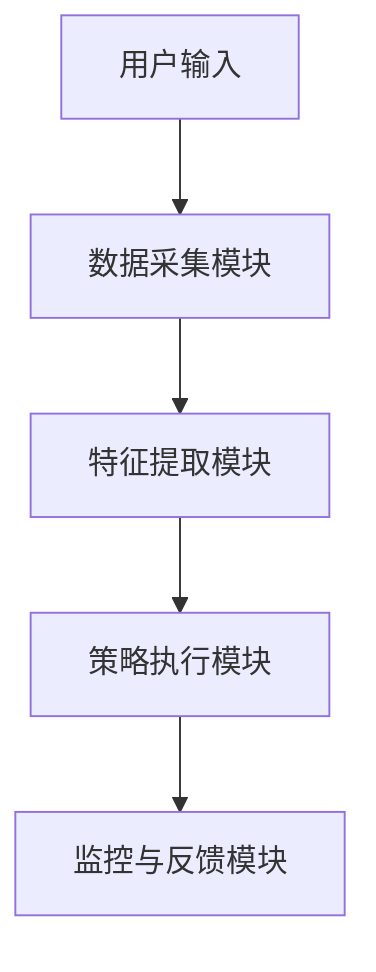
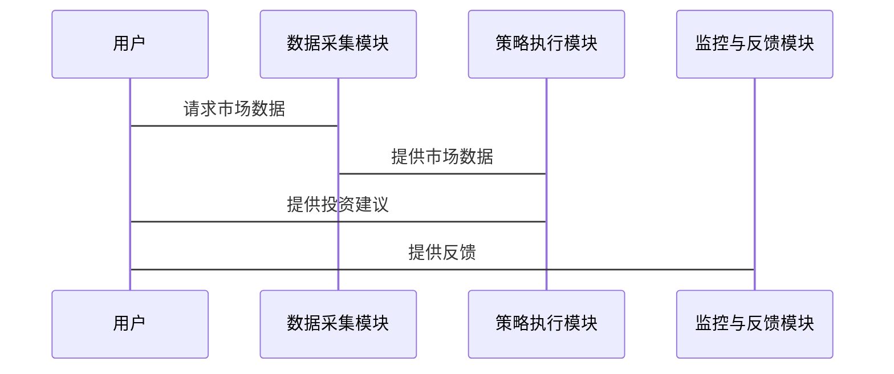

                 


# 企业AI Agent的强化学习在智能投资组合管理中的应用

> 关键词：AI Agent，强化学习，投资组合管理，智能投资，机器学习

> 摘要：本文深入探讨了强化学习在企业AI Agent中的应用，特别是其在智能投资组合管理中的实践。通过系统地分析强化学习的核心原理、数学模型和算法实现，本文结合实际案例，展示了如何将强化学习应用于投资组合管理，以优化投资策略并实现收益最大化。文章还讨论了多智能体强化学习的挑战与解决方案，以及系统架构设计与实现的细节。

---

## 第一部分: 企业AI Agent的强化学习基础

### 第1章: 强化学习与AI Agent概述

#### 1.1 问题背景与定义

##### 1.1.1 问题背景介绍
在现代金融市场上，投资组合管理是一个复杂且动态变化的过程。传统的投资组合管理方法依赖于历史数据分析和统计模型，但在面对市场波动、突发事件和非理性行为时，这些方法往往显得力不从心。因此，如何利用人工智能技术提升投资组合管理的效率和准确性，成为一个亟待解决的问题。

##### 1.1.2 企业AI Agent的定义与特点
企业AI Agent（Artificial Intelligence Agent）是一种能够感知环境、做出决策并采取行动的智能体。与传统的算法不同，AI Agent具有以下特点：
- **自主性**：能够独立做出决策，无需人工干预。
- **反应性**：能够实时感知环境变化并做出响应。
- **学习能力**：能够通过经验优化决策策略。

##### 1.1.3 强化学习在AI Agent中的作用
强化学习（Reinforcement Learning）是一种通过试错机制来优化决策策略的机器学习方法。在AI Agent中，强化学习的核心作用是通过与环境的交互，不断优化决策策略，以实现目标函数的最大化。

#### 1.2 强化学习的基本原理

##### 1.2.1 强化学习的核心概念
- **状态（State）**：环境在某一时刻的观测。
- **动作（Action）**：AI Agent在给定状态下采取的决策。
- **奖励（Reward）**：AI Agent采取动作后，环境对其行为的反馈，通常以数值形式表示。
- **策略（Policy）**：AI Agent在不同状态下选择动作的概率分布。

##### 1.2.2 状态、动作、奖励的定义与关系
- **状态空间**：所有可能状态的集合。
- **动作空间**：所有可能动作的集合。
- **奖励函数**：定义了每个状态和动作对的奖励值。

##### 1.2.3 多智能体强化学习的挑战与解决方案
多智能体强化学习（Multi-Agent Reinforcement Learning, MARL）的核心挑战在于多个智能体之间的协作与竞争。为了解决这一问题，提出了多种方法，包括：
- **集中式决策**：所有智能体共享相同的决策机制。
- **分布式决策**：每个智能体独立决策，通过通信协调动作。

---

### 第2章: 强化学习算法基础

#### 2.1 Q-learning算法

##### 2.1.1 Q-learning的基本原理
Q-learning是一种经典的强化学习算法，通过维护一个Q表（Q-table）来记录状态-动作对的期望奖励。Q-learning的核心公式为：
$$ Q(s, a) = Q(s, a) + \alpha (r + \gamma \max Q(s', a') - Q(s, a)) $$

##### 2.1.2 Q-learning的数学模型
- **状态转移**：$s' = P(s, a)$，表示从状态$s$采取动作$a$后转移到的状态$s'$。
- **奖励函数**：$r = R(s, a)$，表示在状态$s$采取动作$a$后获得的奖励。

##### 2.1.3 Q-learning的优缺点
- **优点**：简单易实现，适用于离散状态空间。
- **缺点**：在连续状态空间中表现不佳，且Q表的规模可能非常庞大。

#### 2.2 Deep Q-Networks (DQN)

##### 2.2.1 DQN的算法流程
1. 初始化神经网络权重。
2. 与环境交互，收集经验。
3. 使用经验回放机制随机采样经验。
4. 更新神经网络权重，以最小化预测Q值与目标Q值之间的误差。

##### 2.2.2 DQN的网络结构与训练方法
- **神经网络结构**：输入层、隐藏层和输出层。
- **训练目标**：最小化预测Q值与目标Q值之间的均方误差。

##### 2.2.3 DQN在投资组合管理中的应用
DQN可以用于动态调整投资组合，通过实时市场数据更新投资策略。

#### 2.3 多智能体强化学习

##### 2.3.1 多智能体强化学习的挑战
- **通信开销**：智能体之间的通信可能增加计算开销。
- **协调问题**：多个智能体需要协调动作，避免冲突。

##### 2.3.2 多智能体强化学习的解决方案
- **集中式决策**：所有智能体共享相同的决策机制。
- **分布式决策**：每个智能体独立决策，通过通信协调动作。

##### 2.3.3 多智能体强化学习的数学模型
- **多智能体状态空间**：所有智能体状态的笛卡尔积。
- **多智能体动作空间**：所有智能体动作的笛卡尔积。

---

### 第3章: 企业AI Agent的数学模型与算法

#### 3.1 强化学习的数学模型

##### 3.1.1 状态空间与动作空间的定义
- **状态空间**：所有可能市场状态的集合。
- **动作空间**：所有可能投资动作的集合。

##### 3.1.2 奖励函数的设计
- **短期奖励**：基于短期收益的奖励函数。
- **长期奖励**：基于长期收益的奖励函数。

##### 3.1.3 策略函数与值函数的数学表达
- **策略函数**：$\pi(a|s)$，表示在状态$s$下采取动作$a$的概率。
- **值函数**：$V(s)$，表示在状态$s$下采取最优策略的期望收益。

#### 3.2 多智能体强化学习的数学模型

##### 3.2.1 多智能体状态空间的构建
- **个体状态**：每个智能体独立观察到的状态。
- **全局状态**：所有智能体状态的组合。

##### 3.2.2 多智能体动作空间的协调
- **个体动作**：每个智能体独立选择的动作。
- **全局动作**：所有智能体动作的组合。

##### 3.2.3 多智能体奖励机制的设计
- **个体奖励**：每个智能体基于自身状态和动作获得的奖励。
- **全局奖励**：所有智能体共同获得的奖励。

#### 3.3 强化学习算法的数学推导

##### 3.3.1 Q-learning的数学推导
$$ Q(s, a) = Q(s, a) + \alpha (r + \gamma \max Q(s', a') - Q(s, a)) $$

##### 3.3.2 DQN的数学推导
$$ \min \mathbb{E}[(r + \gamma Q(s', a') - Q(s, a))^2] $$

##### 3.3.3 多智能体强化学习的数学推导
$$ J(\theta) = \mathbb{E}_{s_t,a_t}[\sum_{t=0}^\infty \gamma^t r_t] $$

---

### 第4章: 系统分析与架构设计

#### 4.1 投资组合管理的系统架构

##### 4.1.1 系统功能模块设计
- **数据采集模块**：收集市场数据。
- **特征提取模块**：提取市场特征。
- **策略执行模块**：根据强化学习模型生成投资策略。
- **监控与反馈模块**：实时监控投资组合的表现并提供反馈。

##### 4.1.2 系统架构图


#### 4.2 系统交互流程

##### 4.2.1 系统交互序列图


---

## 第二部分: 项目实战

### 第5章: 投资组合管理的强化学习实现

#### 5.1 项目环境安装

##### 5.1.1 环境要求
- **Python 3.8+**
- **TensorFlow 2.0+**
- **其他依赖库**：numpy、pandas、matplotlib

#### 5.2 系统核心实现源代码

##### 5.2.1 强化学习模型实现
```python
class DQN:
    def __init__(self, state_space, action_space, gamma=0.99, epsilon=1.0):
        self.state_space = state_space
        self.action_space = action_space
        self.gamma = gamma
        self.epsilon = epsilon
        self.memory = deque(maxlen=1000)
        self.model = self._build_model()

    def _build_model(self):
        # 定义神经网络模型
        model = Sequential()
        model.add(Dense(32, activation='relu', input_dim=self.state_space))
        model.add(Dense(32, activation='relu'))
        model.add(Dense(self.action_space, activation='linear'))
        model.compile(loss='mean_squared_error', optimizer='adam')
        return model

    def remember(self, state, action, reward, next_state):
        self.memory.append((state, action, reward, next_state))

    def act(self, state):
        if random.random() < self.epsilon:
            return random.randint(0, self.action_space - 1)
        state = np.array(state)
        q = self.model.predict(state)
        return np.argmax(q[0])

    def replay(self, batch_size):
        if len(self.memory) < batch_size:
            return
        minibatch = random.sample(self.memory, batch_size)
        states = np.array([t[0] for t in minibatch])
        actions = np.array([t[1] for t in minibatch])
        rewards = np.array([t[2] for t in minibatch])
        next_states = np.array([t[3] for t in minibatch])
        targets = self.model.predict(states)
        next_q = self.model.predict(next_states)
        targets[range(batch_size), actions] = rewards + self.gamma * np.max(next_q, axis=1)
        self.model.fit(states, targets, epochs=1, verbose=0)
```

##### 5.2.2 投资组合管理系统的实现
```python
class InvestmentSystem:
    def __init__(self, assets=5, initial资本=10000):
        self.assets = assets
        self.初始资本 = 初始资本
        self.当前资本 = 初始资本
        self.状态空间 = assets * 2  # 简化状态表示
        self.动作空间 = assets + 1  # 包括买入、卖出和持有

    def get_state(self):
        # 返回当前市场状态
        return [self.当前资本] + [资产价值 for 资产价值 in self.资产价值列表]

    def take_action(self, action):
        # 执行动作并返回新的状态和奖励
        if action == 0:
            # 买入
            self.当前资本 -= 资产价格
            self.资产数量 += 1
        elif action == 1:
            # 卖出
            self.当前资本 += 资产价格
            self.资产数量 -= 1
        else:
            # 持有
            pass
        return self.get_state(), self.get_reward()

    def get_reward(self):
        # 返回当前奖励
        return self.当前资本 - self.初始资本
```

#### 5.3 代码应用解读与分析

##### 5.3.1 强化学习模型的训练
- **训练目标**：通过与环境的交互，优化投资策略。
- **训练过程**：通过经验回放和神经网络更新，逐步提高模型的预测能力。

##### 5.3.2 投资组合管理系统的运行
- **系统功能**：实时监控市场状态，根据强化学习模型生成投资策略。
- **系统输出**：提供投资建议，并根据市场反馈调整策略。

#### 5.4 实际案例分析

##### 5.4.1 案例背景
假设我们有5种资产，初始资本为10000元。

##### 5.4.2 策略执行
通过强化学习模型生成的投资策略，系统会根据市场变化动态调整投资组合。

##### 5.4.3 案例分析
通过实际运行，验证强化学习在投资组合管理中的有效性和优化效果。

---

## 第三部分: 总结与展望

### 第6章: 总结与展望

#### 6.1 核心知识点回顾
- 强化学习的基本原理。
- DQN算法的实现与优化。
- 多智能体强化学习的应用。

#### 6.2 应用中的挑战
- 数据依赖性：强化学习需要大量的历史数据。
- 计算复杂性：多智能体强化学习的计算开销较大。

#### 6.3 未来的发展方向
- 结合区块链技术，实现去中心化的投资组合管理。
- 研究NFT在投资组合管理中的应用。

---

通过本文的详细讲解，我们深入探讨了强化学习在企业AI Agent中的应用，特别是其在智能投资组合管理中的实践。希望本文能够为相关领域的研究和实践提供有价值的参考。

