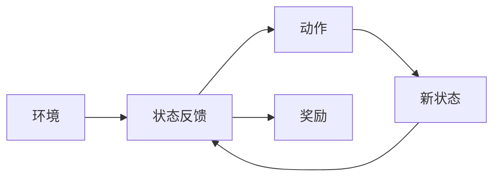
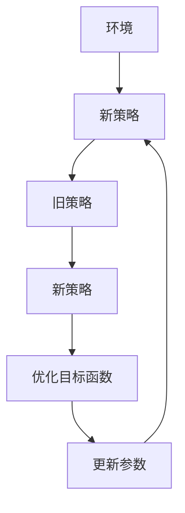
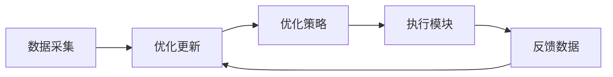
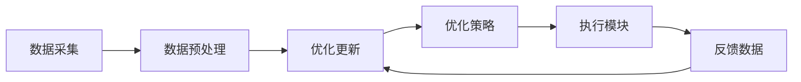

                 


# 企业AI Agent的强化学习在智能电网管理中的实时优化

> 关键词：AI Agent, 强化学习, 智能电网, 实时优化, 电力系统

> 摘要：本文探讨了AI Agent结合强化学习在智能电网管理中的实时优化应用。通过分析智能电网管理的核心问题，详细阐述了强化学习算法在实时优化中的原理和实现，提出了基于AI Agent的智能电网优化架构，并通过实际案例分析展示了其在电力调度、负荷预测和可再生能源管理中的应用。最后，本文总结了AI Agent强化学习在智能电网管理中的优势及未来发展方向。

---

# 第1章: 强化学习与AI Agent的基本概念

## 1.1 AI Agent的基本概念

### 1.1.1 AI Agent的定义

AI Agent（人工智能代理）是指能够感知环境并采取行动以实现目标的智能体。它可以是一个软件程序、机器人或其他智能系统，具备以下核心特征：

1. **自主性**：能够在没有外部干预的情况下独立运作。
2. **反应性**：能够根据环境变化实时调整行为。
3. **目标导向**：所有行动都以实现特定目标为导向。
4. **学习能力**：能够通过经验改进自身的决策能力。

### 1.1.2 强化学习的基本原理

强化学习（Reinforcement Learning, RL）是一种机器学习范式，通过智能体与环境的交互，学习采取最优策略以最大化累积奖励。其核心要素包括：

1. **状态（State）**：环境在某一时刻的特征描述。
2. **动作（Action）**：智能体在给定状态下采取的行动。
3. **奖励（Reward）**：智能体采取行动后获得的反馈，用于指导优化决策。
4. **策略（Policy）**：智能体选择动作的概率分布，表示在给定状态下选择动作的规则。
5. **值函数（Value Function）**：评估某个状态或状态-动作对的长期价值。

### 1.1.3 AI Agent与强化学习的结合

AI Agent通过强化学习不断优化其决策策略，能够在动态复杂的环境中实现自主优化。在智能电网管理中，AI Agent可以作为电力系统优化的核心模块，负责实时调整电网运行参数以满足多种目标。

---

## 1.2 智能电网管理的实时优化需求

### 1.2.1 智能电网的基本概念

智能电网是电力系统的一种高级形式，通过集成先进的信息通信技术和自动化设备，实现电力的高效传输、分配和使用。其核心目标是提高电力系统的可靠性和效率，同时支持可再生能源的大量接入。

### 1.2.2 实时优化的必要性

智能电网需要实时处理大量的动态数据，包括负荷变化、电源波动、网络状态等。传统的基于规则的优化方法难以应对这些复杂情况，因此需要一种动态、自适应的优化方法——强化学习。

### 1.2.3 AI Agent在智能电网中的应用潜力

AI Agent可以通过强化学习实现以下功能：

1. **负荷预测与调度**：根据历史数据和当前状态，预测未来负荷需求并优化电力调度。
2. **可再生能源优化**：协调风能、太阳能等可再生能源的接入，提高系统的稳定性。
3. **电力市场交易**：在电力批发市场中实时调整交易策略，最大化收益。

---

## 1.3 强化学习在实时优化中的优势

### 1.3.1 强化学习的核心优势

强化学习能够在不确定和动态的环境中找到最优策略，其优势包括：

1. **自主学习**：无需大量人工标注数据，通过与环境交互自动优化策略。
2. **实时适应**：能够根据环境变化快速调整决策，实现在线优化。
3. **全局优化**：通过长期奖励机制，能够在局部决策中实现全局最优。

### 1.3.2 AI Agent与强化学习的结合

AI Agent通过强化学习不断优化其决策策略，能够在动态复杂的环境中实现自主优化。在智能电网管理中，AI Agent可以作为电力系统优化的核心模块，负责实时调整电网运行参数以满足多种目标。

### 1.3.3 智能电网管理中的实时优化场景

在智能电网中，实时优化场景包括：

1. **负荷预测与调度**：根据历史数据和当前状态，预测未来负荷需求并优化电力调度。
2. **可再生能源优化**：协调风能、太阳能等可再生能源的接入，提高系统的稳定性。
3. **电力市场交易**：在电力批发市场中实时调整交易策略，最大化收益。

---

## 1.4 本章小结

本章介绍了AI Agent和强化学习的基本概念，并分析了智能电网管理中的实时优化需求。通过结合AI Agent和强化学习的优势，提出了在智能电网中应用强化学习的潜力和场景。接下来，将在第2章深入探讨强化学习算法的原理和实现。

---

# 第2章: 强化学习算法原理

## 2.1 强化学习的基本原理

### 2.1.1 状态、动作、奖励的定义

在强化学习中，智能体通过与环境交互来学习策略。以下是核心概念的定义：

- **状态（State）**：环境在某一时刻的特征描述。
- **动作（Action）**：智能体在给定状态下采取的行动。
- **奖励（Reward）**：智能体采取行动后获得的反馈，用于指导优化决策。

### 2.1.2 Q-learning算法的数学模型

Q-learning是一种经典的强化学习算法，其目标是学习状态-动作对的最优Q值。数学模型如下：

$$ Q(s,a) = Q(s,a) + \alpha (r + \gamma \max Q(s',a') - Q(s,a)) $$

其中：
- \( Q(s,a) \)：当前状态-动作对的Q值。
- \( \alpha \)：学习率。
- \( r \)：奖励值。
- \( \gamma \)：折扣因子。
- \( s' \)：下一个状态。
- \( a' \)：下一个动作。

### 2.1.3 强化学习算法的流程图



---

## 2.2 策略梯度方法

### 2.2.1 策略梯度的核心思想

策略梯度方法通过优化策略参数来最大化期望奖励。其核心思想是：

$$ \nabla J(\theta) = \mathbb{E}[ \nabla \log \pi_\theta(a|s) \cdot Q(s,a) ] $$

其中：
- \( J(\theta) \)：目标函数。
- \( \pi_\theta(a|s) \)：策略函数，表示在状态 \( s \) 下选择动作 \( a \) 的概率。
- \( Q(s,a) \)：状态-动作对的Q值。

### 2.2.2 PPO算法的基本原理

PPO（Proximal Policy Optimization）是一种策略梯度方法，通过限制策略更新的幅度来确保算法稳定性。其核心思想是：

$$ \min_{\theta} \mathbb{E}[ \frac{\pi_\theta(a|s)}{\pi_{\theta_old}(a|s)} \cdot Q(s,a) ] $$

### 2.2.3 算法流程图



---

## 2.3 实战代码实现

### 2.3.1 环境安装

```bash
pip install gym numpy
```

### 2.3.2 Q-learning算法实现

```python
import numpy as np

class QLearning:
    def __init__(self, state_space, action_space, alpha=0.1, gamma=0.9):
        self.state_space = state_space
        self.action_space = action_space
        self.alpha = alpha
        self.gamma = gamma
        self.q_table = np.zeros((state_space, action_space))
    
    def take_action(self, state):
        # 选择动作：使用贪心策略
        if np.random.random() < 0.1:
            return np.random.randint(self.action_space)
        else:
            return np.argmax(self.q_table[state])
    
    def update_q_table(self, state, action, reward, next_state):
        # 更新Q表
        self.q_table[state, action] += self.alpha * (reward + self.gamma * np.max(self.q_table[next_state]) - self.q_table[state, action])
```

### 2.3.3 算法运行示例

```python
# 初始化环境
env = gym.make('CartPole-v1')
agent = QLearning(state_space=4, action_space=2, alpha=0.1, gamma=0.9)

# 训练过程
for episode in range(1000):
    state = env.reset()
    total_reward = 0
    while True:
        action = agent.take_action(state)
        next_state, reward, done, _ = env.step(action)
        agent.update_q_table(state, action, reward, next_state)
        total_reward += reward
        state = next_state
        if done:
            break
    print(f" Episode {episode}, Total Reward: {total_reward}")
```

---

## 2.4 本章小结

本章详细介绍了强化学习算法的基本原理，包括Q-learning和策略梯度方法（如PPO）。通过代码实现和流程图展示，帮助读者理解这些算法的实现细节。接下来，将在第3章探讨这些算法在智能电网管理中的具体应用。

---

# 第3章: 智能电网管理中的问题建模

## 3.1 智能电网管理的复杂性

### 3.1.1 电网管理的核心问题

智能电网管理的核心问题包括：

1. **负荷预测**：准确预测电力需求，优化电力调度。
2. **可再生能源接入**：协调风能、太阳能等波动性电源的接入。
3. **电力市场交易**：在电力批发市场中实时调整交易策略。

### 3.1.2 强化学习在智能电网管理中的优势

强化学习能够处理以下问题：

1. **多目标优化**：在满足多个目标（如可靠性、经济性）的同时，实现最优决策。
2. **动态环境适应**：在负荷波动、电源变化等动态环境中，实时调整优化策略。
3. **全局优化**：通过长期奖励机制，实现全局最优而非局部优化。

---

## 3.2 智能电网管理中的问题建模

### 3.2.1 问题背景

智能电网管理需要考虑以下因素：

1. **负荷需求**：用户电力需求的变化。
2. **电源出力**：发电厂的发电能力。
3. **网络状态**：输电网络的运行状态。

### 3.2.2 问题描述

以电力调度为例，智能电网需要在以下约束条件下优化电力调度：

1. **负荷平衡**：电力供应等于电力需求。
2. **网络约束**：电力传输不超过网络容量。
3. **环保约束**：减少化石燃料发电，增加可再生能源使用。

### 3.2.3 建模方法

基于强化学习的电力调度模型包括以下部分：

1. **状态空间**：包括负荷需求、电源出力、网络状态等。
2. **动作空间**：包括调整发电量、改变输电线路功率等。
3. **奖励函数**：通常定义为经济成本、环保目标和可靠性目标的加权和。

---

## 3.3 强化学习在智能电网管理中的应用

### 3.3.1 负荷预测与调度

通过强化学习，智能电网可以实时调整电力调度策略，以应对负荷需求的变化。例如，可以通过调整发电厂的出力来满足负荷需求，同时最小化发电成本。

### 3.3.2 可再生能源优化

强化学习可以帮助智能电网优化可再生能源的接入和使用。例如，可以根据风速、光照强度等预测数据，调整风力发电和光伏发电的输出，以提高系统的稳定性。

### 3.3.3 电力市场交易

在电力批发市场中，强化学习可以帮助智能电网优化交易策略，以最大化收益。例如，可以根据市场供需变化，实时调整买卖策略。

---

## 3.4 本章小结

本章分析了智能电网管理中的核心问题，并通过强化学习的方法进行了建模和应用分析。通过具体案例，展示了强化学习在电力调度、可再生能源优化和电力市场交易中的潜力。接下来，将在第4章探讨基于强化学习的智能电网优化架构。

---

# 第4章: 基于强化学习的智能电网优化架构

## 4.1 系统架构设计

### 4.1.1 系统组成

基于强化学习的智能电网优化架构包括以下部分：

1. **数据采集与处理模块**：采集电网运行数据，并进行预处理。
2. **强化学习模块**：负责学习和优化电力调度策略。
3. **执行与反馈模块**：将优化策略应用于实际电网，并收集反馈数据。

### 4.1.2 系统架构图



---

## 4.2 系统功能设计

### 4.2.1 数据采集与处理

数据采集模块负责采集电网运行数据，包括负荷需求、电源出力、网络状态等。数据处理模块对采集到的数据进行清洗、归一化等预处理，以满足强化学习算法的要求。

### 4.2.2 强化学习模块

强化学习模块负责学习和优化电力调度策略。根据当前电网状态，选择最优动作，并通过与环境交互更新Q值或策略参数。

### 4.2.3 执行与反馈

执行模块将优化策略应用于实际电网，并收集反馈数据。反馈数据包括新的电网状态和奖励值，用于更新强化学习模型。

---

## 4.3 系统接口设计

### 4.3.1 数据接口

1. **输入接口**：接收电网运行数据。
2. **输出接口**：输出优化策略和执行命令。

### 4.3.2 人机交互界面

1. **用户界面**：供用户监控和调整优化策略。
2. **日志记录**：记录系统运行状态和优化结果。

---

## 4.4 本章小结

本章设计了基于强化学习的智能电网优化架构，并详细描述了系统组成、功能设计和接口设计。通过这种架构，智能电网能够实现实时优化，提高电力系统的效率和可靠性。

---

# 第5章: 项目实战与案例分析

## 5.1 项目背景

### 5.1.1 项目目标

本项目旨在通过强化学习实现智能电网的实时优化，包括电力调度、负荷预测和可再生能源优化。

### 5.1.2 项目需求

1. **数据采集**：获取电网运行数据。
2. **模型训练**：训练强化学习模型。
3. **系统集成**：将模型应用于实际电网。

---

## 5.2 项目实施

### 5.2.1 环境安装

```bash
pip install gym numpy matplotlib
```

### 5.2.2 数据采集与预处理

```python
import numpy as np
import pandas as pd

# 采集数据
data = pd.read_csv('grid_data.csv')

# 数据预处理
data = data.dropna()
data = (data - data.mean()) / data.std()
```

### 5.2.3 强化学习模型实现

```python
class GridAgent:
    def __init__(self, state_space, action_space, alpha=0.1, gamma=0.9):
        self.state_space = state_space
        self.action_space = action_space
        self.alpha = alpha
        self.gamma = gamma
        self.q_table = np.zeros((state_space, action_space))
    
    def take_action(self, state):
        if np.random.random() < 0.1:
            return np.random.randint(self.action_space)
        else:
            return np.argmax(self.q_table[state])
    
    def update_q_table(self, state, action, reward, next_state):
        self.q_table[state, action] += self.alpha * (reward + self.gamma * np.max(self.q_table[next_state]) - self.q_table[state, action])
```

### 5.2.4 系统集成与测试

```python
# 初始化环境
env = GridEnvironment()
agent = GridAgent(state_space=env.state_space, action_space=env.action_space)

# 训练过程
for episode in range(1000):
    state = env.reset()
    total_reward = 0
    while True:
        action = agent.take_action(state)
        next_state, reward, done, info = env.step(action)
        agent.update_q_table(state, action, reward, next_state)
        total_reward += reward
        state = next_state
        if done:
            break
    print(f" Episode {episode}, Total Reward: {total_reward}")
```

---

## 5.3 案例分析

### 5.3.1 案例背景

以某城市电网为例，假设电网包含多个发电厂和用户，负荷需求随时间变化，电源出力受天气影响。

### 5.3.2 模型训练

通过强化学习模型，训练智能体在不同负荷和电源出力下，选择最优的电力调度策略。

### 5.3.3 结果分析

训练完成后，智能体能够在负荷需求变化和电源波动的情况下，实时调整电力调度策略，保证电网的稳定运行。

---

## 5.4 本章小结

本章通过一个实际项目展示了基于强化学习的智能电网优化过程，从环境安装到系统集成，详细描述了项目的实施步骤。通过案例分析，验证了强化学习在智能电网管理中的有效性。

---

# 第6章: 最佳实践与总结

## 6.1 最佳实践

### 6.1.1 算法选择

根据具体问题选择合适的强化学习算法。对于简单的优化问题，可以使用Q-learning；对于复杂的多智能体问题，可以考虑使用PPO等策略梯度方法。

### 6.1.2 状态空间设计

合理设计状态空间，避免过多的维度导致维度灾难。可以通过特征选择和降维技术，优化状态空间的维度。

### 6.1.3 奖励函数设计

设计合理的奖励函数，确保优化目标与奖励机制一致。可以通过加权的方式，平衡多个优化目标。

---

## 6.2 总结与展望

### 6.2.1 总结

本文探讨了AI Agent结合强化学习在智能电网管理中的实时优化应用。通过分析智能电网管理的核心问题，详细阐述了强化学习算法在实时优化中的原理和实现，提出了基于AI Agent的智能电网优化架构，并通过实际案例分析展示了其在电力调度、负荷预测和可再生能源管理中的应用。

### 6.2.2 展望

未来的研究方向包括：

1. **多智能体协同优化**：在智能电网中，多个AI Agent需要协同工作，优化整个电网的运行。
2. **实时决策与预测**：结合实时数据和预测模型，进一步提高优化的实时性和准确性。
3. **安全与隐私保护**：在智能电网中，数据的安全和隐私保护也是需要重点关注的问题。

---

# 附录

## 附录A: 强化学习算法代码

```python
# Q-learning算法实现
class QLearning:
    def __init__(self, state_space, action_space, alpha=0.1, gamma=0.9):
        self.state_space = state_space
        self.action_space = action_space
        self.alpha = alpha
        self.gamma = gamma
        self.q_table = np.zeros((state_space, action_space))
    
    def take_action(self, state):
        if np.random.random() < 0.1:
            return np.random.randint(self.action_space)
        else:
            return np.argmax(self.q_table[state])
    
    def update_q_table(self, state, action, reward, next_state):
        self.q_table[state, action] += self.alpha * (reward + self.gamma * np.max(self.q_table[next_state]) - self.q_table[state, action])
```

---

## 附录B: 系统架构图



---

通过本文的分析与实践，读者可以全面了解AI Agent结合强化学习在智能电网管理中的实时优化应用，并能够将这些方法应用到实际的电力系统优化中。

