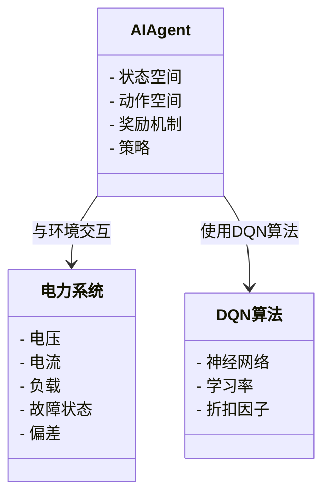
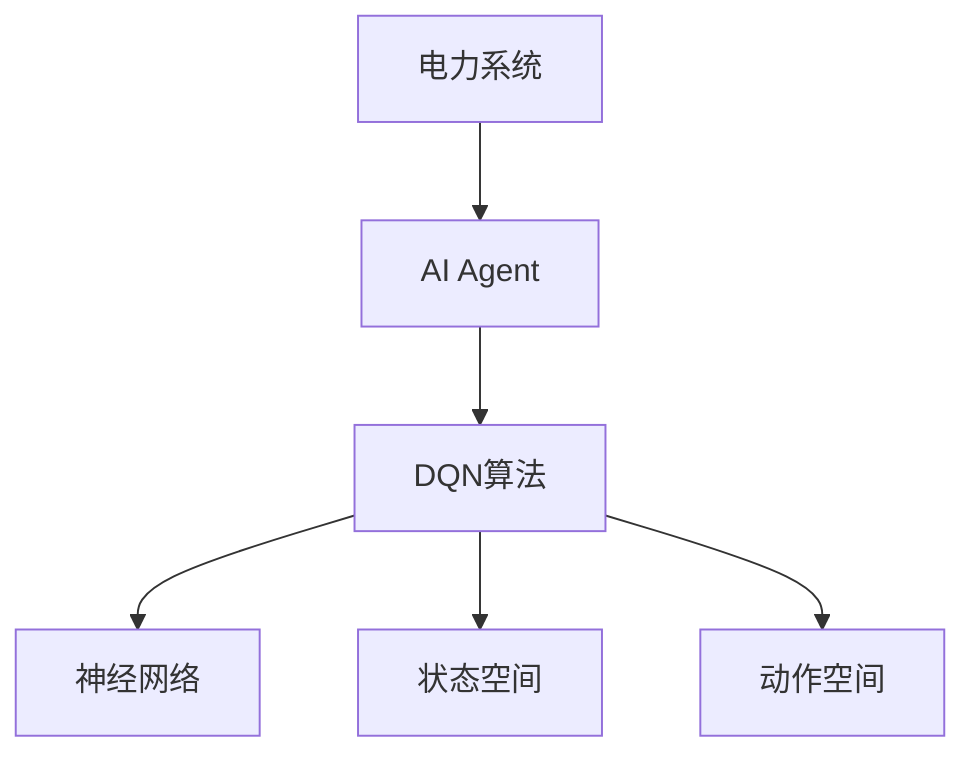
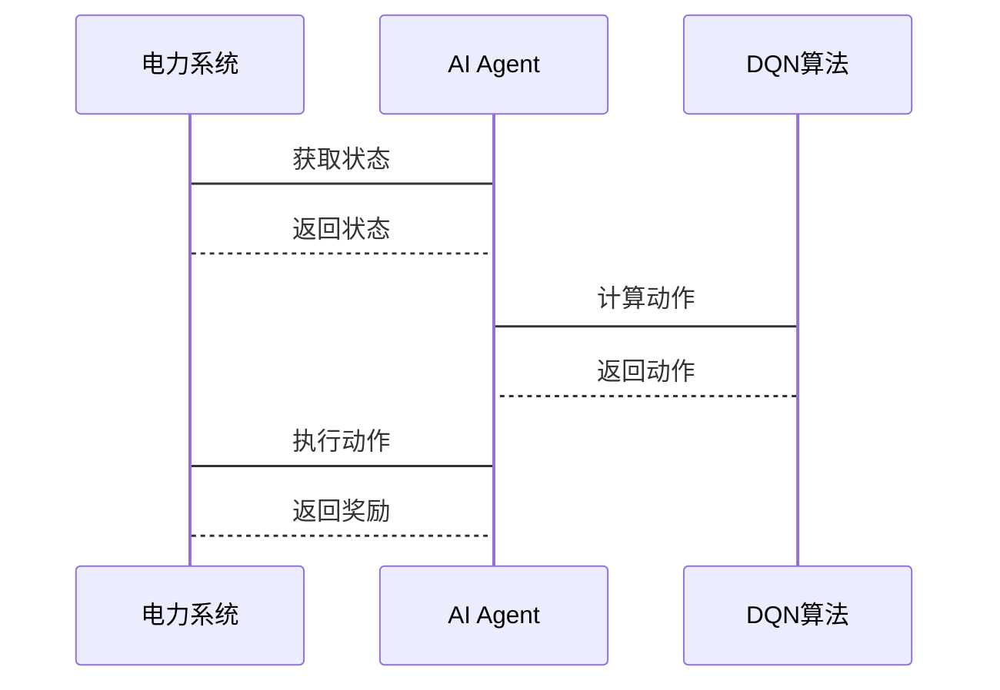

                 


# 企业AI Agent的强化学习在智能电网管理中的应用

> 关键词：智能电网，AI Agent，强化学习，DQN算法，系统架构

> 摘要：本文探讨了企业AI Agent在智能电网管理中的应用，重点分析了强化学习算法（如Q-learning和DQN）在智能电网中的应用潜力。文章详细介绍了强化学习的数学模型、算法实现、系统架构设计以及实际项目案例，通过Mermaid图表和Python代码示例，帮助读者深入理解相关技术。

---

# 第一部分: 智能电网与AI Agent的背景介绍

## 第1章: 智能电网的定义与特点

### 1.1 智能电网的基本概念
智能电网是一种集成现代信息技术、通信技术和电力系统技术的新型电力系统，旨在实现电力的高效传输、分配和管理。

#### 1.1.1 智能电网的核心特征
- **智能化**：通过传感器和数据分析实现智能决策。
- **自动化**：系统能够自动响应和调整。
- **分布式**：能源来源多样，包括可再生能源。
- **高效性**：优化电力传输和消耗。

### 1.2 AI Agent的基本概念与特点
AI Agent是一种智能体，能够感知环境并采取行动以实现目标。

#### 1.2.1 AI Agent的定义
AI Agent是一种智能系统，能够在环境中自主决策并执行任务。

#### 1.2.2 AI Agent的核心特征
- **自主性**：无需外部干预。
- **反应性**：能够实时感知并响应环境变化。
- **目标导向**：基于目标进行决策。

### 1.3 强化学习的定义与特点
强化学习是一种机器学习方法，通过试错机制优化决策策略。

#### 1.3.1 强化学习的基本概念
强化学习通过智能体与环境的交互，学习最优策略以最大化累计奖励。

#### 1.3.2 强化学习的核心特征
- **奖励机制**：通过奖励指导智能体行为。
- **状态空间**：环境中的所有可能状态。
- **动作空间**：智能体可执行的所有动作。

---

# 第二部分: 企业AI Agent的强化学习核心概念

## 第2章: 企业AI Agent的强化学习框架

### 2.1 企业AI Agent的强化学习框架
企业AI Agent通过强化学习框架与智能电网交互，实现电力系统的优化管理。

#### 2.1.1 状态空间的定义
状态空间包括电力系统的各种参数，如电压、电流、负载等。

#### 2.1.2 动作空间的定义
动作空间包括智能体可执行的所有操作，如调整电压、分配负载等。

#### 2.1.3 奖励机制的设计
奖励机制设计直接影响智能体的决策策略，通常基于系统的稳定性、经济性和效率性。

### 2.2 强化学习算法的分类
强化学习算法主要分为值函数方法和策略梯度方法。

#### 2.2.1 Q-learning算法
Q-learning是一种经典的强化学习算法，适用于离线环境。

#### 2.2.2 Deep Q-Network (DQN)算法
DQN算法通过深度神经网络近似Q值函数，适用于高维状态空间。

#### 2.2.3 Policy Gradient方法
Policy Gradient方法直接优化策略，适用于概率决策问题。

### 2.3 强化学习在智能电网中的应用潜力
强化学习在智能电网中的应用潜力主要体现在以下几个方面：

#### 2.3.1 智能电网中的典型问题
- **负荷预测**：预测电力需求，优化电力分配。
- **电压调节**：通过调整电压确保电力系统稳定。
- **故障恢复**：在电力系统故障时快速恢复供电。

#### 2.3.2 强化学习在智能电网中的优势
- **自适应性**：能够根据环境变化自适应调整策略。
- **高效性**：通过强化学习优化决策过程，提高系统效率。
- **实时性**：能够实时响应系统变化。

#### 2.3.3 强化学习在智能电网中的挑战
- **复杂性**：智能电网环境复杂，状态空间和动作空间高维。
- **安全性**：强化学习策略可能存在安全隐患，需谨慎设计。
- **实时性要求**：智能电网需要快速决策，对算法实时性要求高。

---

## 第3章: 强化学习算法的数学模型与公式

### 3.1 Q-learning算法的数学模型
Q-learning算法通过迭代更新Q值函数，逼近最优策略。

#### 3.1.1 Q-learning的基本公式
$$ Q(s,a) = Q(s,a) + \alpha [r + \gamma \max Q(s',a') - Q(s,a)] $$
其中：
- $Q(s,a)$：当前状态下执行动作$a$的Q值。
- $\alpha$：学习率。
- $r$：奖励。
- $\gamma$：折扣因子。
- $s'$：下一个状态。
- $\max Q(s',a')$：下一个状态下动作的最大Q值。

#### 3.1.2 状态转移概率的计算
$$ P(s' | s, a) = \text{概率} $$

### 3.2 Deep Q-Network (DQN)算法的数学模型
DQN算法通过深度神经网络近似Q值函数，解决高维状态空间问题。

#### 3.2.1 DQN的网络结构
$$ Q(s,a; \theta) = \text{神经网络输出} $$
其中：
- $s$：当前状态。
- $a$：执行动作。
- $\theta$：神经网络参数。

#### 3.2.2 DQN的目标函数
$$ \text{损失函数} = \mathbb{E}[ (r + \gamma Q(s',a') - Q(s,a))^2 ] $$

### 3.3 Policy Gradient方法的数学模型
Policy Gradient方法通过直接优化策略，提高决策效率。

#### 3.3.1 Policy Gradient的基本公式
$$ \nabla \theta J(\theta) = \mathbb{E}[ \nabla \log \pi(a|s) Q(s,a) ] $$
其中：
- $\theta$：策略参数。
- $\pi(a|s)$：策略函数。
- $Q(s,a)$：状态-动作值函数。

#### 3.3.2 Policy Gradient的实现步骤
1. 初始化策略参数$\theta$。
2. 通过策略函数$\pi(a|s)$生成动作$a$。
3. 计算Q值函数$Q(s,a)$。
4. 更新策略参数$\theta$，最大化$J(\theta)$。

---

## 第4章: 系统分析与架构设计

### 4.1 问题场景介绍
智能电网管理中的电力系统优化问题。

### 4.2 系统功能设计
通过领域模型实现智能电网的系统功能设计。

#### 4.2.1 领域模型


### 4.3 系统架构设计
通过系统架构图展示智能电网AI Agent的强化学习架构。

#### 4.3.1 系统架构


### 4.4 系统接口设计
系统接口包括AI Agent与电力系统的交互接口。

### 4.5 系统交互
通过序列图展示AI Agent与电力系统之间的交互过程。

#### 4.5.1 系统交互


---

## 第5章: 项目实战

### 5.1 环境安装
安装Python和相关库（如TensorFlow、Keras、Mermaid等）。

### 5.2 核心代码实现
实现DQN算法，训练AI Agent在智能电网中的优化策略。

#### 5.2.1 环境设置
```python
import numpy as np
import gym
```

#### 5.2.2 DQN算法实现
```python
class DQN:
    def __init__(self, state_space, action_space, lr=0.01, gamma=0.99):
        self.state_space = state_space
        self.action_space = action_space
        self.lr = lr
        self.gamma = gamma
        self.model = self.build_model()
    
    def build_model(self):
        # 构建神经网络模型
        pass
    
    def remember(self, state, action, reward, next_state):
        # 存储记忆
        pass
    
    def act(self, state):
        # 选择动作
        pass
    
    def train(self):
        # 训练模型
        pass
```

#### 5.2.3 训练过程
```python
env = gym.make('智能电网环境')
agent = DQN(env.observation_space, env.action_space)
for episode in range(1000):
    state = env.reset()
    while True:
        action = agent.act(state)
        next_state, reward, done, info = env.step(action)
        agent.remember(state, action, reward, next_state)
        agent.train()
        if done:
            break
```

### 5.3 案例分析与详细讲解
分析一个实际案例，展示AI Agent在智能电网中的优化效果。

### 5.4 项目小结
总结项目实现的关键点和经验教训。

---

## 第6章: 总结与展望

### 6.1 总结
回顾文章内容，强调强化学习在智能电网管理中的重要性。

### 6.2 展望
展望未来的研究方向，提出优化建议和改进建议。

---

## 第7章: 最佳实践 tips

### 7.1 小结
简要总结文章内容，帮助读者巩固知识点。

### 7.2 注意事项
提醒读者在实际应用中注意的问题。

### 7.3 拓展阅读
推荐相关领域的书籍和论文，供读者深入学习。

---

以上是完整的目录大纲，涵盖了企业AI Agent的强化学习在智能电网管理中的应用的各个方面，确保内容详细且逻辑清晰。

