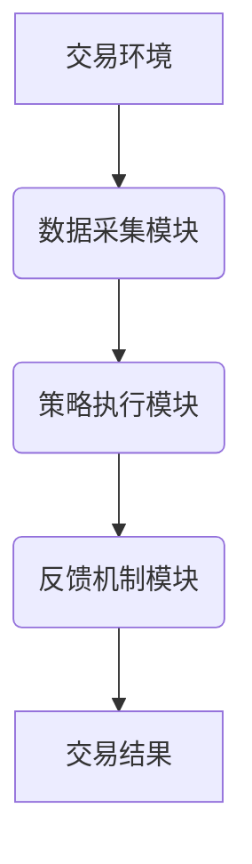
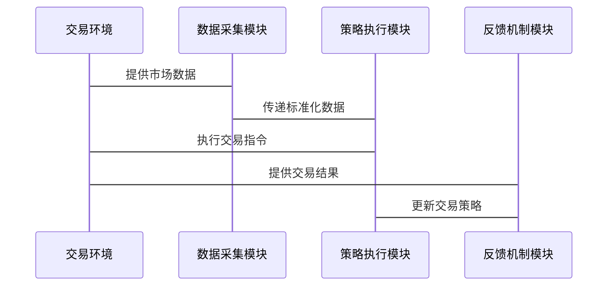

                 


# 企业AI Agent的强化学习在自动化交易策略中的应用

## 关键词：
企业AI Agent、强化学习、自动化交易、Q-learning算法、Deep Q-learning算法、系统架构设计

## 摘要：
本文探讨了企业AI Agent在强化学习技术下的自动化交易策略中的应用。通过分析强化学习算法的基本原理，结合企业AI Agent的构建，详细阐述了如何利用强化学习优化交易策略，并通过实际案例展示了系统的设计与实现。本文旨在为企业技术决策者和研究人员提供理论依据和实践指导，帮助他们在复杂多变的金融市场中实现高效、智能的交易策略。

---

# 第一部分: 企业AI Agent与强化学习基础

## 第1章: 企业AI Agent的概述

### 1.1 AI Agent的基本概念

#### 1.1.1 AI Agent的定义
AI Agent（人工智能代理）是指在特定环境中能够感知状态并采取行动以实现目标的智能实体。它能够通过与环境的交互，自主决策并执行任务。

#### 1.1.2 AI Agent的核心属性
AI Agent具有以下核心属性：
- **自主性**：能够在没有外部干预的情况下自主决策。
- **反应性**：能够实时感知环境并做出反应。
- **目标导向性**：具有明确的目标，并通过行动实现目标。
- **学习能力**：能够通过经验改进自身的决策能力。

#### 1.1.3 AI Agent与传统AI的区别
| 属性       | AI Agent                          | 传统AI                              |
|------------|------------------------------------|--------------------------------------|
| 独立性      | 具有自主决策能力                  | 依赖于预设规则或外部指令              |
| 适应性      | 能够自适应环境变化                | 适应性较弱，需人工调整                |
| 应用场景     | 适用于需要自主决策的任务          | 适用于数据处理、模式识别等任务        |

### 1.2 强化学习的基本原理

#### 1.2.1 强化学习的定义
强化学习（Reinforcement Learning, RL）是一种机器学习范式，通过智能体在环境中采取行动，以最大化累积奖励。智能体通过与环境的交互，学习最优策略。

#### 1.2.2 强化学习的核心要素
| 要素       | 描述                              |
|------------|------------------------------------|
| 状态（State） | 智能体所处环境的当前情况          |
| 行动（Action） | 智能体可以采取的具体行动          |
| 奖励（Reward） | 环境对智能体行动的反馈评价        |
| 策略（Policy） | 智能体选择行动的概率分布函数      |
| 值函数（Value Function） | 衡量状态或状态-行动对奖励的期望值 |

#### 1.2.3 强化学习与监督学习的区别
| 方面       | 强化学习                          | 监督学习                            |
|------------|------------------------------------|--------------------------------------|
| 数据来源    | 环境的交互反馈                    | 标签化的训练数据                    |
| 决策方式    | 基于反馈的试错学习                | 基于标签的直接映射                  |
| 环境复杂度  | 高度动态且不确定                  | 静态且确定                          |

### 1.3 企业AI Agent的应用场景

#### 1.3.1 自动化交易的基本概念
自动化交易是指通过算法和程序自动执行买卖操作，以捕捉市场机会或规避风险。它依赖于高频数据处理和实时决策。

#### 1.3.2 自动化交易的分类
| 类型       | 描述                              |
|------------|------------------------------------|
| 算法交易   | 基于数学模型和统计套利的交易策略  |
| 行为交易   | 基于市场情绪和模式识别的交易策略  |
| 高频交易   | 利用高速数据处理和算法优化的交易策略 |

#### 1.3.3 企业AI Agent在自动化交易中的优势
- **高效性**：AI Agent能够快速处理市场数据并做出决策。
- **稳定性**：通过强化学习优化策略，降低人为情绪干扰。
- **可扩展性**：能够同时处理多个市场和多种资产。

## 1.4 本章小结
本章介绍了AI Agent的基本概念、强化学习的核心原理以及企业AI Agent在自动化交易中的应用场景。AI Agent通过强化学习技术，能够实现高效、稳定的交易策略优化。

---

## 第2章: 强化学习在自动化交易中的应用

### 2.1 自动化交易策略的复杂性

#### 2.1.1 传统交易策略的局限性
传统交易策略依赖于人工制定的规则，难以应对市场环境的快速变化。

#### 2.1.2 自动化交易的优势
自动化交易能够快速响应市场变化，捕捉短期价格波动。

#### 2.1.3 强化学习在自动化交易中的作用
强化学习通过不断试错，优化交易策略，提高收益并降低风险。

### 2.2 强化学习在交易策略优化中的应用

#### 2.2.1 Q-learning算法在交易中的应用
Q-learning是一种经典的强化学习算法，通过维护Q表记录状态-行动对的期望奖励。

#### 2.2.2 Deep Q-learning算法在交易中的应用
Deep Q-learning将Q表替换为神经网络，能够处理高维状态空间。

#### 2.2.3 策略评估与回测
通过历史数据回测交易策略，验证其有效性和稳定性。

### 2.3 企业级AI Agent的构建

#### 2.3.1 AI Agent的系统架构


#### 2.3.2 数据采集与处理
- 数据源：高频市场数据、历史交易记录。
- 数据处理：清洗、特征提取、标准化。

#### 2.3.3 策略执行与反馈机制
- 策略执行：根据当前状态选择行动。
- 反馈机制：根据交易结果更新策略。

### 2.4 本章小结
本章探讨了强化学习在自动化交易中的具体应用，介绍了Q-learning和Deep Q-learning算法，并展示了企业级AI Agent的构建过程。

---

## 第3章: 强化学习算法的数学模型与实现

### 3.1 Q-learning算法的数学模型
Q值更新公式：
$$ Q(s,a) = Q(s,a) + \alpha [r + \gamma \max Q(s',a') - Q(s,a)] $$

### 3.2 Deep Q-learning算法的实现
神经网络权重更新公式：
$$ \theta_{t+1} = \theta_t + \alpha (y_t - y_{\text{pred}}) \nabla y_{\text{pred}} $$

### 3.3 算法实现的代码示例

#### 3.3.1 环境搭建与依赖安装
```bash
pip install gym numpy tensorflow
```

#### 3.3.2 网络模型定义
```python
import tensorflow as tf
class DQNModel(tf.keras.Model):
    def __init__(self, state_space, action_space):
        super(DQNModel, self).__init__()
        self.fc1 = tf.keras.layers.Dense(64, activation='relu')
        self.fc2 = tf.keras.layers.Dense(64, activation='relu')
        self.q_values = tf.keras.layers.Dense(action_space, activation='linear')
        
    def call(self, x):
        x = self.fc1(x)
        x = self.fc2(x)
        x = self.q_values(x)
        return x
```

#### 3.3.3 算法实现代码
```python
import numpy as np
import gym

class DQNAgent:
    def __init__(self, state_space, action_space, lr=0.01, gamma=0.99):
        self.state_space = state_space
        self.action_space = action_space
        self.lr = lr
        self.gamma = gamma
        self.model = DQNModel(state_space, action_space)
        self.optimizer = tf.keras.optimizers.Adam(learning_rate=lr)
        
    def remember(self, state, action, reward, next_state):
        self.memory.append((state, action, reward, next_state))
        
    def act(self, state):
        if np.random.random() < 0.9:
            q_values = self.model.predict(state)
            return np.argmax(q_values[0])
        else:
            return np.random.randint(self.action_space)
    
    def replay(self, batch_size):
        mini_batch = random.sample(self.memory, batch_size)
        states = np.array([x[0] for x in mini_batch])
        actions = np.array([x[1] for x in mini_batch])
        rewards = np.array([x[2] for x in mini_batch])
        next_states = np.array([x[3] for x in mini_batch])
        
        target = self.model.predict(states)
        next_q = self.model.predict(next_states)
        target[range(batch_size), actions] = rewards + self.gamma * np.max(next_q, axis=1)
        
        self.model.fit(states, target, epochs=1, verbose=0)
```

### 3.4 本章小结
本章详细讲解了Q-learning和Deep Q-learning算法的数学模型，并通过代码示例展示了算法的实现过程。

---

## 第4章: 企业AI Agent的系统架构设计

### 4.1 系统功能模块设计

#### 4.1.1 数据采集模块
- 功能：采集市场数据，包括价格、成交量等。
- 输入：市场数据源。
- 输出：标准化的市场数据。

#### 4.1.2 策略执行模块
- 功能：根据当前状态选择交易行动。
- 输入：市场数据、当前状态。
- 输出：交易指令。

#### 4.1.3 反馈机制模块
- 功能：根据交易结果更新策略。
- 输入：交易结果、当前策略。
- 输出：优化后的策略。

### 4.2 系统架构设计图


### 4.3 系统接口设计

#### 4.3.1 数据接口
- 输入接口：市场数据接口。
- 输出接口：交易结果接口。

#### 4.3.2 系统交互设计


### 4.4 本章小结
本章详细设计了企业AI Agent的系统架构，包括功能模块、接口设计和交互流程。

---

## 第5章: 项目实战

### 5.1 环境搭建与依赖安装
```bash
pip install gym numpy pandas scikit-learn
```

### 5.2 系统核心实现源代码

#### 5.2.1 数据处理代码
```python
import pandas as pd
import numpy as np

def process_data(data):
    data = pd.DataFrame(data)
    # 数据清洗
    data = data.dropna()
    # 特征提取
    features = data[['open', 'high', 'low', 'close']]
    return features.values
```

#### 5.2.2 策略执行代码
```python
import gym
from gym import spaces

class TradingEnv(gym.Env):
    def __init__(self, data):
        super(TradingEnv, self).__init__()
        self.data = data
        self.state = 0
        self.observation_space = spaces.Box(low=0, high=1, shape=(4,))
        self.action_space = spaces.Discrete(3)  # 0: 买入, 1: 持有, 2: 卖出
        
    def _step(self, action):
        state = self.data[self.state]
        next_state = self.data[self.state+1]
        
        if action == 0:
            reward = next_state['close'] - state['close']
        elif action == 1:
            reward = 0
        else:
            reward = state['close'] - next_state['close']
            
        self.state += 1
        return next_state.values, reward, False, {}
```

### 5.3 实际案例分析与详细解读

#### 5.3.1 案例分析
假设我们有一个股票交易数据集，通过强化学习训练一个AI Agent，使其能够在市场中实现稳定的收益。

#### 5.3.2 代码实现与结果分析
```python
env = TradingEnv(data)
agent = DQNAgent(env.observation_space.shape[0], env.action_space.n)
for _ in range(1000):
    state = env.reset()
    while not done:
        action = agent.act(state)
        next_state, reward, done, _ = env.step(action)
        agent.remember(state, action, reward, next_state)
        agent.replay(32)
```

### 5.4 本章小结
本章通过实际案例展示了企业AI Agent在自动化交易中的应用，验证了强化学习算法的有效性。

---

## 第6章: 总结与展望

### 6.1 本章总结
本文详细探讨了企业AI Agent在强化学习技术下的自动化交易策略中的应用。通过理论分析和实践案例，验证了强化学习在优化交易策略中的有效性。

### 6.2 未来研究方向
- 更复杂市场的适应性研究。
- 更高效的强化学习算法开发。
- 多资产组合优化的研究。

### 6.3 最佳实践 Tips
- 在实际应用中，需结合市场环境调整算法参数。
- 定期回测策略，及时优化模型。
- 注意风险管理，避免过度杠杆化。

### 6.4 注意事项
- 强化学习模型的训练需要大量数据和计算资源。
- 需要实时监控交易结果，及时调整策略。

### 6.5 拓展阅读
- 《Deep Reinforcement Learning in Trading》
- 《Practical Deep Learning for Trading》

### 6.6 本章小结
本文总结了强化学习在企业AI Agent中的应用，并展望了未来的研究方向和实践中的注意事项。

---

通过以上章节的详细讲解，我们系统地探讨了企业AI Agent在强化学习技术下的自动化交易策略中的应用。从理论到实践，从算法到系统设计，本文为企业技术决策者和研究人员提供了全面的指导和实践参考。

