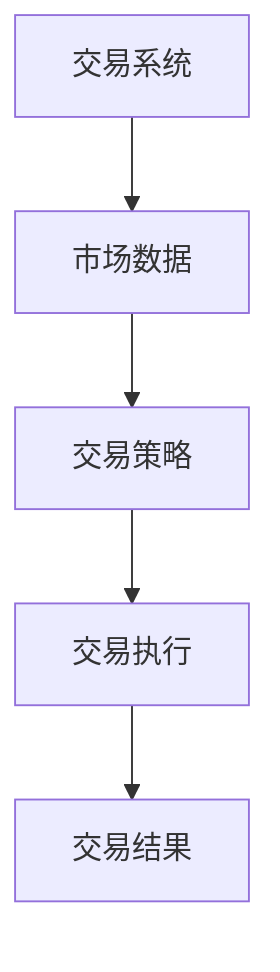

                 


# 企业AI Agent的强化学习在自动化交易策略中的高频应用

> 关键词：强化学习，AI Agent，自动化交易，高频交易，算法交易

> 摘要：本文深入探讨了强化学习在企业AI Agent中的应用，特别是其在自动化交易策略中的高频应用。通过系统化的分析和案例研究，文章详细解释了强化学习的核心概念、算法原理、系统架构设计以及实际项目实现，帮助读者全面理解并掌握如何在高频交易中应用强化学习。

---

# 第一部分: 强化学习与AI Agent基础

## 第1章: 强化学习的概述

### 1.1 强化学习的基本概念

#### 1.1.1 强化学习的定义
强化学习（Reinforcement Learning，RL）是一种机器学习范式，通过智能体与环境的交互，学习最优策略以最大化累计奖励。与监督学习不同，强化学习不需要标记数据，而是通过试错和奖励机制进行学习。

#### 1.1.2 强化学习的核心要素
- **状态（State）**：环境中的当前情况。
- **动作（Action）**：智能体在特定状态下采取的行为。
- **奖励（Reward）**：智能体采取动作后获得的反馈，用于评估动作的好坏。
- **策略（Policy）**：智能体选择动作的概率分布。
- **价值函数（Value Function）**：评估某个状态下采取某动作后的预期回报。

#### 1.1.3 强化学习与监督学习的区别
| 方面 | 监督学习 | 强化学习 |
|------|----------|----------|
| 数据 | 标记数据 | 无标记数据，通过奖励反馈 |
| 目标 | 预测目标 | 最大化累计奖励 |
| 交互 | 无交互 | 有交互 |

### 1.2 AI Agent的定义与特点

#### 1.2.1 AI Agent的定义
AI Agent（人工智能代理）是指能够感知环境并采取行动以实现目标的智能实体。它可以在没有人类干预的情况下自主决策和执行任务。

#### 1.2.2 AI Agent的核心特点
- **自主性**：能够在没有外部干预的情况下自主决策。
- **反应性**：能够根据环境变化实时调整行为。
- **学习能力**：通过经验改进决策策略。
- **目标导向**：所有行为都以实现特定目标为导向。

#### 1.2.3 AI Agent与传统算法的区别
| 方面 | 传统算法 | AI Agent |
|------|----------|----------|
| 决策方式 | 确定性规则 | 基于概率的策略选择 |
| 适应性 | 固定规则 | 能够自适应环境变化 |
| 应用场景 | 简单问题 | 复杂动态环境 |

### 1.3 高频交易的背景与挑战

#### 1.3.1 高频交易的定义
高频交易（High-Frequency Trading，HFT）是指通过计算机算法在极短时间内进行大量交易的一种交易方式。其主要目的是利用市场的微小波动获利。

#### 1.3.2 高频交易的特点与挑战
- **高速性**：交易速度极快，通常以毫秒为单位。
- **复杂性**：市场环境动态变化，需要实时决策。
- **高风险**：高频交易的高杠杆和快速决策模式使其风险较高。
- **技术挑战**：需要高性能的硬件和高效的算法。

#### 1.3.3 强化学习在高频交易中的应用前景
强化学习能够处理动态变化的市场环境，通过试错和奖励机制优化交易策略，因此在高频交易中具有广阔的应用前景。

---

## 第2章: 强化学习与AI Agent的结合

### 2.1 强化学习在AI Agent中的应用

#### 2.1.1 强化学习如何驱动AI Agent决策
AI Agent通过强化学习从环境中学习，根据当前状态选择最优动作，从而实现目标。

#### 2.1.2 AI Agent的强化学习框架
- **环境建模**：构建交易环境的模型，包括市场数据、交易规则等。
- **状态空间**：定义交易中的各种状态，如当前价格、交易量等。
- **动作空间**：定义AI Agent可以执行的动作，如买入、卖出、持有等。
- **奖励机制**：定义奖励函数，根据交易结果给予奖励或惩罚。

#### 2.1.3 强化学习与AI Agent的协同工作
AI Agent通过强化学习不断优化策略，提高交易收益，同时适应市场环境的变化。

### 2.2 强化学习算法在高频交易中的应用

#### 2.2.1 Q-learning算法
Q-learning是一种经典的强化学习算法，通过更新Q值表来学习最优策略。

- **算法流程**：
  1. 初始化Q值表。
  2. 选择动作并执行。
  3. 获取奖励并更新Q值。
  4. 重复上述步骤直到终止。

- **代码示例**：
  ```python
  import numpy as np

  # 初始化Q值表
  Q = np.zeros((state_space, action_space))

  # 定义奖励函数
  def reward_function(state, action):
      # 根据当前状态和动作返回奖励
      return reward

  # Q-learning算法
  for episode in range(episodes):
      state = env.reset()
      while not done:
          # 选择动作
          action = choose_action(Q, state)
          # 执行动作
          next_state, reward, done = env.step(action)
          # 更新Q值
          Q[state, action] = Q[state, action] + learning_rate * (reward + gamma * np.max(Q[next_state, :]) - Q[state, action])
  ```

- **数学模型**：
  $$ Q(s, a) = Q(s, a) + \alpha (r + \gamma \max Q(s', a') - Q(s, a)) $$

#### 2.2.2 Deep Q-Network算法
Deep Q-Network（DQN）通过深度神经网络近似Q值函数，解决高维状态空间的问题。

- **算法流程**：
  1. 初始化DQN网络。
  2. 选择动作并执行。
  3. 记录经验并更新经验回放库。
  4. 随机采样经验并训练网络。
  5. 重复上述步骤直到终止。

- **代码示例**：
  ```python
  import torch
  import torch.nn as nn
  import torch.optim as optim

  # 定义DQN网络
  class DQN(nn.Module):
      def __init__(self, input_dim, output_dim):
          super(DQN, self).__init__()
          self.fc1 = nn.Linear(input_dim, 64)
          self.fc2 = nn.Linear(64, 64)
          self.fc3 = nn.Linear(64, output_dim)

      def forward(self, x):
          x = torch.relu(self.fc1(x))
          x = torch.relu(self.fc2(x))
          x = self.fc3(x)
          return x

  # 初始化网络和优化器
  policy_net = DQN(state_space, action_space)
  target_net = DQN(state_space, action_space)
  optimizer = optim.Adam(policy_net.parameters(), lr=learning_rate)

  # 训练过程
  for episode in range(episodes):
      state = env.reset()
      while not done:
          # 选择动作
          with torch.no_grad():
              q_values = policy_net(torch.tensor(state))
          action = choose_action(q_values)
          # 执行动作
          next_state, reward, done = env.step(action)
          # 记录经验
          replay_buffer.append((state, action, reward, next_state, done))
          # 更新网络
          if len(replay_buffer) >= batch_size:
              batch = replay_buffer.sample(batch_size)
              states = torch.tensor(batch.state)
              actions = torch.tensor(batch.action)
              rewards = torch.tensor(batch.reward)
              next_states = torch.tensor(batch.next_state)
              # 计算目标Q值
              target_q_values = target_net(next_states).max(1)[0].detach()
              # 计算损失
              loss = F.mse_loss(q_values, rewards + gamma * target_q_values)
              # 更新网络
              optimizer.zero_grad()
              loss.backward()
              optimizer.step()
  ```

- **数学模型**：
  $$ \mathcal{L} = \mathbb{E}[(r + \gamma Q(s', a') - Q(s, a))^2] $$

#### 2.2.3 其他强化学习算法在高频交易中的应用
除了Q-learning和DQN，其他强化学习算法如策略梯度（Policy Gradient）和Actor-Critic算法也常用于高频交易。这些算法在复杂环境下表现更优，但实现难度较大。

---

## 第3章: 强化学习的数学模型与公式

### 3.1 强化学习的基本数学模型

#### 3.1.1 状态空间与动作空间
- **状态空间**：所有可能的状态集合，如市场价格、交易量等。
- **动作空间**：所有可能的动作集合，如买入、卖出、持有。

#### 3.1.2 奖励函数与价值函数
- **奖励函数**：定义智能体在特定状态下采取某个动作后获得的奖励。
- **价值函数**：评估某状态下采取某动作后的预期累计奖励。

#### 3.1.3 策略与值函数的关系
- **策略**：从状态到动作的映射，分为确定性策略和概率性策略。
- **值函数**：衡量策略在某状态下表现的好坏。

### 3.2 强化学习的核心公式

#### 3.2.1 Q-learning的更新公式
$$ Q(s, a) = Q(s, a) + \alpha (r + \gamma \max Q(s', a') - Q(s, a)) $$

#### 3.2.2 Deep Q-Network的损失函数
$$ \mathcal{L} = \mathbb{E}[(r + \gamma Q(s', a') - Q(s, a))^2] $$

---

## 第4章: AI Agent的系统架构设计

### 4.1 交易系统场景介绍

#### 4.1.1 系统目标
设计一个基于强化学习的AI Agent，用于高频交易，实现自动化决策和优化交易策略。

#### 4.1.2 系统输入与输出
- **输入**：市场数据（如价格、交易量）、历史数据、市场状态。
- **输出**：交易指令（如买入、卖出、持有）。

#### 4.1.3 系统的约束条件
- 交易速度限制。
- 风险控制。
- 系统稳定性。

### 4.2 系统功能设计

#### 4.2.1 领域模型设计


---

## 第5章: 项目实战

### 5.1 环境安装与配置

#### 5.1.1 安装Python环境
使用Anaconda或virtualenv创建独立的Python环境，安装必要的库，如numpy、torch、pandas等。

#### 5.1.2 安装强化学习库
安装强化学习相关的库，如OpenAI Gym、stable-baselines等。

### 5.2 系统核心实现

#### 5.2.1 环境类实现
定义交易环境类，包括状态空间、动作空间、奖励函数等。

```python
class TradingEnvironment:
    def __init__(self):
        # 初始化环境参数
        self.state = initial_state
        self.done = False
        self.reward = 0

    def reset(self):
        # 初始化环境
        self.state = initial_state
        self.done = False
        self.reward = 0
        return self.state

    def step(self, action):
        # 执行动作并返回新的状态、奖励和是否终止
        new_state = self._execute_action(action)
        self.reward = self._calculate_reward(new_state)
        self.done = self._check_termination(new_state)
        return new_state, self.reward, self.done

    def _execute_action(self, action):
        # 执行交易动作
        return new_state

    def _calculate_reward(self, state):
        # 计算奖励
        return reward

    def _check_termination(self, state):
        # 检查交易是否终止
        return done
```

#### 5.2.2 策略实现
实现强化学习策略，如Q-learning或DQN，并进行训练。

```python
# Q-learning策略
class QLearningStrategy:
    def __init__(self, state_space, action_space):
        self.Q = np.zeros((state_space, action_space))

    def choose_action(self, state):
        # 选择动作
        if np.random.rand() < epsilon:
            return np.random.randint(action_space)
        else:
            return np.argmax(self.Q[state])

    def update_Q(self, state, action, reward, next_state):
        # 更新Q值
        self.Q[state, action] = self.Q[state, action] + alpha * (reward + gamma * np.max(self.Q[next_state, :]) - self.Q[state, action])
```

### 5.3 代码应用解读与分析

#### 5.3.1 环境类解读
环境类负责模拟交易环境，包括市场数据、交易规则等。通过`reset`方法初始化环境，`step`方法执行动作并返回新的状态、奖励和是否终止。

#### 5.3.2 策略类解读
策略类负责根据当前状态选择动作，并根据反馈更新Q值表。Q-learning通过不断更新Q值表，逐步逼近最优策略。

### 5.4 实际案例分析

#### 5.4.1 数据准备
准备高频交易数据，如股票价格、订单簿等。

#### 5.4.2 策略训练
通过模拟交易环境，训练强化学习模型，优化交易策略。

#### 5.4.3 结果分析
分析训练结果，评估策略的收益和风险，调整参数以提高性能。

### 5.5 项目小结

通过本节的实战，读者可以掌握如何将强化学习应用于高频交易，理解系统设计和实现的关键点，为后续的优化和扩展打下基础。

---

## 第6章: 最佳实践与注意事项

### 6.1 小结
强化学习在高频交易中的应用潜力巨大，但实现复杂，需要结合具体场景进行优化。

### 6.2 注意事项
- **数据质量**：确保数据准确性和实时性。
- **模型鲁棒性**：加强模型的鲁棒性，防止策略失效。
- **风险管理**：制定严格的风险控制机制，避免重大损失。

### 6.3 拓展阅读
推荐读者阅读以下书籍和论文，深入了解强化学习和高频交易的相关知识：
- 《Reinforcement Learning: Theory and Algorithms》
- 《Algorithmic Trading: Winning Strategies and Their Rationale》

---

通过本文的系统讲解和实战分析，读者可以全面理解强化学习在高频交易中的应用，并能够实际操作，设计和实现高效的AI Agent交易系统。

