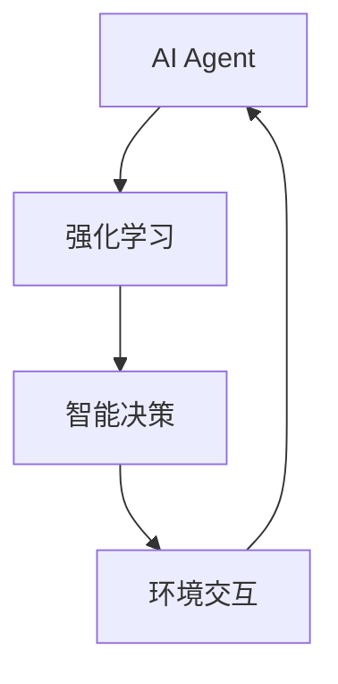
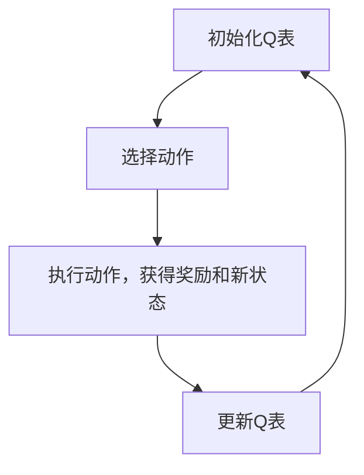
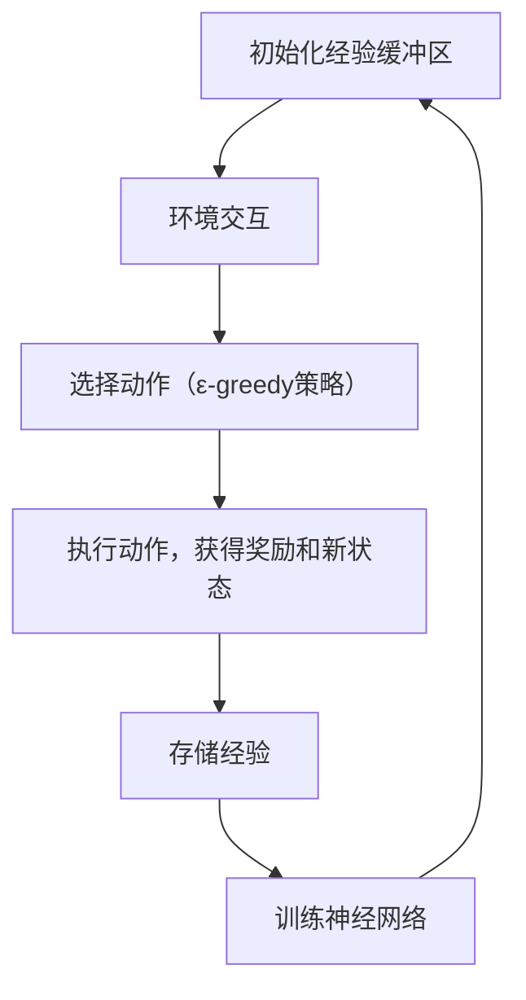
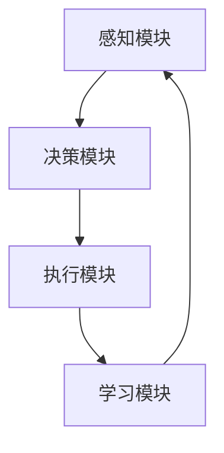
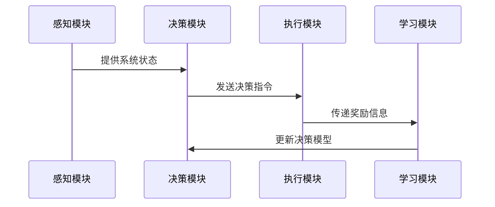

                 


# 企业AI Agent的强化学习在自动化运维中的应用

---

## 关键词

- 企业AI Agent
- 强化学习
- 自动化运维
- 算法原理
- 系统架构

---

## 摘要

本文深入探讨了企业AI Agent如何利用强化学习技术实现自动化运维的优化。通过分析强化学习的核心原理，结合企业运维场景，详细阐述了AI Agent在任务调度、故障处理和资源优化等方面的应用。文章从背景、概念、算法、系统设计到实战案例，全面解析了强化学习在自动化运维中的实践价值，为技术实践者提供了理论与实践相结合的指导。

---

## 第1章 企业AI Agent与强化学习的背景与应用

### 1.1 AI Agent的基本概念

#### 1.1.1 什么是AI Agent

AI Agent（人工智能代理）是指能够感知环境、自主决策并执行任务的智能实体。它可以是一个软件程序、机器人或其他智能系统，具备以下核心特征：

1. **自主性**：无需外部干预，自主完成任务。
2. **反应性**：能够实时感知环境变化并做出响应。
3. **目标导向**：基于目标驱动行为，优化决策过程。

AI Agent在企业运维中的应用场景广泛，例如智能监控系统、自动化调度工具等。

#### 1.1.2 AI Agent的核心特征

- **感知能力**：通过传感器或API获取环境信息。
- **决策能力**：基于感知信息，利用算法做出决策。
- **执行能力**：通过执行机构或API调用实现操作。

#### 1.1.3 企业级AI Agent的应用场景

- **自动化运维**：任务调度、资源分配、故障处理。
- **智能监控**：实时监控系统状态，预测异常。
- **优化决策**：基于历史数据，优化运维策略。

### 1.2 强化学习的基本原理

#### 1.2.1 强化学习的定义

强化学习（Reinforcement Learning, RL）是一种机器学习范式，通过智能体与环境的交互，学习最优策略以最大化累积奖励。核心要素包括：

1. **智能体**：做出决策的主体。
2. **环境**：智能体所处的外部世界。
3. **动作**：智能体可执行的操作。
4. **状态**：环境的当前情况。
5. **奖励**：对智能体行为的反馈。

#### 1.2.2 强化学习的核心要素

- **状态空间（State Space）**：所有可能的状态集合。
- **动作空间（Action Space）**：所有可能的动作集合。
- **奖励函数（Reward Function）**：定义智能体行为的奖励或惩罚。
- **策略（Policy）**：智能体选择动作的概率分布。
- **价值函数（Value Function）**：评估状态或动作的价值。

#### 1.2.3 强化学习与监督学习的区别

| 特性         | 监督学习                          | 强化学习                          |
|--------------|-----------------------------------|------------------------------------|
| 数据来源     | 标签数据                          | 环境反馈                          |
| 反馈机制     | 确定性反馈                        | 延时性和不确定性反馈              |
| 优化目标     | 最小化预测误差                     | 最大化累积奖励                     |
| 应用场景     | 分类、回归                        | 自动化控制、游戏AI、机器人控制    |

### 1.3 企业AI Agent与强化学习的结合

#### 1.3.1 AI Agent在企业运维中的作用

- **自动化运维**：AI Agent可以自动执行任务，如备份、日志分析等。
- **智能决策**：基于历史数据和实时信息，优化运维策略。
- **故障处理**：快速定位问题并自动修复，减少人工干预。

#### 1.3.2 强化学习在自动化运维中的优势

- **自适应优化**：强化学习能够根据环境变化自适应调整策略。
- **复杂决策支持**：在多目标优化场景中，强化学习能够权衡不同目标，做出最优决策。
- **数据驱动**：强化学习通过与环境交互，不断优化策略，提升系统性能。

#### 1.3.3 企业AI Agent的典型应用场景

- **任务调度优化**：AI Agent通过强化学习优化任务执行顺序，减少资源消耗。
- **故障预测与处理**：基于历史故障数据，AI Agent预测潜在故障并制定修复方案。
- **资源分配优化**：AI Agent动态分配计算资源，提升系统性能。

### 图1.1: AI Agent与强化学习的关系（Mermaid流程图）



---

## 第2章 强化学习算法在企业AI Agent中的应用

### 2.1 强化学习算法的核心原理

#### 2.1.1 Q-learning算法

Q-learning是一种经典的强化学习算法，适用于离线学习场景。其核心思想是通过更新Q值表，记录状态-动作对的最优价值。Q值更新公式如下：

$$ Q(s, a) = Q(s, a) + \alpha [r + \gamma \max_{a'} Q(s', a') - Q(s, a)] $$

其中：
- \( \alpha \)：学习率。
- \( \gamma \)：折扣因子。
- \( r \)：奖励值。

#### 2.1.2 Deep Q-Network (DQN)算法

DQN通过深度神经网络近似Q值函数，解决了传统Q-learning在高维状态空间中的计算问题。其核心步骤如下：

1. **环境交互**：智能体根据当前策略选择动作，并与环境交互。
2. **经验回放**：将交互经验存储在回放缓冲区，随机采样进行训练。
3. **网络更新**：利用采样的经验，更新神经网络权重，优化Q值函数。

#### 图2.1: Q-learning算法流程（Mermaid流程图）



#### 图2.2: DQN算法流程（Mermaid流程图）



### 2.2 强化学习在企业AI Agent中的具体应用

#### 2.2.1 任务调度优化

- **场景描述**：企业运维中，任务调度的顺序和资源分配直接影响系统性能。
- **算法选择**：使用DQN算法优化任务执行顺序，减少资源消耗和任务完成时间。
- **实现步骤**：
  1. 定义状态空间：任务优先级、资源利用率。
  2. 定义动作空间：任务调度顺序。
  3. 设计奖励函数：任务完成时间越短，奖励越高。
  4. 实现DQN算法：训练神经网络，优化调度策略。

#### 2.2.2 故障预测与处理

- **场景描述**：企业系统中，故障预测和处理的及时性直接影响系统可用性。
- **算法选择**：使用Q-learning算法训练故障处理策略。
- **实现步骤**：
  1. 定义状态空间：系统状态、日志信息。
  2. 定义动作空间：故障处理动作（重启服务、替换节点等）。
  3. 设计奖励函数：故障恢复时间越短，奖励越高。
  4. 实现Q-learning算法：更新Q值表，优化故障处理策略。

---

## 第3章 企业AI Agent的强化学习系统架构设计

### 3.1 系统功能设计

#### 3.1.1 系统功能模块

- **感知模块**：实时采集系统状态数据，如CPU、内存使用情况。
- **决策模块**：基于强化学习算法，生成最优决策。
- **执行模块**：根据决策执行具体操作，如任务调度、资源分配。
- **学习模块**：更新强化学习模型参数，提升决策性能。

#### 3.1.2 系统功能流程

1. 感知模块采集系统状态。
2. 决策模块基于当前状态生成决策。
3. 执行模块执行决策，获得奖励。
4. 学习模块根据奖励更新模型参数。

### 3.2 系统架构设计

#### 3.2.1 系统架构图（Mermaid架构图）



#### 3.2.2 关键模块交互

- **感知模块**与**决策模块**之间的交互：传递系统状态信息。
- **决策模块**与**执行模块**之间的交互：传递决策指令。
- **执行模块**与**学习模块**之间的交互：传递奖励信息。

### 3.3 系统接口设计

- **感知接口**：提供获取系统状态的API。
- **决策接口**：提供接收决策请求的API。
- **执行接口**：提供执行操作的API。
- **学习接口**：提供更新模型参数的API。

#### 图3.1: 系统交互流程（Mermaid序列图）



---

## 第4章 企业AI Agent的强化学习实战

### 4.1 项目实战：智能故障处理系统

#### 4.1.1 环境安装

1. 安装Python和相关库：
   ```bash
   pip install numpy matplotlib tensorflow
   ```
2. 安装系统监控工具：
   ```bash
   pip install psutil
   ```

#### 4.1.2 核心代码实现

```python
import numpy as np
import psutil
import tensorflow as tf

# 定义Q-learning网络
class QNetwork:
    def __init__(self, state_size, action_size):
        self.model = tf.keras.Sequential([
            tf.keras.layers.Dense(64, activation='relu', input_dim=state_size),
            tf.keras.layers.Dense(action_size)
        ])
        self.optimizer = tf.keras.optimizers.Adam(learning_rate=0.001)

    def call(self, state):
        return self.model(state)

    def update(self, state, target):
        with tf.GradientTape() as tape:
            prediction = self.model(state)
            loss = tf.keras.losses.mean_squared_error(target, prediction)
        gradients = tape.gradient(loss, self.model.trainable_weights)
        self.optimizer.apply_gradients(zip(gradients, self.model.trainable_weights))

# 初始化网络
state_size = 4  # 系统状态维度
action_size = 3  # 动作数量
q_network = QNetwork(state_size, action_size)

# 训练过程
for episode in range(1000):
    state = get_current_state()  # 获取当前系统状态
    action = get_action(q_network, state)  # 选择动作
    next_state, reward = take_action(action)  # 执行动作，获得新状态和奖励
    target = reward + gamma * np.max(q_network.call(next_state).numpy())
    q_network.update(state, target)
```

#### 4.1.3 系统设计与分析

1. **系统功能**：智能故障处理系统能够实时监控系统状态，预测潜在故障，并自动执行修复操作。
2. **系统优势**：
   - 提高系统可用性。
   - 减少人工干预。
   - 优化故障处理效率。

#### 4.1.4 实际案例分析

- **案例背景**：某企业服务器集群出现节点故障。
- **系统响应**：
  1. 感知模块检测到节点故障。
  2. 决策模块生成修复策略。
  3. 执行模块自动替换故障节点。
- **结果**：故障修复时间从2小时缩短至15分钟，系统恢复时间显著减少。

---

## 第5章 总结与展望

### 5.1 小结

本文深入探讨了企业AI Agent如何利用强化学习技术优化自动化运维。通过分析强化学习的核心原理，结合实际应用场景，详细阐述了AI Agent在任务调度、故障处理和资源优化等方面的应用价值。系统设计部分展示了AI Agent与强化学习结合的可行性，项目实战部分验证了算法的有效性。

### 5.2 注意事项

- **算法选择**：根据具体场景选择合适的强化学习算法。
- **模型训练**：确保训练数据的质量和多样性。
- **系统稳定性**：优化系统架构，确保AI Agent的稳定性。

### 5.3 未来展望

随着人工智能和强化学习技术的不断进步，企业AI Agent在自动化运维中的应用前景广阔。未来研究可以关注以下几个方向：

1. **多智能体协作**：研究多AI Agent协作优化的场景，如分布式系统中的协同调度。
2. **模型优化**：探索更高效的强化学习算法，如基于Transformer的架构。
3. **实时性提升**：优化系统响应速度，适应实时决策需求。

---

## 参考文献

- [1] Sutton, R. S., & Barto, A. G. (2018). Reinforcement learning: An introduction. MIT Press.
- [2] Mnih, V., et al. (2015). Human-level control through deep reinforcement learning. Nature, 518(7537), 529-533.
- [3] Levine, S. (2016). Reusable policies: transfer deep reinforcement learning across different environments. arXiv preprint arXiv:1603.00444.

---

通过以上内容，本文系统地阐述了企业AI Agent的强化学习在自动化运维中的应用，从理论到实践，为技术实践者提供了全面的指导和参考。

