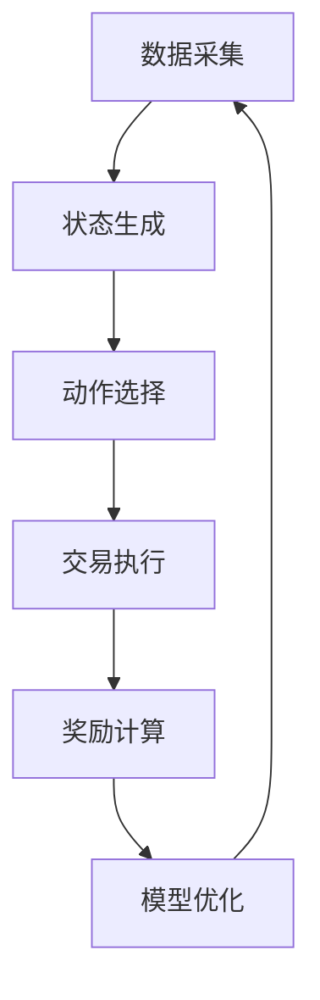

                 


# 企业AI Agent的强化学习在金融交易策略优化中的应用

## 关键词：强化学习、AI Agent、金融交易、交易策略优化、算法实现、系统架构

## 摘要：本文详细探讨了企业AI Agent在金融交易策略优化中的应用，通过强化学习的方法，结合数学建模和系统设计，分析了如何构建高效的AI Agent，并通过实际案例展示了其在金融交易中的优化效果。文章从理论到实践，系统地介绍了强化学习在金融交易中的应用，为相关领域的研究和实践提供了有益的参考。

---

## 第一部分: AI Agent与强化学习基础

### 第1章: AI Agent的基本概念与强化学习原理

#### 1.1 AI Agent的定义与特点
- **AI Agent**是指具有智能决策能力的主体，能够在特定环境中感知信息并采取行动。
- **自主性**：AI Agent能够独立决策，无需外部干预。
- **反应性**：能够根据环境变化实时调整行为。
- **学习能力**：通过与环境交互，不断优化决策策略。

#### 1.2 强化学习的核心原理
- **状态（State）**：环境中的当前情况，例如当前的市场价格、持有仓位等。
- **动作（Action）**：AI Agent在特定状态下采取的行为，例如买入、卖出或持有。
- **奖励（Reward）**：环境对AI Agent行为的反馈，通常以收益或损失的形式表示。
- **策略（Policy）**：AI Agent在不同状态下选择动作的概率分布，目标是最大化累计奖励。

#### 1.3 AI Agent与强化学习的关系
- 强化学习为AI Agent提供了决策优化的框架，使其能够在动态环境中实现最优策略。

---

## 第二部分: 强化学习在金融交易中的应用

### 第2章: 金融交易场景的强化学习建模

#### 2.1 金融交易场景的定义
- **金融市场**：包括股票、期货、外汇等交易市场。
- **交易策略**：一套基于市场信息的买卖规则，目标是实现收益最大化。
- **动态性**：市场价格受多种因素影响，具有高度不确定性。

#### 2.2 强化学习模型的构建
- **状态空间**：包括当前市场价格、历史价格走势、仓位信息等。
- **动作空间**：包括买入、卖出或持有等操作。
- **奖励函数**：基于交易收益和风险的综合评估，例如净利润、夏普比率等。

#### 2.3 强化学习在金融交易中的优势
- **适应性**：能够实时调整策略，应对市场变化。
- **高效性**：通过算法优化，减少人为决策的主观性和情绪化。

---

## 第三部分: 强化学习算法的数学解析

### 第3章: Q-learning算法的数学模型

#### 3.1 Q-learning的基本原理
- Q-learning是一种基于值函数的强化学习算法，目标是学习状态-动作对的最优值。
- **Q值更新公式**：
  $$ Q(s, a) = Q(s, a) + \alpha \left[ r + \max_{a'} Q(s', a') - Q(s, a) \right] $$
  其中：
  - \( Q(s, a) \)：当前状态下采取动作 \( a \) 的Q值。
  - \( \alpha \)：学习率。
  - \( r \)：奖励值。
  - \( \max_{a'} Q(s', a') \)：下一个状态下的最大Q值。

#### 3.2 策略梯度方法的数学推导
- 策略梯度方法直接优化策略参数，目标是最大化期望奖励。
- **策略函数**：\( \pi(a|s) \)，表示在状态 \( s \) 下采取动作 \( a \) 的概率。
- **目标函数**：
  $$ J(\theta) = \mathbb{E}_{s, a, r} \left[ r + \gamma J(s', a') \right] $$
  其中：
  - \( \theta \)：策略参数。
  - \( \gamma \)：折扣因子。

#### 3.3 动作概率分布的优化目标
- 通过梯度上升算法优化策略参数：
  $$ \theta \leftarrow \theta + \alpha \nabla_\theta J(\theta) $$

---

## 第四部分: 系统架构与实现方案

### 第4章: 系统架构设计

#### 4.1 系统模块划分
- **数据采集模块**：收集市场数据，包括历史价格、成交量等。
- **状态生成模块**：将市场数据转换为AI Agent的状态输入。
- **动作选择模块**：基于强化学习算法选择最优动作。
- **奖励计算模块**：根据交易结果计算奖励值。

#### 4.2 系统功能流程图


### 第5章: 项目实战与案例分析

#### 5.1 项目环境搭建
- **开发环境**：Python 3.8+，TensorFlow 2.0+，PyTorch 1.8+。
- **数据集**：使用股票历史数据，例如股票代码、开盘价、收盘价等。

#### 5.2 核心代码实现
- **Q-learning算法实现**：
  ```python
  import numpy as np

  class QLearning:
      def __init__(self, state_space_size, action_space_size):
          self.Q = np.zeros((state_space_size, action_space_size))
      
      def choose_action(self, state, epsilon):
          if np.random.random() < epsilon:
              return np.random.randint(0, action_space_size)
          else:
              return np.argmax(self.Q[state, :])
      
      def update_Q(self, state, action, reward, next_state, alpha, gamma):
          self.Q[state, action] += alpha * (reward + gamma * np.max(self.Q[next_state, :]) - self.Q[state, action])
  ```

- **策略梯度方法实现**：
  ```python
  import torch
  import torch.nn as nn

  class PolicyGradient:
      def __init__(self, state_dim, action_dim):
          self.policy = nn.Linear(state_dim, action_dim)
          self.optimizer = torch.optim.Adam(self.policy.parameters())
          selfCriterion = nn.CrossEntropyLoss()
      
      def choose_action(self, state):
          logits = self.policy(state)
          action = torch.multinomial(torch.softmax(logits), 1).item()
          return action
      
      def update_policy(self, state, action, reward, gamma, discount_factor):
          loss = self.Criterion(self.policy(state), torch.tensor([action]))
          loss = loss * (reward * (gamma ** discount_factor))
          self.optimizer.zero_grad()
          loss.backward()
          self.optimizer.step()
  ```

#### 5.3 实际案例分析
- 使用股票数据训练AI Agent，通过Q-learning和策略梯度方法优化交易策略，实现稳定的收益增长。

---

## 第五部分: 最佳实践与未来展望

### 第6章: 最佳实践与注意事项

#### 6.1 模型训练的收敛性问题
- **过拟合**：避免在训练数据上表现优异但测试数据上效果差。
- **欠拟合**：增加模型复杂度或提供更多数据。

#### 6.2 策略优化的稳定性问题
- **波动性**：金融市场的波动可能导致策略不稳定。
- **风险管理**：设置止损点和止盈点，控制风险。

#### 6.3 系统实现的可扩展性问题
- **模块化设计**：便于扩展和维护。
- **高性能计算**：优化算法和硬件，提高计算效率。

### 第7章: 未来研究方向

#### 7.1 更复杂的金融场景建模
- **多 Agent 协作**：多个AI Agent协同工作，提高交易效率。
- **高级强化学习算法**：研究更高效的强化学习算法，如深度强化学习、多目标强化学习等。

#### 7.2 多 Agent 协作的交易策略优化
- 通过多个AI Agent分工合作，优化整体交易策略。

---

## 附录: 强化学习算法的数学公式

### 附录A: Q-learning算法的数学公式
$$ Q(s, a) = Q(s, a) + \alpha [r + \max Q(s', a') - Q(s, a)] $$

### 附录B: 策略梯度方法的数学推导
$$ J(\theta) = \mathbb{E}_{s, a, r} \left[ r + \gamma J(s', a') \right] $$

---

通过本文的详细分析，我们可以看到强化学习在金融交易策略优化中的巨大潜力。从理论到实践，结合数学模型和系统设计，我们能够构建高效的AI Agent，实现金融交易的智能化和高效化。未来，随着算法的不断进步和硬件性能的提升，强化学习在金融领域将发挥更大的作用。

