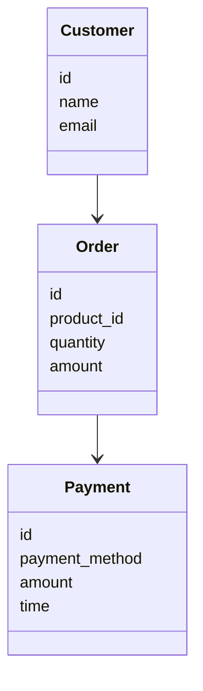
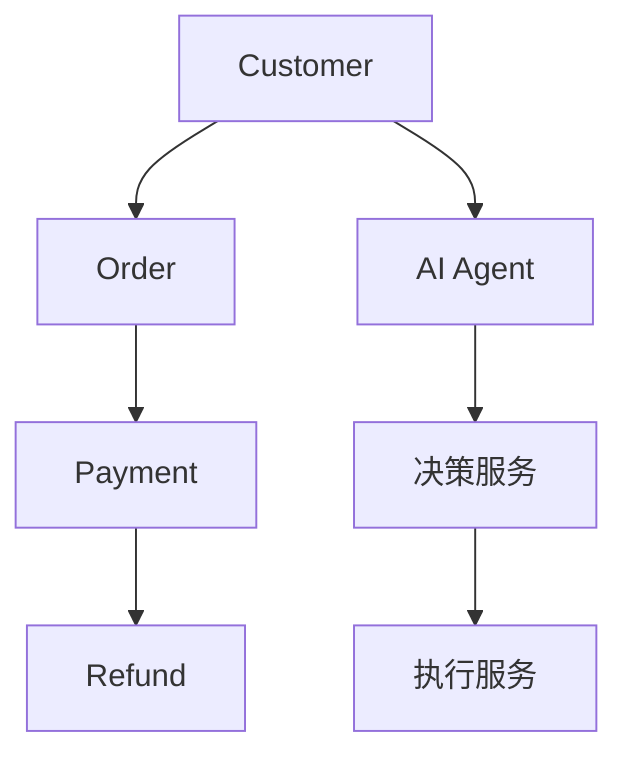
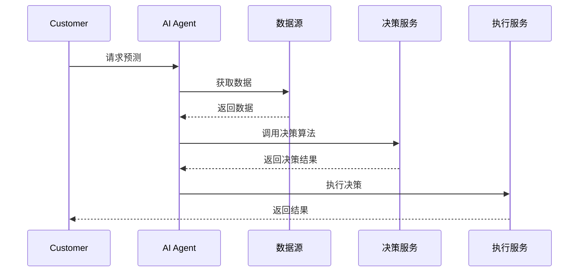

                 


# 企业AI Agent的微服务架构优化策略

## 关键词：企业AI Agent，微服务架构，服务优化，算法优化，系统设计，项目实战

## 摘要：  
本文详细探讨了企业AI Agent在微服务架构中的优化策略。首先介绍了企业AI Agent和微服务架构的基本概念，分析了两者的结合意义。接着从算法原理、系统架构设计、项目实战等多个维度，深入剖析了企业AI Agent微服务架构的核心要素和优化方法。通过具体案例分析，展示了如何在实际项目中实现高效的AI Agent微服务架构，并提出了相应的优化建议。

---

# 第一章: 企业AI Agent与微服务架构概述

## 1.1 企业AI Agent的定义与特点

### 1.1.1 AI Agent的基本概念  
AI Agent（人工智能代理）是一种能够感知环境、自主决策并执行任务的智能实体。它通过传感器获取信息，利用算法进行分析和推理，并通过执行器与外部环境交互。

### 1.1.2 企业AI Agent的核心特点  
1. **目标导向性**：企业AI Agent通常服务于特定的业务目标，如客户推荐、自动化流程优化等。  
2. **可扩展性**：支持多种任务和场景，能够灵活扩展。  
3. **实时性**：需要快速响应和处理实时数据。  
4. **自主性**：能够在一定程度上自主决策，减少人工干预。  

### 1.1.3 与传统AI Agent的区别  
- 传统AI Agent：主要用于学术研究或特定领域（如游戏AI）。  
- 企业AI Agent：注重实际业务场景中的应用，强调与企业系统的深度集成。  

## 1.2 微服务架构的核心原理  

### 1.2.1 微服务架构的定义  
微服务架构是一种将应用程序分解为小型、独立服务的设计模式。每个服务都可以独立开发、部署和扩展。  

### 1.2.2 微服务架构的优势  
1. **模块化**：服务独立性强，便于维护和扩展。  
2. **灵活性**：可以根据需求快速调整服务功能。  
3. **可扩展性**：每个服务都可以根据负载独立扩展。  

### 1.2.3 微服务架构的挑战  
1. **复杂性**：服务之间的通信和协调增加了系统管理的难度。  
2. **性能开销**：服务间通信可能带来额外的延迟。  

## 1.3 企业AI Agent与微服务架构的结合  

### 1.3.1 企业AI Agent的场景需求  
- 客户行为预测  
- 自动化流程优化  
- 智能客服系统  

### 1.3.2 微服务架构在AI Agent中的应用  
- 将AI Agent的功能模块化，如自然语言处理服务、决策服务等。  
- 提供灵活的扩展能力，以应对业务需求的变化。  

### 1.3.3 两者结合的必要性  
- 提高系统的可维护性和扩展性。  
- 降低单点故障风险，提高系统的可靠性。  

## 1.4 本章小结  
本章介绍了企业AI Agent和微服务架构的基本概念，分析了它们的特点和结合的意义，为后续的优化策略奠定了基础。

---

# 第二章: 企业AI Agent的微服务架构核心要素  

## 2.1 企业AI Agent的构成模块  

### 2.1.1 数据源模块  
- 负责收集和处理原始数据，如客户行为数据、市场数据等。  

### 2.1.2 AI模型服务模块  
- 负责训练和部署AI模型，提供预测和决策服务。  

### 2.1.3 业务逻辑处理模块  
- 根据AI模型的输出，执行具体的业务逻辑，如发送通知、触发流程等。  

### 2.1.4 接口调用模块  
- 提供API接口，与其他系统进行交互。  

## 2.2 微服务架构的核心组件  

### 2.2.1 服务注册与发现  
- 通过服务注册中心，实现服务的自动注册和发现。  

### 2.2.2 服务网关  
- 作为统一的入口，负责路由、鉴权和监控。  

### 2.2.3 服务通信机制  
- 使用HTTP或RPC协议，实现服务间的通信。  

### 2.2.4 服务治理与监控  
- 负责服务的健康监测、负载均衡和容错恢复。  

## 2.3 企业AI Agent微服务架构的实体关系分析  

### 2.3.1 实体关系图（ER图）  
```mermaid
erDiagram
    customer &&&& order
    order --> payment
    customer --> payment
    payment --> refund
    refund --> customer
```

### 2.3.2 实体属性分析  
| 实体 | 属性 |
|------|------|
| 客户 | id, 姓名, 电话, 邮箱 |
| 订单 | id, 产品ID, 数量, 金额 |
| 支付 | id, 支付方式, 金额, 时间 |
| 退款 | id, 金额, 原因, 时间 |

### 2.3.3 关系属性分析  
| 关系 | 属性 |
|------|------|
| 订单-支付 | 订单ID, 支付ID, 时间 |
| 支付-退款 | 支付ID, 退款ID, 时间 |

---

# 第三章: 企业AI Agent微服务架构的算法原理  

## 3.1 AI Agent决策算法  

### 3.1.1 基于概率论的决策模型  
- 使用贝叶斯网络进行概率推理，输出最优决策。  

### 3.1.2 马尔可夫决策过程（MDP）  
- 将问题建模为状态、动作和奖励的序列，通过动态规划求解最优策略。  

### 3.1.3 蒙特卡洛树搜索（MCTS）  
- 在复杂的决策树中，通过采样和模拟生成最优路径。  

### 3.1.4 代码实现示例  
```python
import random

def mcts_search(root):
    while True:
        node = select_node(root)
        simulate(node)
        backpropagate(node)

def select_node(node):
    # 选择具有最高价值的未遍历子节点
    pass

def simulate(node):
    # 随机模拟一个结果
    pass

def backpropagate(node):
    # 更新节点的价值
    pass
```

## 3.2 微服务架构中的通信算法  

### 3.2.1 HTTP通信协议  
- 使用RESTful API进行服务间的通信。  

### 3.2.2 RPC通信协议  
- 使用gRPC实现高效的远程过程调用。  

### 3.2.3 服务发现算法  
- 使用DNS或服务发现中间件（如Consul）实现动态发现。  

## 3.3 企业AI Agent微服务架构的优化算法  

### 3.3.1 负载均衡算法  
- 使用轮询、加权轮询或随机算法实现负载均衡。  

### 3.3.2 容错恢复算法  
- 使用自动重试、断路器模式（如Hystrix）实现容错恢复。  

---

# 第四章: 企业AI Agent微服务架构的系统设计  

## 4.1 系统功能设计  

### 4.1.1 领域模型设计  


### 4.1.2 系统功能模块  
- 数据采集模块：负责收集客户行为数据。  
- AI模型训练模块：负责训练和部署AI模型。  
- 业务逻辑处理模块：根据AI模型输出执行具体操作。  

## 4.2 系统架构设计  

### 4.2.1 总体架构图  


### 4.2.2 接口设计  
- AI Agent提供REST API，供其他系统调用。  
- 决策服务提供预测接口，供业务逻辑处理模块调用。  

## 4.3 系统交互设计  

### 4.3.1 交互流程图  


---

# 第五章: 企业AI Agent微服务架构的项目实战  

## 5.1 环境安装  

### 5.1.1 安装Docker  
```bash
curl -fsSL https://get.docker.com | bash -s docker
```

### 5.1.2 安装Kubernetes  
```bash
curl -s "https://get.k8s.io/kubectl-linux-amd64.tar.gz" | tar -xz
```

## 5.2 核心代码实现  

### 5.2.1 AI Agent核心代码  
```python
class AI_Agent:
    def __init__(self):
        self.models = {}

    def train_model(self, data):
        # 训练AI模型
        pass

    def predict(self, input):
        # 使用训练好的模型进行预测
        pass
```

### 5.2.2 微服务架构核心代码  
```python
from fastapi import FastAPI

app = FastAPI()

@app.get("/api/predict")
async def predict():
    return {"result": "success"}
```

## 5.3 案例分析  

### 5.3.1 案例背景  
- 某电商平台需要实现客户行为预测功能。  

### 5.3.2 实现过程  
1. 数据采集：收集客户浏览、点击、下单等行为数据。  
2. AI模型训练：基于历史数据训练客户行为预测模型。  
3. 服务部署：将AI Agent服务部署为微服务，通过API接口提供预测功能。  

## 5.4 项目小结  
通过实际案例展示了企业AI Agent微服务架构的实现过程，验证了其可行性和优势。

---

# 第六章: 企业AI Agent微服务架构的优化策略  

## 6.1 性能优化策略  

### 6.1.1 模型优化  
- 使用模型压缩和知识蒸馏技术，降低模型资源消耗。  

### 6.1.2 服务优化  
- 通过负载均衡和容器化部署，提高系统的扩展性。  

## 6.2 安全性优化  

### 6.2.1 数据安全  
- 使用加密技术保护数据传输和存储。  

### 6.2.2 权限管理  
- 实施严格的权限控制，确保服务间通信的安全性。  

## 6.3 可扩展性优化  

### 6.3.1 模块化设计  
- 将AI Agent的功能模块化，便于扩展。  

### 6.3.2 异构系统集成  
- 支持多种数据源和接口格式，提高系统的兼容性。  

## 6.4 未来发展趋势  

### 6.4.1 多模态AI Agent  
- 结合视觉、听觉等多种感知方式，提供更丰富的交互体验。  

### 6.4.2 自适应优化  
- 基于实时数据动态调整系统参数，提高系统的自适应能力。  

---

# 第七章: 总结与展望  

## 7.1 本章总结  
本文详细探讨了企业AI Agent在微服务架构中的优化策略，从算法原理到系统设计，再到项目实战，全面剖析了优化的关键点。  

## 7.2 未来展望  
随着AI技术的不断发展，企业AI Agent的微服务架构将朝着更智能、更高效的方向演进，为企业的数字化转型提供更强大的支持。  

---

# 参考文献  
1. 刘军, 等. 《微服务架构实战》. 电子工业出版社, 2020.  
2. 李明, 等. 《企业级AI Agent设计与实现》. 清华大学出版社, 2021.  
3. OpenAI.《微服务架构最佳实践》. https://openai.com, 2023.  

---

通过以上结构和内容，您可以逐步展开每个部分的详细内容，确保逻辑清晰、结构紧凑，并结合实际案例进行深入分析。希望这篇文章能够为您提供有价值的参考和启发！

