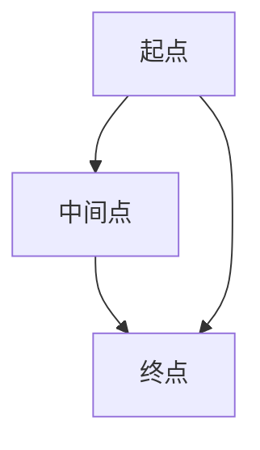
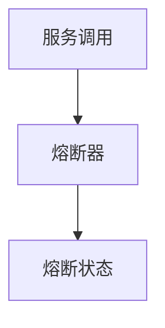
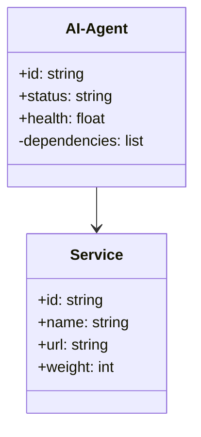
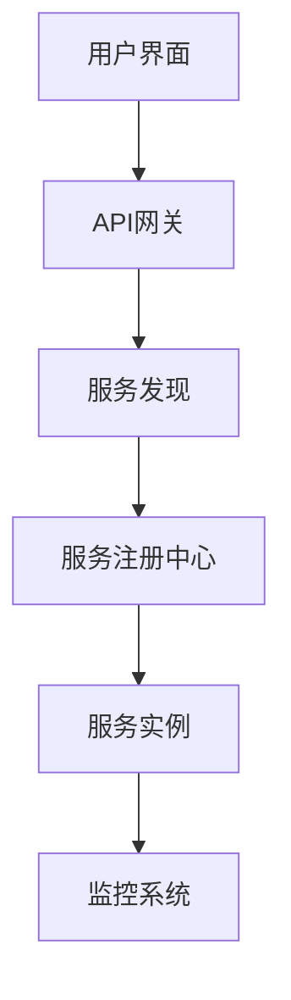

                 


# 企业AI Agent的微服务治理与监控策略

> **关键词**：微服务治理、AI Agent、服务发现、负载均衡、系统架构  
> **摘要**：随着企业智能化转型的加速，AI Agent（人工智能代理）在企业级应用中的地位日益重要。然而，AI Agent的复杂性和动态性给微服务治理与监控带来了新的挑战。本文从企业AI Agent的微服务治理与监控的核心概念出发，深入分析其算法原理、系统架构设计，并结合实际案例，为企业提供可落地的治理与监控策略。

---

## 第1章 企业AI Agent的微服务治理与监控概述

### 1.1 问题背景与挑战

#### 1.1.1 微服务架构在企业AI Agent中的应用背景
随着企业智能化转型的推进，AI Agent（人工智能代理）逐渐成为企业级应用的核心组件。AI Agent通过自动化决策和执行任务，能够显著提升企业的运营效率。然而，AI Agent的复杂性和动态性给微服务架构带来了新的挑战。企业AI Agent的微服务化是大势所趋，但如何实现高效的治理与监控，成为了亟待解决的问题。

#### 1.1.2 企业AI Agent微服务化的核心问题
在企业AI Agent的微服务化过程中，面临以下核心问题：
- **服务发现与注册**：AI Agent可能频繁启动或停止，如何快速发现并注册服务？
- **动态负载均衡**：AI Agent的任务量可能瞬时激增，如何保证服务的高可用性？
- **服务熔断与降级**：当某AI Agent节点出现故障时，如何快速熔断并降级任务？
- **实时监控与告警**：如何实时监控AI Agent的运行状态，并在异常时及时告警？

#### 1.1.3 微服务治理与监控的必要性
微服务治理与监控是确保企业AI Agent稳定运行的关键。通过治理，可以优化服务间的依赖关系；通过监控，可以实时掌握系统的健康状态。两者结合，能够显著提升系统的可靠性和用户体验。

### 1.2 企业AI Agent的定义与特点

#### 1.2.1 企业AI Agent的定义
企业AI Agent是一种能够理解上下文、执行复杂决策并采取行动的智能实体。它通过与企业系统的交互，帮助实现业务目标。

#### 1.2.2 企业AI Agent的核心特点
- **智能性**：基于AI算法，能够进行复杂决策。
- **自主性**：能够在没有人工干预的情况下执行任务。
- **协作性**：能够与其他AI Agent或系统协作完成任务。
- **动态性**：任务量和运行状态可能随时变化。

#### 1.2.3 企业AI Agent与传统AI代理的区别
| 属性         | 传统AI代理                 | 企业AI Agent               |
|--------------|---------------------------|-----------------------------|
| 应用场景     | 单点任务                   | 复杂的企业级应用             |
| 智能性       | 较低                       | 较高                         |
| 交互性       | 单向                       | 双向                         |
| 可扩展性     | 有限                       | 高                           |

### 1.3 微服务治理与监控的核心概念

#### 1.3.1 微服务治理的核心概念
- **服务发现**：动态发现可用服务的能力。
- **服务注册**：服务向注册中心上报自身的可用性信息。
- **负载均衡**：将请求均匀分配到多个服务实例上。
- **熔断与降级**：当服务出现异常时，暂时停止调用该服务，避免雪崩效应。

#### 1.3.2 企业AI Agent微服务治理的目标
- **提高可用性**：确保AI Agent服务的高可用性。
- **降低耦合度**：减少服务间的依赖耦合。
- **提升扩展性**：支持AI Agent的动态扩展。

#### 1.3.3 企业AI Agent微服务治理的边界与外延
- **边界**：仅关注AI Agent服务本身及其直接依赖的服务。
- **外延**：可能涉及企业内部的其他微服务系统。

### 1.4 企业AI Agent微服务治理与监控的价值

#### 1.4.1 提高系统可用性
通过服务熔断和负载均衡，可以避免单点故障，提高系统的整体可用性。

#### 1.4.2 降低运营成本
通过自动化监控和告警，可以减少人工干预，降低运维成本。

#### 1.4.3 提升用户体验
通过快速响应和动态调整，可以提升用户对系统的使用体验。

---

## 第2章 企业AI Agent的微服务治理原理

### 2.1 微服务治理的基本原理

#### 2.1.1 微服务治理的定义与目标
微服务治理是指对微服务架构中的各个服务进行规划、控制和协调的过程。其目标是确保服务的高效运行和系统的稳定性。

#### 2.1.2 微服务治理的关键原则
- **去中心化**：避免单点控制，实现去中心化的治理。
- **可观测性**：确保服务的状态可被监控和分析。
- **自适应性**：能够根据系统状态动态调整治理策略。

#### 2.1.3 微服务治理的实现机制
- **服务发现与注册**：通过注册中心实现服务的动态发现。
- **服务路由与负载均衡**：通过API网关实现请求的路由和负载分担。
- **服务熔断与降级**：通过熔断器实现服务的保护机制。

### 2.2 企业AI Agent的微服务治理框架

#### 2.2.1 服务发现与注册
- **服务发现**：通过注册中心（如Eureka）动态发现可用服务。
- **服务注册**：服务启动后向注册中心上报自身的可用性信息。

#### 2.2.2 服务路由与负载均衡
- **路由策略**：基于服务的健康状态动态调整路由。
- **负载均衡算法**：如轮询、随机、加权等。

#### 2.2.3 服务熔断与降级
- **熔断机制**：当服务调用失败率达到阈值时，熔断该服务。
- **降级机制**：当服务熔断后，将请求降级到备用服务或简化服务。

### 2.3 微服务治理的核心要素

#### 2.3.1 服务发现机制
- **服务发现算法**：如Dijks
- **服务注册中心**：如Eureka、Consul等。

#### 2.3.2 服务健康监测
- **健康检查**：定期检查服务的可用性。
- **健康指标**：如响应时间、错误率等。

#### 2.3.3 服务依赖管理
- **依赖注入**：通过容器（如Spring Cloud）管理服务依赖。
- **依赖关系图**：通过工具（如Graphviz）可视化服务依赖关系。

---

## 第3章 企业AI Agent的微服务治理与监控算法原理

### 3.1 服务发现算法

#### 3.1.1 基于Dijks的算法原理
Dijks算法是一种最短路径算法，常用于服务发现中的路由优化。其核心思想是通过不断松弛边来找到最短路径。

$$dijkstra算法的伪代码如下：$$



#### 3.1.2 负载均衡算法
负载均衡算法用于将请求均匀分配到多个服务实例上。常用算法包括轮询、随机、加权轮询等。

$$负载均衡的数学模型如下：$$

$$weight_i = \frac{weight_i}{\sum weight_j}$$

### 3.2 服务熔断与降级算法

#### 3.2.1 熔断算法
熔断算法用于检测服务的健康状态，并在服务出现故障时快速熔断。

$$熔断算法的伪代码如下：$$



#### 3.2.2 降级算法
降级算法用于在熔断期间，将请求降级到备用服务或简化服务。

$$降级算法的数学模型如下：$$

$$fallback\_probability = 1 - \frac{fault\_rate}{threshold}$$

---

## 第4章 企业AI Agent的微服务治理与监控系统架构设计

### 4.1 问题场景介绍

#### 4.1.1 系统需求
- 高可用性：确保AI Agent服务的稳定运行。
- 动态扩展：支持AI Agent的动态扩展。
- 实时监控：实时监控AI Agent的运行状态。

#### 4.1.2 项目介绍
本项目旨在设计一个企业AI Agent的微服务治理与监控系统，能够实现服务发现、负载均衡、熔断与降级等功能。

### 4.2 系统功能设计

#### 4.2.1 领域模型设计


#### 4.2.2 系统架构设计


### 4.3 系统接口设计

#### 4.3.1 服务发现接口
- **接口名称**：`discover-service`
- **接口描述**：根据服务名称发现可用服务实例。
- **请求参数**：`service-name`（字符串）
- **返回参数**：`list<service-instance>`（服务实例列表）

#### 4.3.2 服务注册接口
- **接口名称**：`register-service`
- **接口描述**：将服务实例注册到服务注册中心。
- **请求参数**：`service-instance`（服务实例对象）
- **返回参数**：`success`（布尔值）

---

## 第5章 企业AI Agent的微服务治理与监控项目实战

### 5.1 环境安装

#### 5.1.1 安装依赖
- **语言**：Python 3.8+
- **框架**：Spring Cloud、Eureka
- **工具**：Docker、Kubernetes

#### 5.1.2 安装步骤
1. 安装JDK：`sudo apt-get install openjdk-8-jdk`
2. 安装Maven：`sudo apt-get install maven`
3. 安装Docker：`sudo apt-get install docker.io`

### 5.2 系统核心实现源代码

#### 5.2.1 服务发现实现
```python
from discovery import ServiceDiscovery

# 初始化服务发现实例
discovery = ServiceDiscovery()

# 发现可用服务
services = discovery.discover_service("ai-agent")
```

#### 5.2.2 服务注册实现
```python
from registry import ServiceRegistry

# 初始化服务注册中心
registry = ServiceRegistry()

# 注册服务实例
registry.register_service("ai-agent", "127.0.0.1:8080")
```

#### 5.2.3 负载均衡实现
```python
from load_balancer import LoadBalancer

# 初始化负载均衡器
lb = LoadBalancer()

# 获取可用服务实例
instance = lb.select_instance(services)
```

### 5.3 代码解读与分析

#### 5.3.1 服务发现实现
- **代码功能**：通过服务名称发现可用服务实例。
- **关键点**：使用Dijks算法优化服务发现路径。

#### 5.3.2 服务注册实现
- **代码功能**：将服务实例注册到服务注册中心。
- **关键点**：支持动态服务注册与注销。

#### 5.3.3 负载均衡实现
- **代码功能**：根据负载均衡算法选择可用服务实例。
- **关键点**：支持多种负载均衡策略。

### 5.4 实际案例分析

#### 5.4.1 案例场景
假设企业AI Agent需要处理大量的自然语言处理任务，可以通过微服务治理与监控系统实现任务的动态分配和负载均衡。

#### 5.4.2 案例分析
- **问题描述**：某AI Agent节点因内存不足崩溃。
- **解决方案**：系统自动熔断该节点，并将任务降级到备用节点。

---

## 第6章 企业AI Agent的微服务治理与监控最佳实践

### 6.1 小结

- 本文从企业AI Agent的微服务治理与监控的核心概念出发，深入分析了其算法原理、系统架构设计，并结合实际案例，为企业提供可落地的治理与监控策略。

### 6.2 注意事项

- **服务发现的性能优化**：需要关注服务发现的延迟和资源消耗。
- **熔断与降级的策略优化**：需要根据业务需求动态调整熔断和降级策略。
- **监控系统的实时性**：需要确保监控数据的实时采集和快速响应。

### 6.3 未来的发展方向

- **智能化治理**：通过AI算法实现更加智能的治理策略。
- **边缘计算**：将微服务治理与边缘计算结合，实现更高效的资源管理。
- **自动化运维**：通过AIOps（AI for IT Operations）实现自动化运维。

### 6.4 拓展阅读

- **推荐书籍**：《微服务设计》、《Spring Cloud微服务实战》
- **推荐博客**：Spring Cloud官方博客、Kubernetes中文社区
- **推荐工具**：Docker、Kubernetes、Prometheus

---

通过本文的详细分析和实战指导，企业可以更好地理解和实现AI Agent的微服务治理与监控策略，为企业的智能化转型提供有力支持。

