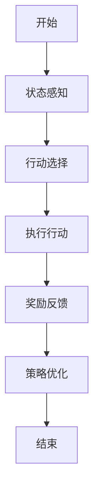
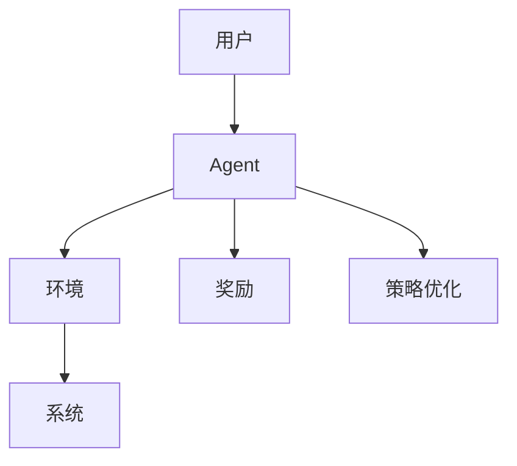
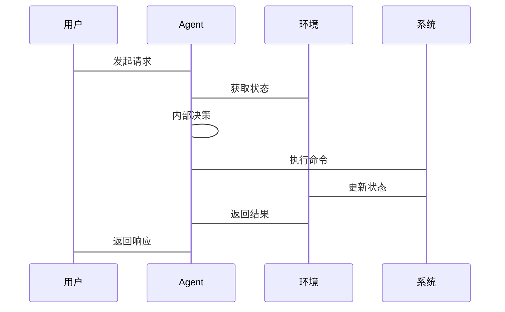

                 


# 企业AI Agent的快速适应框架：应对瞬息万变的市场环境

---

## 关键词：企业AI Agent、快速适应框架、市场环境、算法原理、系统架构、项目实战

---

## 摘要：  
在数字化转型的浪潮中，企业面临着前所未有的市场变化和竞争压力。为了快速响应市场变化，企业需要一种高效、灵活的AI Agent框架。本文将从背景介绍、核心概念、算法原理、系统架构、项目实战等多个维度，深入分析企业AI Agent的快速适应框架。通过强化学习算法、系统设计和实际案例，本文将为企业提供一套应对瞬息万变市场环境的解决方案。

---

# 第一部分: 企业AI Agent的背景与核心概念

---

## 第1章: 企业AI Agent的背景与问题背景

### 1.1 问题背景  
#### 1.1.1 数字化转型与企业竞争压力  
在数字经济时代，企业面临着日益激烈的市场竞争。数字化转型已成为企业生存和发展的必由之路。然而，传统的企业系统往往 rigid，难以快速适应市场变化。  

#### 1.1.2 市场环境的瞬息万变对企业的影响  
市场变化的速度不断加快，企业需要快速响应客户需求、技术革新和政策变化。然而，传统的企业系统在灵活性和适应性方面存在明显不足。  

#### 1.1.3 传统企业应对市场变化的挑战  
传统企业系统通常基于固定的流程和规则，难以快速调整。这种 rigidity 使得企业在面对市场变化时，往往需要进行大量的定制开发和人工干预，成本高且效率低。  

### 1.2 问题描述  
#### 1.2.1 企业对快速响应能力的需求  
企业在面对市场变化时，需要快速调整业务流程、优化资源配置，并实时响应客户需求。  

#### 1.2.2 传统系统在灵活性和适应性上的不足  
传统系统通常基于固定的规则和流程，难以快速适应市场变化。企业需要一种更加灵活、智能的系统架构，以应对快速变化的市场环境。  

#### 1.2.3 市场变化对企业AI Agent的需求  
企业需要一种能够自主学习、快速适应市场变化的AI Agent，以实现业务的智能化和自动化。  

### 1.3 问题解决与边界  
#### 1.3.1 AI Agent在企业中的应用价值  
AI Agent可以通过自主学习和决策，帮助企业快速响应市场变化，优化业务流程，并提高整体效率。  

#### 1.3.2 企业AI Agent的边界与外延  
企业AI Agent的边界包括企业的核心业务流程、数据源和外部接口。外延则包括与第三方系统、客户和供应商的交互。  

#### 1.3.3 企业AI Agent的核心要素与组成  
企业AI Agent的核心要素包括：感知能力、决策能力、执行能力和学习能力。  

---

## 第2章: 企业AI Agent的核心概念与联系  

### 2.1 核心概念原理  
#### 2.1.1 AI Agent的基本原理  
AI Agent是一种能够感知环境、自主决策并执行任务的智能体。它通过与环境交互，不断优化自身的行为，以实现目标。  

#### 2.1.2 企业AI Agent的特殊性与复杂性  
企业AI Agent需要处理复杂的业务逻辑和多变的市场环境，同时需要与企业现有系统无缝集成。  

#### 2.1.3 AI Agent与传统企业系统的区别  
传统企业系统基于固定的规则和流程，而AI Agent能够自主学习和适应，具有更强的灵活性和适应性。  

### 2.2 核心概念的属性特征对比  
#### 2.2.1 表格对比：AI Agent与传统系统的属性对比  

| 属性         | 传统企业系统       | AI Agent       |  
|--------------|-------------------|----------------|  
| 灵活性       | 低                | 高             |  
| 学习能力     | 无                | 有             |  
| 决策能力     | 基于规则          | 基于数据       |  
| 适应性       | 低                | 高             |  

#### 2.2.2 关键属性的详细说明  
- **感知能力**：AI Agent能够感知环境中的变化，并根据变化调整自身行为。  
- **决策能力**：AI Agent能够基于数据和模型做出决策，而非基于固定的规则。  
- **学习能力**：AI Agent能够通过机器学习算法不断优化自身的模型和策略。  

### 2.3 ER实体关系图  
#### 2.3.1 企业AI Agent的实体关系图  

```mermaid
er
actor: 用户
agent: AI Agent
environment: 市场环境
system: 企业系统
interaction: 交互
goal: 目标

actor --> interaction
agent --> interaction
environment --> interaction
system --> interaction
interaction --> goal
```

---

# 第二部分: 企业AI Agent的算法原理  

---

## 第3章: 企业AI Agent的算法原理  

### 3.1 算法原理概述  
#### 3.1.1 基于强化学习的适应性算法  
强化学习是一种通过试错机制优化决策的算法。AI Agent通过与环境交互，不断优化自身的策略，以最大化奖励。  

#### 3.1.2 算法的核心思想与实现步骤  
- **核心思想**：通过试错和奖励机制，优化决策策略。  
- **实现步骤**：  
  1. 状态感知：AI Agent感知当前状态。  
  2. 行动选择：基于当前状态选择最优行动。  
  3. 执行行动：执行选择的行动并观察结果。  
  4. 奖励反馈：根据结果获得奖励或惩罚。  
  5. 策略优化：根据奖励反馈优化策略。  

### 3.2 算法流程图  
#### 3.2.1 强化学习算法流程图  



### 3.3 算法实现代码  
#### 3.3.1 Python实现的强化学习算法示例  

```python
class Agent:
    def __init__(self, state_space, action_space):
        self.state_space = state_space
        self.action_space = action_space
        # 初始化策略网络
        self.policy = PolicyNetwork(state_space, action_space)
        
    def take_action(self, state):
        # 使用策略网络选择动作
        action_probs = self.policy.predict(state)
        action = np.random.choice(self.action_space, p=action_probs)
        return action
    
    def update_policy(self, rewards):
        # 更新策略网络
        self.policy.update(rewards)
```

---

## 第4章: 企业AI Agent的系统架构设计  

### 4.1 系统架构设计  
#### 4.1.1 领域模型类图  

```mermaid
classDiagram
    class Agent:
        + state_space: StateSpace
        + action_space: ActionSpace
        + policy: PolicyNetwork
        + reward_function: RewardFunction
        -epsilon: float
        -gamma: float
        
    class PolicyNetwork:
        + input_dim: int
        + output_dim: int
        + model: Sequential
        
    class RewardFunction:
        + calculate_reward(state, action, next_state): float
        
    Agent <|-- PolicyNetwork
    Agent <|-- RewardFunction
```

#### 4.1.2 系统架构设计图  



#### 4.1.3 系统接口设计  
- **输入接口**：接收用户请求、环境状态。  
- **输出接口**：输出决策结果、执行命令。  

### 4.2 接口设计与交互  
#### 4.2.1 系统交互序列图  



---

# 第三部分: 企业AI Agent的项目实战  

---

## 第5章: 企业AI Agent的项目实战  

### 5.1 项目介绍  
#### 5.1.1 项目背景  
本项目旨在开发一个能够快速适应市场变化的企业AI Agent，帮助企业优化业务流程。  

#### 5.1.2 核心功能  
- **市场监测**：实时监测市场变化。  
- **决策优化**：基于强化学习优化决策。  
- **执行命令**：根据决策执行相应操作。  

### 5.2 核心代码实现  
#### 5.2.1 环境状态感知代码  

```python
class Environment:
    def __init__(self):
        self.state = self.get_initial_state()
        
    def get_initial_state(self):
        # 初始化环境状态
        return {'market': 'stable', 'demand': 100}
```

#### 5.2.2 强化学习算法代码  

```python
class PolicyNetwork:
    def __init__(self, input_dim, output_dim):
        self.model = Sequential([
            Dense(32, activation='relu', input_dim=input_dim),
            Dense(output_dim, activation='softmax')
        ])
        self.model.compile(optimizer='adam', loss='sparse_categorical_crossentropy')
        
    def predict(self, state):
        return self.model.predict(state)
        
    def update(self, rewards):
        # 更新策略网络参数
        self.model.fit(X, y, epochs=1, batch_size=32)
```

---

## 第6章: 总结与展望  

### 6.1 最佳实践  
- 定期更新AI Agent的模型和策略。  
- 与企业现有系统无缝集成。  
- 定期监控和优化AI Agent的性能。  

### 6.2 本章小结  
企业AI Agent的快速适应框架是一种能够帮助企业快速响应市场变化的智能化解决方案。通过强化学习算法和系统架构设计，企业可以实现业务流程的自动化和优化。  

### 6.3 注意事项  
- 确保数据质量和隐私安全。  
- 定期监控和优化AI Agent的性能。  
- 建立完善的异常处理机制。  

### 6.4 拓展阅读  
- 探索更高级的强化学习算法。  
- 研究多智能体协作的AI Agent架构。  
- 探讨AI Agent在更多领域的应用。  

---

通过以上内容，企业可以构建一个快速适应市场变化的AI Agent框架，从而在激烈的市场竞争中占据优势。

