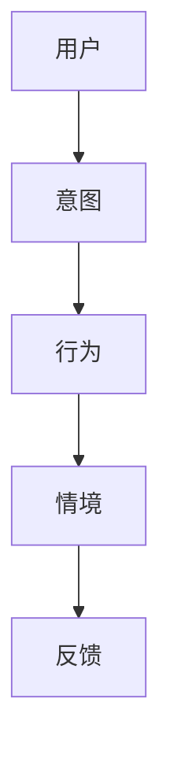

                 

# 企业AI Agent的情境感知能力：提升用户体验

## 关键词：情境感知、AI Agent、用户体验、算法原理、系统设计

## 摘要：  
本文探讨企业AI Agent如何通过情境感知能力提升用户体验。通过分析情境感知的核心概念、算法原理和系统设计，结合实际案例，详细阐述如何通过数据输入、模型训练和系统优化，使AI Agent更好地理解用户需求，从而提升用户体验。

---

## 目录大纲

### 第一部分：情境感知能力的背景与问题背景

#### 第1章：情境感知能力的背景与问题背景

- **1.1 问题背景**
  - 企业AI Agent的发展现状
  - 情境感知能力的定义与重要性
  - 情境感知能力与其他相关概念的对比

- **1.2 情境感知能力的核心概念**
  - 情境感知能力的定义
  - 情境感知能力的属性与特征
  - 情境感知能力与用户体验的关系

- **1.3 情境感知能力的边界与外延**
  - 情境感知能力的边界
  - 情境感知能力的外延
  - 情境感知能力与其他相关概念的对比

- **1.4 情境感知能力的核心要素组成**
  - 数据输入与处理
  - 意图识别与推理
  - 行为决策与反馈

---

### 第二部分：情境感知能力的核心概念与联系

#### 第2章：情境感知能力的核心概念原理

- **2.1 感知模型与知识表示**
  - 感知模型的定义与分类
  - 知识表示的多样性
  - 感知模型与知识表示的关系

- **2.2 意图推理与行为预测**
  - 意图推理的定义与方法
  - 行为预测的模型与算法
  - 意图推理与行为预测的结合

- **2.3 情境感知能力的特征对比**
  - 基于表格的核心概念属性特征对比
  - 情境感知能力的ER实体关系图

---

### 第三部分：情境感知能力的算法原理

#### 第3章：情境感知模型的算法原理

- **3.1 感知模型的训练与优化**
  - 感知模型的训练过程
  - 感知模型的优化方法
  - 感知模型的评估指标

- **3.2 意图识别与推理算法**
  - 意图识别的算法原理
  - 意图推理的算法实现
  - 意图识别与推理的对比分析

- **3.3 行为预测与决策算法**
  - 行为预测的算法原理
  - 行为决策的算法实现
  - 行为预测与决策的结合

---

### 第四部分：系统分析与架构设计

#### 第4章：系统分析与架构设计

- **4.1 问题场景介绍**
  - 系统功能设计
  - 系统架构设计
  - 系统接口设计

- **4.2 系统功能设计**
  - 领域模型的Mermaid类图
  - 系统架构的Mermaid架构图
  - 系统交互的Mermaid序列图

---

### 第五部分：项目实战

#### 第5章：项目实战

- **5.1 环境安装**
  - 必要的工具与库
  - 环境配置步骤

- **5.2 系统核心实现**
  - 核心功能的代码实现
  - 关键算法的代码解读

- **5.3 代码应用解读与分析**
  - 代码实现的具体功能
  - 代码实现的优化建议

- **5.4 实际案例分析**
  - 案例背景介绍
  - 案例分析与解决方案
  - 案例总结与经验分享

- **5.5 项目小结**
  - 项目实现的关键点
  - 项目实现的经验总结
  - 项目实现的未来改进方向

---

### 第六部分：最佳实践与小结

#### 第6章：最佳实践

- **6.1 总结全书内容**
  - 情境感知能力的核心概念
  - 算法原理与系统设计
  - 项目实战与最佳实践

- **6.2 注意事项**
  - 系统设计中的常见问题
  - 项目实施中的注意事项
  - 用户体验优化的关键点

- **6.3 拓展阅读**
  - 相关领域的最新进展
  - 进一步学习的资源推荐
  - 未来研究方向的展望

---

## 附录

- 附录A：相关术语解释
- 附录B：工具与库的详细安装说明
- 附录C：算法实现的代码示例

---

通过以上目录大纲，可以系统地探讨企业AI Agent的情境感知能力，从理论到实践，帮助读者全面理解和提升用户体验。

