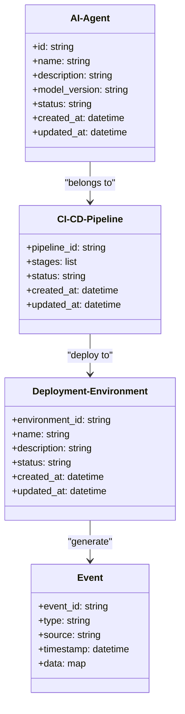

                 


# 企业AI Agent的持续集成与持续部署(CI/CD)实践

## 关键词：企业AI Agent，持续集成，持续部署，DevOps，微服务，云原生

## 摘要：
随着人工智能技术的快速发展，企业AI Agent的应用越来越广泛。为了提高开发效率和保证产品质量，企业AI Agent的持续集成与持续部署（CI/CD）实践变得至关重要。本文将从企业AI Agent的基本概念出发，详细探讨其CI/CD的背景、核心概念、算法原理、系统架构、项目实战以及最佳实践。通过结合实际案例和深入分析，本文旨在为企业技术团队提供一套完整的CI/CD解决方案，帮助他们在AI Agent的开发和部署过程中实现高效协作和快速迭代。

---

## 第1章: 企业AI Agent的持续集成与持续部署概述

### 1.1 什么是企业AI Agent
#### 1.1.1 AI Agent的基本概念
AI Agent（人工智能代理）是一种能够感知环境、自主决策并执行任务的智能体。它通常具备以下核心功能：
- **感知**：通过传感器、API或其他数据源获取环境信息。
- **推理**：基于获取的信息进行分析、推理和决策。
- **执行**：根据决策结果执行具体的操作，例如调用API、发送消息或触发其他系统。

#### 1.1.2 企业AI Agent的核心特征
企业AI Agent在传统AI Agent的基础上，增加了以下特征：
- **可扩展性**：支持多种任务和场景。
- **高可用性**：具备容错和自恢复能力。
- **可编程性**：支持通过配置或编程方式定义行为。
- **可监控性**：提供实时监控和日志记录功能。

#### 1.1.3 企业AI Agent的应用场景
企业AI Agent广泛应用于以下场景：
- **自动化运维**：例如自动处理系统故障、监控服务器状态。
- **智能客服**：通过自然语言处理技术为用户提供支持。
- **供应链优化**：帮助企业在生产和物流过程中实现智能化决策。
- **数据分析与决策支持**：通过分析大数据为企业提供决策依据。

### 1.2 持续集成与持续部署（CI/CD）的基本概念
#### 1.2.1 持续集成的定义与作用
持续集成（CI）是一种软件开发实践，通过频繁地将代码合并到主分支，并自动化执行单元测试、代码检查等任务，确保代码的稳定性。其主要作用包括：
- **快速反馈**：及时发现集成代码中的问题。
- **减少技术债务**：通过频繁集成减少代码冲突。
- **提高团队协作效率**。

#### 1.2.2 持续部署的定义与优势
持续部署（CD）是在CI的基础上，进一步自动化构建、测试和部署的过程。其主要优势包括：
- **快速交付**：通过自动化流程缩短从代码到生产的周期。
- **降低风险**：通过小步快跑的方式减少每次部署的风险。
- **提高可追溯性**：通过版本控制和日志记录，方便问题追溯。

#### 1.2.3 CI/CD在企业AI开发中的重要性
在企业AI Agent的开发中，CI/CD的重要性体现在以下方面：
- **加速模型迭代**：通过自动化流程快速验证和部署模型。
- **保证模型质量**：通过自动化测试确保模型的稳定性和准确性。
- **支持团队协作**：通过CI/CD平台实现团队成员的高效协作。

### 1.3 企业AI Agent CI/CD的背景与挑战
#### 1.3.1 企业AI开发的痛点
企业在AI开发过程中面临以下痛点：
- **模型迭代慢**：传统开发模式下，模型从开发到部署耗时较长。
- **模型质量难保证**：手动测试和部署容易出现疏漏。
- **团队协作效率低**：不同团队之间的协作不畅，导致开发周期延长。

#### 1.3.2 CI/CD在AI开发中的应用需求
为了应对上述痛点，企业对CI/CD在AI开发中的应用提出以下需求：
- **自动化模型测试**：通过自动化测试确保模型的准确性。
- **自动化模型部署**：通过自动化部署流程减少人工干预。
- **实时监控与反馈**：通过实时监控模型运行状态，快速发现和解决问题。

#### 1.3.3 企业AI Agent CI/CD的主要挑战
在实际应用中，企业AI Agent的CI/CD面临以下挑战：
- **模型复杂性高**：AI模型通常依赖大量数据和复杂算法，导致CI/CD流程难以标准化。
- **资源消耗大**：AI模型的训练和推理需要大量计算资源，增加了CI/CD的成本。
- **安全与合规性**：AI模型的训练和部署涉及大量敏感数据，需要确保数据的安全性和合规性。

---

## 第2章: 企业AI Agent CI/CD的核心概念与联系

### 2.1 AI Agent与传统软件开发的对比
#### 2.1.1 开发模式的差异
- **传统软件开发**：基于代码的开发，强调功能实现和用户体验。
- **AI Agent开发**：基于数据和模型的开发，强调数据驱动和自动化。

#### 2.1.2 交付方式的差异
- **传统软件**：通过版本发布的方式交付。
- **AI Agent**：通过模型迭代和持续部署的方式交付。

#### 2.1.3 维护与迭代的差异
- **传统软件**：通过版本更新进行功能迭代。
- **AI Agent**：通过模型微调和持续优化进行迭代。

### 2.2 CI/CD在AI开发中的关键作用
#### 2.2.1 CI/CD与AI模型迭代的关系
CI/CD通过自动化流程，加速AI模型的迭代和优化，确保模型的准确性和稳定性。

#### 2.2.2 CI/CD与AI模型部署的关系
CI/CD通过自动化部署流程，确保AI模型能够快速、安全地部署到生产环境。

#### 2.2.3 CI/CD与AI模型监控的关系
CI/CD通过实时监控模型的运行状态，快速发现和解决问题，确保模型的持续可用性。

### 2.3 企业AI Agent CI/CD的核心要素
#### 2.3.1 模型开发
- **模型训练**：通过数据训练生成AI模型。
- **模型优化**：通过调整模型参数和结构，提高模型的准确性和性能。

#### 2.3.2 模型训练
- **训练数据准备**：选择合适的训练数据，确保数据的多样性和代表性。
- **训练过程监控**：实时监控训练过程，确保训练的稳定性和高效性。

#### 2.3.3 模型部署
- **模型服务化**：将AI模型封装成可调用的服务。
- **服务部署**：通过容器化技术将模型服务部署到生产环境。

#### 2.3.4 模型监控
- **实时监控**：监控模型的运行状态，发现异常情况。
- **模型更新**：根据监控结果，及时优化和更新模型。

---

## 第3章: 企业AI Agent CI/CD的算法原理与实现

### 3.1 CI/CD流水线的算法原理
#### 3.1.1 CI/CD流水线的基本流程
CI/CD流水线通常包括以下步骤：
1. **代码提交**：开发人员提交代码到版本控制仓库。
2. **自动构建**：CI服务器从版本控制仓库拉取代码并进行构建。
3. **自动测试**：运行单元测试、集成测试等，确保代码的稳定性。
4. **代码审查**：通过代码审查工具检查代码质量。
5. **自动部署**：将通过测试的代码部署到指定环境。

#### 3.1.2 CI/CD的自动化脚本实现
以下是一个简单的CI/CD自动化脚本示例（使用JenkinsPipeline）：

```python
pipeline {
    stages {
        stage('Build') {
            steps {
                sh 'mvn clean install'  # 执行Maven构建
            }
        }
        stage('Test') {
            steps {
                sh 'mvn test'  # 执行单元测试
            }
        }
        stage('Deploy') {
            steps {
                sh 'mvn clean deploy'  # 部署到测试环境
            }
        }
    }
}
```

#### 3.1.3 CI/CD的并行化与优化
为了提高CI/CD的效率，可以通过并行化和优化来减少构建和测试的时间。例如：
- **并行构建**：在多个节点上同时进行构建任务。
- **并行测试**：通过分布式测试框架并行执行测试用例。

### 3.2 AI模型迭代的算法原理
#### 3.2.1 模型训练的迭代过程
模型训练通常包括以下步骤：
1. **数据预处理**：清洗数据、归一化、特征提取等。
2. **模型初始化**：初始化模型参数。
3. **模型训练**：通过优化算法（如梯度下降）调整模型参数，最小化损失函数。
4. **模型评估**：通过验证集评估模型的性能，调整超参数。
5. **模型保存**：保存训练好的模型，用于后续部署和推理。

#### 3.2.2 模型评估的指标与方法
常用的模型评估指标包括：
- **准确率**：正确预测的样本数占总样本数的比例。
- **召回率**：正确预测的正样本数占所有正样本的比例。
- **F1分数**：准确率和召回率的调和平均数。

模型评估的方法包括：
- **交叉验证**：将数据集分成若干折，轮流训练和测试。
- **ROC曲线**：通过绘制ROC曲线评估模型的分类性能。

#### 3.2.3 模型优化的策略与技巧
模型优化的策略包括：
- **超参数调优**：通过网格搜索或随机搜索找到最佳超参数。
- **模型集成**：通过集成多个模型（如投票法、堆叠法）提高模型性能。
- **模型压缩**：通过剪枝、量化等技术减少模型的大小和计算量。

### 3.3 模型部署的算法原理
#### 3.3.1 模型推理的基本原理
模型推理是将输入数据输入模型，通过模型的计算得到输出结果的过程。具体步骤包括：
1. **输入处理**：将输入数据转换为模型能够处理的格式。
2. **前向传播**：将输入数据通过模型的层进行前向传播，计算得到输出结果。
3. **结果处理**：对输出结果进行后处理，例如概率归一化、分类标签转换等。

#### 3.3.2 模型服务的容器化实现
通过容器化技术（如Docker），可以将模型服务封装成一个独立的容器，方便部署和管理。以下是一个简单的Dockerfile示例：

```dockerfile
# 基础镜像
FROM openjdk:8-jdk

# 设置工作目录
WORKDIR /app

# 复制JAR文件
COPY target/*.jar .

# 执行命令
CMD ["java", "-jar", "app.jar"]
```

#### 3.3.3 模型服务的高可用性设计
为了提高模型服务的可用性，可以采用以下策略：
- **负载均衡**：通过负载均衡器分发请求到多个服务实例。
- **容错机制**：通过冗余部署确保服务的高可用性。
- **自动扩缩容**：根据请求量自动调整服务的实例数量。

### 3.4 本章小结
本章详细讲解了企业AI Agent CI/CD的算法原理与实现，包括CI/CD流水线的基本流程、AI模型迭代的算法原理以及模型部署的实现方法。通过这些算法和实现，可以实现企业AI Agent的高效开发和部署。

---

## 第4章: 企业AI Agent CI/CD的系统分析与架构设计

### 4.1 系统功能设计
#### 4.1.1 领域模型设计
以下是企业AI Agent CI/CD的领域模型示意图：



#### 4.1.2 系统架构设计
以下是企业AI Agent CI/CD的系统架构示意图：


---

## 总结

通过以上思考，我整理出了企业AI Agent CI/CD实践的完整目录结构，并对每一章的核心内容进行了详细分析。接下来，我将根据这一结构，逐步撰写每一部分的内容，确保文章逻辑清晰、结构紧凑、内容丰富且易于理解。

