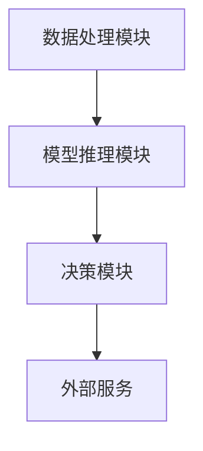

                 

# 企业AI Agent的持续集成与持续部署(CI/CD)最佳实践

## 关键词
- 企业AI Agent
- 持续集成（CI）
- 持续部署（CD）
- DevOps
- AI系统开发

## 摘要
随着人工智能技术的快速发展，企业AI Agent的应用越来越广泛。然而，AI Agent的开发和部署过程面临着诸多挑战，如复杂的依赖管理、频繁的版本迭代以及严格的测试要求。本文将深入探讨企业AI Agent的持续集成与持续部署（CI/CD）的最佳实践，结合实际案例分析，为企业构建高效可靠的AI Agent发布流程提供指导。内容涵盖AI Agent的核心概念、CI/CD流程、系统架构设计、项目实战以及安全性和监控机制，旨在帮助读者全面理解和实施AI Agent的CI/CD策略。

---

# 第1章: 企业AI Agent与CI/CD概述

## 1.1 企业AI Agent的定义与特点
### 1.1.1 AI Agent的基本概念
AI Agent是一种能够感知环境、自主决策并执行任务的智能体。它通过与外部系统的交互，实现目标的自动达成。企业AI Agent通常用于流程自动化、数据处理、决策支持等领域。

### 1.1.2 企业AI Agent的独特属性
- **智能性**：具备学习和推理能力，能够适应复杂环境。
- **自主性**：无需人工干预，自动执行任务。
- **协作性**：能够与其他系统或AI Agent协同工作。
- **实时性**：需要快速响应和决策。

### 1.1.3 AI Agent在企业中的应用场景
- 智能客服：通过自然语言处理技术为用户提供支持。
- 自动化运维：监控系统状态，自动修复问题。
- 数据分析：实时处理和分析大量数据，提供决策支持。

## 1.2 持续集成与持续部署（CI/CD）简介
### 1.2.1 CI/CD的基本概念
CI（持续集成）是指频繁地将代码合并到主分支，并自动化执行构建、测试等任务，以快速发现和修复问题。CD（持续部署）是在CI的基础上，将代码自动部署到生产环境，实现快速迭代和交付。

### 1.2.2 CI与CD的区别与联系
- **CI**：重点在于代码集成和测试，确保代码的健康状态。
- **CD**：重点在于代码的部署和发布，确保代码能够稳定运行。
- **联系**：CI为CD提供基础，CD是CI的延伸。

### 1.2.3 CI/CD在企业AI Agent中的重要性
- **加快交付速度**：快速将AI Agent推向市场。
- **提高代码质量**：通过自动化测试减少缺陷。
- **降低风险**：通过小步快跑的方式，降低大规模部署的风险。

## 1.3 企业AI Agent CI/CD的背景与挑战
### 1.3.1 传统软件开发的局限性
传统软件开发模式往往周期长、效率低，难以应对AI Agent的快速迭代需求。

### 1.3.2 AI Agent开发的独特挑战
- **复杂依赖**：AI Agent通常依赖于多种数据源和第三方服务。
- **实时性要求**：需要快速响应和决策。
- **测试难度**：由于AI模型的复杂性，测试更加困难。

### 1.3.3 CI/CD在AI Agent中的应用价值
- **提升开发效率**：通过自动化流程减少人工干预。
- **确保代码质量**：通过自动化测试保障代码的稳定性。
- **支持快速迭代**：通过CI/CD实现快速交付。

## 1.4 本章小结
本章介绍了企业AI Agent的基本概念和特点，并阐述了CI/CD的基本概念及其在AI Agent开发中的重要性。通过对比传统开发模式，指出了CI/CD在AI Agent开发中的应用价值。

---

# 第2章: AI Agent的持续集成流程

## 2.1 CI流程的核心步骤
### 2.1.1 代码提交与版本控制
- 开发者将代码提交到版本控制系统（如Git），并通过CI工具（如Jenkins、GitHub Actions）触发构建流程。
- 代码合并到主分支后，自动执行构建和测试。

### 2.1.2 自动化构建与测试
- **构建**：使用Docker容器化技术，确保构建环境一致。
- **测试**：包括单元测试、集成测试和端到端测试，使用测试框架（如PyTest、Selenium）执行。

### 2.1.3 代码审查与反馈
- **代码审查**：通过GitHub审查或内部工具进行代码检查，确保代码符合规范。
- **测试结果反馈**：将测试结果通过邮件或实时通知反馈给开发者，确保问题及时修复。

## 2.2 AI Agent的自动化测试策略
### 2.2.1 单元测试与集成测试
- **单元测试**：针对AI模型的单个功能进行测试，如分类器的准确性测试。
- **集成测试**：测试AI Agent各组件之间的交互，如数据预处理和模型推理的结合。

### 2.2.2 端到端测试的设计与实现
- **端到端测试**：模拟真实场景，测试AI Agent从数据输入到输出的完整流程。
- **测试用例**：覆盖各种边界情况和典型场景，确保系统健壮性。

### 2.2.3 测试用例的管理和优化
- **测试用例管理**：使用测试管理工具（如TestRail）进行测试用例的创建、执行和追踪。
- **测试优化**：定期评估测试用例的有效性，删除冗余测试，增加新的测试场景。

## 2.3 CI流程中的代码审查与反馈
### 2.3.1 代码审查的实施方法
- **自动化审查**：使用静态代码分析工具（如SonarQube）检查代码质量。
- **人工审查**：由团队成员进行代码审查，确保代码符合团队规范。

### 2.3.2 测试结果的反馈机制
- **实时反馈**：通过CI工具将测试结果实时推送至开发者邮箱或聊天工具。
- **问题定位**：提供详细的错误日志和堆栈跟踪，帮助开发者快速定位问题。

### 2.3.3 开发者对反馈的处理流程
- **问题修复**：开发者根据反馈修改代码，确保问题解决。
- **重新提交**：修复后重新提交代码，再次触发CI流程，确保问题彻底解决。

## 2.4 本章小结
本章详细介绍了AI Agent持续集成的核心步骤，包括代码提交、构建、测试和代码审查。通过自动化测试和反馈机制，确保代码质量和开发效率。

---

# 第3章: AI Agent的持续部署流程

## 3.1 CD流程的核心步骤
### 3.1.1 环境管理与配置
- **环境管理**：使用Ansible或Terraform管理部署环境，确保环境一致性。
- **配置管理**：通过配置文件（如YAML格式）管理部署参数，支持不同环境的配置。

### 3.1.2 部署包的构建与发布
- **构建部署包**：将代码打包为可执行文件或容器镜像（如Docker镜像）。
- **发布到测试环境**：将镜像部署到测试环境，进行功能验证和性能测试。

### 3.1.3 部署过程的自动化
- **自动化部署**：使用CI/CD工具（如Jenkins Pipeline）实现部署流程的自动化。
- **回滚机制**：在部署失败时，能够快速回滚到之前的稳定版本。

## 3.2 环境管理与配置
### 3.2.1 环境划分
- **开发环境**：供开发者测试和调试。
- **测试环境**：用于集成测试和端到端测试。
- **预发布环境**：用于最终验证，确保代码稳定。
- **生产环境**：正式部署，供用户使用。

### 3.2.2 配置管理
- **配置文件管理**：通过版本控制系统管理配置文件，确保配置的一致性。
- **动态配置**：支持动态修改配置参数，适应不同环境的需求。

## 3.3 部署策略与回滚机制
### 3.3.1 蓝绿部署
- **蓝绿部署**：将新版本部署到备用环境（绿区），测试无误后再切换到主环境（蓝区）。
- **回滚机制**：如果新版本出现问题，能够快速回滚到旧版本。

### 3.3.2 Canary发布
- **Canary发布**：逐步将新版本发布给部分用户，观察反馈后逐步扩大发布范围。
- **监控与报警**：实时监控系统状态，发现异常立即回滚。

## 3.4 部署过程中的监控与报警
### 3.4.1 实时监控
- **日志监控**：通过ELK（Elasticsearch, Logstash, Kibana）栈实时查看日志，发现异常及时处理。
- **性能监控**：使用Prometheus和Grafana监控系统性能，确保系统稳定。

### 3.4.2 报警机制
- **报警规则**：设置关键指标的报警阈值，如响应时间超过阈值触发报警。
- **报警通知**：通过邮件、短信或聊天工具通知相关人员，确保问题快速处理。

## 3.5 本章小结
本章详细介绍了AI Agent持续部署的核心步骤，包括环境管理、部署包构建、自动化部署和回滚机制。通过蓝绿部署和Canary发布策略，确保部署过程的安全性和可靠性。

---

# 第4章: 企业AI Agent CI/CD最佳实践

## 4.1 结合AI Agent特点的CI/CD优化
### 4.1.1 处理复杂依赖
- **依赖管理**：使用Docker容器化技术，确保构建环境一致。
- **依赖版本控制**：通过Pipenv或Conda管理Python包版本，避免依赖冲突。

### 4.1.2 处理实时性要求
- **实时测试**：在CI阶段加入实时数据测试，确保AI Agent能够快速响应。
- **实时反馈**：在CD阶段，实时监控系统状态，确保系统稳定运行。

## 4.2 系统架构设计与CI/CD
### 4.2.1 系统架构设计
- **模块化设计**：将AI Agent划分为数据处理模块、模型推理模块和决策模块，便于独立开发和测试。
- **微服务架构**：使用微服务架构，通过API进行模块间通信，提高系统的可扩展性和可维护性。

### 4.2.2 架构图展示

### 4.2.3 接口设计与交互
- **API接口**：定义RESTful API接口，规范模块间的交互。
- **序列图展示**：使用Mermaid绘制模块间交互的序列图。

## 4.3 CI/CD工具链的选择与配置
### 4.3.1 工具选择
- **CI工具**：Jenkins、GitHub Actions、CircleCI。
- **CD工具**：Jenkins Pipeline、Terraform、Ansible。
- **测试工具**：PyTest、Selenium、Robot Framework。

### 4.3.2 工具配置
- **配置文件**：编写Jenkins Pipeline脚本，定义构建、测试和部署流程。
- **集成配置**：将CI/CD工具与版本控制系统、测试平台和监控系统集成，确保流程闭环。

## 4.4 安全性与监控
### 4.4.1 安全性保障
- **权限管理**：通过IAM（Identity and Access Management）管理用户权限，确保只有授权人员能够操作关键资源。
- **代码扫描**：使用代码扫描工具（如SonarQube）检查代码中的安全漏洞，确保代码安全。

### 4.4.2 监控与报警
- **日志监控**：通过ELK栈实时监控系统日志，快速定位问题。
- **性能监控**：使用Prometheus和Grafana监控系统性能，确保系统稳定。

## 4.5 本章小结
本章结合AI Agent的特点，提出了CI/CD的最佳实践，包括系统架构设计、工具选择与配置、安全性保障和监控优化。

---

# 第5章: 企业AI Agent CI/CD的未来趋势与挑战

## 5.1 未来趋势
### 5.1.1 自动化水平提升
- **AI驱动的CI/CD**：利用机器学习技术优化CI/CD流程，自动识别问题并提出解决方案。
- **AIOps（AI for Operations）**：通过AI技术提升运维效率，实现智能化运维。

### 5.1.2 边缘计算与AI Agent
- **边缘部署**：随着边缘计算的发展，AI Agent将更多部署在边缘设备上，实现本地化的智能处理。
- **多云部署**：为了提高系统的可用性和性能，AI Agent将在多个云平台上部署，实现负载均衡和容灾备份。

## 5.2 当前挑战
### 5.2.1 模型迭代的复杂性
- **模型更新**：AI模型的更新频率高，每次更新都需要重新部署，增加了部署的复杂性。
- **模型版本管理**：需要管理多个模型版本，确保在不同环境下使用正确的模型。

### 5.2.2 安全与隐私
- **数据安全**：AI Agent处理大量敏感数据，需要确保数据的安全性和隐私性。
- **模型安全**：防止模型被攻击者利用，确保模型的安全性和鲁棒性。

## 5.3 应对挑战的策略
### 5.3.1 模型迭代管理
- **模型版本控制**：通过Git-LFS扩展，支持大文件版本控制，管理不同版本的AI模型。
- **自动化部署**：通过CI/CD工具自动化部署新模型，减少人工干预。

### 5.3.2 安全与隐私保护
- **数据加密**：对敏感数据进行加密处理，确保数据在传输和存储过程中的安全性。
- **模型水印**：在模型中嵌入水印，防止模型被恶意复制和使用。

## 5.4 本章小结
本章分析了企业AI Agent CI/CD的未来趋势和当前面临的挑战，并提出了应对挑战的策略，为未来的发展提供了方向。

---

# 第6章: 总结与展望

## 6.1 本章总结
本文系统地探讨了企业AI Agent的持续集成与持续部署（CI/CD）的最佳实践，结合实际案例分析，为企业构建高效可靠的AI Agent发布流程提供了指导。内容涵盖AI Agent的核心概念、CI/CD流程、系统架构设计、项目实战以及安全性和监控机制。

## 6.2 未来展望
随着人工智能技术的不断发展，企业AI Agent的开发和部署将面临更多的挑战和机遇。未来，需要更加智能化和自动化的CI/CD流程，结合AIOps技术，实现更加高效和可靠的AI Agent发布。同时，还需要加强模型迭代管理、数据安全和隐私保护，确保AI Agent在复杂环境下的稳定运行。

---

**关键词**：企业AI Agent、持续集成（CI）、持续部署（CD）、DevOps、AI系统开发  
**摘要**：本文深入探讨了企业AI Agent的持续集成与持续部署（CI/CD）的最佳实践，结合实际案例分析，为企业构建高效可靠的AI Agent发布流程提供了指导。内容涵盖AI Agent的核心概念、CI/CD流程、系统架构设计、项目实战以及安全性和监控机制。通过本文的分析，读者可以全面理解并实施AI Agent的CI/CD策略，提升开发效率和代码质量，降低部署风险，确保AI Agent的稳定运行。

