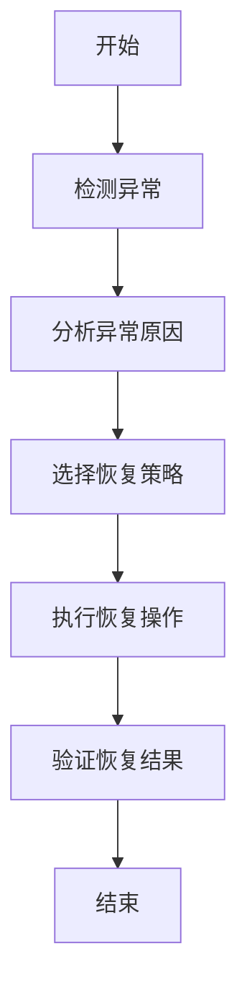
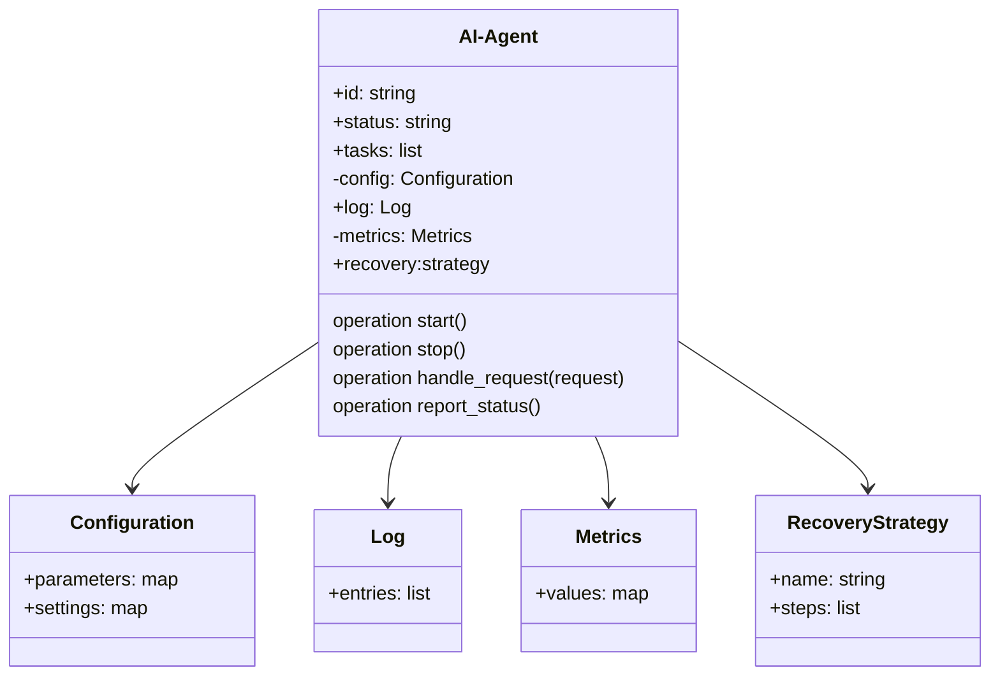
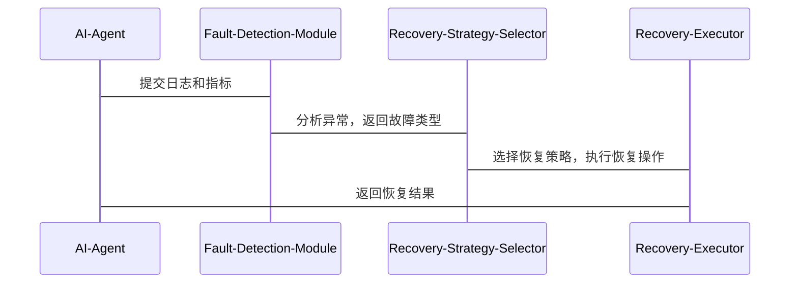

                 


# 企业AI Agent的故障恢复机制

## 关键词：AI Agent, 故障恢复, 企业系统, 异常检测, 系统架构, 算法原理

## 摘要：本文详细探讨了企业AI Agent在运行过程中可能出现的故障及其恢复机制。通过分析故障检测、原因诊断和恢复策略，结合实际案例，介绍了基于日志分析和马尔可夫链的故障恢复算法，并提出了系统架构设计和实现方案。文章最后给出了实际项目的实施步骤和效果分析，为企业AI Agent的稳定运行提供了理论和实践指导。

---

## 第一部分: 企业AI Agent的背景与概念

### 第1章: 企业AI Agent的背景与概念

#### 1.1 问题背景

- **AI Agent的定义与特点**
  - AI Agent是一种智能主体，能够感知环境、自主决策并执行任务。
  - 具备自主性、反应性、目标导向性和学习能力。

- **企业AI Agent的应用场景**
  - 自动化运维：监控系统状态，自动处理异常。
  - 智能客服：处理客户请求，提供个性化服务。
  - 供应链管理：优化库存，协调生产流程。

- **故障恢复机制的必要性**
  - AI Agent在企业中的广泛应用使其成为关键业务系统的一部分。
  - 系统故障可能导致业务中断，造成经济损失。
  - 故障恢复机制是确保AI Agent稳定运行的核心保障。

#### 1.2 问题描述

- **AI Agent在企业中的常见故障**
  - 服务中断：网络故障或资源耗尽。
  - 数据错误：输入数据异常或处理逻辑错误。
  - 模型失效：训练数据过时或模型性能下降。

- **故障对企业业务的影响**
  - 业务中断：影响客户体验和企业声誉。
  - 操作延迟：延误决策，影响市场机会。
  - 额外成本：故障修复和应急处理费用增加。

- **故障恢复的紧迫性**
  - 快速响应：减少故障时间，降低损失。
  - 智能恢复：自动化处理，减少人工干预。
  - 预防措施：预测故障，提前优化系统。

#### 1.3 问题解决

- **故障恢复机制的核心目标**
  - 最小化故障影响时间，确保业务连续性。
  - 自动检测和定位故障，提高恢复效率。
  - 提供多级恢复策略，适应不同故障场景。

- **企业AI Agent故障恢复的实现路径**
  - 实时监控：收集系统日志和运行指标。
  - 故障分析：基于日志和指标进行异常检测。
  - 恢复执行：选择最优恢复策略，执行修复操作。

- **故障恢复机制的边界与外延**
  - 边界：仅处理AI Agent相关的故障，不涉及其他系统的耦合。
  - 外延：扩展到整个企业系统的容灾和高可用性建设。

#### 1.4 核心概念结构与要素

- **AI Agent的组成结构**
  - 感知层：收集环境数据。
  - 决策层：分析数据，制定策略。
  - 执行层：执行任务，反馈结果。

- **故障恢复机制的关键要素**
  - 数据采集：日志、指标、状态信息。
  - 异常检测：基于统计或机器学习的算法。
  - 恢复策略：预定义的修复步骤和备用方案。

- **机制之间的关系与依赖**
  - 数据采集为故障检测提供依据。
  - 异常检测触发恢复流程。
  - 恢复策略依赖于故障类型和影响程度。

---

## 第二部分: 企业AI Agent故障恢复机制的核心概念与联系

### 第2章: 企业AI Agent故障恢复机制的核心概念与联系

#### 2.1 核心概念原理

- **故障检测原理**
  - 基于日志分析：识别异常模式。
  - 基于指标监控：分析性能波动。
  - 组合检测：结合日志和指标进行综合判断。

- **故障分析原理**
  - 原因分析：追溯故障的根本原因。
  - 影响评估：评估故障对业务的影响范围。
  - 相关性分析：找出故障之间的关联性。

- **故障恢复策略**
  - 自动重试：重启服务或任务。
  - 备份切换：启用备用系统或模块。
  - 参数调整：动态优化系统配置。

#### 2.2 概念属性特征对比

| **机制**      | **特点**                                                                 |
|----------------|--------------------------------------------------------------------------|
| 故障检测      | 基于实时数据，快速定位异常。                                             |
| 故障分析      | 通过日志和指标，深入挖掘故障原因。                                       |
| 恢复策略      | 预定义的恢复步骤，确保最小化故障影响。                                   |

#### 2.3 ER实体关系图

```mermaid
er
actor: 用户
agent: AI Agent
fault: 故障
recovery: 恢复操作
```

- 用户触发AI Agent执行任务。
- 故障发生时，AI Agent生成故障记录。
- 恢复操作关联到具体的故障记录。
- 用户或系统监控恢复操作的状态。

---

## 第三部分: 企业AI Agent故障恢复机制的算法原理

### 第3章: 企业AI Agent故障恢复机制的算法原理

#### 3.1 算法原理

- **基于日志的异常检测算法**
  - 使用聚类算法（如K-Means）或深度学习（如LSTM）分析日志数据。
  - 识别日志中的异常模式，标记潜在故障。

- **基于状态转移的故障恢复算法**
  - 利用马尔可夫链模型，根据当前状态预测下一步状态。
  - 根据状态转移概率选择最优恢复路径。

- **基于概率的故障预测算法**
  - 使用贝叶斯网络分析故障发生的概率。
  - 根据历史数据预测未来故障的可能性。

#### 3.2 算法流程图



#### 3.3 算法实现代码

```python
def detect_anomaly(logs):
    # 假设logs是一个包含日志数据的列表
    # 使用简单的基于频率的异常检测
    from collections import Counter
    log_count = Counter(logs)
    threshold = len(logs) / 100
    anomalies = [log for log, count in log_count.items() if count < threshold]
    return anomalies

def analyze_fault(anomalies):
    # 假设anomalies是一个异常日志列表
    # 简单的故障原因分析
    fault_types = {'connection_error', 'timeout_error', 'data_error'}
    fault = None
    for log in anomalies:
        if 'connection' in log:
            fault = 'connection_error'
            break
        elif 'timeout' in log:
            fault = 'timeout_error'
            break
        elif 'data' in log:
            fault = 'data_error'
            break
    return fault

def recover(fault_info):
    # 根据故障类型执行恢复操作
    if fault_info['type'] == 'connection_error':
        # 重启服务
        return 'service_restarted'
    elif fault_info['type'] == 'timeout_error':
        # 增加超时时间
        return 'timeout_increased'
    elif fault_info['type'] == 'data_error':
        # 重新加载数据
        return 'data_reloaded'
    return 'unknown_error'
```

#### 3.4 数学模型与公式

- **异常检测模型**
  - 使用马尔可夫链模型计算日志序列的概率：
  $$ P(anomaly | log) = \frac{P(log | anomaly) \cdot P(anomaly)}{P(log)} $$

- **故障恢复模型**
  - 根据状态转移概率选择恢复路径：
  $$ R(recovery) = \sum_{i=1}^{n} P(recovery_i | fault_i) \cdot V(recovery_i) $$

---

## 第四部分: 企业AI Agent故障恢复机制的系统分析与架构设计

### 第4章: 企业AI Agent故障恢复机制的系统分析与架构设计

#### 4.1 项目介绍

- **项目目标**
  - 实现企业AI Agent的故障恢复机制。
  - 提供高可用性和快速恢复能力。

- **项目范围**
  - 覆盖AI Agent的全生命周期。
  - 集成到企业现有的IT系统中。

#### 4.2 系统功能设计

- **核心功能模块**
  - 故障检测模块：实时监控日志和指标。
  - 故障分析模块：识别异常并分类。
  - 恢复执行模块：选择和执行恢复策略。

- **领域模型（类图）**



#### 4.3 系统架构设计

- **系统架构图**


- **系统接口设计**
  - 故障检测模块提供API，接收日志和指标。
  - 恢复策略选择模块提供API，返回恢复步骤。
  - 恢复执行模块提供API，执行具体操作。

#### 4.4 系统交互设计

- **序列图**



---

## 第五部分: 企业AI Agent故障恢复机制的项目实战

### 第5章: 企业AI Agent故障恢复机制的项目实战

#### 5.1 环境安装

- **安装依赖**
  - Python 3.8+
  - Pandas、Scikit-learn、TensorFlow
  - FastAPI框架

#### 5.2 系统核心实现

- **故障检测模块实现**
  ```python
  import pandas as pd
  from sklearn.cluster import KMeans

  def detect_anomaly(logs):
      df = pd.DataFrame(logs)
      model = KMeans(n_clusters=2)
      model.fit(df)
      anomalies = model.predict(df) == 0
      return anomalies
  ```

- **故障分析模块实现**
  ```python
  def analyze_fault(anomalies):
      from collections import defaultdict
      fault_counts = defaultdict(int)
      for anomaly in anomalies:
          key = anomaly['type']
          fault_counts[key] += 1
      return max(fault_counts, key=fault_counts.get)
  ```

- **恢复策略选择模块实现**
  ```python
  def choose_recovery_strategy(fault_type):
      strategies = {
          'connection_error': 'restart_service',
          'timeout_error': 'increase_timeout',
          'data_error': 'reload_data'
      }
      return strategies.get(fault_type, 'unknown_error')
  ```

#### 5.3 实际案例分析

- **案例：AI Agent服务中断**
  - **故障现象**
    - 用户反馈无法连接AI Agent服务。
    - 系统日志显示“Connection refused”。
  - **故障检测**
    - 故障检测模块标记为“connection_error”。
  - **故障分析**
    - 分析模块确定为服务器端口被占用。
  - **恢复策略**
    - 执行“restart_service”操作。
  - **恢复结果**
    - 服务恢复正常，用户重新连接成功。

#### 5.4 项目小结

- **项目成果**
  - 实现了完整的故障恢复机制。
  - 提供了高可用性和快速响应能力。

- **经验总结**
  - 故障恢复机制需要结合具体业务场景。
  - 数据分析和日志监控是关键。

---

## 第六部分: 企业AI Agent故障恢复机制的扩展阅读与未来发展

### 第6章: 企业AI Agent故障恢复机制的扩展阅读与未来发展

#### 6.1 最佳实践

- **实时监控**
  - 使用Prometheus和Grafana进行指标监控。
  - 配置 alerts 进行实时告警。

- **日志管理**
  - 使用ELK（Elasticsearch, Logstash, Kibana）进行日志分析。
  - 配置日志归档和自动清理策略。

- **恢复策略**
  - 结合A/B测试，验证恢复策略的有效性。
  - 建立故障恢复的知识库，记录常见问题和解决方法。

#### 6.2 小结

- **核心要点回顾**
  - 故障恢复机制是企业AI Agent稳定运行的关键。
  - 综合运用算法和系统架构设计，确保故障快速响应和恢复。

- **注意事项**
  - 定期进行系统演练，测试故障恢复流程。
  - 保持监控和恢复系统的可扩展性和可维护性。

#### 6.3 未来展望

- **智能化故障恢复**
  - 引入强化学习算法，优化恢复策略选择。
  - 实现自适应恢复机制，动态调整恢复策略。

- **分布式系统支持**
  - 针对微服务架构，设计分布式故障恢复机制。
  - 实现跨系统的故障协调恢复。

- **自动化运维**
  - 推动AI Agent的自动化运维，减少人工干预。
  - 结合DevOps理念，实现故障恢复的自动化流程。

---

## 关键词回顾：AI Agent, 故障恢复, 企业系统, 异常检测, 系统架构, 算法原理

## 总结

企业AI Agent的故障恢复机制是保障系统稳定运行的核心。通过实时监控、异常检测、故障分析和恢复策略的综合应用，结合高效的系统架构设计和智能化的算法，可以实现快速响应和最小化故障影响。未来，随着AI技术的不断发展，故障恢复机制将更加智能化和自动化，为企业AI Agent的广泛应用提供坚实保障。

