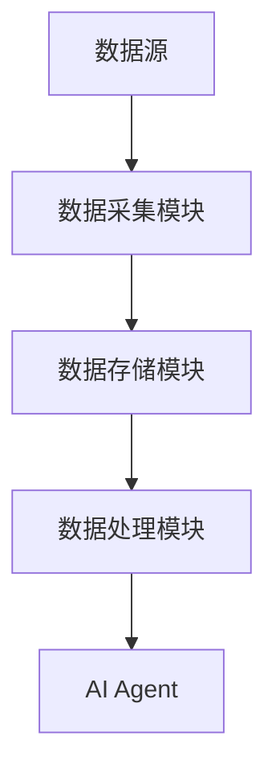

                 


# 企业AI Agent的数据湖架构设计

> 关键词：数据湖，AI Agent，架构设计，机器学习，系统架构

> 摘要：本文详细探讨了企业AI Agent在数据湖架构中的设计与实现，从数据湖的概念、AI Agent的核心原理，到两者结合的具体应用场景，系统分析了数据湖与AI Agent的交互流程，并通过实际案例展示了如何构建高效的数据湖驱动的AI Agent系统。

---

## 第1章 数据湖与AI Agent概述

### 1.1 数据湖的概念与特点

数据湖是一种集中存储企业所有数据的平台，支持多种数据格式和结构。其核心特点包括：

- **多样性**：支持结构化、半结构化和非结构化数据。
- **灵活性**：允许用户根据需求自由提取数据。
- **可扩展性**：能够处理海量数据。
- **统一性**：提供统一的数据访问接口。

### 1.2 AI Agent的定义与特点

AI Agent是一种智能代理系统，能够自主感知环境并执行任务。其特点包括：

- **自主性**：无需外部干预，自主决策。
- **反应性**：实时感知环境变化并做出响应。
- **学习能力**：通过机器学习不断提升能力。

### 1.3 数据湖在企业AI Agent中的作用

数据湖为AI Agent提供了丰富的数据源，支持其进行智能决策和学习。具体作用包括：

- **数据存储**：集中存储企业数据，为AI Agent提供数据支持。
- **数据处理**：支持数据清洗、转换等预处理工作。
- **数据共享**：促进企业内部数据的共享与协作。

---

## 第2章 数据湖与AI Agent的核心概念

### 2.1 数据湖的实体关系分析

数据湖的实体包括数据源、数据存储、数据处理模块和用户。实体关系如下：

- 数据源提供原始数据，数据存储进行归档，数据处理模块负责清洗和转换，用户进行数据查询和分析。

```mermaid
er
actor 用户
database 数据存储
database 数据处理模块
database 数据源

用户 --> 数据存储: 查询数据
数据源 --> 数据存储: 存储原始数据
数据处理模块 --> 数据存储: 处理后的数据
```

### 2.2 AI Agent的实体关系分析

AI Agent的实体包括感知模块、决策模块和执行模块。实体关系如下：

- 感知模块负责收集环境信息，决策模块基于感知信息做出决策，执行模块负责执行决策。

```mermaid
er
actor 环境
database 感知模块
database 决策模块
database 执行模块

环境 --> 感知模块: 提供环境信息
感知模块 --> 决策模块: 传递感知数据
决策模块 --> 执行模块: 发出决策指令
```

### 2.3 数据湖与AI Agent的关系分析

数据湖为AI Agent提供数据支持，AI Agent则利用数据湖中的数据进行智能决策。两者的关系如下：

- 数据湖作为数据源，AI Agent作为消费者，数据湖为AI Agent提供数据支持。

```mermaid
er
database 数据湖
actor AI Agent

AI Agent --> 数据湖: 查询数据
数据湖 --> AI Agent: 提供数据
```

---

## 第3章 数据湖与AI Agent的算法原理

### 3.1 数据湖中的数据预处理算法

数据预处理是数据湖中的关键步骤，包括数据清洗、特征提取等。以决策树算法为例，数据预处理流程如下：

1. 数据清洗：去除缺失值和异常值。
2. 特征提取：从原始数据中提取有用特征。
3. 数据标准化：将数据标准化到统一范围。

### 3.2 AI Agent中的机器学习算法

AI Agent的核心算法包括监督学习和无监督学习。以线性回归为例，其数学模型如下：

$$ y = \beta_0 + \beta_1x + \epsilon $$

其中，$$y$$ 是目标变量，$$x$$ 是自变量，$$\beta_0$$ 和 $$\beta_1$$ 是回归系数，$$\epsilon$$ 是误差项。

---

## 第4章 数据湖与AI Agent的系统分析与架构设计

### 4.1 企业AI Agent的数据湖应用场景

企业AI Agent在数据湖中的应用场景包括：

- **智能决策**：基于数据湖中的数据，进行市场预测和风险评估。
- **数据共享**：促进部门间数据共享，提升协作效率。

### 4.2 企业AI Agent的数据湖系统功能设计

系统功能设计包括数据采集、存储、处理和分析模块。以数据采集模块为例，其功能包括：

- 采集数据源中的数据。
- 将数据存储到数据湖中。

### 4.3 数据湖与AI Agent的系统架构图

系统架构包括数据采集、数据存储、数据处理和AI Agent模块。架构图如下：



---

## 第5章 数据湖与AI Agent的项目实战

### 5.1 环境安装与配置

数据湖环境搭建可以使用Hadoop或云存储服务，AI Agent开发可以使用Python和机器学习库。

### 5.2 数据湖与AI Agent的核心代码实现

以下是一个简单的数据处理代码示例：

```python
import pandas as pd

# 从数据湖中读取数据
data = pd.read_csv('data.csv')

# 数据清洗
data.dropna(inplace=True)
data['label'] = data['label'].astype(int)

# 模型训练
from sklearn.tree import DecisionTreeClassifier
model = DecisionTreeClassifier()
model.fit(data[['feature1', 'feature2']], data['label'])
```

### 5.3 代码应用解读与分析

上述代码展示了如何从数据湖中读取数据、进行清洗，并使用决策树算法进行训练。模型训练完成后，AI Agent可以基于数据湖中的新数据进行预测。

### 5.4 实际案例分析

以市场预测为例，AI Agent可以基于数据湖中的销售数据，预测未来的市场趋势，并为企业提供决策支持。

---

## 第6章 最佳实践与总结

### 6.1 最佳实践

- **数据质量管理**：确保数据湖中的数据质量。
- **安全性与合规性**：保护数据安全，确保符合相关法规。

### 6.2 总结

企业AI Agent与数据湖的结合为企业提供了强大的数据处理和智能决策能力。通过合理设计数据湖架构，企业可以充分发挥AI Agent的潜力，提升竞争力。

### 6.3 未来展望

随着技术的进步，数据湖与AI Agent的结合将更加紧密，为企业带来更多的创新机会。

---

通过以上章节的详细分析和代码示例，读者可以全面了解企业AI Agent的数据湖架构设计，并能够实际应用于项目中。

