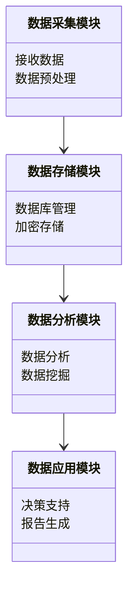
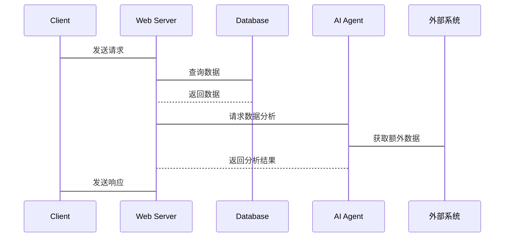

                 


# 企业AI Agent的数据隐私保护机制

## 关键词：AI Agent，数据隐私，隐私保护机制，企业应用，数据安全

## 摘要：本文深入探讨了企业AI Agent在数据隐私保护方面的机制，从核心概念到系统设计，从数学模型到项目实战，全面解析了如何在企业AI Agent中实现数据隐私保护，确保数据安全和合规性。

---

## 第一部分: 引言

## 第1章: AI Agent与数据隐私保护概述

### 1.1 AI Agent的基本概念

#### 1.1.1 AI Agent的定义与分类

AI Agent（人工智能代理）是指能够感知环境并采取行动以实现目标的智能实体。根据功能和应用场景的不同，AI Agent可以分为以下几类：

1. **简单反射型AI Agent**：基于规则直接响应输入，适用于简单决策场景。
2. **基于模型的反应式AI Agent**：利用内部模型动态调整行为，适用于复杂环境。
3. **目标驱动型AI Agent**：根据预设目标采取行动，适用于长期任务。
4. **实用驱动型AI Agent**：通过效用函数优化决策，适用于资源分配场景。

AI Agent在企业中的应用广泛，包括自动化流程、智能客服、供应链优化等领域。

#### 1.1.2 AI Agent在企业中的应用场景

AI Agent在企业中的应用主要集中在以下几个方面：

- **自动化决策支持**：通过分析数据，提供实时决策建议。
- **智能客服与支持**：通过自然语言处理技术，为用户提供智能支持。
- **供应链优化**：通过预测分析，优化供应链管理。
- **风险管理**：通过异常检测，识别潜在风险。

#### 1.1.3 数据隐私保护的重要性

在AI Agent的应用中，数据隐私保护至关重要。企业AI Agent通常处理大量敏感数据，如客户信息、交易记录等，这些数据的泄露可能导致严重的法律和经济损失。因此，如何在AI Agent中实现数据隐私保护，确保数据安全，是企业面临的重要挑战。

### 1.2 数据隐私保护的核心问题

#### 1.2.1 数据隐私的基本概念

数据隐私是指个人或组织对其数据的控制权和使用权。在企业环境中，数据隐私保护需要确保数据在采集、存储、处理和传输的各个环节中得到妥善保护，防止未经授权的访问和泄露。

#### 1.2.2 数据隐私保护的挑战与需求

AI Agent的应用带来了数据隐私保护的新挑战：

- **数据多样性**：AI Agent处理的数据类型多样，包括结构化数据和非结构化数据，增加了隐私保护的复杂性。
- **数据分布**：数据可能分布在不同的系统和云服务中，增加了统一管理的难度。
- **动态环境**：企业环境通常是动态变化的，AI Agent需要能够适应新的数据隐私要求。

#### 1.2.3 企业AI Agent中的数据隐私问题

在企业AI Agent中，数据隐私保护的主要问题包括：

- **数据访问控制**：如何确保只有授权人员能够访问敏感数据。
- **数据匿名化**：如何在保护隐私的同时，确保数据的可用性。
- **数据加密**：如何在传输和存储过程中保护数据不被窃取。

### 1.3 本章小结

本章介绍了AI Agent的基本概念和在企业中的应用场景，强调了数据隐私保护的重要性。接下来的章节将详细探讨数据隐私保护的核心机制，包括数学模型、系统设计和项目实战。

---

## 第二部分: 核心概念与原理

## 第2章: 数据隐私保护机制的核心概念

### 2.1 数据隐私保护的基本原理

#### 2.1.1 数据匿名化与脱敏技术

数据匿名化是指通过技术手段将数据中的敏感信息去除或替换，使其无法被重新识别。常见的数据脱敏技术包括：

- **数据屏蔽**：通过掩盖敏感信息，如将姓名替换为“XXX”。
- **数据扰动**：通过添加噪声，使数据无法被精确识别。
- **数据泛化**：通过将数据归类到更广泛的类别中，降低识别风险。

#### 2.1.2 数据加密与解密机制

数据加密是通过加密算法将敏感数据转换为不可读的形式，确保数据在传输和存储过程中的安全性。常用的加密算法包括：

- **对称加密**：如AES算法，加密和解密使用相同的密钥。
- **非对称加密**：如RSA算法，加密和解密使用不同的密钥对。

#### 2.1.3 数据访问控制策略

数据访问控制策略通过权限管理，确保只有授权人员能够访问敏感数据。常见的访问控制策略包括：

- **基于角色的访问控制（RBAC）**：根据用户角色分配权限。
- **基于属性的访问控制（ABAC）**：根据用户属性和上下文动态分配权限。

### 2.2 AI Agent中的数据处理流程

#### 2.2.1 数据采集与预处理

数据采集是AI Agent的第一步，通常包括从多种数据源（如数据库、API、传感器等）获取数据。预处理步骤包括数据清洗、数据转换和数据增强。

#### 2.2.2 数据存储与管理

数据存储是数据隐私保护的关键环节。企业通常使用数据库或云存储服务来存储数据。为了保护数据隐私，需要采取以下措施：

- **数据分区存储**：将数据按敏感程度分区存储，确保高敏感数据的安全。
- **数据加密存储**：对存储的数据进行加密，防止未经授权的访问。

#### 2.2.3 数据分析与应用

数据分析是AI Agent的核心功能，通过分析数据，AI Agent可以为企业的决策提供支持。在数据分析过程中，需要确保数据的隐私性，避免敏感数据的泄露。

### 2.3 数据隐私保护与AI Agent的结合

#### 2.3.1 数据隐私保护对AI Agent的影响

数据隐私保护对AI Agent的影响主要体现在以下几个方面：

- **数据可用性**：数据隐私保护可能会限制数据的可用性，影响AI Agent的性能。
- **数据处理方式**：为了保护隐私，可能需要采用特殊的处理方式，如联邦学习。

#### 2.3.2 AI Agent中的数据隐私保护需求

在AI Agent中，数据隐私保护的需求主要体现在以下几个方面：

- **数据匿名化**：确保数据在处理过程中不会泄露个人隐私。
- **数据加密**：确保数据在传输和存储过程中的安全性。
- **数据访问控制**：确保只有授权人员能够访问敏感数据。

#### 2.3.3 数据隐私保护与企业合规性

企业需要遵守相关的数据隐私保护法规，如GDPR（通用数据保护条例）和CCPA（加利福尼亚消费者隐私法案）。AI Agent的设计需要符合这些法规要求，确保数据处理的合法性。

### 2.4 核心概念的ER实体关系图

以下是数据隐私保护机制的核心概念的ER实体关系图：

```mermaid
er
    title 数据隐私保护核心概念
    User [ 实体 ] 
    Data [ 实体 ] 
    AccessControl [ 实体 ] 
    Role [ 实体 ] 
    Permission [ 实体 ] 
    User --|{拥有}| Permission 
    Role --|{拥有}| Permission 
    Data --|{属于}| User 
    Data --|{受控于}| AccessControl 
    AccessControl --|{基于}| Role 
    AccessControl --|{基于}| Permission 
```

### 2.5 本章小结

本章详细介绍了数据隐私保护的核心概念，包括数据匿名化、数据加密和数据访问控制。同时，探讨了AI Agent中的数据处理流程和数据隐私保护的需求。接下来的章节将深入探讨数据隐私保护的数学模型和系统设计。

---

## 第三部分: 数学模型与算法

## 第3章: 数据隐私保护的数学模型与算法

### 3.1 数据匿名化的数学模型

#### 3.1.1 数据脱敏的数学模型

数据脱敏可以通过概率论中的随机化技术来实现。例如，使用拉普拉斯分布对数据进行扰动：

$$
P(x) = \frac{1}{\sqrt{2\pi}\sigma} e^{-\frac{(x-\mu)^2}{2\sigma^2}}
$$

其中，$\mu$ 是均值，$\sigma$ 是标准差。

#### 3.1.2 数据加密的数学模型

对称加密算法（如AES）的加密过程可以用以下公式表示：

$$
C = E_k(P)
$$

其中，$P$ 是明文，$C$ 是密文，$k$ 是密钥。

### 3.2 基于概率论的隐私保护算法

#### 3.2.1 差分隐私

差分隐私是一种通过在数据中添加噪声来保护隐私的技术。差分隐私的定义如下：

对于任意数据集 $D$ 和 $D'$，其中 $D'$ 是 $D$ 的一个相邻数据集（即只有一个元素不同），对于任何可能的输出结果 $O$，差分隐私要求：

$$
\frac{P(O(D))}{P(O(D'))} \leq \epsilon
$$

其中，$\epsilon$ 是隐私参数，控制隐私泄露的程度。

#### 3.2.2 随机化响应

随机化响应是一种通过随机化技术保护隐私的方法。其数学模型如下：

$$
y = \text{sign}(x \cdot w + b) + \text{噪声}
$$

其中，$x$ 是输入，$w$ 是权重，$b$ 是偏置，噪声用于增加随机性。

### 3.3 数据访问控制的算法实现

#### 3.3.1 基于角色的访问控制（RBAC）

RBAC的实现可以通过以下步骤：

1. 定义角色和权限。
2. 为用户分配角色。
3. 根据角色授予权限。

其数学模型可以表示为：

$$
\text{权限}(u) = \bigcup_{r \in R(u)} \text{权限}(r)
$$

其中，$R(u)$ 是用户 $u$ 所属的角色集合。

### 3.4 本章小结

本章通过数学模型和算法，详细探讨了数据隐私保护的核心技术，包括数据脱敏、差分隐私和基于角色的访问控制。接下来的章节将结合这些模型，设计企业AI Agent的系统架构。

---

## 第四部分: 系统设计

## 第4章: 企业AI Agent的系统架构设计

### 4.1 问题场景介绍

在企业AI Agent的设计中，数据隐私保护是系统设计的核心问题。本文将从数据采集、数据存储、数据分析和数据应用四个环节进行系统设计。

### 4.2 系统功能设计

以下是系统功能设计的领域模型：



### 4.3 系统架构设计

以下是系统架构设计的Mermaid图：


### 4.4 系统接口设计

系统接口设计主要涉及以下几个接口：

1. 数据采集接口：从外部系统获取数据。
2. 数据存储接口：将数据加密后存储到数据库。
3. 数据分析接口：对数据进行分析和挖掘。
4. 数据应用接口：生成决策支持和报告。

### 4.5 系统交互流程

以下是系统交互流程的Mermaid序列图：



### 4.6 本章小结

本章详细设计了企业AI Agent的系统架构，包括功能模块、接口设计和交互流程。接下来的章节将结合实际案例，展示如何在项目中实现这些设计。

---

## 第五部分: 项目实战

## 第5章: 数据隐私保护机制的项目实战

### 5.1 环境配置

项目实战的环境配置包括以下内容：

1. **开发环境**：Python 3.8及以上版本，Jupyter Notebook。
2. **工具安装**：安装TensorFlow、Keras、Pandas、Scikit-learn等库。
3. **数据集准备**：收集和整理企业数据，确保数据匿名化处理。

### 5.2 核心代码实现

以下是核心代码实现：

#### 5.2.1 数据脱敏代码

```python
import numpy as np

def differential_privacy(data, epsilon=1.0):
    n = len(data)
    alpha = 1.0 / epsilon
    noise = np.random.laplace(0, 1.0 / epsilon, n)
    perturbed_data = data + noise
    return perturbed_data

# 示例数据
data = np.array([1, 2, 3, 4, 5])
perturbed_data = differential_privacy(data)
print("原始数据:", data)
print("加噪后数据:", perturbed_data)
```

#### 5.2.2 数据加密代码

```python
from cryptography.fernet import Fernet

# 生成密钥
key = Fernet.generate_key()
cipher = Fernet(key)

# 加密数据
encrypted_data = cipher.encrypt(b"敏感数据")
print("加密后的数据:", encrypted_data)

# 解密数据
decrypted_data = cipher.decrypt(encrypted_data)
print("解密后的数据:", decrypted_data.decode())
```

#### 5.2.3 基于角色的访问控制代码

```python
# 定义角色和权限
roles = {
    'admin': ['read', 'write', 'delete'],
    'user': ['read', 'write']
}

# 用户角色分配
users = {
    'user1': 'admin',
    'user2': 'user'
}

# 数据访问控制
def has_permission(user, action, resource):
    role = users[user]
    return action in roles[role]

# 示例使用
print(has_permission('user1', 'read', 'data'))  # 输出: True
print(has_permission('user2', 'delete', 'data'))  # 输出: False
```

### 5.3 项目小结

本章通过具体的代码实现，展示了如何在企业AI Agent中实现数据隐私保护机制，包括数据脱敏、数据加密和基于角色的访问控制。接下来的章节将总结整个项目，并展望未来的发展趋势。

---

## 第六部分: 总结与展望

## 第6章: 总结与展望

### 6.1 核心观点回顾

本文从AI Agent的基本概念出发，详细探讨了数据隐私保护的核心机制，包括数据脱敏、数据加密和基于角色的访问控制。通过数学模型和系统设计，展示了如何在企业AI Agent中实现数据隐私保护。

### 6.2 未来展望

随着AI技术的不断发展，数据隐私保护将面临新的挑战和机遇。未来的研究方向包括：

1. **联邦学习**：在数据不集中存储的情况下，如何实现模型训练。
2. **零知识证明**：在不泄露数据的情况下，如何验证数据的真实性。
3. **动态隐私保护**：根据数据的敏感性和环境的变化，动态调整隐私保护策略。

### 6.3 最佳实践 tips

- 在设计AI Agent时，应优先考虑数据隐私保护，确保数据的安全性和合规性。
- 数据脱敏和加密技术是保护数据隐私的重要手段，应根据具体场景选择合适的技术。
- 基于角色的访问控制是实现数据访问控制的有效方法，应结合企业的组织结构和业务需求进行设计。

### 6.4 本章小结

本文总结了企业AI Agent中的数据隐私保护机制，展望了未来的研究方向，并给出了最佳实践的建议。希望通过本文的研究，能够为企业在AI Agent中的数据隐私保护提供参考和指导。

---

## 结语

企业AI Agent中的数据隐私保护是一个复杂而重要的问题。本文通过系统的分析和设计，展示了如何在企业AI Agent中实现数据隐私保护机制。未来的研究将更加关注动态隐私保护和新兴技术的应用，以应对不断变化的挑战。

