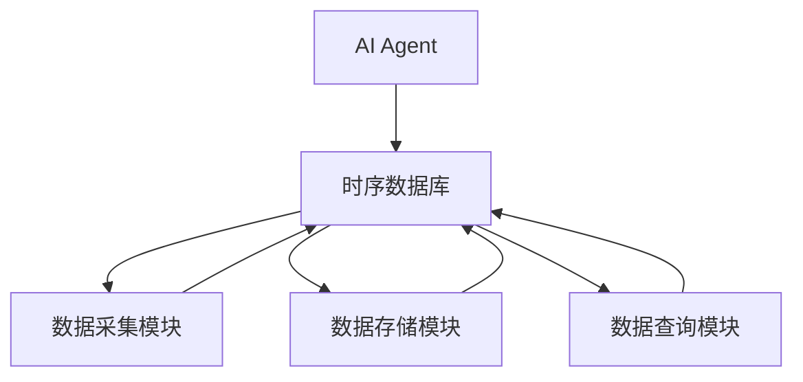
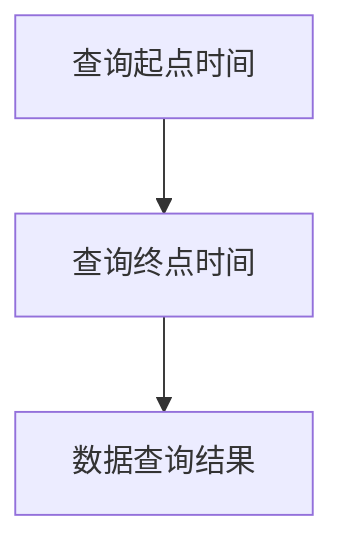
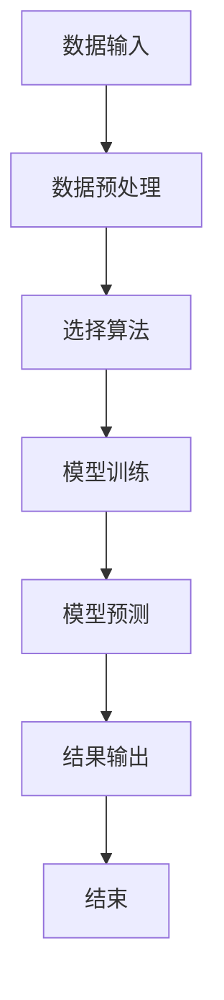
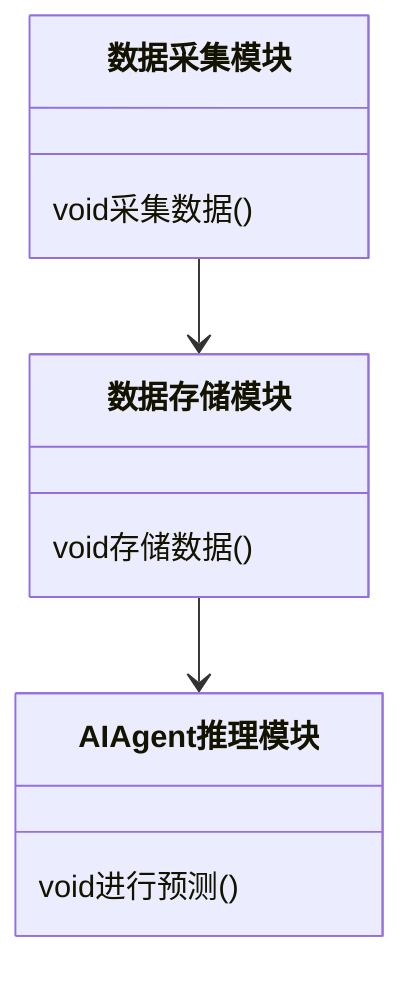
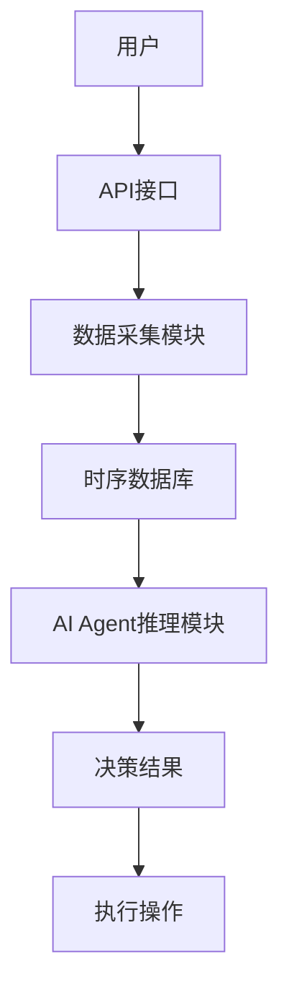
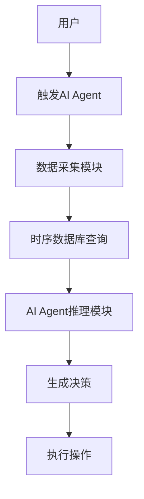

                 


---

# 企业AI Agent的时序数据库设计与应用

> **关键词**：时序数据库、企业AI Agent、数据存储、算法设计、系统架构

> **摘要**：本文详细探讨了企业AI Agent与时序数据库的结合，分析了时序数据在AI Agent中的应用价值，介绍了时序数据库的核心设计原理，提出了基于时序数据的企业AI Agent算法模型，并通过实际案例展示了系统架构设计与实现方案。本文旨在为企业技术架构师、数据科学家和AI开发人员提供有价值的参考。

---

## 第1章: 时序数据库与企业AI Agent概述

### 1.1 时序数据库的定义与特点

#### 1.1.1 时序数据的定义
时序数据是指按时间顺序记录的数据，通常以时间戳为索引，包含连续的观测值。例如，股票价格、传感器数据、用户行为数据等都属于时序数据。

#### 1.1.2 时序数据库的核心特点
- **时间戳**：所有数据记录都包含时间戳，支持按时间范围查询。
- **高效存储**：针对时序数据的特点进行优化，支持压缩存储和快速查询。
- **高并发**：支持高频率的数据写入和查询操作。

#### 1.1.3 时序数据在企业中的应用场景
- **物联网**：传感器数据的采集与分析。
- **金融**：股票价格、交易数据的实时监控。
- **运维**：系统日志、性能指标的监控与分析。

---

### 1.2 企业AI Agent的定义与特点

#### 1.2.1 AI Agent的基本概念
AI Agent（人工智能代理）是一种能够感知环境、自主决策并执行任务的智能实体。它可以是一个软件程序，也可以是一个物理设备。

#### 1.2.2 企业AI Agent的核心功能
- **感知环境**：通过传感器、API等方式获取实时数据。
- **决策推理**：基于历史数据和实时数据，利用机器学习算法进行预测和决策。
- **执行任务**：根据决策结果执行相应的操作，例如发送通知、调整系统参数等。

#### 1.2.3 企业AI Agent与传统AI的区别
| 特性             | 传统AI                | 企业AI Agent          |
|------------------|-----------------------|-----------------------|
| 智能水平         | 基于规则或预训练模型  | 具备自主学习能力      |
| 任务目标         | 完成特定任务           | 实时监控与动态调整    |
| 环境交互         | 通常在受控环境中运行    | 可在复杂动态环境中运行 |

---

### 1.3 时序数据库与AI Agent的结合

#### 1.3.1 时序数据在AI Agent中的作用
- **历史数据存储**：AI Agent需要存储历史数据以进行趋势分析和模式识别。
- **实时数据处理**：AI Agent需要快速读取实时数据以进行预测和决策。
- **数据关联性**：时序数据的关联性可以帮助AI Agent发现数据中的潜在规律。

#### 1.3.2 AI Agent如何利用时序数据库
- **数据查询**：通过时序数据库查询历史数据和实时数据。
- **模型训练**：利用时序数据训练预测模型。
- **任务执行**：根据预测结果执行相应的操作。

#### 1.3.3 时序数据库与AI Agent的协同工作模式


---

### 1.4 本章小结
本章介绍了时序数据库和企业AI Agent的基本概念、特点及其在企业中的应用场景。通过对比分析，阐述了时序数据库与AI Agent的结合方式，为后续章节的深入探讨奠定了基础。

---

## 第2章: 时序数据库的核心概念与设计原理

### 2.1 时序数据库的存储机制

#### 2.1.1 时间戳的重要性
时间戳是时序数据库的核心字段，用于标识数据的生成时间。高效的时间戳管理可以显著提高查询效率。

#### 2.1.2 时序数据的压缩与存储优化
- **数据压缩**：对连续的时序数据进行压缩存储，例如使用RLE（Run-Length Encoding）算法。
- **存储分片**：将数据按时间范围分片存储，支持分布式存储和查询。

#### 2.1.3 分片与分布式存储
- **分片策略**：按时间戳、主键或哈希值对数据进行分片。
- **分布式存储**：通过分布式文件系统或数据库实现数据的水平扩展。

---

### 2.2 时序数据库的查询优化

#### 2.2.1 时间范围查询


#### 2.2.2 聚合操作与高效计算
- **聚合函数**：SUM、AVG、MAX、MIN等。
- **计算优化**：利用索引和预计算结果加速聚合操作。

#### 2.2.3 索引优化策略
- **时间戳索引**：基于时间戳建立索引，支持快速范围查询。
- **全局索引**：对整个数据库建立全局索引，支持跨分片查询。

---

### 2.3 时序数据库的扩展性设计

#### 2.3.1 弹性扩展的实现
- **自动扩缩容**：根据实时负载自动调整存储资源。
- **负载均衡**：通过分片和负载均衡技术实现水平扩展。

#### 2.3.2 高可用性架构
- **主从复制**：通过主从复制实现数据的高可用性。
- **读写分离**：将读操作和写操作分离，提高系统性能。

#### 2.3.3 数据保留与归档策略
- **数据保留**：根据业务需求设置数据保留时间，自动删除过期数据。
- **归档存储**：将历史数据归档到 cheaper storage（如云存储）中，降低存储成本。

---

### 2.4 本章小结
本章详细探讨了时序数据库的核心设计原理，包括存储机制、查询优化和扩展性设计。通过合理的存储和查询优化策略，可以显著提高时序数据库的性能和可用性。

---

## 第3章: 企业AI Agent的算法原理与数学模型

### 3.1 AI Agent的核心算法

#### 3.1.1 基于时序数据的预测算法
- **时间序列预测**：使用ARIMA、LSTM等算法对时序数据进行预测。
- **异常检测**：基于统计方法或深度学习模型检测时序数据中的异常值。

#### 3.1.2 强化学习在AI Agent中的应用
- **状态空间**：AI Agent的感知状态。
- **动作空间**：AI Agent可执行的动作。
- **奖励机制**：根据决策结果给予奖励或惩罚。

#### 3.1.3 聚类与分类算法
- **聚类分析**：将相似的时序数据聚类，发现数据中的潜在模式。
- **分类算法**：基于时序数据进行分类，例如用户行为分类。

---

### 3.2 时序数据分析的数学模型

#### 3.2.1 时间序列分解模型
时间序列分解模型将数据分解为趋势、周期性、季节性和随机性成分。
$$ T_t = T_{t-1} + S_{t-1} + R_{t} $$
其中：
- $T_t$ 表示当前趋势。
- $S_{t-1}$ 表示前一时刻的周期性成分。
- $R_t$ 表示随机噪声。

#### 3.2.2 ARIMA模型与LSTM网络
- **ARIMA模型**：自回归积分滑动平均模型，适用于线性时序数据。
  $$ ARIMA(p, d, q) $$
  其中，p为自回归阶数，d为差分阶数，q为滑动平均阶数。
- **LSTM网络**：长短期记忆网络，适用于非线性时序数据。
  $$ f(x) = \tanh(W_{h} h_{t-1} + W_{x} x_t) $$

#### 3.2.3 Prophet模型的原理与应用
Prophet模型是一种基于时间序列分解的预测模型，适用于有噪声的时序数据。

---

### 3.3 算法流程图


---

### 3.4 本章小结
本章介绍了企业AI Agent的核心算法及其数学模型，重点分析了时间序列预测、强化学习和聚类分类算法的应用场景。通过算法流程图展示了AI Agent的工作流程。

---

## 第4章: 企业AI Agent的系统架构与设计

### 4.1 系统功能设计

#### 4.1.1 数据采集模块
- **数据来源**：传感器、日志文件、API接口。
- **采集频率**：根据业务需求设置采集频率。

#### 4.1.2 数据存储模块
- **时序数据库选型**：InfluxDB、TimescaleDB、Prometheus等。
- **数据模型设计**：设计合理的数据表结构，支持高效的查询操作。

#### 4.1.3 AI Agent推理模块
- **预测模型**：集成多种预测算法，支持在线更新。
- **决策逻辑**：根据预测结果和业务规则生成决策指令。

---

### 4.2 系统架构设计

#### 4.2.1 系统功能模块的类图


#### 4.2.2 系统架构图


---

### 4.3 系统接口设计

#### 4.3.1 数据采集接口
- **输入**：数据采集模块的接口参数。
- **输出**：采集到的数据。

#### 4.3.2 数据查询接口
- **输入**：时间范围和查询条件。
- **输出**：查询结果。

#### 4.3.3 AI Agent决策接口
- **输入**：实时数据和预测结果。
- **输出**：决策指令。

---

### 4.4 系统交互流程图


---

### 4.5 本章小结
本章详细探讨了企业AI Agent的系统架构设计，包括功能模块、系统架构图和接口设计。通过系统交互流程图展示了AI Agent的完整工作流程。

---

## 第5章: 项目实战

### 5.1 环境安装与配置

#### 5.1.1 时序数据库安装
以InfluxDB为例：
```bash
# 安装InfluxDB
sudo apt-get install influxdb influxdb-client
# 启动InfluxDB服务
sudo systemctl start influxdb
```

#### 5.1.2 AI Agent开发环境配置
- **编程语言**：Python、Java或Go。
- **开发框架**：TensorFlow、PyTorch或Keras。

---

### 5.2 系统核心实现源代码

#### 5.2.1 数据采集模块
```python
import influxdb
from datetime import datetime

client = influxdb.InfluxDBClient(host='localhost', port=8086)
data = {
    'measurement': 'sensor_data',
    'time': datetime.now(),
    'fields': {
        'temperature': 25.6,
        'humidity': 60
    }
}
client.write_points([data])
```

#### 5.2.2 AI Agent推理模块
```python
import numpy as np
from tensorflow.keras.models import load_model

# 加载预训练模型
model = load_model('time_series_model.h5')

# 预测未来值
def predict_next_value(data):
    return model.predict(data)

# 调用预测函数
predicted_value = predict_next_value(data)
```

---

### 5.3 实际案例分析与详细讲解

#### 5.3.1 案例背景
某企业需要实时监控生产设备的运行状态，希望通过AI Agent预测设备故障风险。

#### 5.3.2 数据分析与处理
- **数据预处理**：清洗、归一化和特征提取。
- **模型训练**：使用LSTM网络训练故障预测模型。

#### 5.3.3 系统实现
- **数据采集**：通过传感器采集设备状态数据。
- **数据存储**：将数据存储到InfluxDB中。
- **模型推理**：AI Agent基于历史数据预测未来状态。

---

### 5.4 项目小结
本章通过实际案例展示了企业AI Agent的实现过程，包括环境配置、数据采集、模型训练和系统实现。通过具体代码和案例分析，帮助读者理解理论知识的实际应用。

---

## 第6章: 最佳实践与注意事项

### 6.1 最佳实践

#### 6.1.1 数据质量管理
- 数据清洗：去除噪声和异常值。
- 数据标准化：统一数据格式和单位。

#### 6.1.2 模型优化
- 参数调优：通过网格搜索或随机搜索优化模型参数。
- 模型评估：使用交叉验证和性能指标（如MAE、RMSE）评估模型效果。

#### 6.1.3 系统安全
- 数据加密：对敏感数据进行加密存储和传输。
- 权限管理：严格控制系统的访问权限。

---

### 6.2 小结
本章总结了企业AI Agent开发中的最佳实践，包括数据质量管理、模型优化和系统安全等方面。

---

### 6.3 注意事项

#### 6.3.1 数据存储
- 确保时序数据库的高效存储和查询性能。
- 定期备份和归档数据，防止数据丢失。

#### 6.3.2 模型更新
- 定期重新训练模型，保持模型的预测精度。
- 使用在线学习方法，实时更新模型参数。

#### 6.3.3 系统监控
- 实时监控系统性能，及时发现和解决问题。
- 建立完善的日志系统，方便故障排查。

---

## 第7章: 拓展阅读

### 7.1 相关技术领域
- **时间序列分析**：深入学习ARIMA、LSTM等算法。
- **分布式系统**：研究分布式存储和计算技术。
- **机器学习工程化**：学习模型部署和运维的最佳实践。

### 7.2 推荐书籍
- 《时间序列分析》——王燕
- 《分布式系统与大数据技术》——李志军
- 《机器学习实战》——唐宇迪

---

## 附录: 总结与致谢

### 附录A: 总结
本文系统地介绍了企业AI Agent的时序数据库设计与应用，涵盖了时序数据库的核心设计、AI Agent的算法原理、系统架构设计和实际项目实现。通过理论与实践的结合，为企业技术架构师和开发人员提供了有价值的参考。

### 附录B: 致谢
感谢所有参与本项目研究和写作的人员，特别感谢在项目过程中给予支持和指导的导师和同事们。

---

**全文完。**

