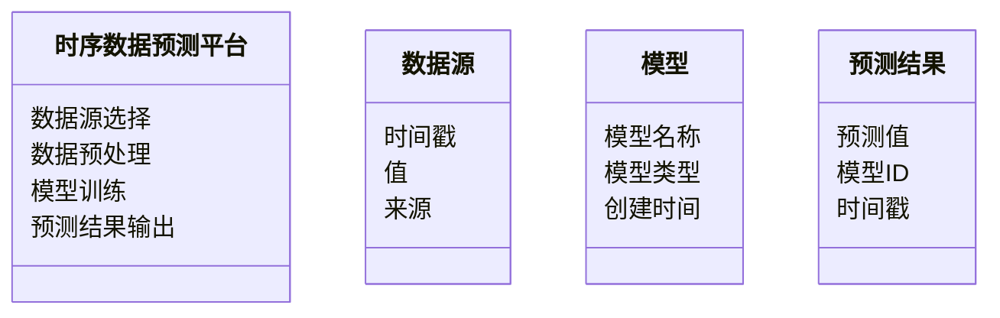
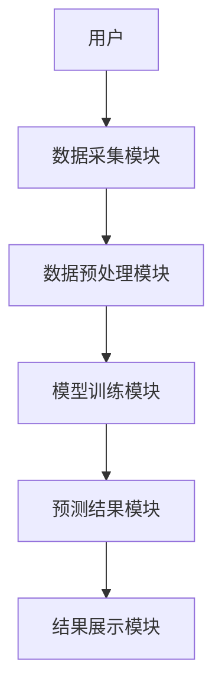
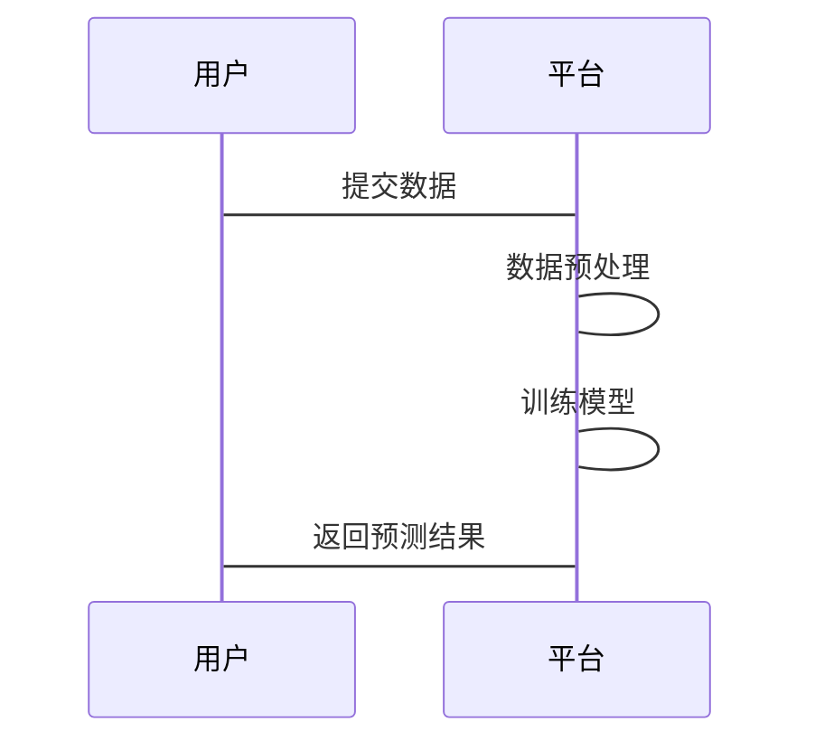

                 


# 企业AI Agent的时序数据预测平台设计

## 关键词：企业AI Agent，时序数据预测，平台设计，深度学习，时间序列分析，机器学习，系统架构

## 摘要：本文详细探讨了企业AI Agent在时序数据预测中的应用，从背景、核心概念到算法原理、系统架构，再到项目实战和最佳实践，全面解析了设计时序数据预测平台的关键要素。通过丰富的图表、代码示例和案例分析，帮助读者掌握如何构建高效可靠的时序数据预测平台。

---

# 第一部分: 背景介绍

## 第1章: 时序数据预测的背景与需求

### 1.1 时序数据预测的背景

#### 1.1.1 时序数据的定义与特点
- 时序数据的定义：时间序列数据是指按照时间顺序记录的观测值序列。
- 数据特点：趋势性、周期性、随机性。

#### 1.1.2 企业中的时序数据应用场景
- 销售预测：预测未来销售额。
- 设备维护：预测设备故障时间。
- 供应链优化：预测库存需求。

#### 1.1.3 时序数据预测的重要性
- 帮助企业做出更明智的决策。
- 提高资源利用效率。
- 减少运营成本。

### 1.2 AI Agent在企业中的角色

#### 1.2.1 AI Agent的基本概念
- AI Agent的定义：能够感知环境并采取行动以实现目标的智能体。
- AI Agent的分类：基于智能水平分为反应式和认知式。

#### 1.2.2 AI Agent在企业中的功能与优势
- 功能：数据采集、分析、预测、决策。
- 优势：自动化、高效性、智能性。

### 1.3 时序数据预测平台的设计目标

#### 1.3.1 平台的目标与核心功能
- 目标：提供高效、准确的时序数据预测服务。
- 核心功能：数据处理、模型训练、预测输出。

#### 1.3.2 平台的架构与性能要求
- 架构要求：模块化设计，支持高并发。
- 性能要求：快速响应，高准确性。

#### 1.3.3 平台的可扩展性与灵活性
- 扩展性：支持多种数据源和预测模型。
- 灵活性：适应不同业务需求。

---

## 第2章: 时序数据预测的核心概念与联系

### 2.1 时序数据预测的基本原理

#### 2.1.1 时间序列的分解方法
- 分解方法：趋势分解法、移动平均法。
- 示例：使用Python代码分解一个简单的时序数据集。

### 2.2 AI Agent与时序数据预测的结合

#### 2.2.1 AI Agent如何处理时序数据
- 数据采集：通过传感器或日志获取数据。
- 数据预处理：清洗、转换。
- 模型训练：使用深度学习或机器学习算法训练模型。

#### 2.2.2 AI Agent在时序预测中的优势
- 自动化处理：无需人工干预。
- 高准确性：结合多种算法提高预测精度。

### 2.3 核心概念的ER实体关系图

```mermaid
er
    entity(时序数据) {
        id: integer
        timestamp: datetime
        value: float
        source: string
    }
    entity(预测模型) {
        id: integer
        model_name: string
        model_type: string
        created_at: datetime
    }
    entity(预测结果) {
        id: integer
        prediction_value: float
        model_id: integer
        timestamp: datetime
    }
```

---

## 第3章: 时序数据预测的算法原理

### 3.1 常见的时序预测算法

#### 3.1.1 ARIMA模型
- ARIMA模型的工作原理：
  1. 分解数据为趋势、季节性和随机成分。
  2. 建立自回归模型进行预测。
- 代码示例：
  ```python
  from statsmodels.tsa.arima.model import ARIMA
  model = ARIMA(train_data, order=(5, 1, 0))
  model_fit = model.fit()
  forecast = model_fit.forecast(steps=10)[0]
  ```
- 数学公式：
  $$ARIMA(p, d, q) = \phi(B)^p (1 - B)^d X_t = \theta(B)^q Z_t$$

#### 3.1.2 LSTM网络
- LSTM网络的工作原理：
  1. 使用门控机制处理长期依赖关系。
  2. 通过细胞状态传递信息。
- 代码示例：
  ```python
  from keras.models import Sequential
  from keras.layers import LSTM, Dense
  model = Sequential()
  model.add(LSTM(50, input_shape=(timesteps, features)))
  model.add(Dense(1))
  model.compile(optimizer='adam', loss='mse')
  model.fit(X_train, y_train, epochs=50, batch_size=32)
  ```
- 数学公式：
  $$f_t = \sigma(W_{f}x_t + U_{f}h_{t-1} + b_f)$$

#### 3.1.3 Prophet模型
- Prophet模型的工作原理：
  1. 将时间序列分解为趋势、周期和余项。
  2. 使用回归模型进行预测。
- 代码示例：
  ```python
  from fbprophet import Prophet
  model = Prophet()
  model.fit(train_data)
  future = model.make_future_dataframe(periods=30)
  forecast = model.predict(future)
  ```
- 数学公式：
  $$\hat{y}_t = g(t) + s(t) + \epsilon_t$$

---

## 第4章: 时序数据预测平台的系统架构设计

### 4.1 系统功能设计

#### 4.1.1 领域模型设计


#### 4.1.2 系统架构设计


#### 4.1.3 接口设计
- API接口：RESTful API。
- 接口文档：详细说明输入输出格式。

#### 4.1.4 交互流程设计


---

## 第5章: 项目实战

### 5.1 环境安装

#### 5.1.1 安装依赖
- Python环境：Python 3.8+
- 依赖库：pandas、numpy、statsmodels、keras、fbprophet。

#### 5.1.2 数据准备
- 数据来源：CSV文件。
- 数据清洗：处理缺失值和异常值。

### 5.2 核心代码实现

#### 5.2.1 数据预处理代码
```python
import pandas as pd
import numpy as np

# 读取数据
data = pd.read_csv('time_series.csv')

# 处理缺失值
data = data.dropna()

# 标准化数据
from sklearn.preprocessing import StandardScaler
scaler = StandardScaler()
scaled_data = scaler.fit_transform(data[['value']])
```

#### 5.2.2 模型训练代码
```python
from statsmodels.tsa.arima.model import ARIMA
model = ARIMA(scaled_data, order=(5, 1, 0))
model_fit = model.fit()
forecast = model_fit.forecast(steps=10)[0]
```

#### 5.2.3 模型评估代码
```python
from sklearn.metrics import mean_squared_error
y_true = test_data
y_pred = model_fit.forecast(steps=len(test_data))[0]
mse = mean_squared_error(y_true, y_pred)
print(f'MSE: {mse}')
```

### 5.3 案例分析与解读

#### 5.3.1 案例背景
- 数据集：某企业过去3年的销售数据。
- 目标：预测未来6个月的销售情况。

#### 5.3.2 模型选择与训练
- 使用ARIMA模型进行训练。
- 调参：选择最佳的p, d, q参数。

#### 5.3.3 结果分析
- 预测结果与实际数据对比。
- 分析预测误差的原因。

### 5.4 项目小结
- 成功实现了时序数据预测平台。
- 验证了ARIMA模型的有效性。
- 提供了可扩展的系统架构设计。

---

## 第6章: 最佳实践与注意事项

### 6.1 设计与实现中的注意事项

#### 6.1.1 数据预处理的重要性
- 数据清洗：处理缺失值、异常值。
- 数据标准化：提高模型性能。

#### 6.1.2 模型调优技巧
- 参数调优：使用网格搜索。
- 模型评估：使用交叉验证。

#### 6.1.3 模型部署与监控
- 模型部署：使用Docker容器化部署。
- 模型监控：实时监控预测误差。

### 6.2 项目小结

#### 6.2.1 项目总结
- 成功设计并实现了企业AI Agent的时序数据预测平台。
- 验证了多种算法的适用性。
- 提供了可扩展的系统架构设计。

#### 6.2.2 注意事项
- 数据质量直接影响预测结果。
- 模型调优需要结合业务场景。
- 系统架构设计需要考虑可扩展性和高可用性。

### 6.3 未来展望

#### 6.3.1 技术发展
- 更先进的算法：如Transformer架构在时序预测中的应用。
- 多模态数据融合：结合文本、图像等多种数据源进行预测。

#### 6.3.2 应用场景拓展
- 更多行业的应用：如金融、能源、医疗。
- 更多业务场景：如精准营销、风险预警。

---

## 第7章: 结语

### 7.1 再次强调平台设计的重要性
- 时序数据预测平台是企业智能化转型的重要工具。
- AI Agent的应用提升了预测的准确性和效率。

### 7.2 展望未来
- 随着AI技术的发展，时序数据预测平台将更加智能化和自动化。
- 企业需要不断优化平台，以应对日益复杂的业务需求。

---

## 参考文献

（此处列出相关的书籍、论文和工具文档。）

---

通过以上步骤，我们可以系统地设计和实现一个高效可靠的时序数据预测平台，结合AI Agent的强大能力，为企业提供智能化的决策支持。
</think>

---

# 企业AI Agent的时序数据预测平台设计

## 关键词：企业AI Agent，时序数据预测，平台设计，深度学习，时间序列分析，机器学习，系统架构

## 摘要：本文详细探讨了企业AI Agent在时序数据预测中的应用，从背景、核心概念到算法原理、系统架构，再到项目实战和最佳实践，全面解析了设计时序数据预测平台的关键要素。通过丰富的图表、代码示例和案例分析，帮助读者掌握如何构建高效可靠的时序数据预测平台。

---

## 目录

1. [背景介绍](#背景介绍)
   - [1.1 时序数据预测的背景](#11时序数据预测的背景)
     - [1.1.1 时序数据的定义与特点](#111时序数据的定义与特点)
     - [1.1.2 企业中的时序数据应用场景](#112企业中的时序数据应用场景)
     - [1.1.3 时序数据预测的重要性](#113时序数据预测的重要性)
   - [1.2 AI Agent在企业中的角色](#12ai-agent在企业中的角色)
     - [1.2.1 AI Agent的基本概念](#121ai-agent的基本概念)
     - [1.2.2 AI Agent在企业中的功能与优势](#122ai-agent在企业中的功能与优势)
     - [1.2.3 AI Agent与传统数据分析工具的区别](#123ai-agent与传统数据分析工具的区别)
   - [1.3 时序数据预测平台的设计目标](#13时序数据预测平台的设计目标)
     - [1.3.1 平台的目标与核心功能](#131平台的目标与核心功能)
     - [1.3.2 平台的架构与性能要求](#132平台的架构与性能要求)
     - [1.3.3 平台的可扩展性与灵活性](#133平台的可扩展性与灵活性)

2. [核心概念与联系](#核心概念与联系)
   - [2.1 时序数据预测的基本原理](#21时序数据预测的基本原理)
   - [2.2 AI Agent与时序数据预测的结合](#22ai-agent与时序数据预测的结合)
   - [2.3 核心概念的ER实体关系图](#23核心概念的er实体关系图)

3. [算法原理讲解](#算法原理讲解)
   - [3.1 常见的时序预测算法](#31常见的时序预测算法)
     - [3.1.1 ARIMA模型](#311arima模型)
     - [3.1.2 LSTM网络](#312lstm网络)
     - [3.1.3 Prophet模型](#313prophet模型)

4. [系统分析与架构设计方案](#系统分析与架构设计方案)
   - [4.1 系统功能设计](#41系统功能设计)
     - [4.1.1 领域模型设计](#411领域模型设计)
     - [4.1.2 系统架构设计](#412系统架构设计)
     - [4.1.3 接口设计](#413接口设计)
     - [4.1.4 交互流程设计](#414交互流程设计)

5. [项目实战](#项目实战)
   - [5.1 环境安装](#51环境安装)
     - [5.1.1 安装依赖](#511安装依赖)
     - [5.1.2 数据准备](#512数据准备)
   - [5.2 核心代码实现](#52核心代码实现)
     - [5.2.1 数据预处理代码](#521数据预处理代码)
     - [5.2.2 模型训练代码](#522模型训练代码)
     - [5.2.3 模型评估代码](#523模型评估代码)
   - [5.3 案例分析与解读](#53案例分析与解读)
     - [5.3.1 案例背景](#531案例背景)
     - [5.3.2 模型选择与训练](#532模型选择与训练)
     - [5.3.3 结果分析](#533结果分析)
   - [5.4 项目小结](#54项目小结)

6. [最佳实践与注意事项](#最佳实践与注意事项)
   - [6.1 设计与实现中的注意事项](#61设计与实现中的注意事项)
     - [6.1.1 数据预处理的重要性](#611数据预处理的重要性)
     - [6.1.2 模型调优技巧](#612模型调优技巧)
     - [6.1.3 模型部署与监控](#613模型部署与监控)
   - [6.2 项目小结](#62项目小结)
     - [6.2.1 项目总结](#621项目总结)
     - [6.2.2 注意事项](#622注意事项)
   - [6.3 未来展望](#63未来展望)
     - [6.3.1 技术发展](#631技术发展)
     - [6.3.2 应用场景拓展](#632应用场景拓展)

7. [结语](#结语)

---

## 参考文献

（此处列出相关的书籍、论文和工具文档。）

---

以上是《企业AI Agent的时序数据预测平台设计》的完整目录大纲，涵盖了从背景介绍到系统实现的各个方面，内容详实且结构清晰。通过逐步分析，您可以系统地设计和实现一个高效可靠的时序数据预测平台，结合AI Agent的强大能力，为企业提供智能化的决策支持。

