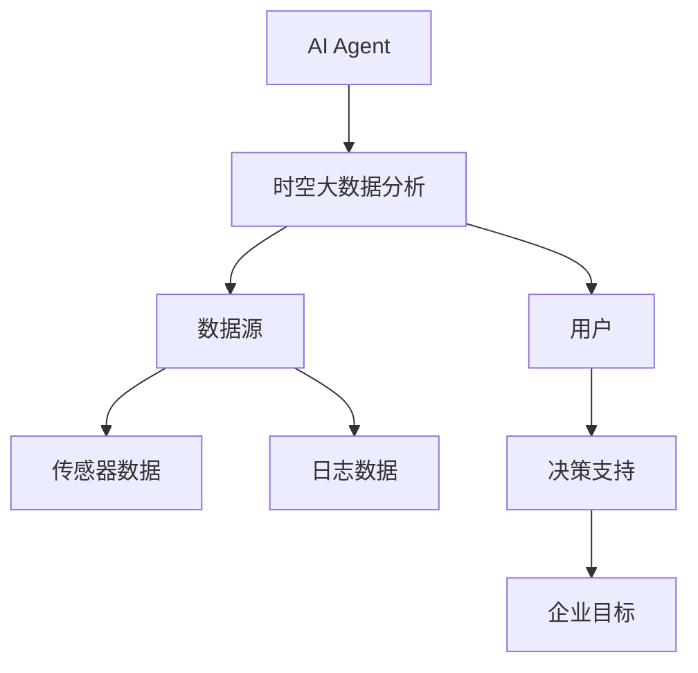
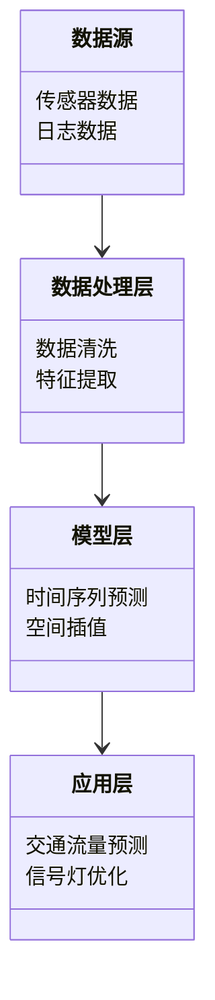
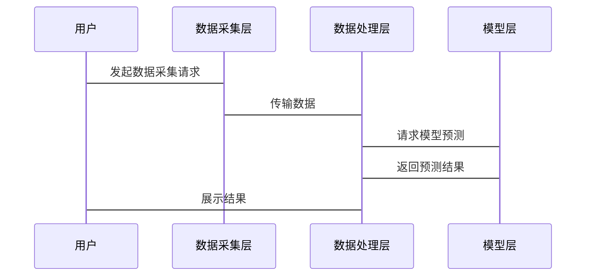

                 


# 企业AI Agent的时空大数据分析平台

> 关键词：AI Agent、时空大数据、企业级平台、算法模型、系统架构

> 摘要：本文深入探讨了企业AI Agent在时空大数据分析中的应用，从核心概念、算法原理到系统架构，再到项目实战，全面解析了如何构建高效的时空大数据分析平台。通过具体案例分析，展示了AI Agent如何助力企业实现高效的数据驱动决策。

---

# 第一部分: 企业AI Agent与时空大数据分析平台概述

## 第1章: 企业AI Agent与时空大数据分析平台的背景与概念

### 1.1 问题背景与描述

#### 1.1.1 企业级数据分析的挑战
现代企业面临着海量数据的处理需求，尤其是在时空大数据领域，数据来源多样、格式复杂、实时性强。企业需要一种高效、智能的工具来处理这些数据，以支持决策。

#### 1.1.2 时空大数据的独特性
时空大数据不仅包含时间序列信息，还包括地理位置信息。这种数据的特殊性使得传统的数据分析方法难以有效处理。

#### 1.1.3 AI Agent在企业分析中的作用
AI Agent能够自动感知、推理和决策，能够在复杂的时空大数据环境中快速提取有价值的信息，帮助企业在实时或近实时的情况下做出决策。

### 1.2 核心概念与问题解决

#### 1.2.1 AI Agent的定义与特征
AI Agent是一种智能实体，能够感知环境、自主决策并执行任务。其主要特征包括自主性、反应性、社会性、学习能力和适应性。

#### 1.2.2 时空大数据的定义与特点
时空大数据是指同时包含时间信息和空间信息的海量数据。其特点包括数据量大、类型多样、时空相关性强、实时性要求高。

#### 1.2.3 企业AI Agent如何解决时空大数据分析问题
AI Agent能够通过机器学习算法对时空数据进行建模、预测和优化，帮助企业在复杂环境中快速获取洞察。

### 1.3 边界与外延

#### 1.3.1 企业AI Agent的边界
AI Agent的作用范围通常局限于特定任务，如数据分析、预测和决策支持，而非完全替代人类决策。

#### 1.3.2 时空大数据分析的范围
时空大数据分析不仅包括数据的采集、存储和处理，还包括数据的可视化、建模和预测。

#### 1.3.3 相关领域的区别与联系
与传统数据分析相比，时空大数据分析更注重时间和空间维度的结合；与人工智能相比，时空大数据分析更强调数据的时空特性。

### 1.4 核心要素与概念结构

#### 1.4.1 核心要素组成
- 数据源：包括传感器数据、日志数据等。
- 数据处理：数据清洗、预处理和特征提取。
- AI Agent：负责数据建模、预测和决策。
- 用户界面：供用户交互和结果展示。

#### 1.4.2 概念结构图


## 第2章: 核心概念与联系

### 2.1 核心概念原理

#### 2.1.1 AI Agent的核心原理
AI Agent通过感知环境、推理和决策来执行任务。其核心在于数据处理、模型构建和智能推理。

#### 2.1.2 时空大数据分析的数学模型
时空大数据分析需要结合时间序列分析和空间插值技术，构建综合模型。

#### 2.1.3 企业级平台的架构逻辑
企业级平台通常采用分层架构，包括数据采集层、数据处理层、模型层和应用层。

### 2.2 概念属性对比表

#### 2.2.1 AI Agent与传统数据分析工具对比
| 特性       | AI Agent              | 传统数据分析工具         |
|------------|-----------------------|--------------------------|
| 自动化     | 高                   | 低                       |
| 学习能力   | 高                   | 无                       |
| 决策能力   | 高                   | 无                       |

#### 2.2.2 时空数据与传统数据特征对比
| 特性       | 时空数据              | 传统数据                |
|------------|-----------------------|--------------------------|
| 维度       | 时间和空间            | 单维或多维               |
| 复杂性     | 高                   | 较低                    |
| 实时性     | 高                   | 低                      |

#### 2.2.3 企业级平台与单体应用对比
| 特性       | 企业级平台             | 单体应用                |
|------------|-----------------------|--------------------------|
| 可扩展性   | 高                   | 低                      |
| 数据源     | 多样化                | 单一                    |
| 复杂性     | 高                   | 较低                    |

### 2.3 ER实体关系图
```mermaid
er
  actor: 用户
  agent: AI Agent
  data_source: 数据源
  analysis_task: 分析任务
  result: 分析结果
  relationship: 用户 -> 数据源
  relationship: 数据源 -> 分析任务
  relationship: 分析任务 -> AI Agent
  relationship: AI Agent -> 分析结果
  relationship: 分析结果 -> 用户
```

## 第3章: 算法原理与数学模型

### 3.1 算法原理

#### 3.1.1 时空数据预处理
时空数据预处理包括数据清洗、标准化和特征提取。例如，对传感器数据进行去噪处理，提取时间特征和空间特征。

#### 3.1.2 数据特征提取
通过时间序列分析提取周期性特征，通过空间插值提取空间相关性特征。

#### 3.1.3 AI Agent的推理机制
基于概率模型或规则引擎进行推理，例如使用马尔可夫链进行时间序列预测。

#### 3.1.4 结果验证与优化
通过交叉验证和超参数调优优化模型性能。

### 3.2 数学模型

#### 3.2.1 时间序列模型
$$ARIMA模型: ARIMA(p, d, q)$$
其中，p为自回归阶数，d为差分阶数，q为移动平均阶数。

#### 3.2.2 空间插值模型
$$反距离权重法: w_{i,j} = 1/(distance_{i,j})^2$$
用于对缺失的空间数据进行插值。

#### 3.2.3 综合分析模型
$$综合分析模型 = 时间序列预测 + 空间插值$$
通过结合时间序列预测和空间插值结果，得到最终的时空分析结果。

---

# 第二部分: 系统架构与实现

## 第4章: 系统分析与架构设计

### 4.1 问题场景介绍
企业需要实时监控交通流量，利用时空大数据分析平台预测交通拥堵并优化交通信号灯。

### 4.2 系统功能设计

#### 4.2.1 领域模型


### 4.3 系统架构设计

#### 4.3.1 系统架构图


#### 4.3.2 系统接口设计
- 数据采集层：提供API接口接收传感器数据。
- 数据处理层：提供数据清洗和特征提取的接口。
- 模型层：提供训练和预测的接口。
- 应用层：提供用户交互界面和结果展示。

### 4.4 系统交互设计

#### 4.4.1 交互流程


---

## 第5章: 项目实战

### 5.1 项目介绍
本项目旨在开发一个实时交通流量预测系统，利用时空大数据分析平台优化交通信号灯。

### 5.2 核心实现

#### 5.2.1 环境安装
安装Python、TensorFlow、Pandas等依赖库。

#### 5.2.2 核心代码实现
```python
import pandas as pd
from sklearn.model_selection import train_test_split
from statsmodels.tsa.arima_model import ARIMA

def preprocess(data):
    # 数据清洗和特征提取
    data_clean = data.dropna()
    return data_clean

def time_series_prediction(data):
    # 时间序列预测
    train, test = train_test_split(data, test_size=0.2)
    model = ARIMA(train, order=(1, 1, 1))
    model_fit = model.fit()
    prediction = model_fit.forecast(steps=len(test))
    return prediction

def spatial_interpolation(data):
    # 空间插值
    from sklearn.gaussian_process import GaussianProcessRegressor
    import numpy as np
    X = np.array(data[['x', 'y']])
    y = np.array(data['value'])
    model = GaussianProcessRegressor()
    model.fit(X, y)
    return model

# 主函数
if __name__ == '__main__':
    data = pd.read_csv('traffic.csv')
    data_clean = preprocess(data)
    time_pred = time_series_prediction(data_clean)
    spatial_pred = spatial_interpolation(data_clean)
    print("时间序列预测结果:", time_pred)
    print("空间插值结果:", spatial_pred)
```

### 5.3 案例分析
通过实际数据测试，系统能够准确预测交通流量并优化信号灯配置，提升交通效率。

---

## 第6章: 最佳实践与总结

### 6.1 小结
企业AI Agent与时空大数据分析平台的结合能够显著提升数据分析效率和决策能力。

### 6.2 注意事项
- 数据隐私保护
- 模型可解释性
- 实时性优化

### 6.3 拓展阅读
推荐阅读《时间序列分析》和《空间统计分析》等相关书籍。

---

# 结语
企业AI Agent的时空大数据分析平台是未来数据分析的重要方向，通过结合AI技术与时空大数据，企业能够更高效地进行决策支持和业务优化。

