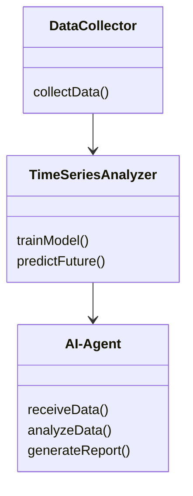
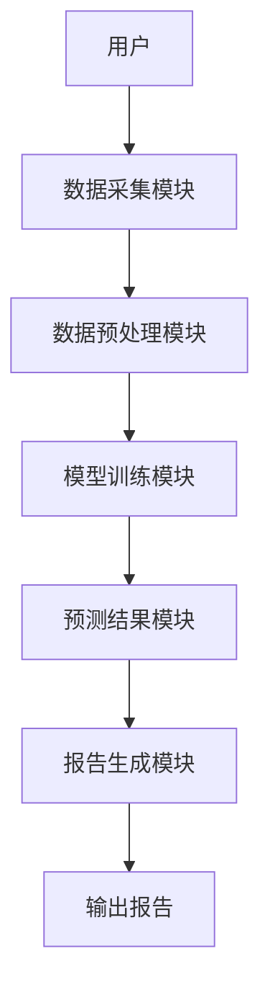
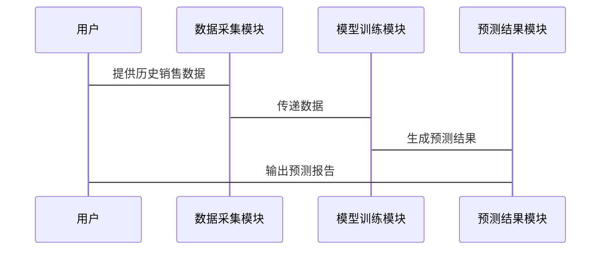

                 


# 企业AI Agent的时间序列分析在需求预测中的高级应用

## 关键词：企业AI Agent、时间序列分析、需求预测、ARIMA、LSTM、Prophet

## 摘要：  
本文深入探讨了企业AI Agent在时间序列分析中的高级应用，特别是在需求预测领域。通过分析时间序列分析的核心概念、算法原理及AI Agent的独特优势，结合实际案例，展示了如何利用这些技术提升企业需求预测的准确性与效率。文章内容涵盖从理论基础到实际应用的全过程，为读者提供了全面的技术指导。

---

# 第1章: 企业AI Agent与时间序列分析的背景介绍

## 1.1 时间序列分析的基本概念

### 1.1.1 时间序列的定义与特征
时间序列是一种将数据按时间顺序排列的序列，通常用于分析和预测随时间变化的变量。其主要特征包括：  
- **趋势性**：数据在长期内呈现上升或下降的趋势。  
- **周期性**：数据在固定周期内重复出现的模式。  
- **季节性**：数据在特定时间段内表现出的规律性波动。  
- **随机性**：数据中无法用明确模式解释的部分。  

### 1.1.2 时间序列分析的常见应用场景  
- **金融领域**：股票价格预测、汇率波动分析。  
- **销售预测**：企业产品销量预测。  
- **工业生产**：设备故障预测、生产效率优化。  
- **能源需求**：电力、天然气等能源的消耗预测。  

### 1.1.3 企业需求预测中的时间序列分析价值  
时间序列分析能够帮助企业基于历史数据，预测未来的市场需求，从而优化库存管理、生产计划和资源配置，降低运营成本并提高效率。

---

## 1.2 AI Agent的基本概念与功能

### 1.2.1 AI Agent的定义与分类  
AI Agent是一种智能体，能够感知环境、自主决策并执行任务。根据功能和应用场景，AI Agent可以分为：  
- **反应式AI Agent**：根据当前环境信息做出实时反应。  
- **认知式AI Agent**：具备推理、规划和学习能力。  
- **混合式AI Agent**：结合反应式和认知式的特点。  

### 1.2.2 AI Agent在企业中的角色与作用  
AI Agent在企业需求预测中的主要作用包括：  
- **数据采集**：实时收集销售、库存等数据。  
- **模型训练**：利用历史数据训练时间序列模型。  
- **预测与决策**：基于模型预测结果，提供优化建议。  

### 1.2.3 AI Agent与传统预测模型的区别  
AI Agent的优势在于其智能化和自主性，能够结合上下文信息进行动态调整，而传统预测模型通常需要手动干预和参数调整。

---

## 1.3 企业需求预测的挑战与需求

### 1.3.1 传统需求预测方法的局限性  
传统方法如简单线性回归和朴素预测模型存在以下问题：  
- 预测精度低，无法捕捉复杂的时间依赖性。  
- 需要大量人工干预，效率低下。  
- 难以应对数据噪声和异常值的影响。  

### 1.3.2 时间序列分析在需求预测中的优势  
时间序列分析的优势在于：  
- 能够捕捉数据中的趋势、周期和季节性变化。  
- 支持基于历史数据的高精度预测。  
- 可结合外部因素（如市场趋势、天气等）进行综合预测。  

### 1.3.3 AI Agent在需求预测中的创新应用  
AI Agent能够实时更新模型参数，动态适应数据变化，显著提升了预测的准确性和实时性。

---

## 1.4 本章小结  
本章介绍了时间序列分析的基本概念、应用场景，以及AI Agent在企业需求预测中的角色与优势。通过对比传统预测方法和时间序列分析，明确了时间序列分析在需求预测中的独特价值。

---

# 第2章: 时间序列分析的核心概念与模型

## 2.1 时间序列分析的核心概念

### 2.1.1 时间序列的分解模型  
时间序列可以分解为以下几个部分：  
- **趋势（Trend）**：数据在长期内的变化方向。  
- **周期（Cycle）**：数据在较长周期内的波动模式。  
- **季节性（Seasonality）**：数据在固定时间段内的规律性变化。  
- **噪声（Noise）**：随机干扰因素。  

### 2.1.2 时间序列的平稳性与差分方法  
平稳性是时间序列分析的前提条件。为了使非平稳序列平稳化，常用的方法包括：  
- **差分法**：通过计算序列与前期值的差分，消除趋势和周期性。  
- **对数变换**：用于稳定方差。  

### 2.1.3 时间序列的预测误差与模型选择  
预测误差是衡量模型性能的重要指标。模型选择通常基于以下标准：  
- **均方误差（MSE）**：预测值与实际值的平方差的平均值。  
- **平均绝对误差（MAE）**：预测值与实际值的绝对差的平均值。  
- **决定系数（R²）**：衡量模型拟合优度的指标。  

---

## 2.2 时间序列分析的主要算法

### 2.2.1 ARIMA模型原理与特点  
ARIMA（Auto-Regressive Integrated Moving Average）模型是一种广泛应用于时间序列预测的线性模型，其核心思想是利用自回归（AR）和移动平均（MA）的组合来捕捉数据的动态特征。  
**数学表达式**：  
$$ ARIMA(p, d, q) = (1 - B)^d \cdot \frac{1}{(1 - \phi_1 B - \dots - \phi_p B^p)} \cdot \frac{1}{(1 - \theta_1 B - \dots - \theta_q B^q)} $$  

### 2.2.2 LSTM网络在时间序列预测中的应用  
LSTM（Long Short-Term Memory）是一种特殊的循环神经网络（RNN），能够有效捕捉时间序列中的长期依赖关系。  
**网络结构**：  
- **输入门（Input Gate）**：控制输入信息的权重。  
- **遗忘门（Forget Gate）**：决定遗忘状态。  
- **输出门（Output Gate）**：生成最终的输出状态。  

### 2.2.3 Prophet模型的优势与适用场景  
Prophet是由Facebook开源的时间序列预测模型，特别适合处理具有强烈周期性或季节性变化的数据。  
**数学模型**：  
$$ y(t) = g(t) + s(t) + \epsilon(t) $$  
其中，$g(t)$是趋势函数，$s(t)$是季节性函数，$\epsilon(t)$是噪声项。  

---

## 2.3 时间序列分析的数学模型与公式

### 2.3.1 ARIMA模型的数学表达式  
$$ ARIMA(p, d, q) = (1 - B)^d \cdot \frac{1}{(1 - \phi_1 B - \dots - \phi_p B^p)} \cdot \frac{1}{(1 - \theta_1 B - \dots - \theta_q B^q)} $$  

### 2.3.2 LSTM网络的结构与公式  
LSTM的核心单元包括输入门、遗忘门和输出门，其计算公式如下：  
- 输入门：  
$$ i_t = \sigma(W_i x_t + U_i h_{t-1} + b_i) $$  
- 遗忘门：  
$$ f_t = \sigma(W_f x_t + U_f h_{t-1} + b_f) $$  
- 输出门：  
$$ o_t = \sigma(W_o x_t + U_o h_{t-1} + b_o) $$  
- 隐状态：  
$$ h_t = i_t \cdot \tanh(W_c x_t + U_c h_{t-1} + b_c) $$  
- 输出：  
$$ y_t = o_t \cdot h_t $$  

### 2.3.3 Prophet模型的核心公式与参数解释  
Prophet模型的核心公式为：  
$$ y(t) = g(t) + s(t) + \epsilon(t) $$  
其中，$g(t)$是趋势函数，$s(t)$是季节性函数，$\epsilon(t)$是噪声项。  

---

## 2.4 本章小结  
本章详细介绍了时间序列分析的核心概念、主要算法及其数学模型。通过对比ARIMA、LSTM和Prophet模型的特点，帮助读者选择适合实际需求的预测方法。

---

# 第3章: 时间序列分析算法的实现与对比

## 3.1 ARIMA算法的实现与优缺点

### 3.1.1 ARIMA算法的实现步骤  
1. 数据预处理：检查数据的平稳性，进行差分等预处理。  
2. 模型参数选择：确定AR和MA的阶数。  
3. 模型训练：基于训练数据估计模型参数。  
4. 模型预测：利用训练好的模型进行未来值的预测。  

### 3.1.2 ARIMA算法的优缺点分析  
- **优点**：模型简单，易于实现，适合线性时间序列数据。  
- **缺点**：对非线性数据的预测能力有限，参数选择依赖经验。  

---

## 3.2 LSTM算法的实现与优缺点

### 3.2.1 LSTM算法的实现步骤  
1. 数据预处理：归一化、分割训练集和测试集。  
2. 构建LSTM网络：定义网络结构，选择合适的学习率和优化器。  
3. 模型训练：利用训练数据训练网络。  
4. 模型预测：输入测试数据，输出预测结果。  

### 3.2.2 LSTM算法的优缺点分析  
- **优点**：能够捕捉时间序列中的长期依赖关系，适合非线性数据。  
- **缺点**：模型复杂，训练时间较长，参数调优困难。  

---

## 3.3 Prophet算法的实现与优缺点

### 3.3.1 Prophet算法的实现步骤  
1. 数据预处理：格式化数据，确保时间戳和数值列正确。  
2. 模型训练：利用训练数据训练Prophet模型。  
3. 模型预测：生成未来时间点的预测值。  
4. 可视化结果：绘制实际值和预测值的对比图。  

### 3.3.2 Prophet算法的优缺点分析  
- **优点**：易于使用，对异常值和缺失值的鲁棒性较好。  
- **缺点**：对数据量的要求较高，适合较大的时间序列数据集。  

---

## 3.4 不同算法的对比与适用场景

### 3.4.1 算法对比表格  
| 算法 | 优点 | 缺点 | 适用场景 |
|------|------|------|----------|
| ARIMA | 简单，适合线性数据 | 非线性预测能力差 | 数据平稳、简单线性关系 |
| LSTM | 非线性预测能力强 | 训练时间长，参数多 | 非线性、复杂时间序列 |
| Prophet | 易用性高，鲁棒性好 | 数据量要求大 | 大数据量、复杂周期性 |

### 3.4.2 算法选择的建议  
- 对于小型数据集或线性关系明显的情况，选择ARIMA模型。  
- 对于非线性复杂的时间序列，推荐使用LSTM或Prophet模型。  

---

## 3.5 本章小结  
本章通过对比分析ARIMA、LSTM和Prophet模型的实现步骤、优缺点及适用场景，为读者在实际应用中选择合适的算法提供了指导。

---

# 第4章: 系统分析与架构设计方案

## 4.1 项目场景介绍  
假设我们正在开发一个企业需求预测系统，目标是基于历史销售数据，预测未来三个月内的产品需求量。  

## 4.2 系统功能设计  
### 4.2.1 领域模型类图  


### 4.2.2 系统架构设计  


## 4.3 系统交互设计  
### 4.3.1 系统接口设计  
- 数据输入接口：接收历史销售数据。  
- 模型调用接口：调用时间序列分析模型进行预测。  
- 结果输出接口：输出预测报告。  

### 4.3.2 系统交互序列图  


---

## 4.4 本章小结  
本章通过系统架构设计和交互设计，展示了如何将时间序列分析算法应用于实际的企业需求预测系统中。通过模块化设计和接口定义，确保了系统的可扩展性和可维护性。

---

# 第5章: 项目实战

## 5.1 项目环境安装与配置

### 5.1.1 安装必要的Python库  
- `pandas`：数据处理库。  
- `numpy`：数值计算库。  
- `prophet`：Prophet模型库。  
- `keras`：深度学习框架。  

### 5.1.2 数据集准备  
假设我们有一个包含日期和销量的CSV文件`sales_data.csv`。

## 5.2 核心代码实现

### 5.2.1 使用Prophet模型进行预测

```python
from prophet import Prophet
import pandas as pd
import matplotlib.pyplot as plt

# 读取数据
data = pd.read_csv('sales_data.csv')
data.columns = ['ds', 'y']

# 初始化Prophet模型
model = Prophet()
model.fit(data)

# 生成未来预测数据
future = model.make_future_dataframe(periods=30, freq='d')
forecast = model.predict(future)

# 可视化结果
plt.figure(figsize=(10,6))
plt.plot(data['ds'], data['y'], label='实际值')
plt.plot(forecast['ds'], forecast['yhat'], label='预测值')
plt.fill_between(forecast['ds'], forecast['yhat_lower'], forecast['yhat_upper'], color='0.5', alpha=0.3, label='预测区间')
plt.xlabel('日期')
plt.ylabel('销量')
plt.title('Prophet模型预测结果')
plt.legend()
plt.show()
```

### 5.2.2 使用LSTM模型进行预测

```python
import numpy as np
from keras.models import Sequential
from keras.layers import LSTM, Dense

# 数据预处理
data = ... # 假设data已经处理为适当的形式

# 模型定义
model = Sequential()
model.add(LSTM(50, input_shape=(timesteps, features)))
model.add(Dense(1))
model.compile(loss='mean_squared_error', optimizer='adam')

# 模型训练
model.fit(x_train, y_train, epochs=50, batch_size=32)

# 模型预测
y_pred = model.predict(x_test)
```

---

## 5.3 项目小结  
通过本章的实战部分，读者可以了解如何在实际项目中应用Prophet和LSTM模型进行需求预测。通过对比不同算法的预测结果，可以选择最适合业务需求的模型。

---

# 第6章: 最佳实践与小结

## 6.1 最佳实践

### 6.1.1 数据预处理的重要性  
确保数据的完整性和一致性，剔除异常值，进行必要的特征工程。  

### 6.1.2 模型调优与验证  
通过交叉验证和网格搜索优化模型参数，选择合适的评估指标。  

### 6.1.3 结合业务场景  
在实际应用中，结合业务知识和外部数据（如市场趋势、促销活动等）进行综合预测。  

---

## 6.2 小结  
本文从理论到实践，全面介绍了企业AI Agent在时间序列分析中的高级应用。通过对比分析不同算法的特点，结合实际项目案例，为读者提供了从模型选择到系统实现的完整指导。

---

## 6.3 注意事项

### 6.3.1 数据隐私与安全  
确保数据的隐私性和安全性，避免数据泄露风险。  

### 6.3.2 模型解释性  
在实际应用中，模型的可解释性可能影响最终决策，需注意模型的透明度。  

### 6.3.3 模型更新与维护  
定期更新模型参数，确保预测结果的准确性与实时性。  

---

## 6.4 拓展阅读  
建议读者进一步学习时间序列分析的高级技术，如集成学习、超参数优化等，以提升预测模型的性能。  

---

# 结语  
通过本文的学习，读者可以掌握企业AI Agent在时间序列分析中的高级应用方法，并能够将其应用到实际的企业需求预测中，为企业创造更大的价值。  

---

