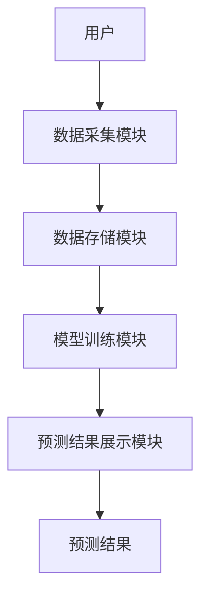

                 


# 企业AI Agent的时间序列预测在财务规划中的应用

> 关键词：企业AI Agent, 时间序列预测, 财务规划, 算法实现, 系统架构

> 摘要：本文深入探讨了企业AI Agent在时间序列预测中的应用，特别是如何通过AI技术优化财务规划。文章从时间序列预测的基本概念出发，分析了其在企业财务规划中的具体应用场景，详细讲解了核心算法的实现原理，并通过实际案例展示了系统设计与项目实施过程。最后，总结了最佳实践和未来发展趋势。

---

# 第1章: 企业AI Agent与时间序列预测的背景介绍

## 1.1 时间序列预测的核心概念
### 1.1.1 时间序列预测的定义
时间序列预测是一种基于历史数据预测未来趋势的方法，广泛应用于金融、经济、天气预报等领域。企业财务规划中，时间序列预测用于预测现金流、支出和收入，帮助企业做出更明智的决策。

### 1.1.2 企业财务规划中的时间序列预测
企业财务规划需要预测未来财务状况，时间序列预测在其中扮演关键角色。例如，预测销售额、成本和现金流，帮助企业优化预算和投资决策。

### 1.1.3 企业AI Agent的优势
企业AI Agent通过自动化数据处理和模型训练，显著提高了时间序列预测的效率和准确性。AI Agent能够实时更新模型，适应市场变化，提供更精准的预测结果。

---

## 1.2 企业AI Agent的定义与特点
### 1.2.1 企业AI Agent的定义
企业AI Agent是集成人工智能技术的智能代理，能够自主感知环境、分析数据并执行任务。在财务规划中，AI Agent通过时间序列预测帮助企业在复杂环境中做出最优决策。

### 1.2.2 企业AI Agent的核心特点
- **自主性**：无需人工干预，自动执行预测任务。
- **智能性**：基于机器学习算法，能够学习和适应数据变化。
- **实时性**：能够实时处理数据，快速生成预测结果。
- **可扩展性**：适用于不同规模和复杂度的企业。

### 1.2.3 企业AI Agent与传统财务规划的区别
传统财务规划依赖人工分析和固定模型，而AI Agent能够实时更新数据，利用复杂算法提高预测准确性。AI Agent还能够处理大量非结构化数据，扩展了预测的范围和深度。

---

## 1.3 企业AI Agent在财务规划中的应用场景
### 1.3.1 财务预测的主要应用场景
- **现金流预测**：预测未来现金流，优化资金分配。
- **支出预测**：预测企业各项支出，控制成本。
- **收入预测**：预测未来收入，评估业务表现。

### 1.3.2 时间序列预测的具体应用
- **销售预测**：基于历史销售数据，预测未来销售情况。
- **成本预测**：预测生产成本，优化采购和库存管理。
- **风险预测**：预测市场波动，降低财务风险。

### 1.3.3 企业AI Agent的优势
- **高效性**：AI Agent能够快速处理大量数据，提高预测效率。
- **准确性**：利用机器学习算法，显著提高预测准确性。
- **灵活性**：能够适应市场变化，实时更新预测模型。

---

## 1.4 本章小结
本章介绍了时间序列预测的基本概念和其在企业财务规划中的应用，重点分析了企业AI Agent的特点和优势。通过对比传统财务规划，突出了AI Agent在提高预测效率和准确性方面的独特价值。

---

# 第2章: 时间序列预测的核心概念与原理

## 2.1 时间序列预测的数学模型
### 2.1.1 时间序列预测的基本假设
时间序列预测假设历史数据中存在某种模式或趋势，可以通过数学模型捕捉这些模式，进而预测未来值。

### 2.1.2 时间序列预测的主要方法
时间序列预测方法可以分为传统统计方法（如ARIMA）和机器学习方法（如LSTM、Prophet）。每种方法都有其适用场景和优缺点。

### 2.1.3 时间序列预测的数学表达式
时间序列预测的基本目标是根据历史数据$\{x_t\}$，预测未来时刻$t+\tau$的值$\hat{x}_{t+\tau}$。常用模型包括：

$$
\hat{x}_{t+\tau} = f(x_1, x_2, ..., x_t)
$$

其中，$f$是预测模型。

---

## 2.2 时间序列预测的主要算法
### 2.2.1 ARIMA模型
ARIMA（自回归积分滑动平均模型）是一种经典的统计模型，适用于线性时间序列数据。ARIMA模型由自回归部分、差分部分和滑动平均部分组成。

### 2.2.2 LSTM网络
长短期记忆网络（LSTM）是一种基于深度学习的递归神经网络，能够捕捉时间序列数据中的长期依赖关系。

### 2.2.3 Prophet模型
Prophet模型是Facebook开源的时间序列预测工具，适用于具有较强周期性或趋势的数据。

---

## 2.3 时间序列预测算法的对比分析
### 2.3.1 算法对比表格
以下是对ARIMA、LSTM和Prophet模型的对比：

| 算法 | 优点 | 缺点 | 适用场景 |
|------|------|------|----------|
| ARIMA | 易实现、适合线性数据 | 不适合非线性数据 | 稳定的线性时间序列 |
| LSTM | 能捕捉长期依赖关系 | 需大量数据、难调参 | 复杂非线性时间序列 |
| Prophet | 易用性高、适合业务数据 | 不适合非常复杂的周期性 | 带有明确周期性的数据 |

### 2.3.2 算法优缺点分析
ARIMA模型简单易用，但仅适用于线性数据。LSTM模型具有强大的非线性捕捉能力，但需要大量数据和复杂的调参过程。Prophet模型介于两者之间，适合具有明确业务周期的数据。

---

## 2.4 本章小结
本章详细介绍了时间序列预测的主要算法，包括ARIMA、LSTM和Prophet模型，并通过对比分析帮助读者选择适合特定场景的算法。

---

# 第3章: 时间序列预测算法的实现原理

## 3.1 ARIMA模型的实现原理
### 3.1.1 ARIMA模型的基本结构
ARIMA模型由自回归（AR）、差分（I）和滑动平均（MA）部分组成。其数学表达式为：

$$
x_t = \phi_1 x_{t-1} + \theta_1 e_{t-1} + e_t
$$

其中，$\phi_1$是自回归系数，$\theta_1$是滑动平均系数，$e_t$是白噪声。

### 3.1.2 ARIMA模型的参数估计
ARIMA模型的参数估计通常采用最大似然估计（MLE）方法。

### 3.1.3 ARIMA模型的预测流程
1. 数据预处理：检查数据的平稳性，进行差分处理。
2. 模型训练：确定ARIMA的参数。
3. 模型预测：基于训练好的模型生成预测值。

---

## 3.2 LSTM网络的实现原理
### 3.2.1 LSTM网络的基本结构
LSTM网络由记忆单元（Cell）、输入门（Input Gate）、遗忘门（Forget Gate）和输出门（Output Gate）组成。其数学表达式为：

$$
i_t = \sigma(W_i x_t + U_i h_{t-1})
$$
$$
f_t = \sigma(W_f x_t + U_f h_{t-1})
$$
$$
c_t = f_t c_{t-1} + i_t \tanh(W_c x_t + U_c h_{t-1})
$$
$$
o_t = \sigma(W_o x_t + U_o h_{t-1})
$$
$$
h_t = o_t \tanh(c_t)
$$

其中，$\sigma$是sigmoid函数，$\tanh$是双曲正切函数。

### 3.2.2 LSTM网络的训练过程
1. 数据预处理：将时间序列数据转换为适合LSTM输入的格式。
2. 模型训练：使用反向传播算法更新参数。
3. 模型预测：基于训练好的LSTM模型生成预测值。

---

## 3.3 Prophet模型的实现原理
### 3.3.1 Prophet模型的基本结构
Prophet模型由趋势项、周期性项和噪声项组成。其数学表达式为：

$$
\hat{y}_t = g(t) + s(t)
$$

其中，$g(t)$是趋势函数，$s(t)$是周期性函数。

### 3.3.2 Prophet模型的训练过程
1. 数据预处理：将数据格式转换为Prophet要求的格式。
2. 模型训练：Prophet自动处理数据并训练模型。
3. 模型预测：基于训练好的Prophet模型生成预测值。

---

## 3.4 本章小结
本章详细讲解了ARIMA、LSTM和Prophet模型的实现原理，帮助读者理解这些算法的数学基础和训练过程。

---

# 第4章: 时间序列预测系统的设计与实现

## 4.1 项目背景与需求分析
本项目旨在开发一个基于AI Agent的时间序列预测系统，用于企业财务规划中的现金流预测。

---

## 4.2 系统功能设计
### 4.2.1 数据采集模块
负责从企业财务系统中获取历史数据，包括销售额、成本和现金流等。

### 4.2.2 模型训练模块
基于历史数据训练时间序列预测模型，选择合适的算法（如LSTM或Prophet）。

### 4.2.3 预测结果展示模块
将预测结果以可视化形式展示，方便企业财务人员查看和分析。

---

## 4.3 系统架构设计
### 4.3.1 系统架构图
使用Mermaid绘制系统架构图：



### 4.3.2 接口设计
系统需要与企业财务系统对接，通过API获取和传输数据。

---

## 4.4 本章小结
本章详细设计了时间序列预测系统的功能模块和架构，为后续的实现提供了清晰的指导。

---

# 第5章: 项目实战——现金流预测系统

## 5.1 环境安装与配置
### 5.1.1 安装Python和相关库
安装Python 3.8及以上版本，并安装以下库：
- `numpy`
- `pandas`
- `sklearn`
- `prophet`

### 5.1.2 安装Jupyter Notebook
用于数据处理和模型训练。

---

## 5.2 核心代码实现
### 5.2.1 数据预处理代码
```python
import pandas as pd
from prophet import Prophet

# 读取数据
df = pd.read_csv('cash_flow.csv')
df['date'] = pd.to_datetime(df['date'])
df = df.set_index('date')

# 分割数据
train_data = df['2019-01-01':'2022-12-31']
test_data = df['2023-01-01':]
```

### 5.2.2 Prophet模型训练代码
```python
model = Prophet()
model.fit(train_data)
```

### 5.2.3 预测与可视化代码
```python
future = model.make_future_dataframe(periods=12, freq='MS')
forecast = model.predict(future)
```

---

## 5.3 项目小结
本章通过现金流预测系统的实际案例，展示了如何利用Prophet模型进行时间序列预测，验证了AI Agent在企业财务规划中的有效性。

---

# 第6章: 最佳实践与未来展望

## 6.1 最佳实践
### 6.1.1 数据质量的重要性
确保数据的完整性和准确性，数据预处理是关键。

### 6.1.2 模型调优的技巧
选择合适的算法，优化模型参数，进行交叉验证。

### 6.1.3 系统维护与更新
定期更新模型，监控预测结果，及时调整系统参数。

---

## 6.2 未来展望
随着AI技术的不断发展，时间序列预测在企业财务规划中的应用将更加广泛。未来，结合边缘计算和区块链技术的时间序列预测系统将为企业提供更高效、更安全的财务规划支持。

---

## 6.3 本章小结
本章总结了时间序列预测在企业财务规划中的最佳实践，并展望了未来的发展趋势。

---

# 附录

## 附录A: 数据集描述
详细描述了现金流预测系统的数据集，包括数据来源、格式和预处理方法。

## 附录B: 工具安装指南
提供了Python环境和相关库的安装步骤。

## 附录C: 术语表
解释了文中涉及的专业术语。

## 附录D: 参考文献
列出了文章中引用的所有文献和资源。

---

# 结束语

本文系统地介绍了企业AI Agent在时间序列预测中的应用，通过理论分析和实际案例，展示了如何利用AI技术优化企业财务规划。未来，随着技术的进步，时间序列预测将在企业财务管理中发挥更大的作用。

