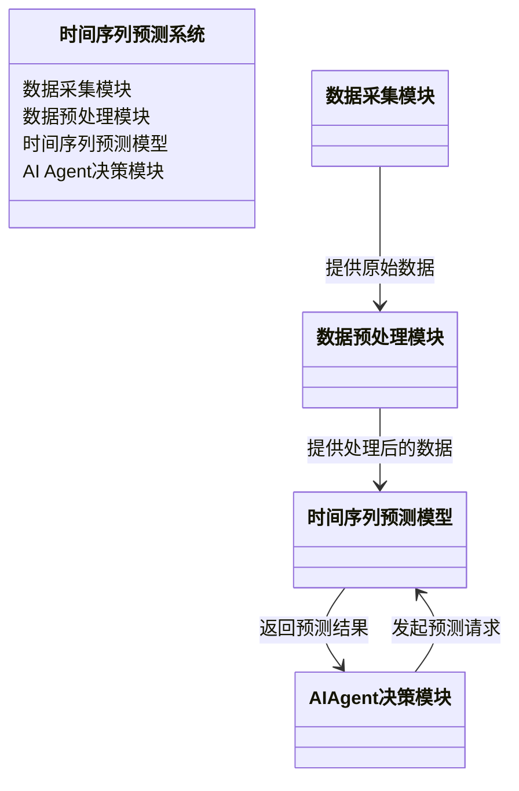

                 


# 企业AI Agent的时间序列预测在需求规划中的应用

## 关键词：企业需求规划、时间序列预测、AI Agent、机器学习、预测模型

## 摘要

随着企业对高效需求规划的需求不断增加，时间序列预测在这一领域的重要性日益凸显。本文深入探讨了AI Agent如何通过时间序列预测技术优化企业需求规划流程。文章从理论基础到实际应用，系统性地分析了AI Agent在时间序列预测中的作用，并通过案例展示了其在企业中的具体应用。同时，文章还详细介绍了时间序列预测模型的构建过程、AI Agent的系统架构设计，以及项目实施的最佳实践。

---

## 第一部分：背景介绍

### 第1章：时间序列预测与AI Agent概述

#### 1.1 问题背景

现代企业在制定需求规划时，面临着复杂多变的市场环境和客户需求。传统的基于经验的预测方法已经难以满足精准性和实时性的要求。时间序列预测作为一种高效的数据驱动方法，能够帮助企业更好地捕捉市场趋势和客户需求变化。

AI Agent（人工智能代理）作为一种能够自主感知环境、做出决策并执行任务的智能系统，为企业需求规划提供了新的解决方案。AI Agent能够实时分析历史数据和当前市场信息，生成准确的需求预测，并根据预测结果优化企业资源分配。

#### 1.2 问题描述

企业在需求规划过程中常常面临以下问题：
- 数据量大且复杂，难以快速提取有效信息。
- 市场变化快，传统的预测模型难以适应动态需求。
- 预测结果缺乏实时性，难以指导实时决策。
- 缺乏智能化工具，难以实现预测结果的自动化应用。

AI Agent的时间序列预测解决方案能够有效应对这些问题，通过智能化的数据分析和预测，提升企业需求规划的效率和准确性。

#### 1.3 问题解决

AI Agent通过集成时间序列预测模型，能够实现以下功能：
- 实时采集和处理企业需求数据。
- 基于历史数据和市场信息，生成精准的需求预测。
- 根据预测结果，优化企业资源分配和生产计划。
- 提供实时反馈和调整建议，确保预测结果的准确性。

通过AI Agent的时间序列预测，企业能够实现需求规划的智能化和自动化，显著提升预测的准确性和效率。

#### 1.4 边界与外延

时间序列预测的应用范围主要集中在具有明显时间依赖性的数据上，如销售数据、生产数据等。AI Agent的应用边界则取决于企业的需求和资源。AI Agent的时间序列预测系统通常与其他企业系统（如ERP、CRM）集成，实现数据的共享和协同工作。

与其他预测方法（如统计预测、机器学习预测）相比，AI Agent的时间序列预测具有更高的智能化和自动化水平，能够在复杂环境下实现精准预测。

#### 1.5 概念结构与核心要素

时间序列预测系统的核心要素包括数据采集、数据预处理、模型选择、模型训练、预测结果输出等。AI Agent的时间序列预测系统则包括数据采集模块、预测模型模块、决策模块和执行模块等。

---

## 第二部分：核心概念与联系

### 第2章：时间序列预测的理论基础

#### 2.1 核心概念原理

时间序列预测是一种基于历史数据预测未来趋势的方法。其核心原理包括数据的平稳化、模型的选择与训练等。常用的模型包括ARIMA、Prophet等。

#### 2.2 核心概念属性对比

| 概念       | 描述                                                                 |
|------------|----------------------------------------------------------------------|
| 时间序列预测 | 基于历史数据预测未来趋势                                             |
| AI Agent   | 能够自主感知环境、做出决策并执行任务的智能系统                         |
| 数据平稳化  | 通过差分等方法使数据序列变得平稳，便于模型训练                         |
| ARIMA模型   | 自回归积分滑动平均模型，适用于具有趋势和季节性特征的数据               |

#### 2.3 ER实体关系图

以下是时间序列预测系统的实体关系图：

```mermaid
er
    %% 基于时间序列预测的企业需求规划系统 ER 图
    classDiagram
    class 数据源 {
        id
        数据类型
        数据值
    }
    class 数据预处理模块 {
        数据清洗
        数据转换
    }
    class 时间序列预测模型 {
        参数设置
        模型训练
        预测结果
    }
    class AI Agent {
        数据采集
        预测请求
        执行指令
    }
    数据源 --> 数据预处理模块: 提供原始数据
    数据预处理模块 --> 时间序列预测模型: 提供处理后的数据
    AI Agent --> 时间序列预测模型: 发起预测请求
    时间序列预测模型 --> AI Agent: 返回预测结果
```

---

### 第3章：AI Agent的核心原理

#### 3.1 AI Agent的基本原理

AI Agent的核心功能包括感知环境、做出决策和执行任务。在时间序列预测的应用中，AI Agent通过采集数据、触发预测模型、分析预测结果并生成优化建议，帮助企业在需求规划中实现智能化决策。

#### 3.2 AI Agent与时间序列预测的结合

AI Agent的时间序列预测系统包括数据采集模块、预测模型模块和决策执行模块。数据采集模块负责收集企业需求数据，预测模型模块基于历史数据生成预测结果，决策执行模块根据预测结果优化企业资源分配。

---

## 第三部分：算法原理讲解

### 第4章：时间序列预测算法原理

#### 4.1 算法原理

时间序列预测的核心算法包括ARIMA、Prophet等。以下是ARIMA模型的数学公式：

$$ ARIMA(p, d, q) $$

其中，p为自回归阶数，d为差分阶数，q为移动平均阶数。Prophet模型则基于分解趋势和周期性进行预测。

#### 4.2 代码实现

以下是时间序列预测的Python代码示例：

```python
# ARIMA模型实现
from statsmodels.tsa.arima_model import ARIMA
import pandas as pd

# 加载数据
data = pd.read_csv('demand_data.csv')

# 拆分训练集和测试集
train_data = data.head(100)
test_data = data.tail(20)

# 训练ARIMA模型
model = ARIMA(train_data, order=(5, 1, 0))
model_fit = model.fit()

# 预测
forecast = model_fit.forecast(steps=len(test_data))
```

---

## 第四部分：系统架构设计

### 第5章：系统架构设计

#### 5.1 系统功能设计

以下是时间序列预测系统的功能模块图：



#### 5.2 系统架构设计

以下是系统的架构图：


---

## 第五部分：项目实战

### 第6章：项目实战

#### 6.1 环境搭建

项目需要以下环境：

- Python 3.8+
- pandas、numpy、statsmodels、prophet

#### 6.2 数据获取与预处理

以下是数据预处理代码：

```python
import pandas as pd
import numpy as np

# 加载数据
data = pd.read_csv('demand_data.csv')

# 数据清洗
data.dropna(inplace=True)
data['date'] = pd.to_datetime(data['date'])
data.set_index('date', inplace=True)

# 数据转换
data['demand'] = data['demand'].astype(int)
```

#### 6.3 模型实现

以下是ARIMA模型实现代码：

```python
from statsmodels.tsa.arima_model import ARIMA
import matplotlib.pyplot as plt

# 训练模型
model = ARIMA(data['demand'], order=(5, 1, 0))
model_fit = model.fit()

# 可视化
plt.plot(data['demand'])
plt.plot(model_fit.predict(), color='red')
plt.show()
```

---

## 第六部分：总结与展望

### 第7章：总结与展望

#### 7.1 总结

通过AI Agent的时间序列预测，企业能够实现需求规划的智能化和高效化。本文详细探讨了时间序列预测的理论基础、AI Agent的核心原理、系统架构设计以及项目实战。

#### 7.2 展望

未来，AI Agent的时间序列预测将在企业需求规划中发挥更大的作用。随着算法的优化和计算能力的提升，预测的准确性和实时性将不断提高。

---

## 参考文献

1. Hyndman, R. J., & Athanasopoulos, G. (2018). Forecasting: principles and practice.
2. Taylor, S. J., & Letham, B. (2018). Prophet: A time series forecasting package for R.
3. Box, G. E., Jenkins, G. M., & Reinsel, G. C. (2015). Time series forecasting: ARIMA models.

---

## 附录

### 附录A：数据集

以下是时间序列预测数据集示例：

```csv
date, demand
2020-01-01, 100
2020-02-01, 120
2020-03-01, 110
...
```

### 附录B：代码

以下是完整的代码实现：

```python
import pandas as pd
from statsmodels.tsa.arima_model import ARIMA
import matplotlib.pyplot as plt

# 加载数据
data = pd.read_csv('demand_data.csv')

# 数据预处理
data['date'] = pd.to_datetime(data['date'])
data.set_index('date', inplace=True)
data['demand'] = data['demand'].astype(int)

# 拆分训练集和测试集
train_data = data.head(100)
test_data = data.tail(20)

# 训练ARIMA模型
model = ARIMA(train_data['demand'], order=(5, 1, 0))
model_fit = model.fit()

# 预测
forecast = model_fit.forecast(steps=len(test_data))

# 可视化
plt.plot(data['demand'])
plt.plot(model_fit.predict(), color='red')
plt.show()
```

---

以上是《企业AI Agent的时间序列预测在需求规划中的应用》的完整目录和内容大纲，希望对您有所帮助！

