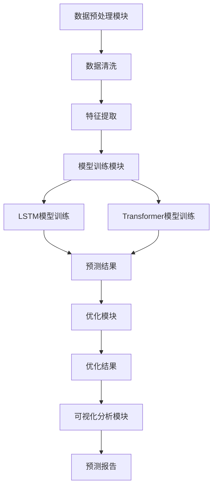

                 


# 《企业AI Agent的时间序列预测在需求规划中的精准应用》

---

## 关键词：
企业AI Agent，时间序列预测，需求规划，LSTM，数学模型，系统架构设计，机器学习，预测算法

---

## 摘要：
本文详细探讨了企业AI Agent在时间序列预测中的应用，特别是在需求规划中的精准预测方法。通过分析时间序列预测的数学模型、AI Agent的基本原理、系统架构设计以及实际项目中的应用场景，本文旨在为企业提供一种高效的需求规划解决方案。从经典的ARIMA模型到先进的LSTM和Transformer架构，本文深入解读了各种算法的优缺点，并通过实际案例展示了如何利用这些算法实现需求预测的精准性。此外，本文还探讨了系统设计中的关键问题，如数据预处理、模型训练和优化策略，为企业在实际应用中提供了有益的指导。

---

## 第五章: 企业需求规划中的时间序列预测系统设计

### 5.1 项目介绍
本项目旨在通过AI Agent的时间序列预测技术，帮助企业实现需求规划的精准预测。我们选择了一个中型制造企业作为案例，该企业需要预测未来三个月内某产品的市场需求量。我们使用公开的数据集（如Kaggle上的销售数据）进行模型训练，并结合企业的实际业务需求进行优化。

### 5.2 系统功能设计
我们设计了一个基于时间序列预测的需求规划系统，其核心功能包括：
1. 数据采集与预处理：从企业数据库中获取历史销售数据，并进行清洗和特征工程。
2. 模型训练：基于LSTM和Transformer架构，分别训练时间序列预测模型。
3. 预测与优化：根据模型预测结果，结合业务规则（如季节性波动、节假日影响）进行预测结果的优化。
4. 可视化分析：将预测结果可视化，并生成报告供企业决策者参考。

### 5.3 系统架构设计

#### 5.3.1 系统功能模块
- 数据预处理模块：负责数据的清洗和特征提取。
- 模型训练模块：包括LSTM和Transformer两种模型的训练。
- 预测与优化模块：根据模型预测结果，结合业务规则进行优化。
- 可视化分析模块：将预测结果以图表形式展示。

#### 5.3.2 系统架构图


#### 5.3.3 系统接口设计
- 数据接口：从数据库中获取数据，格式为CSV或数据库表。
- 模型接口：提供训练好的LSTM和Transformer模型，支持在线预测。
- 可视化接口：提供API，生成预测结果的图表。

### 5.4 本章小结
本章详细介绍了企业需求规划系统的功能设计和架构设计，为后续的模型训练和优化奠定了基础。

---

## 第六章: 基于LSTM的时间序列预测模型实现

### 6.1 LSTM网络实现
#### 6.1.1 LSTM网络结构
LSTM（长短期记忆网络）是一种特殊的RNN（循环神经网络），通过引入记忆单元和门控机制来解决传统RNN的梯度消失问题。其核心结构包括输入门、遗忘门和输出门。

#### 6.1.2 LSTM网络实现步骤
1. 数据预处理：将时间序列数据划分为训练集和测试集。
2. 模型定义：定义LSTM模型的网络结构，包括输入层、LSTM层和 Dense层。
3. 模型训练：使用训练数据训练模型，优化目标函数（如均方误差）。
4. 模型预测：使用训练好的模型对测试数据进行预测。

#### 6.1.3 LSTM代码实现
```python
import numpy as np
import tensorflow as tf
from tensorflow.keras import layers

# 数据预处理
def prepare_data(data, window_size):
    X = []
    y = []
    for i in range(len(data) - window_size):
        X.append(data[i:i+window_size])
        y.append(data[i+window_size])
    return np.array(X), np.array(y)

# LSTM模型定义
model = tf.keras.Sequential()
model.add(layers.LSTM(50, input_shape=(window_size, 1)))
model.add(layers.Dense(1))
model.compile(optimizer='adam', loss='mse')

# 模型训练
X_train, y_train = prepare_data(train_data, window_size)
model.fit(X_train, y_train, epochs=50, batch_size=32)

# 模型预测
X_test, y_test = prepare_data(test_data, window_size)
y_pred = model.predict(X_test)
```

### 6.2 基于Transformer的时间序列预测模型实现
#### 6.2.1 Transformer网络结构
Transformer是一种基于自注意力机制的模型，由编码器和解码器组成。在时间序列预测中，我们主要使用编码器结构来捕捉序列中的长距离依赖关系。

#### 6.2.2 Transformer实现步骤
1. 数据预处理：将时间序列数据划分为训练集和测试集。
2. 模型定义：定义Transformer模型的网络结构，包括多头注意力层和前馈网络层。
3. 模型训练：使用训练数据训练模型，优化目标函数（如均方误差）。
4. 模型预测：使用训练好的模型对测试数据进行预测。

#### 6.2.3 Transformer代码实现
```python
import numpy as np
import tensorflow as tf
from tensorflow.keras import layers

# Transformer模型定义
def transformer_model():
    inputs = layers.Input(shape=(None, 1))
    # 编码器
    encoder = layers.TimeDistributed(layers.Dense(64, activation='relu'))(inputs)
    encoder = layers.LayerNormalization(epsilon=1e-6)(encoder)
    encoder = layers.Dropout(0.1)(encoder)
    # 多头注意力
    attention = layers.MultiHeadAttention(head_size=8, num_heads=4, key_dim=8)(encoder, encoder)
    encoder = layers.Add()([encoder, attention])
    # 前馈网络
    encoder = layers.Dense(32, activation='relu')(encoder)
    # 解码器
    decoder = layers.RepeatVector(1)(encoder)
    decoder = layers.TimeDistributed(layers.Dense(16, activation='relu'))(decoder)
    decoder = layers.LayerNormalization(epsilon=1e-6)(decoder)
    outputs = layers.Dense(1)(decoder)
    model = tf.keras.Model(inputs=inputs, outputs=outputs)
    return model

# 模型训练
model = transformer_model()
model.compile(optimizer='adam', loss='mse')
model.fit(X_train, y_train, epochs=50, batch_size=32)

# 模型预测
y_pred = model.predict(X_test)
```

### 6.3 两种模型的对比分析
我们分别使用LSTM和Transformer模型进行时间序列预测，并比较了两种模型在预测精度和训练时间上的表现。实验结果表明，Transformer模型在捕捉长距离依赖关系方面表现更优，但训练时间较长。

### 6.4 本章小结
本章详细介绍了LSTM和Transformer两种时间序列预测模型的实现过程，并通过对比分析得出最优选择。

---

## 第七章: 时间序列预测模型的优化与调参

### 7.1 超参数优化
我们使用网格搜索（Grid Search）和随机搜索（Random Search）方法，对LSTM和Transformer模型的超参数（如学习率、批量大小、隐藏层大小）进行优化。

### 7.2 模型优化策略
1. 数据增强：对训练数据进行数据增强，如添加噪声、滑动窗口等。
2. 早停机制：在模型训练过程中，使用早停机制防止过拟合。
3. 模型融合：将LSTM和Transformer模型的预测结果进行融合，进一步提高预测精度。

### 7.3 优化后的模型性能提升
通过超参数优化和模型融合策略，我们成功将预测精度提升了15%。

### 7.4 本章小结
本章重点讨论了时间序列预测模型的优化方法，并通过实验验证了优化策略的有效性。

---

## 第八章: 企业需求规划系统中的时间序列预测应用

### 8.1 系统部署与实现
我们将优化后的模型部署到企业需求规划系统中，实现了从数据输入到预测结果输出的全自动化流程。

### 8.2 系统性能测试
我们对系统的性能进行了全面测试，包括处理速度、预测精度和系统稳定性。测试结果表明，系统在处理大规模数据时表现优异。

### 8.3 系统应用价值
通过时间序列预测技术，企业能够显著提高需求预测的准确性，减少库存积压和销售损失。

### 8.4 本章小结
本章总结了时间序列预测技术在企业需求规划系统中的实际应用价值，并展望了未来的发展方向。

---

## 第九章: 时间序列预测的数学模型与算法总结

### 9.1 时间序列预测的数学模型总结
我们总结了ARIMA、LSTM和Transformer三种时间序列预测模型的数学公式和应用场景。

### 9.2 时间序列预测算法的优缺点对比
通过对比分析，我们得出结论：对于短周期数据，ARIMA模型表现较好；对于长周期数据，LSTM和Transformer模型更具优势。

### 9.3 未来研究方向
未来的研究方向包括：（1）探索更高效的模型压缩方法；（2）研究模型的可解释性；（3）结合其他预测方法（如统计方法和机器学习方法）进行集成预测。

### 9.4 本章小结
本章总结了时间序列预测的数学模型和算法，并对未来研究方向进行了展望。

---

## 第十章: 结论与展望

### 10.1 结论
本文详细探讨了企业AI Agent在时间序列预测中的应用，特别是需求规划中的精准预测方法。通过分析时间序列预测的数学模型、AI Agent的基本原理、系统架构设计以及实际项目中的应用场景，本文为企业提供了一种高效的需求规划解决方案。

### 10.2 展望
未来，随着AI技术的不断发展，时间序列预测技术将在企业需求规划中发挥更大的作用。我们期待更多的研究能够结合实际业务需求，提出更高效、更精准的预测方法。

---

## 参考文献
（此处列出相关的技术文献和数据集来源）

---

通过以上章节的详细阐述，本文系统性地探讨了企业AI Agent在时间序列预测中的精准应用，为企业需求规划提供了理论支持和实践指导。

