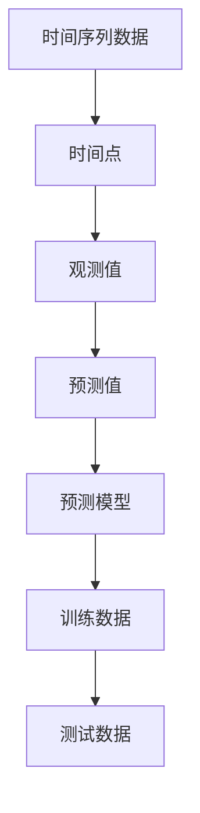

                 


```markdown
# 企业AI Agent的时间序列预测技术应用

## 关键词：时间序列预测、AI Agent、企业应用、算法原理、系统架构

## 摘要：时间序列预测在企业AI Agent中的应用，探讨其核心概念、算法原理、系统架构设计及项目实战，为企业智能化决策提供支持。

---

## 第一部分：时间序列预测的背景与概念

### 第1章：时间序列预测的背景与概念

#### 1.1 时间序列预测的基本概念
- **时间序列的定义与特点**  
  时间序列是指将数据按时间顺序排列，形成有序的数据序列。其特点包括连续性、趋势性、周期性、随机性等。

- **时间序列预测的定义与目的**  
  时间序列预测是利用历史数据，通过模型预测未来趋势。其目的是辅助企业进行决策优化、资源规划和风险控制。

- **时间序列预测在企业中的应用价值**  
  例如，销售预测、库存管理、财务预测等场景，帮助企业在复杂多变的市场环境中做出更明智的决策。

#### 1.2 企业AI Agent的定义与特点
- **企业AI Agent的定义**  
  企业AI Agent是具备自主决策能力的智能系统，能够通过数据驱动的方式优化企业运营。

- **企业AI Agent的核心功能**  
  包括数据采集、分析、预测、决策执行、反馈优化等，形成闭环的智能流程。

- **企业AI Agent与传统预测方法的区别**  
  AI Agent具备自主学习和自适应能力，能够实时更新模型，适应动态变化的环境。

#### 1.3 时间序列预测在企业AI Agent中的应用
- **企业AI Agent中的预测场景**  
  包括销售预测、库存管理、设备维护预测等关键业务场景。

- **时间序列预测对企业决策的支持**  
  通过精准预测，优化资源配置，降低运营成本，提升企业竞争力。

- **时间序列预测的挑战与机遇**  
  数据质量、模型选择、计算资源等挑战，但同时也带来了高效决策和创新发展的机遇。

---

## 第二部分：时间序列预测的核心概念与联系

### 第2章：时间序列预测的核心原理

#### 2.1 时间序列预测的核心原理
- **时间序列的分解模型**  
  将时间序列分解为趋势、周期、季节性和平稳部分，便于分别建模和预测。

- **时间序列的平稳性与非平稳性**  
  平稳序列适合使用ARIMA等线性模型，而非平稳序列可能需要差分或其他预处理。

- **时间序列的自相关性与偏自相关性**  
  通过自相关图和偏自相关图选择合适的模型参数。

#### 2.2 时间序列预测的数学模型与公式
- **线性回归模型**  
  $$ y = \beta_0 + \beta_1x + \epsilon $$  
  适用于简单的线性关系，但在时间序列中通常需要考虑序列相关性。

- **自回归模型（AR）**  
  $$ y_t = c + \phi_1y_{t-1} + \phi_2y_{t-2} + \epsilon_t $$  
  适合捕捉数据的自相关性。

- **移动平均模型（MA）**  
  $$ y_t = c + \theta_1\epsilon_{t-1} + \theta_2\epsilon_{t-2} + \epsilon_t $$  
  适合处理残差的自相关性。

- **自回归移动平均模型（ARMA）**  
  综合AR和MA模型，适用于平稳时间序列的预测。

- **自回归积分移动平均模型（ARIMA）**  
  $$ y_t = c + \phi_1y_{t-1} + \phi_2y_{t-2} + \theta_1\epsilon_{t-1} + \theta_2\epsilon_{t-2} + \epsilon_t $$  
  适用于非平稳时间序列，通过差分使序列平稳。

#### 2.3 时间序列预测的实体关系图


---

## 第三部分：时间序列预测的算法原理与流程

### 第3章：时间序列预测的算法原理与流程

#### 3.1 常见的时间序列预测算法
- **ARIMA算法**  
  通过参数选择和模型训练，实现对时间序列的预测。例如，使用AIC准则选择最优模型。

- **LSTM**  
  长短期记忆网络，适用于处理长期依赖关系，适合复杂的时间序列预测。

#### 3.2 ARIMA算法的详细讲解
- **模型训练**  
  使用历史数据训练ARIMA模型，确定最佳参数（p, d, q）。

- **预测流程**  
  1. 数据预处理：检查平稳性，进行差分等预处理。  
  2. 模型选择：通过AIC/BIC准则选择最优模型。  
  3. 模型验证：检查残差的白噪声特性。  
  4. 模型预测：基于训练好的模型，预测未来值。

#### 3.3 LSTM算法的详细讲解
- **网络结构**  
  LSTM包含输入门、遗忘门和输出门，能够有效捕捉时间序列中的长程依赖。

- **模型训练**  
  使用RNN结构，通过反向传播训练模型参数。

- **预测流程**  
  1. 数据预处理：归一化处理。  
  2. 模型构建：搭建LSTM网络，定义损失函数和优化器。  
  3. 模型训练：使用训练数据拟合模型。  
  4. 模型预测：基于训练好的模型，预测未来值。

#### 3.4 算法对比与选择
- **ARIMA与LSTM的对比**  
  ARIMA适合线性平稳序列，LSTM适合非线性和复杂序列。  
  - ARIMA：简单高效，适合数据量小的情况。  
  - LSTM：计算复杂，但预测精度更高，适合大数据和复杂场景。

---

## 第四部分：时间序列预测的系统架构设计

### 第4章：时间序列预测的系统架构设计

#### 4.1 问题场景介绍
- **企业AI Agent的时间序列预测场景**  
  包括销售预测、设备维护预测等，帮助企业在业务中做出数据驱动的决策。

#### 4.2 系统功能设计
- **系统功能模块**  
  包括数据采集、数据预处理、模型训练、预测部署和结果分析。

- **系统功能流程**  
  ```mermaid
  graph TD
      A[数据采集] --> B[数据预处理]
      B --> C[模型训练]
      C --> D[预测部署]
      D --> E[结果分析]
  ```

#### 4.3 系统架构设计
- **系统架构图**  
  ```mermaid
  graph TD
      U[用户] --> A[数据采集模块]
      A --> B[数据预处理模块]
      B --> C[模型训练模块]
      C --> D[预测部署模块]
      D --> E[结果分析模块]
  ```

#### 4.4 系统接口设计
- **API接口**  
  提供RESTful API，用于数据上传、模型训练和结果查询。

#### 4.5 系统交互流程
- **系统交互流程图**  
  ```mermaid
  graph TD
      U[用户] --> API[API接口]
      API --> D[数据采集模块]
      D --> P[数据预处理模块]
      P --> M[模型训练模块]
      M --> F[预测部署模块]
      F --> R[结果分析模块]
      R --> U[用户]
  ```

---

## 第五部分：时间序列预测的项目实战

### 第5章：时间序列预测的项目实战

#### 5.1 环境安装
- **安装Python环境**  
  使用Anaconda或虚拟环境，安装必要的库，如pandas、numpy、scikit-learn、keras、tensorflow。

#### 5.2 数据准备
- **数据来源**  
  使用公开数据集，例如AirPassengers数据集，模拟企业销售数据。

#### 5.3 模型实现
- **ARIMA模型实现**  
  ```python
  from statsmodels.tsa.arima.model import ARIMA
  model = ARIMA(train_data, order=(5,1,0))
  model_fit = model.fit()
  forecast = model_fit.forecast(steps=5)[0]
  ```

- **LSTM模型实现**  
  ```python
  from keras.models import Sequential
  from keras.layers import LSTM, Dense
  model = Sequential()
  model.add(LSTM(128, input_shape=(timesteps, features)))
  model.add(Dense(1))
  model.compile(optimizer='adam', loss='mse')
  model.fit(x_train, y_train, epochs=100, batch_size=32)
  ```

#### 5.4 结果分析
- **结果可视化**  
  使用matplotlib绘制实际值和预测值的对比图，评估模型的准确性。

#### 5.5 项目小结
- **项目总结**  
  通过实践，掌握了ARIMA和LSTM模型的实现方法，了解了时间序列预测在企业中的应用。

---

## 第六部分：时间序列预测的最佳实践

### 第6章：时间序列预测的最佳实践

#### 6.1 最佳实践
- **数据处理**  
  确保数据质量，处理缺失值和异常值。

- **模型调优**  
  使用网格搜索优化模型参数，提升预测精度。

- **结果验证**  
  使用MAE、MAPE等指标评估模型性能。

#### 6.2 小结
- **总结**  
  时间序列预测是企业AI Agent中的重要技术，通过合理的模型选择和系统设计，能够有效支持企业的智能化决策。

#### 6.3 注意事项
- **数据更新**  
  定期更新模型，避免因数据变化导致预测偏差。

- **模型解释性**  
  确保模型可解释，便于分析和优化。

#### 6.4 拓展阅读
- **推荐文献**  
  1. Hyndman, R. J., & Athanasopoulos, G. (2018). *Forecasting: principles and practice*.  
  2. Hochreiter, S., & Schmidhuber, J. (1997). *Long short-term memory*. Neural computation.

---

## 结语

通过本文的详细讲解，读者可以全面了解时间序列预测在企业AI Agent中的应用，掌握核心概念、算法原理和系统设计方法，并通过项目实战提升实践能力。希望本文能为企业的智能化转型提供有价值的参考和指导。
```

