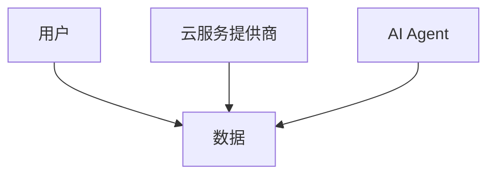
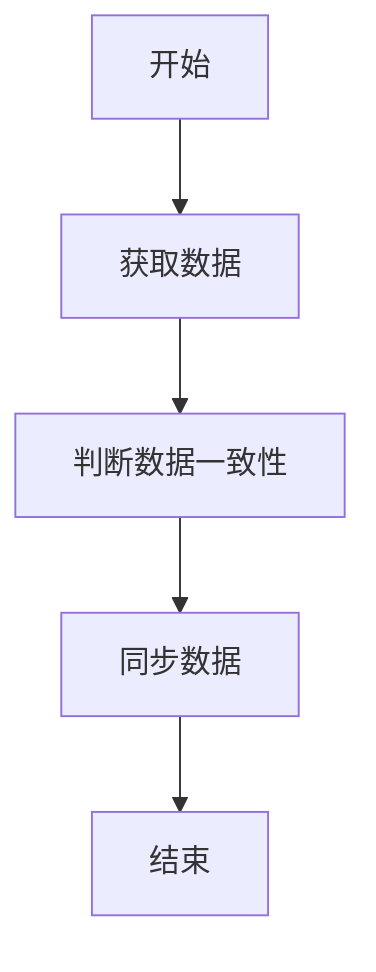
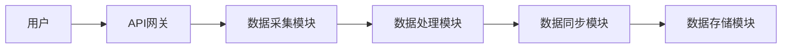

                 


### 《企业AI Agent的混合云数据管理策略》

**关键词**：AI Agent, 混合云, 数据管理, 云计算, 数据同步, 访问控制

**摘要**：本文探讨了在混合云环境下，企业AI Agent如何有效管理数据。文章首先介绍了问题背景和核心概念，然后分析了AI Agent的算法原理，接着详细设计了系统架构，提供了项目实战案例，并总结了最佳实践。

---

### 目录大纲

#### 第一部分：背景介绍

##### 第1章：企业AI Agent与混合云数据管理概述

###### 1.1 问题背景
- 1.1.1 数据管理的复杂性
- 1.1.2 混合云环境的挑战
- 1.1.3 AI Agent在数据管理中的作用

###### 1.2 问题描述
- 1.2.1 数据孤岛问题
- 1.2.2 数据一致性与实时性要求
- 1.2.3 安全与隐私保护

###### 1.3 解决方案
- 1.3.1 引入AI Agent的必要性
- 1.3.2 混合云数据管理的核心目标
- 1.3.3 AI Agent的预期效果

###### 1.4 边界与外延
- 1.4.1 数据管理的边界
- 1.4.2 AI Agent的适用范围
- 1.4.3 与其他技术的区分

###### 1.5 核心概念结构
- 1.5.1 核心要素组成
- 1.5.2 概念之间的关系
- 1.5.3 系统整体架构

#### 第二部分：核心概念与联系

##### 第2章：AI Agent与混合云数据管理的核心概念

###### 2.1 AI Agent的定义与原理
- 2.1.1 AI Agent的基本概念
- 2.1.2 AI Agent的核心原理
- 2.1.3 AI Agent的分类与特点

###### 2.2 混合云数据管理的定义与特点
- 2.2.1 混合云的定义
- 2.2.2 混合云数据管理的特点
- 2.2.3 混合云数据管理的挑战

###### 2.3 核心概念对比
- 2.3.1 AI Agent与传统数据管理的对比
- 2.3.2 混合云与传统云的对比
- 2.3.3 数据管理策略的对比

###### 2.4 ER实体关系图


#### 第三部分：算法原理讲解

##### 第3章：AI Agent的数据同步算法

###### 3.1 算法概述
- 3.1.1 数据同步的必要性
- 3.1.2 数据同步的挑战

###### 3.2 数据同步算法流程


###### 3.3 数据同步算法实现
```python
def synchronize_data():
    while True:
        local_data = get_local_data()
        cloud_data = get_cloud_data()
        if local_data == cloud_data:
            print("数据同步成功")
            break
        else:
            print("数据不一致，正在处理...")
            merge_data(local_data, cloud_data)
```

###### 3.4 数学模型与公式
- 数据一致性检查公式：$C = |D_{local} \Delta D_{cloud}|$
- 数据合并策略：$M = merge(D_{local}, D_{cloud})$

#### 第四部分：系统分析与架构设计方案

##### 第4章：混合云数据管理系统设计

###### 4.1 问题场景介绍
- 数据分布在多个云平台和本地系统中
- 数据需要实时同步和访问控制

###### 4.2 系统功能设计
- 数据采集模块
- 数据处理模块
- 数据同步模块
- 访问控制模块

###### 4.3 系统架构设计


###### 4.4 接口设计与交互
- 用户接口：API接口
- 系统交互：数据同步流程

#### 第五部分：项目实战

##### 第5章：混合云数据管理系统的实现

###### 5.1 环境安装
- 安装Python和相关库
- 配置云服务提供商API

###### 5.2 核心代码实现
```python
class DataAgent:
    def __init__(self, cloud_provider):
        self.cloud_provider = cloud_provider

    def fetch_data(self):
        return self.cloud_provider.get_data()

    def sync_data(self, local_data):
        remote_data = self.fetch_data()
        if local_data == remote_data:
            print("数据同步完成")
        else:
            self.merge_data(local_data, remote_data)

    def merge_data(self, local, remote):
        # 实现数据合并逻辑
        pass
```

###### 5.3 实际案例分析
- 案例背景：企业数据分布在阿里云和AWS中
- 数据同步实现：使用上述代码进行数据同步
- 问题分析与解决：处理数据冲突和不一致

#### 第六部分：最佳实践

##### 第6章：AI Agent的混合云数据管理最佳实践

###### 6.1 实用技巧
- 定期数据备份
- 使用日志记录数据同步过程

###### 6.2 注意事项
- 数据隐私保护
- 权限管理

###### 6.3 拓展阅读
- 关于数据同步的论文
- 相关技术书籍推荐

###### 6.4 项目小结
- 总结项目经验
- 提出改进建议

---

**本文详细探讨了企业AI Agent在混合云数据管理中的应用，通过系统设计、算法实现和项目实战，为读者提供了全面的解决方案和实践指导。**

