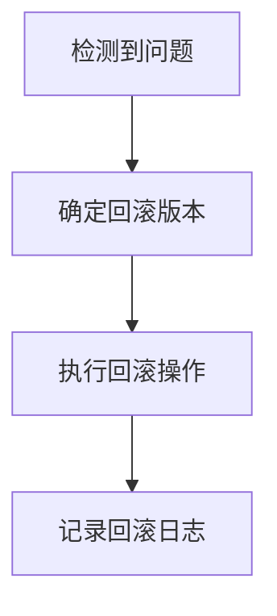
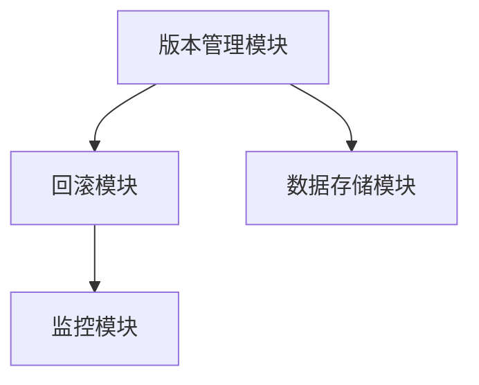

                 


# 企业AI Agent的版本控制与回滚机制

## 关键词：AI Agent、版本控制、回滚机制、企业应用、系统架构

## 摘要：  
在企业环境中，AI Agent的广泛应用要求其具备高效且可靠的版本控制与回滚机制。本文将深入探讨企业AI Agent的版本控制原理、回滚机制的设计与实现，结合实际案例分析，提供系统化的解决方案，确保企业在智能化转型中能够稳健前行。

---

## 第1章: AI Agent与版本控制的基本概念

### 1.1 AI Agent的定义与特点  
AI Agent是一种能够感知环境、自主决策并执行任务的智能实体。它通过传感器获取信息，利用算法进行分析和推理，并通过执行器采取行动。企业AI Agent广泛应用于自动化运维、智能客服、数据分析等领域。其核心特点包括：  
1. **自主性**：无需人工干预，自主完成任务。  
2. **反应性**：能够实时感知环境变化并做出反应。  
3. **目标导向**：基于目标驱动行为，优化决策路径。  

### 1.2 版本控制的基本概念  
版本控制是一种管理文件或系统变更的技术，记录每个版本的差异，便于恢复和追溯。在AI Agent中，版本控制不仅涉及代码，还包括模型、数据和配置文件的版本管理。其核心作用包括：  
1. **变更追踪**：记录每次修改，确保可追溯性。  
2. **协作开发**：支持多团队协作，避免冲突。  
3. **风险控制**：通过版本回滚机制降低更新失败的风险。  

---

## 第2章: 企业AI Agent版本控制的背景与问题  

### 2.1 企业AI Agent的复杂性  
企业AI Agent往往由多个模块组成，包括感知模块、决策模块、执行模块等。各模块之间的依赖关系复杂，升级或修改任何一个模块都可能影响整体系统。  

### 2.2 版本控制在AI Agent中的挑战  
1. **数据与模型版本协调**：AI Agent依赖大量数据和模型，版本控制需要同时管理数据和模型的变更。  
2. **高可用性与版本回滚的矛盾**：企业AI Agent通常要求7×24小时可用，任何停机都可能导致业务损失。  

### 2.3 问题背景总结  
企业AI Agent的版本控制需要解决以下问题：  
- 如何确保版本更新的稳定性？  
- 如何快速定位并回滚问题版本？  
- 如何在不中断业务的情况下进行版本更新？  

---

## 第3章: 版本控制与回滚机制的核心概念  

### 3.1 版本控制的核心原理  
1. **版本号生成**：采用递增、哈希或其他算法生成唯一版本号。  
2. **版本依赖管理**：记录每个版本之间的依赖关系，确保回滚时不会破坏其他模块。  

### 3.2 回滚机制的实现原理  
1. **回滚触发条件**：通过监控系统性能、错误日志等指标，触发回滚机制。  
2. **回滚策略**：根据问题严重性选择回滚到最近稳定版本或更早版本。  
3. **异常处理**：在回滚过程中，记录失败情况并提供回滚失败的处理方案。  

### 3.3 系统架构设计  
1. **模块划分**：版本管理模块、回滚模块、监控模块。  
2. **交互关系**：版本管理模块负责记录版本信息，监控模块检测问题并通知回滚模块执行。  

---

## 第4章: 企业AI Agent版本控制的算法原理  

### 4.1 版本控制的算法选择  
1. **Git**：适用于代码版本控制，但在AI Agent中需扩展支持模型和数据版本。  
2. **分布式版本控制系统**：确保高可用性，避免单点故障。  

### 4.2 回滚机制的算法实现  
1. **数学模型**：版本号与时间戳相关联，确保版本顺序可追溯。  
2. **流程图**：  


---

## 第5章: 企业AI Agent版本控制的系统架构设计  

### 5.1 系统功能设计  
1. **功能模块划分**：  
   - 版本管理模块：负责版本号生成、版本依赖管理。  
   - 回滚模块：执行回滚操作、处理异常情况。  
   - 监控模块：实时监控系统状态，触发回滚机制。  

2. **交互流程**：  
   - 监控模块检测到问题，通知回滚模块。  
   - 回滚模块选择合适的版本进行回滚。  
   - 版本管理模块记录回滚操作并更新版本信息。  

### 5.2 系统架构图  


---

## 第6章: 项目实战  

### 6.1 环境配置  
1. 安装必要的工具：Git、Docker、Kubernetes等。  
2. 配置版本控制和回滚机制的环境变量。  

### 6.2 核心代码实现  
```python
def rollback(version):
    # 获取指定版本的模型和数据
    model = get_model_by_version(version)
    data = get_data_by_version(version)
    # 加载模型和数据
    load_model(model)
    load_data(data)
    # 更新版本记录
    update_version_log(version, "Rolled back successfully")
```

### 6.3 案例分析  
某企业AI Agent在上线后出现性能下降问题，监控模块触发回滚机制，将系统回滚到两天前的稳定版本，成功恢复了性能，避免了业务损失。  

---

## 第7章: 最佳实践与总结  

### 7.1 最佳实践  
1. **定期演练**：模拟版本回滚操作，确保团队熟悉流程。  
2. **日志管理**：详细记录版本变更和回滚操作，便于后续分析。  

### 7.2 小结  
企业AI Agent的版本控制与回滚机制是确保系统稳定性和可靠性的关键。通过合理的架构设计和算法实现，可以在复杂的企业环境中实现高效且安全的版本管理。  

### 7.3 注意事项  
- **数据备份**：回滚操作前确保数据备份，避免数据丢失。  
- **监控优化**：不断完善监控指标，提高问题检测的准确性。  

### 7.4 拓展阅读  
1. 分布式版本控制系统的研究与应用。  
2. AI Agent在不同行业的具体应用案例。  

---

## 附录: 相关工具与资源  

- **版本控制工具**：Git、Subversion。  
- **回滚机制实现框架**：Spring Boot、Docker。  

---

以上是《企业AI Agent的版本控制与回滚机制》的技术博客文章大纲，结合了理论与实践，旨在为企业AI Agent的开发和运维提供系统化的指导。

