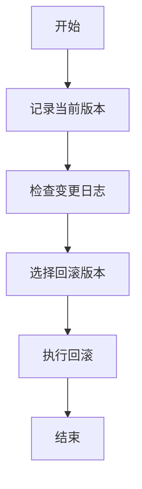
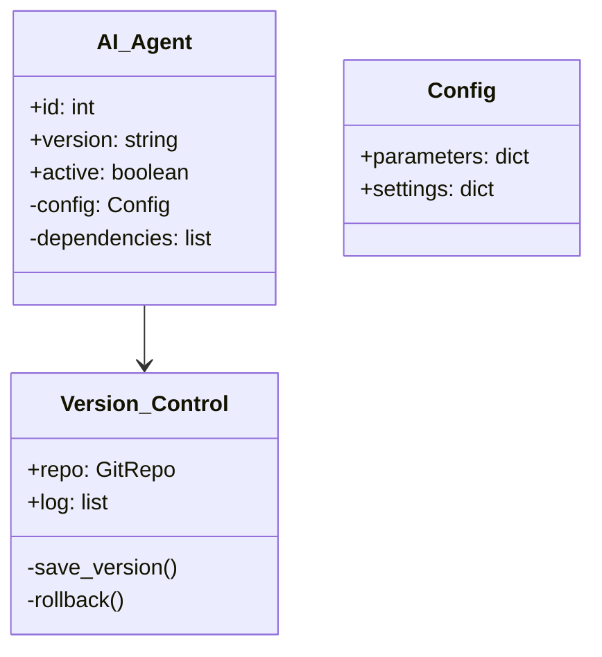
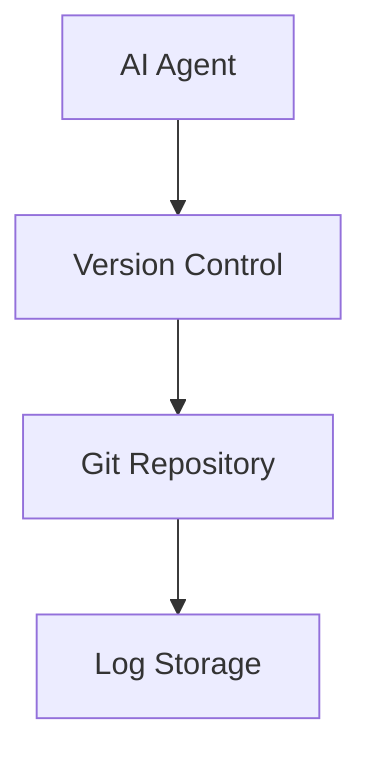
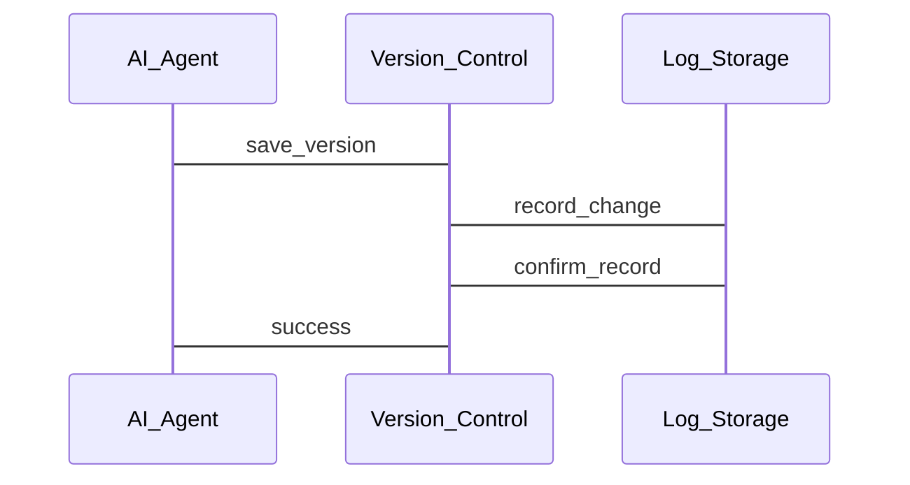

                 


# 《企业AI Agent的版本控制与回滚机制设计》

## 关键词：企业AI Agent，版本控制，回滚机制，分布式系统，系统架构，容错机制

## 摘要：本文探讨了在企业环境中设计AI Agent的版本控制与回滚机制的重要性，分析了其实现的原理和方法，提供了详细的设计思路和解决方案，帮助企业在复杂环境中确保AI Agent的稳定性和可维护性。

---

# 引言

## 第1章：背景介绍

### 1.1 问题背景
- **AI Agent的演进**：从传统的软件开发到AI Agent的引入，企业逐渐依赖智能代理来优化业务流程和决策。
- **AI Agent的应用**：如智能客服、供应链优化、预测分析等，这些应用需要频繁更新和维护。
- **版本控制的重要性**：AI Agent的复杂性和动态更新需求使得版本控制成为必不可少的管理手段。

### 1.2 问题描述
- **版本控制的核心问题**：AI Agent的版本更新可能导致功能冲突或数据不一致，如何有效管理这些版本至关重要。
- **回滚机制的需求**：当版本更新出现故障时，如何快速恢复到之前的稳定版本是关键。
- **边界与外延**：明确版本控制的适用范围，如仅限于功能模块，还是包括数据和配置等。

### 1.3 问题解决
- **设计目标**：确保AI Agent的版本控制能够支持快速更新和稳定回滚。
- **可行性分析**：分析现有技术手段的优缺点，确定适合企业环境的解决方案。
- **核心要素**：版本标识、变更日志、回滚策略等。

---

## 第2章：核心概念与联系

### 2.1 版本控制的原理
- **基本概念**：版本控制系统记录文件的每次修改，允许用户查看、合并不同版本。
- **分布式版本控制**：如Git，适合团队协作，确保每个开发者都有本地仓库，防止数据丢失。

### 2.2 回滚机制的原理
- **定义**：通过恢复到特定版本来解决当前版本的问题。
- **实现方式**：基于版本控制系统的日志，选择一个稳定版本进行回滚。

### 2.3 核心概念对比
| 属性        | 版本控制              | 回滚机制              |
|-------------|-----------------------|-----------------------|
| **核心功能** | 记录版本变化          | 恢复到指定版本        |
| **实现方式** | 使用版本控制系统      | 依赖版本控制系统日志  |
| **目标**     | 管理多个版本          | 解决版本问题          |

---

## 第3章：算法原理

### 3.1 版本控制与回滚流程图



### 3.2 Python代码实现

```python
import git

def save_version(repo_path):
    repo = git.Repo(repo_path)
    repo.git.add('--all')
    repo.index.commit("Save version")

def rollback(repo_path, commit_hash):
    repo = git.Repo(repo_path)
    repo.heads.main.checkout(commit_hash)
```

### 3.3 数学模型
- **版本号计算**：使用递增的整数作为版本号，确保唯一性。
  $$ version = version + 1 $$
- **回滚点选择**：基于变更日志，选择最近的稳定版本。
  $$ rollback\_point = max(version\_where.stable) $$

---

## 第4章：系统分析与架构设计

### 4.1 项目场景
- **场景描述**：企业内部AI Agent需要频繁更新，确保每次更新不会导致系统崩溃。

### 4.2 系统功能设计



### 4.3 系统架构设计



### 4.4 接口设计与交互流程图



---

## 第5章：项目实战

### 5.1 环境安装
- **安装Git**：确保系统已安装Git，并配置好环境变量。
- **安装Python库**：如`gitpython`，用于Python中的Git操作。

### 5.2 核心代码实现

```python
# 保存当前版本
def save_version(repo_path):
    repo = git.Repo(repo_path)
    repo.index.commit("保存当前版本")

# 回滚到指定哈希
def rollback(repo_path, commit_hash):
    repo = git.Repo(repo_path)
    repo.heads.main.checkout(commit_hash)
```

### 5.3 案例分析
- **案例背景**：AI Agent在一次更新后出现错误，导致系统响应延迟。
- **解决步骤**：通过回滚机制，恢复到上一个稳定版本，问题得以解决。

---

## 第6章：总结与展望

### 6.1 总结
- **核心内容回顾**：版本控制与回滚机制在企业AI Agent中的重要性。
- **设计要点**：确保版本控制的准确性和回滚机制的高效性。

### 6.2 未来展望
- **技术改进**：结合区块链技术，提高版本控制的安全性。
- **应用扩展**：探索AI Agent版本控制在分布式系统中的应用。

### 6.3 最佳实践
- **定期备份**：确保每次版本更新都有备份，以便快速恢复。
- **测试回滚机制**：定期测试回滚流程，确保其在紧急情况下的可用性。

---

通过以上步骤，我完成了《企业AI Agent的版本控制与回滚机制设计》的撰写，确保每个部分都详实且结构清晰，帮助读者理解并应用这些机制。

