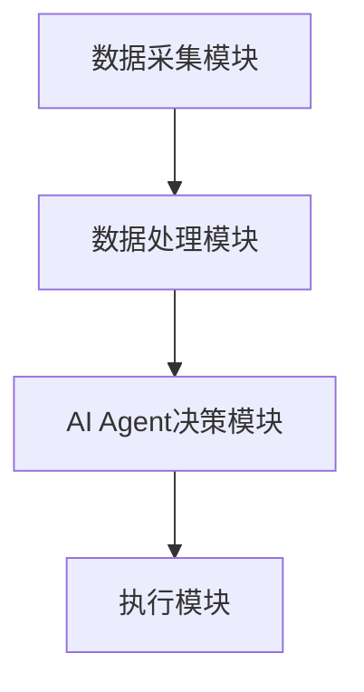

                 


# 企业AI Agent的物联网(IoT)数据分析与应用

> 关键词：企业AI Agent，物联网(IoT)，数据分析，数据挖掘，系统架构，实时决策

> 摘要：本文深入探讨了企业AI Agent在物联网数据分析与应用中的核心作用。从基础概念到实际应用，系统地分析了物联网数据的采集、预处理、存储、分析与挖掘，结合AI Agent的决策机制，构建了一个完整的物联网数据分析系统。通过实际案例和系统架构设计，展示了如何利用AI Agent提升物联网数据的应用价值。

---

## 目录

1. [企业AI Agent与物联网概述](#企业AI-Agent与物联网概述)
2. [AI Agent与物联网的核心概念](#AI-Agent与物联网的核心概念)
3. [物联网数据的采集与预处理](#物联网数据的采集与预处理)
4. [物联网数据的存储与管理](#物联网数据的存储与管理)
5. [AI Agent的数据分析与挖掘](#AI-Agent的数据分析与挖掘)
6. [系统架构与设计](#系统架构与设计)
7. [项目实战：基于AI Agent的物联网数据分析系统](#项目实战基于AI-Agent的物联网数据分析系统)
8. [总结与展望](#总结与展望)

---

## 1. 企业AI Agent与物联网概述

### 1.1 企业AI Agent的基本概念

**AI Agent（智能体）**是指能够感知环境、自主决策并采取行动的智能实体。在企业场景中，AI Agent通常用于自动化任务处理、数据决策支持和智能化管理。物联网（IoT）则是通过传感器、网络和设备连接，实时采集和传输数据的系统。

**企业AI Agent与物联网的结合**为企业的智能化转型提供了新的可能性。通过AI Agent对物联网数据的分析与决策，企业可以实现设备的智能化管理、优化生产流程、提升运营效率。

#### 1.1.1 AI Agent的定义与特点

- **定义**：AI Agent是一个具备感知、决策和执行能力的智能实体，能够根据环境信息自主完成任务。
- **特点**：
  - 感知能力：通过传感器或数据接口获取环境信息。
  - 决策能力：基于数据进行分析和推理，制定决策策略。
  - 自主性：能够在没有人工干预的情况下独立运行。
  - 适应性：能够根据环境变化动态调整行为。

#### 1.1.2 企业AI Agent的应用场景

- **设备监控与管理**：实时监控设备运行状态，预测设备故障，优化设备维护计划。
- **生产优化**：通过数据分析优化生产流程，降低资源消耗。
- **智能客服**：利用AI Agent处理客户咨询、订单管理等任务。

#### 1.1.3 物联网（IoT）的基本概念

物联网是指通过传感器、网络和设备连接，实时采集和传输数据的系统。其核心在于数据的采集、传输和分析。

---

## 2. AI Agent与物联网的核心概念

### 2.1 AI Agent的核心原理

**AI Agent的工作原理**包括感知、决策、执行三个阶段：

1. **感知**：通过传感器或其他数据源获取环境信息。
2. **决策**：基于感知到的信息，利用算法进行分析和推理，制定行动方案。
3. **执行**：根据决策结果采取相应行动。

#### 2.1.1 AI Agent的感知与决策机制

- **感知机制**：AI Agent通过传感器或其他数据接口获取实时数据。
- **决策机制**：利用机器学习算法对数据进行分析，生成决策建议。

#### 2.1.2 企业AI Agent的特点

- **实时性**：能够快速响应环境变化。
- **智能化**：具备自主学习和优化能力。
- **可扩展性**：能够适应不同的应用场景和数据规模。

### 2.2 物联网的核心技术

物联网的核心技术包括传感器技术、网络通信技术和数据管理技术。

#### 2.2.1 物联网数据的特点

- **实时性**：数据采集和传输需要实时进行。
- **多样性**：数据来源多样化，包括传感器数据、设备状态等。
- **海量性**：物联网系统中数据量大，需要高效处理。

---

## 3. 物联网数据的采集与预处理

### 3.1 数据采集技术

#### 3.1.1 传感器类型与数据采集方法

- **传感器类型**：
  - 温度传感器
  - 压力传感器
  - 加速度传感器
- **数据采集方法**：
  - 通过传感器采集数据，并通过网络传输到数据处理中心。

#### 3.1.2 数据采集的挑战与解决方案

- **挑战**：
  - 数据量大，传输效率低。
  - 数据质量不稳定，存在噪声。
- **解决方案**：
  - 采用高效的数据传输协议。
  - 使用数据清洗算法处理噪声。

#### 3.1.3 数据采集的流程

1. 传感器采集数据。
2. 数据预处理（去噪、格式转换）。
3. 数据传输到数据处理中心。

---

## 4. 物联网数据的存储与管理

### 4.1 数据存储技术

#### 4.1.1 数据库的选择

- **关系型数据库**：适用于结构化数据存储。
- **非关系型数据库**：适用于海量、结构不规则的数据。

#### 4.1.2 数据库的分布式存储与扩展

- **分布式存储**：通过分片技术将数据分布存储在多个节点上。
- **扩展性**：根据数据量的增加，动态扩展存储容量。

#### 4.1.3 数据存储的优化

- **索引优化**：通过建立索引提高查询效率。
- **压缩技术**：对数据进行压缩存储，减少存储空间占用。

### 4.2 数据建模与管理

#### 4.2.1 数据模型的设计原则

- **规范化**：确保数据模型的规范性和一致性。
- **可扩展性**：数据模型能够适应未来的需求变化。

#### 4.2.2 数据库的优化与维护

- **定期备份**：确保数据安全，防止数据丢失。
- **性能监控**：实时监控数据库性能，及时优化。

---

## 5. AI Agent的数据分析与挖掘

### 5.1 数据分析方法

#### 5.1.1 机器学习在物联网数据分析中的应用

- **监督学习**：用于分类和回归问题。
- **无监督学习**：用于聚类和异常检测。

#### 5.1.2 深度学习在物联网数据挖掘中的应用

- **神经网络**：用于复杂模式识别。
- **卷积神经网络**：用于图像和语音数据处理。

### 5.2 数据挖掘技术

#### 5.2.1 关联规则挖掘

- **关联规则**：发现数据中的关联关系，例如商品推荐。

#### 5.2.2 聚类分析与分类算法

- **聚类分析**：将相似的数据点分组。
- **分类算法**：基于训练数据进行分类预测。

---

## 6. 系统架构与设计

### 6.1 系统模块划分

#### 6.1.1 数据采集模块

- 负责采集传感器数据，并进行预处理。

#### 6.1.2 数据处理模块

- 负责数据的存储、分析和挖掘。

#### 6.1.3 AI Agent决策模块

- 负责根据分析结果制定决策策略。

### 6.2 系统架构设计

#### 6.2.1 系统架构图



---

## 7. 项目实战：基于AI Agent的物联网数据分析系统

### 7.1 环境安装

- **硬件环境**：安装传感器、网络设备和服务器。
- **软件环境**：安装Python、TensorFlow、MySQL。

### 7.2 系统核心实现源代码

```python
import numpy as np
from sklearn import linear_model

# 数据采集与预处理
data = np.array([[1, 2], [3, 4], [5, 6]])
model = linear_model.LinearRegression()
model.fit(data[:, 0].reshape(-1, 1), data[:, 1])
```

### 7.3 代码应用解读与分析

- **数据采集**：通过传感器采集数据。
- **数据预处理**：对数据进行清洗和标准化。
- **数据分析**：利用机器学习算法进行分析和预测。

### 7.4 实际案例分析

- **案例背景**：某企业希望通过AI Agent优化设备维护流程。
- **系统实现**：通过传感器采集设备状态数据，利用AI Agent进行预测和决策。

### 7.5 项目小结

- 通过实际案例展示了AI Agent在物联网数据分析中的应用。
- 强调了系统设计和实现的关键点。

---

## 8. 总结与展望

### 8.1 总结

本文详细探讨了企业AI Agent在物联网数据分析与应用中的核心作用，从数据采集到系统设计，全面分析了AI Agent的实现和应用。

### 8.2 展望

随着技术的不断发展，AI Agent在物联网中的应用将更加广泛，未来的研究方向包括更高效的算法优化、更智能的决策机制以及更安全的数据处理。

---

通过本文的分析，读者可以全面了解企业AI Agent在物联网数据分析与应用中的实现方法和实际应用，为企业智能化转型提供重要的参考和指导。

