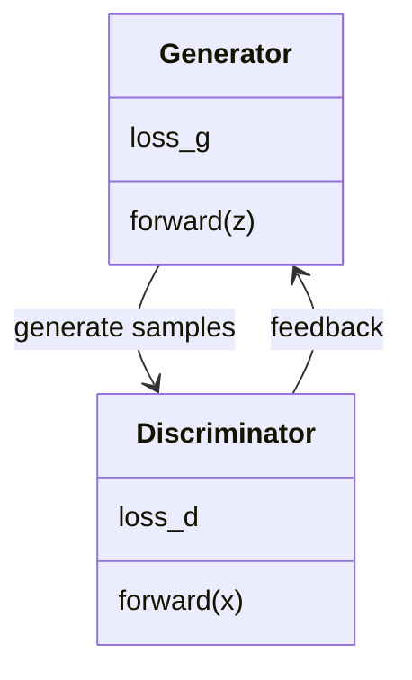
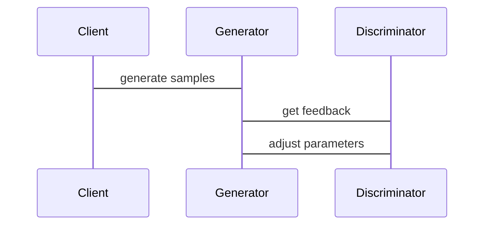

                 


# 企业AI Agent的生成对抗网络在产品设计中的创新应用

**关键词**：生成对抗网络、企业AI Agent、产品设计、创新应用、机器学习

**摘要**：本文探讨了生成对抗网络（GAN）在企业AI Agent中的创新应用，特别是在产品设计中的应用。通过详细分析GAN的原理、算法、系统架构以及实际案例，本文展示了GAN如何帮助企业在产品设计中实现创新和优化。文章内容涵盖背景介绍、核心概念、算法原理、系统设计、项目实战和最佳实践，旨在为技术人员和产品经理提供有价值的见解。

---

## 正文

### 第一部分：背景介绍

#### 第1章：生成对抗网络（GAN）概述

##### 1.1 生成对抗网络的基本概念

**1.1.1 生成对抗网络的定义**

生成对抗网络（GAN）是一种生成模型，由Ian Goodfellow等人于2014年提出。GAN由两部分组成：生成器（Generator）和判别器（Discriminator）。生成器的目标是生成与真实数据分布相似的数据，而判别器的目标是区分真实数据和生成数据。通过对抗训练，GAN能够生成高质量的数据，如图像、文本和音频。

**1.1.2 GAN的核心原理**

GAN的核心思想是通过对抗训练来优化生成器和判别器。生成器通过学习真实数据的分布，生成接近真实数据的样本；判别器则试图区分真实数据和生成数据。两者的对抗过程使得生成器不断改进，最终生成高质量的数据。

**1.1.3 GAN在企业AI Agent中的应用前景**

企业AI Agent是一种能够自主决策和执行任务的智能系统。GAN在企业AI Agent中的应用可以提升生成数据的质量和多样性，从而增强AI Agent的决策能力和创新能力。例如，GAN可以用于生成产品设计的草图、优化产品推荐算法等。

##### 1.2 企业AI Agent的定义与特点

**1.2.1 AI Agent的基本概念**

AI Agent是一种智能代理，能够感知环境、执行任务并做出决策。企业AI Agent通常用于企业内部流程优化、客户交互和服务提供等领域。

**1.2.2 企业AI Agent的核心功能**

企业AI Agent的核心功能包括数据处理、决策制定、任务执行和反馈优化。这些功能使得AI Agent能够高效地完成复杂任务，并与人类用户进行自然交互。

**1.2.3 企业AI Agent与传统AI的区别**

与传统AI相比，企业AI Agent具有更强的自主性和适应性。传统AI通常需要明确的规则和输入，而企业AI Agent能够自主学习和适应环境，具备更强的决策能力。

##### 1.3 GAN在产品设计中的创新应用

**1.3.1 产品设计的挑战与痛点**

产品设计是一个复杂的过程，需要考虑用户需求、市场趋势和技术创新。传统设计方法依赖设计师的经验和灵感，而现代企业需要更快、更高效的设计方法。

**1.3.2 GAN在产品设计中的优势**

GAN能够生成多样化的设计草图和产品概念，帮助设计师快速探索不同的设计方案。GAN还可以根据用户反馈优化设计，提高设计效率和质量。

**1.3.3 GAN在产品设计中的具体应用场景**

GAN在产品设计中的应用场景包括生成产品草图、优化产品外观、生成产品配色方案等。这些应用可以帮助设计师快速迭代，提高设计效率。

---

### 第二部分：核心概念与联系

#### 第2章：生成对抗网络的核心原理

##### 2.1 GAN的结构与组成

**2.1.1 生成器（Generator）的结构与功能**

生成器通常由卷积神经网络（CNN）或变体组成。生成器的目标是生成与真实数据分布相似的样本。例如，在图像生成任务中，生成器可以生成逼真的图像。

**2.1.2 判别器（Discriminator）的结构与功能**

判别器同样由CNN组成，其目标是区分真实数据和生成数据。判别器的输出通常是一个概率值，表示输入数据为真实数据的概率。

**2.1.3 GAN的对抗过程**

生成器和判别器通过对抗训练不断优化。生成器试图生成更接近真实数据的样本，而判别器则试图更准确地区分真实数据和生成数据。这种对抗过程使得生成器能够生成高质量的数据。

##### 2.2 GAN的核心算法流程

**2.2.1 GAN的训练过程**

GAN的训练过程包括以下步骤：
1. 初始化生成器和判别器的参数。
2. 训练判别器，使其能够区分真实数据和生成数据。
3. 训练生成器，使其生成的样本能够欺骗判别器。
4. 重复上述步骤，直到生成器和判别器达到收敛。

**2.2.2 GAN的损失函数**

GAN的损失函数包括生成器损失和判别器损失。生成器损失表示生成器生成样本被判别器误判为生成数据的概率；判别器损失表示判别器区分真实数据和生成数据的能力。

**2.2.3 GAN的优化策略**

为了提高训练效率，可以采用以下优化策略：
- 使用Adam优化器
- 调整学习率
- 使用早停策略

##### 2.3 GAN与其他生成模型的对比

**2.3.1 VAE与GAN的对比**

变分自编码器（VAE）与GAN都是生成模型，但它们的优化目标不同。VAE的目标是最大化数据的似然，而GAN的目标是生成与真实数据分布相似的样本。

**2.3.2 GAN与传统生成模型的对比**

传统生成模型（如马尔可夫链）通常依赖于数据分布的明确建模，而GAN通过对抗训练间接建模数据分布，具有更强的生成能力。

**2.3.3 GAN的优势与局限性**

GAN的优势在于能够生成高质量的数据，但其训练过程可能不稳定，容易出现梯度消失等问题。

---

### 第三部分：算法原理讲解

#### 第3章：生成对抗网络的数学模型

##### 3.1 GAN的数学模型

**3.1.1 生成器的数学模型**

生成器的输入是随机噪声$z$，输出是生成样本$G(z)$。生成器的目标是最小化判别器对生成样本的误判概率。

$$ \mathcal{L}_G = \mathbb{E}_{z \sim p_z}[ -\log D(G(z))] $$

**3.1.2 判别器的数学模型**

判别器的输入是真实样本$x$和生成样本$G(z)$，输出是对$x$是真实的概率$D(x)$。判别器的目标是最小化生成样本被误判的概率。

$$ \mathcal{L}_D = -\mathbb{E}_{x \sim p_x}[\log D(x)] - \mathbb{E}_{z \sim p_z}[\log (1 - D(G(z)))] $$

**3.1.3 GAN的联合损失函数**

GAN的联合损失函数将生成器和判别器的损失函数结合起来。

$$ \mathcal{L}_{GAN} = \mathcal{L}_G + \mathcal{L}_D $$

##### 3.2 GAN的训练过程

**3.2.1 GAN的梯度计算**

使用链式法则计算生成器和判别器的梯度。生成器的梯度通过判别器的梯度反向传播。

**3.2.2 GAN的优化算法**

通常使用Adam优化器，设置适当的学习率和动量参数。

**3.2.3 GAN的训练技巧**

包括数据预处理、标签平滑、使用判别器的梯度惩罚等。

##### 3.3 GAN的变体与改进

**3.3.1 WGAN-GP的改进**

Wasserstein GAN with Gradient Penalty（WGAN-GP）通过引入梯度惩罚项，使得判别器的损失函数更平滑，训练更稳定。

**3.3.2 StyleGAN的创新**

StyleGAN通过引入风格编码，使得生成器能够生成更具多样性的样本。

---

### 第四部分：系统分析与架构设计方案

#### 第4章：系统设计

##### 4.1 项目介绍

企业AI Agent系统旨在通过GAN生成高质量的产品设计草图，帮助设计师快速探索不同的设计方案。

##### 4.2 系统功能设计

系统功能包括数据输入、生成器训练、判别器训练和结果输出。

**4.2.1 领域模型（Mermaid类图）**



##### 4.3 系统架构设计（Mermaid架构图）


##### 4.4 系统接口设计

系统接口包括生成器接口和判别器接口，分别用于生成样本和判别样本。

##### 4.5 系统交互流程图（Mermaid序列图）



---

### 第五部分：项目实战

#### 第5章：项目实战

##### 5.1 环境安装

安装Python、TensorFlow和Keras等依赖库。

##### 5.2 核心代码实现

```python
import tensorflow as tf
from tensorflow.keras import layers

class Generator(tf.keras.Model):
    def __init__(self):
        super(Generator, self).__init__()
        self.dense = layers.Dense(256, activation='relu')
        self.dropout = layers.Dropout(0.2)
        self.dense2 = layers.Dense(128, activation='relu')
        self.dropout2 = layers.Dropout(0.2)
        self.dense3 = layers.Dense(64, activation='sigmoid')

    def call(self, inputs):
        x = self.dense(inputs)
        x = self.dropout(x)
        x = self.dense2(x)
        x = self.dropout2(x)
        x = self.dense3(x)
        return x

class Discriminator(tf.keras.Model):
    def __init__(self):
        super(Discriminator, self).__init__()
        self.dense = layers.Dense(256, activation='relu')
        self.dropout = layers.Dropout(0.2)
        self.dense2 = layers.Dense(128, activation='relu')
        self.dropout2 = layers.Dropout(0.2)
        self.dense3 = layers.Dense(1, activation='sigmoid')

    def call(self, inputs):
        x = self.dense(inputs)
        x = self.dropout(x)
        x = self.dense2(x)
        x = self.dropout2(x)
        x = self.dense3(x)
        return x

# 训练过程
def train(generator, discriminator, optimizer_g, optimizer_d, epochs):
    for epoch in range(epochs):
        # 训练生成器
        with tf.GradientTape() as tape_g:
            generated = generator(z)
            d_fake = discriminator(generated)
            loss_g = tf.keras.losses.binary_crossentropy(tf.ones_like(d_fake), d_fake)
        gradients_g = tape_g.gradient(loss_g, generator.trainable_variables)
        optimizer_g.apply_gradients(zip(gradients_g, generator.trainable_variables))

        # 训练判别器
        with tf.GradientTape() as tape_d:
            d_real = discriminator(x)
            loss_d_real = tf.keras.losses.binary_crossentropy(tf.ones_like(d_real), d_real)
            generated = generator(z)
            d_fake = discriminator(generated)
            loss_d_fake = tf.keras.losses.binary_crossentropy(tf.zeros_like(d_fake), d_fake)
            total_loss_d = (loss_d_real + loss_d_fake) * 0.5
        gradients_d = tape_d.gradient(total_loss_d, discriminator.trainable

