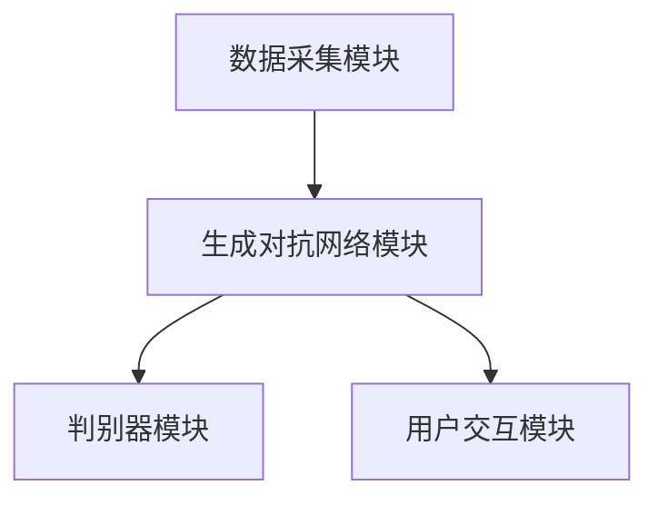

                 


# 企业AI Agent的生成对抗网络在产品设计创新中的前沿应用

> 关键词：生成对抗网络（GANs），企业AI Agent，产品设计创新，深度学习，生成模型

> 摘要：本文探讨了生成对抗网络（GANs）在企业AI Agent中的应用，特别是在产品设计创新方面。通过详细分析GANs的原理、算法实现、系统架构以及实际案例，本文揭示了如何利用GANs提升企业AI Agent的产品设计能力，推动产品创新。

---

## 第一部分：生成对抗网络（GANs）概述

### 1.1 生成对抗网络的定义与特点

生成对抗网络（GANs）是一种深度学习模型，由生成器和判别器两个部分组成。生成器的目标是生成逼真的数据样本，而判别器的目标是区分真实样本和生成样本。两者的对抗训练使得生成器能够生成高质量的数据，从而实现数据生成的任务。

#### 1.1.1 GANs的核心特点
- **对抗性学习**：生成器和判别器通过对抗训练提升性能。
- **无监督学习**：GANs可以在无标签数据的情况下进行训练。
- **多样性生成**：生成器能够生成多种不同的数据样本。

#### 1.1.2 GANs的优势
- **数据生成能力强**：GANs能够生成高质量、多样化的数据。
- **适用于多种任务**：GANs可以应用于图像生成、风格迁移、数据增强等领域。

### 1.2 企业AI Agent的定义与应用

企业AI Agent是一种智能化的辅助工具，能够理解企业需求、优化流程、提供决策支持。在产品设计创新中，企业AI Agent可以通过分析市场趋势、用户反馈和内部数据，帮助设计团队生成新的产品概念和设计方案。

#### 1.2.1 企业AI Agent的核心功能
- **数据收集与分析**：从市场、用户和内部数据中提取有用信息。
- **生成设计建议**：基于分析结果，生成创新的产品设计方案。
- **反馈与优化**：根据反馈不断优化设计方案。

---

## 第二部分：生成对抗网络的核心原理

### 2.1 GANs的基本原理

GANs由生成器和判别器组成，两者通过对抗训练提升性能。生成器的目标是最小化判别器的错误率，而判别器的目标是最大化区分真实样本和生成样本的能力。

#### 2.1.1 GANs的损失函数

生成器的损失函数：
$$ L_G = -\mathbb{E}_{z}[ \log D(G(z))] $$

判别器的损失函数：
$$ L_D = -\mathbb{E}_{x}[ \log D(x)] - \mathbb{E}_{z}[ \log (1 - D(G(z)))] $$

#### 2.1.2 GANs的训练过程

1. 初始化生成器和判别器的参数。
2. 进行对抗训练，交替优化生成器和判别器的参数。
3. 直到生成器生成高质量的样本，判别器无法区分真实样本和生成样本。

### 2.2 GANs的变体与改进

#### 2.2.1 Wasserstein GAN（WGAN）

WGAN通过使用Wasserstein距离替代传统的损失函数，解决了传统GAN训练不稳定的问题。

#### 2.2.2 WGAN-GP

WGAN-GP是对WGAN的改进，引入梯度惩罚项，进一步稳定训练过程。

---

## 第三部分：企业AI Agent与生成对抗网络的结合

### 3.1 企业AI Agent中的生成对抗网络

企业AI Agent可以通过集成GANs，生成多样化的设计概念，帮助设计团队快速迭代和优化产品设计方案。

#### 3.1.1 生成对抗网络在产品设计中的应用

1. **图像生成**：生成产品设计的草图、原型图。
2. **风格迁移**：将现有设计风格应用到新产品上。
3. **数据增强**：生成更多样化的设计数据，提升模型的泛化能力。

#### 3.1.2 生成对抗网络的优势

- **高效性**：GANs可以快速生成大量高质量的设计样本。
- **创新性**：通过对抗训练，GANs能够生成具有创新性的设计方案。

---

## 第四部分：系统分析与架构设计方案

### 4.1 系统架构设计

企业AI Agent的系统架构包括数据采集模块、生成对抗网络模块、判别器模块和用户交互模块。

#### 4.1.1 系统架构图



### 4.2 系统功能设计

#### 4.2.1 数据采集模块

- 负责收集市场数据、用户反馈和内部数据。
- 提供多样化的数据输入，供生成器生成设计样本。

#### 4.2.2 生成对抗网络模块

- 包含生成器和判别器。
- 生成器生成设计样本，判别器对生成样本和真实样本进行分类。

#### 4.2.3 用户交互模块

- 提供用户友好的界面，展示生成的设计样本。
- 支持用户对生成的设计进行反馈和优化。

---

## 第五部分：项目实战

### 5.1 环境安装与配置

- **Python环境**：建议使用Python 3.6以上版本。
- **深度学习框架**：推荐使用TensorFlow或Keras。
- **依赖库安装**：安装必要的库，如numpy、matplotlib、tensorflow。

### 5.2 生成对抗网络实现代码

```python
import numpy as np
import tensorflow as tf

# 定义生成器模型
def generator():
    model = tf.keras.Sequential([
        tf.keras.layers.Dense(256, activation='relu'),
        tf.keras.layers.Dense(128, activation='relu'),
        tf.keras.layers.Dense(64, activation='sigmoid')
    ])
    return model

# 定义判别器模型
def discriminator():
    model = tf.keras.Sequential([
        tf.keras.layers.Dense(64, activation='relu'),
        tf.keras.layers.Dense(32, activation='relu'),
        tf.keras.layers.Dense(1, activation='sigmoid')
    ])
    return model

# 初始化生成器和判别器
generator_model = generator()
discriminator_model = discriminator()

# 定义损失函数和优化器
cross_entropy = tf.keras.losses.BinaryCrossentropy()

# 生成器和判别器的训练
def train_step(real_images, generator, discriminator, optimizer):
    noise = tf.random.normal([real_images.shape[0], 64])
    generated_images = generator(noise)
    
    real_labels = tf.ones_like(real_images)
    generated_labels = tf.zeros_like(generated_images)
    
    with tf.GradientTape() as gen_tape, tf.GradientTape() as disc_tape:
        gen_output = discriminator(generated_images)
        disc_output_real = discriminator(real_images)
        disc_output_fake = discriminator(generated_images)
        
        gen_loss = cross_entropy(real_labels, gen_output)
        disc_loss = cross_entropy(real_labels, disc_output_real) + cross_entropy(generated_labels, disc_output_fake)
    
    gradients_gen = gen_tape.gradient(gen_loss, generator.trainable_weights)
    gradients_disc = disc_tape.gradient(disc_loss, discriminator.trainable_weights)
    
    optimizer.apply_gradients(zip(gradients_gen, generator.trainable_weights))
    optimizer.apply_gradients(zip(gradients_disc, discriminator.trainable_weights))

# 训练过程
optimizer = tf.keras.optimizers.Adam(0.0002)
for epoch in range(100):
    for batch in data_loader:
        train_step(batch, generator, discriminator, optimizer)
```

---

## 第六部分：总结与展望

### 6.1 总结

本文详细探讨了生成对抗网络在企业AI Agent中的应用，特别是其在产品设计创新中的前沿应用。通过分析GANs的原理、系统架构和实际案例，本文揭示了GANs如何帮助企业AI Agent生成高质量的设计样本，推动产品创新。

### 6.2 展望

未来，随着GANs技术的不断进步，其在企业AI Agent中的应用将更加广泛。通过结合其他深度学习技术，如强化学习和迁移学习，GANs将为企业的产品设计创新提供更多可能性。

---

通过本文的探讨，我们希望能够为读者提供关于企业AI Agent和生成对抗网络的深入理解，助力企业利用前沿技术实现产品设计的创新与突破。

