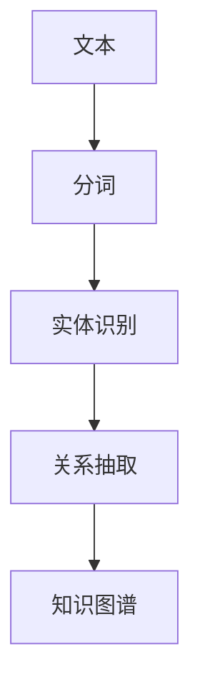
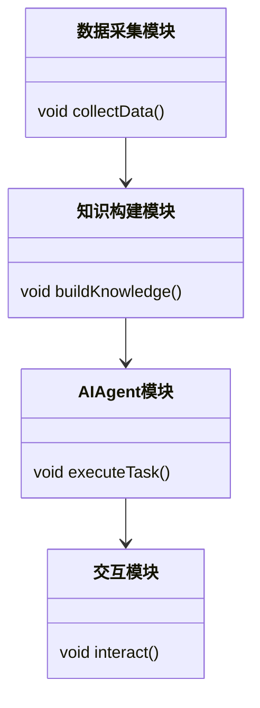
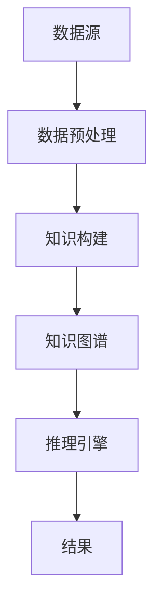

                 


# 企业AI Agent的知识图谱应用策略

> 关键词：企业AI Agent，知识图谱，人工智能，智能化系统，知识管理

> 摘要：本文深入探讨了企业AI Agent与知识图谱的结合应用策略，分析了知识图谱在企业智能化中的关键作用，详细讲解了核心算法原理、系统架构设计以及实际项目案例，为企业智能化转型提供了有力的技术支持。

---

## 第1章: 企业AI Agent与知识图谱概述

### 1.1 问题背景与定义
#### 1.1.1 企业AI Agent的定义与特点
- **定义**：企业AI Agent是一种智能代理系统，能够感知企业环境、执行任务并优化决策。
- **特点**：
  - **自主性**：无需人工干预。
  - **反应性**：实时响应环境变化。
  - **学习能力**：通过数据优化行为。
  - **协作性**：与其他系统或人类协同工作。

#### 1.1.2 知识图谱的定义与特点
- **定义**：知识图谱是结构化的语义网络，描述实体及其关系。
- **特点**：
  - **可扩展性**：支持大规模数据。
  - **语义丰富性**：包含实体属性和关系。
  - **动态性**：支持实时更新。

#### 1.1.3 两者的结合与应用前景
- **结合方式**：知识图谱为AI Agent提供语义理解能力，AI Agent利用知识图谱进行推理和决策。
- **应用前景**：广泛应用于问答系统、推荐系统、流程自动化等领域。

---

### 1.2 核心概念与问题描述
#### 1.2.1 企业AI Agent的核心要素
- **知识表示**：通过知识图谱表示企业信息。
- **推理引擎**：基于知识图谱进行推理。
- **交互接口**：与用户或系统交互。

#### 1.2.2 知识图谱的核心要素
- **实体**：企业中的概念或对象。
- **属性**：实体的特征。
- **关系**：实体间的联系。

#### 1.2.3 问题解决的边界与外延
- **边界**：聚焦于企业内部知识管理与推理。
- **外延**：扩展至跨企业知识共享。

---

### 1.3 核心概念的结构与联系
#### 1.3.1 核心概念的属性对比表
| 特性 | AI Agent | 知识图谱 |
|------|----------|----------|
| 核心功能 | 执行任务 | 表示知识 |
| 依赖 | 知识图谱 | 数据 |
| 输出 | 行为 | 结构化数据 |

#### 1.3.2 ER实体关系图
```mermaid
er
    actor: 企业AI Agent
    knowledge_graph: 知识图谱
    relation: 关系
    attribute: 属性
    actor --> knowledge_graph: 依赖
    knowledge_graph --> relation: 包含
    knowledge_graph --> attribute: 包含
```

---

## 第2章: 知识图谱与AI Agent的核心算法

### 2.1 知识抽取算法
#### 2.1.1 算法原理
- **分词**：将文本分割成词。
- **实体识别**：识别文本中的实体。
- **关系抽取**：识别实体间的联系。

#### 2.1.2 算法实现
```python
import spacy
nlp = spacy.load("en_core_web_sm")
doc = nlp("Apple is a company.")
for token in doc:
    print(token.text, token.pos_)
```

#### 2.1.3 流程图


---

### 2.2 知识推理算法
#### 2.2.1 算法原理
- **基于规则**：使用预定义规则进行推理。
- **基于学习**：利用机器学习模型进行推理。

#### 2.2.2 算法实现
```python
from pattern import *
text = "Water boils at 100°C."
print(findall(simple_prepositions, text))
```

#### 2.2.3 数学模型
- **规则推理**：
  \[
  \text{如果 } A \text{ 和 } B \text{ 关联，那么 } A \text{ 的属性影响 } B。
  \]
- **学习推理**：使用图神经网络进行关系推理。

---

## 第3章: 系统分析与架构设计

### 3.1 问题场景介绍
- **场景**：企业内部知识管理与决策支持。

### 3.2 系统功能设计
#### 3.2.1 功能模块
- **数据采集模块**：收集企业数据。
- **知识构建模块**：构建知识图谱。
- **AI Agent模块**：执行任务。
- **交互模块**：与用户交互。

#### 3.2.2 领域模型类图


---

### 3.3 系统架构设计
#### 3.3.1 系统架构图


#### 3.3.2 接口设计
- **查询接口**：获取知识图谱数据。
- **推理接口**：执行推理任务。

---

## 第4章: 项目实战

### 4.1 项目介绍
- **名称**：智能问答系统。
- **目标**：利用知识图谱构建问答系统。

### 4.2 核心代码实现
#### 4.2.1 知识抽取代码
```python
from spacy.lang.zh import Chinese
nlp = spacy.load("zh_core_web_sm")
text = "自然语言处理是人工智能的一个分支。"
doc = nlp(text)
entities = [ent.text for ent in doc.ents]
print(entities)
```

#### 4.2.2 推理引擎代码
```python
def infer_relationships(entities, relations):
    for relation in relations:
        print(f"{relation[0]} {relation[1]} {relation[2]}")
```

### 4.3 案例分析
- **数据来源**：企业文档。
- **知识图谱构建**：构建企业术语表。
- **AI Agent应用**：实现智能问答功能。

---

## 第5章: 最佳实践与总结

### 5.1 关键点总结
- **数据质量**：知识图谱构建的基础。
- **模型选择**：根据任务选择合适算法。
- **性能优化**：提升推理效率。

### 5.2 注意事项
- **数据隐私**：确保数据安全。
- **模型更新**：及时更新知识图谱。
- **可扩展性**：设计可扩展的系统架构。

### 5.3 小结
企业AI Agent与知识图谱的结合为企业智能化提供了强大支持，通过合理设计和优化，可以显著提升企业效率和决策能力。

---

## 第6章: 拓展阅读与未来方向

### 6.1 拓展阅读
- 推荐书籍：《知识图谱实战》。
- 推荐文章：《深度学习中的知识图谱应用》。

### 6.2 未来研究方向
- **动态知识图谱**：支持实时更新。
- **多模态知识表示**：结合图像、语音等多种数据。
- **可解释性AI**：提升AI决策的透明性。

---

## 结语
企业AI Agent与知识图谱的结合为企业智能化转型提供了强大工具。通过深入了解知识图谱的构建与应用，企业可以更好地利用AI技术提升竞争力。未来，随着技术进步，知识图谱在企业中的应用将更加广泛和深入。

--- 

* THE END *

