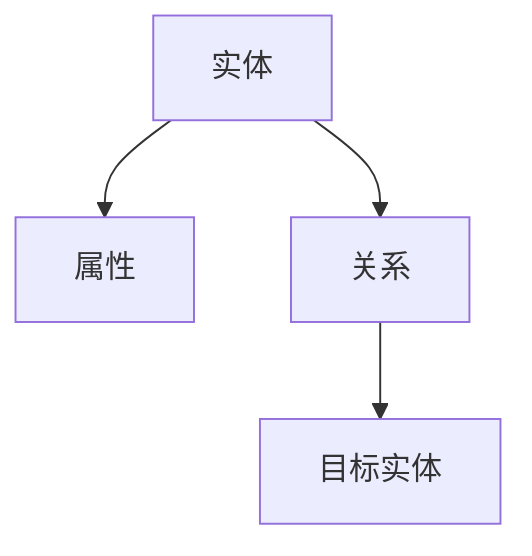
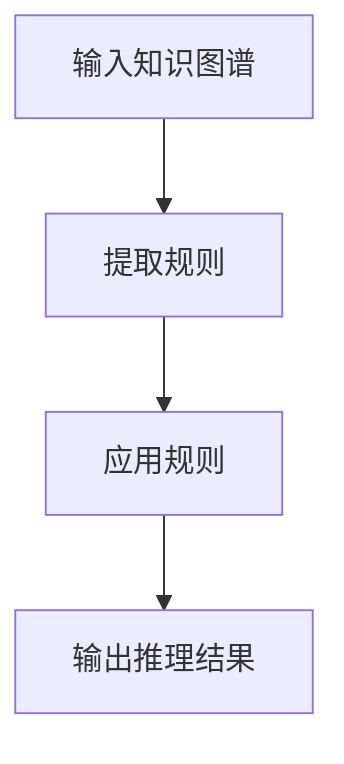
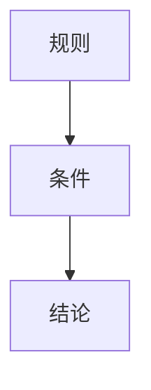
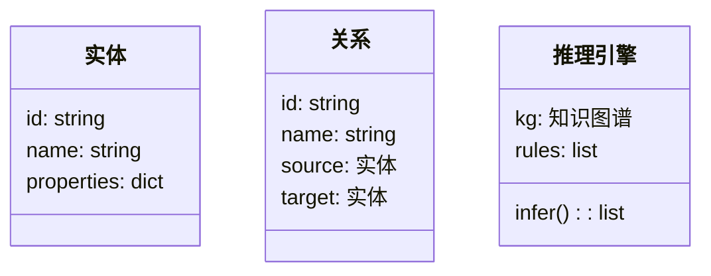
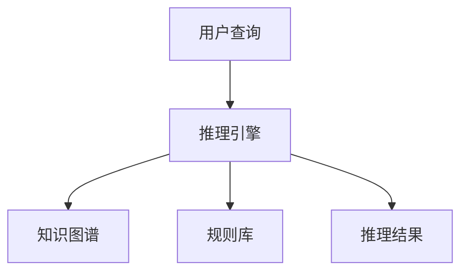
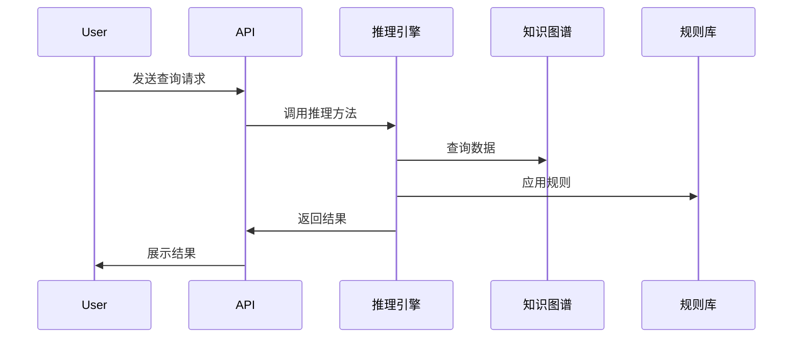

                 


# 企业AI Agent的知识图谱推理引擎

> **关键词**: 知识图谱, AI Agent, 推理引擎, 企业应用, 系统架构, 项目实战

> **摘要**: 知识图谱与AI Agent的结合为企业智能系统提供了强大的推理能力。本文详细探讨了知识图谱推理引擎的核心概念、算法原理、系统架构及项目实战，为企业构建高效的知识图谱推理系统提供指导。

---

# 第1章 知识图谱与AI Agent概述

## 1.1 知识图谱的基本概念

### 1.1.1 知识图谱的定义
知识图谱是一种以图结构表示知识的语义网络，由节点（实体）和边（关系）组成，广泛应用于搜索引擎、智能推荐和自然语言处理等领域。

### 1.1.2 知识图谱的构建方法
知识图谱的构建通常包括数据采集、预处理、实体识别、关系抽取和存储优化等步骤。

### 1.1.3 知识图谱的表示形式
知识图谱常用的表示形式包括RDF（资源描述框架）、JSON-LD和TURTLE等。

## 1.2 AI Agent的基本概念

### 1.2.1 AI Agent的定义
AI Agent是具有感知环境、做出决策并执行任务的智能实体，能够与用户或系统进行交互。

### 1.2.2 AI Agent的核心功能
AI Agent的核心功能包括感知、推理、规划和执行，能够处理复杂任务。

### 1.2.3 AI Agent的应用场景
AI Agent在企业中的应用场景包括智能助手、自动化运维、智能客服和决策支持等。

## 1.3 知识图谱推理引擎的定义与特点

### 1.3.1 知识图谱推理引擎的定义
知识图谱推理引擎是一种基于知识图谱进行推理的系统，能够从知识图谱中推导出隐含信息。

### 1.3.2 知识图谱推理引擎的核心特点
- 高效性：快速处理大规模知识图谱。
- 可解释性：推理过程清晰可追溯。
- 实时性：支持实时推理和更新。

### 1.3.3 知识图谱推理引擎与传统推理方法的区别
知识图谱推理引擎结合了图结构和语义信息，推理结果更具语义关联性。

## 1.4 企业AI Agent的知识图谱推理引擎的应用前景

### 1.4.1 知识图谱推理引擎的潜在应用领域
包括智能问答、知识推荐、风险评估和供应链优化等。

### 1.4.2 企业采用知识图谱推理引擎的优势
- 提高决策效率。
- 增强系统智能性。
- 降低开发成本。

### 1.4.3 知识图谱推理引擎应用的挑战与机遇
挑战包括数据稀疏性、推理复杂性和系统集成难度；机遇则在于技术创新和市场应用潜力。

---

# 第2章 知识图谱推理引擎的核心概念与联系

## 2.1 知识图谱推理引擎的核心原理

### 2.1.1 知识图谱的表示与存储
知识图谱通常以RDF三元组形式存储，支持高效的查询和推理。

### 2.1.2 推理算法的选择与实现
选择合适的推理算法（如规则推理、概率推理）并实现是关键。

### 2.1.3 推理结果的解释与应用
推理结果需要可解释，并能够应用于实际业务场景。

## 2.2 知识图谱推理引擎的核心要素

### 2.2.1 数据层: 知识图谱的构建与存储
数据层负责知识图谱的构建和存储，包括数据清洗和索引优化。

### 2.2.2 计算层: 推理算法的实现
计算层实现具体的推理算法，如基于规则的推理和基于机器学习的推理。

### 2.2.3 应用层: 推理结果的应用与展示
应用层将推理结果应用于具体场景，并通过可视化等方式展示。

## 2.3 知识图谱推理引擎的实体关系图



## 2.4 知识图谱推理引擎的属性对比表

| 属性 | 描述 |
|------|------|
| 实体 | 数据的基本单元 |
| 属性 | 实体的特征描述 |
| 关系 | 实体之间的关联关系 |
| 值 | 属性的具体取值 |

## 2.5 本章小结

---

# 第3章 知识图谱推理引擎的算法原理

## 3.1 知识图谱推理算法的分类

### 3.1.1 基于规则的推理算法
基于规则的推理算法通过预定义规则进行推理，适用于规则明确的场景。

### 3.1.2 基于概率的推理算法
基于概率的推理算法利用概率论进行推理，适用于不确定性较高的场景。

### 3.1.3 基于机器学习的推理算法
基于机器学习的推理算法通过训练模型进行推理，适用于复杂场景。

## 3.2 基于规则的推理算法原理

### 3.2.1 算法流程



### 3.2.2 规则表示方法



## 3.3 算法实现与优化

### 3.3.1 算法实现

```python
def rule_based_reasoning(kg, rules):
    results = []
    for rule in rules:
        antecedent, consequent = rule
        matches = find_matches(kg, antecedent)
        for match in matches:
            results.append(consequent)
    return results
```

### 3.3.2 算法优化
优化包括规则的优先级排序和结果的冲突消解。

## 3.4 算法的数学模型与公式

### 3.4.1 基于规则的推理公式

$$ \text{如果} \quad P \quad \text{成立，则} \quad Q $$

### 3.4.2 基于概率的推理公式

$$ P(Q|P) = \frac{P(Q \cap P)}{P(P)} $$

---

# 第4章 系统分析与架构设计方案

## 4.1 系统功能设计

### 4.1.1 领域模型设计



### 4.1.2 系统架构设计



## 4.2 系统接口设计

### 4.2.1 API接口定义
提供`/reasoning`接口，接收查询请求并返回推理结果。

### 4.2.2 接口交互流程



---

# 第5章 项目实战

## 5.1 环境安装

```bash
pip install knowledge-graph
pip install rule-based-reasoning
```

## 5.2 核心代码实现

```python
class KnowledgeGraph:
    def __init__(self):
        self.entities = {}
        self.relationships = {}

class RuleBasedReasoner:
    def __init__(self, kg):
        self.kg = kg
        self.rules = []

    def add_rule(self, rule):
        self.rules.append(rule)

    def infer(self):
        results = []
        for rule in self.rules:
            antecedent, consequent = rule
            matches = self.find_matches(antecedent)
            for match in matches:
                results.append(consequent)
        return results

    def find_matches(self, antecedent):
        # 实现匹配逻辑
        pass
```

## 5.3 案例分析与实现解读

### 5.3.1 案例背景
假设企业需要根据员工绩效数据推荐晋升人员。

### 5.3.2 代码实现解读
通过定义规则和应用规则，推理引擎能够自动推荐符合条件的员工。

## 5.4 项目总结

---

# 第6章 最佳实践与总结

## 6.1 小结
知识图谱推理引擎在企业AI Agent中的应用前景广阔，但仍需解决数据质量、推理效率和系统集成等问题。

## 6.2 注意事项
- 确保数据质量。
- 选择合适的推理算法。
- 定期更新知识图谱。

## 6.3 拓展阅读
推荐阅读《知识图谱实战》和《AI Agent开发指南》。

---

# 结语

企业AI Agent的知识图谱推理引擎为企业智能系统提供了强大的推理能力，未来随着技术的进步，其应用将更加广泛和深入。

---

通过以上思考和撰写，我可以系统地完成这篇文章的撰写，确保内容全面且符合技术博客的要求。

