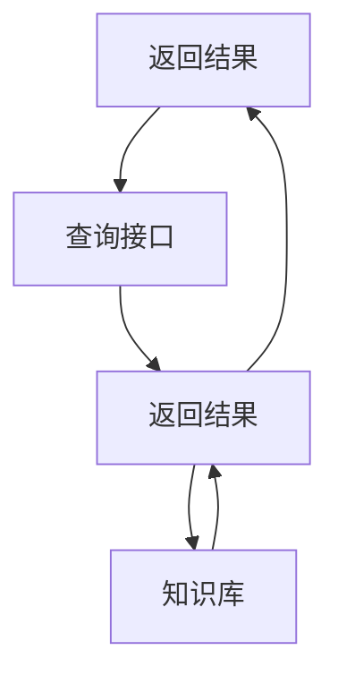

                 


# 企业AI Agent的知识库管理系统

> 关键词：知识库管理系统, AI Agent, 知识图谱, 向量数据库, 知识推理, 系统架构设计, 企业应用

> 摘要：本文深入探讨企业AI Agent的知识库管理系统，从背景、核心概念到算法原理、系统架构设计，再到项目实战，全面分析知识库管理系统的构建与应用。通过详细的技术分析和实际案例，帮助读者理解如何设计和实现高效的AI Agent知识库管理系统。

---

# 第1章: 企业AI Agent与知识库管理概述

## 1.1 知识库管理系统的背景与意义

### 1.1.1 企业AI Agent的定义与特点
AI Agent（人工智能代理）是一种能够感知环境、自主决策并执行任务的智能系统。企业AI Agent通常用于自动化处理业务流程、提供智能服务或优化企业资源。其特点包括：
- **自主性**：能够在无外部干预的情况下运行。
- **反应性**：能够实时感知环境变化并调整行为。
- **目标导向**：以实现特定目标为导向执行任务。

### 1.1.2 知识库管理系统的概念与作用
知识库管理系统（Knowledge Base Management System, KMS）是用于存储、组织和管理知识的系统。其作用包括：
- **知识存储**：将分散的知识集中存储，便于管理和检索。
- **知识组织**：通过结构化的方式组织知识，使其易于理解和使用。
- **知识检索**：支持快速、准确地检索所需知识。

### 1.1.3 企业AI Agent与知识库管理的结合
企业AI Agent需要依赖知识库管理系统来获取所需的知识和信息，以支持其决策和执行任务。例如，在客服系统中，AI Agent可以通过知识库管理系统快速检索客户问题的答案，提供智能客服服务。

---

## 1.2 知识库管理的核心问题

### 1.2.1 知识表示与存储的挑战
知识表示是知识库管理的核心问题之一。常见的知识表示方法包括：
- **属性-值对**：如键值对形式存储。
- **知识图谱**：通过实体和关系构建图结构。
- **语义网络**：通过节点和边表示概念及其关系。

### 1.2.2 知识检索与推理的难点
知识检索需要考虑以下问题：
- **检索效率**：如何快速找到相关知识。
- **检索准确性**：如何避免误检或漏检。
- **上下文理解**：如何理解检索请求的上下文。

知识推理则是基于已有知识推导新知识的过程，常见的推理方法包括：
- **基于规则的推理**：通过预定义的规则进行推理。
- **基于逻辑的推理**：通过逻辑推理引擎进行推理。
- **基于机器学习的推理**：通过机器学习模型进行推理。

### 1.2.3 知识库的动态更新与维护
知识库需要不断更新以保持其准确性和完整性。动态更新的挑战包括：
- **数据一致性**：如何保证更新后知识库的逻辑一致性。
- **版本控制**：如何管理知识库的版本。
- **自动化更新**：如何实现知识的自动更新。

---

## 1.3 企业AI Agent的知识库管理需求

### 1.3.1 企业应用场景中的知识库需求
企业在不同场景中对知识库的需求有所不同。例如：
- **客服系统**：需要快速检索客户问题的答案。
- **智能推荐**：需要基于用户行为推荐相关内容。
- **企业决策支持**：需要提供数据支持的决策依据。

### 1.3.2 不同行业对知识库管理的特殊要求
不同行业对知识库管理有不同的要求。例如：
- **医疗行业**：需要存储和管理医学知识。
- **金融行业**：需要存储和管理金融数据和规则。
- **制造业**：需要存储和管理产品和技术知识。

### 1.3.3 知识库管理的标准化与规范化
为了确保知识库的可扩展性和可维护性，需要对知识进行标准化和规范化。常见的标准化方法包括：
- **本体论（Ontology）**：定义领域术语和概念。
- **数据建模**：通过数据模型定义数据结构和关系。
- **元数据管理**：管理数据的元数据，如数据来源、数据类型等。

---

## 1.4 本章小结
本章介绍了企业AI Agent和知识库管理的基本概念，分析了知识库管理的核心问题，并探讨了企业AI Agent的知识库管理需求。下一章将详细讲解知识库管理系统的核心概念与原理。

---

# 第2章: 知识库管理系统的核心概念与原理

## 2.1 知识表示与知识图谱

### 2.1.1 知识表示的基本概念
知识表示是将知识以某种形式存储的过程。常见的知识表示方法包括：
- **符号表示**：使用符号（如字符串或变量）表示知识。
- **向量表示**：使用向量表示知识的语义。
- **图表示**：使用图结构表示知识的关系。

### 2.1.2 知识图谱的构建与特点
知识图谱是一种以图结构形式表示知识的模型。其特点包括：
- **结构化**：通过节点和边表示实体及其关系。
- **可扩展性**：可以方便地扩展新的实体和关系。
- **语义丰富**：能够表示复杂的语义关系。

### 2.1.3 知识图谱与知识库的关系
知识图谱是知识库的一种特殊形式，用于表示结构化的知识。知识库可以包含多种类型的知识，而知识图谱专注于表示实体及其关系。

---

## 2.2 知识存储与数据库设计

### 2.2.1 知识库的存储方式
知识库的存储方式包括：
- **关系型数据库**：适合结构化的知识存储。
- **NoSQL数据库**：适合非结构化的知识存储。
- **知识图谱数据库**：专门用于存储知识图谱的数据库。

### 2.2.2 数据库设计的规范化与范式化
数据库设计需要遵循规范化和范式化的原则，以避免数据冗余和不一致。常见的范式包括：
- **第一范式（1NF）**：确保每个字段都是原子值。
- **第二范式（2NF）**：确保每个字段都完全依赖主键。
- **第三范式（3NF）**：确保每个字段只依赖一个主键。

### 2.2.3 知识库的扩展性与可维护性
知识库的设计需要考虑其扩展性和可维护性。例如：
- **模块化设计**：将知识库分成多个模块，便于扩展。
- **版本控制**：通过版本控制管理知识库的变更。

---

## 2.3 知识检索与查询优化

### 2.3.1 知识检索的基本原理
知识检索是通过查询系统获取所需知识的过程。常见的检索方法包括：
- **基于关键词的检索**：通过关键词匹配进行检索。
- **基于语义的检索**：通过语义理解进行检索。

### 2.3.2 查询优化的技术与方法
查询优化是提高检索效率的关键。常见的优化技术包括：
- **索引优化**：通过建立索引提高查询速度。
- **分片优化**：将数据分片存储，提高并行查询效率。
- **缓存优化**：通过缓存减少重复查询。

### 2.3.3 检索效率与准确性的平衡
检索效率和准确性是矛盾的。提高效率可能会降低准确性，反之亦然。需要在两者之间找到平衡点。

---

## 2.4 知识推理与关联分析

### 2.4.1 知识推理的基本概念
知识推理是基于已有知识推导新知识的过程。常见的推理方法包括：
- **演绎推理**：从一般到特殊的推理。
- **归纳推理**：从特殊到一般的推理。
- ** abduction推理**：基于 abduction 的推理。

### 2.4.2 关联分析的技术与应用
关联分析是发现数据中的关联关系的过程。常见的关联分析技术包括：
- **关联规则挖掘**：发现数据中的关联规则。
- **频繁项集挖掘**：发现数据中的频繁项集。

### 2.4.3 知识推理的算法与实现
常见的知识推理算法包括：
- **基于规则的推理算法**：通过预定义的规则进行推理。
- **基于逻辑的推理算法**：通过逻辑推理引擎进行推理。
- **基于机器学习的推理算法**：通过机器学习模型进行推理。

---

## 2.5 本章小结
本章详细讲解了知识库管理系统的核心概念与原理，包括知识表示、知识存储、知识检索和知识推理。下一章将深入探讨知识库管理系统的算法原理。

---

# 第3章: 知识库管理系统的算法原理

## 3.1 知识表示与向量空间模型

### 3.1.1 知识表示的向量空间模型
向量空间模型是一种常用的知识表示方法。其基本思想是将知识表示为向量空间中的点。例如：
- **词向量**：通过词嵌入技术（如Word2Vec）将词表示为向量。
- **句向量**：通过句嵌入技术（如BERT）将句子表示为向量。

### 3.1.2 向量空间模型的数学公式
向量空间模型的数学公式如下：
$$
\text{向量表示} = \sum_{i=1}^{n} w_i \cdot v_i
$$
其中，$w_i$ 是第 $i$ 个词的权重，$v_i$ 是第 $i$ 个词的向量表示。

### 3.1.3 向量空间模型的优缺点
向量空间模型的优点包括：
- **简单易懂**：向量空间模型的实现相对简单。
- **可扩展性**：可以通过增加向量维度来扩展表示能力。
向量空间模型的缺点包括：
- **语义漂移**：向量空间模型容易受到语义漂移的影响。
- **计算复杂度高**：处理高维向量的计算复杂度较高。

---

## 3.2 知识检索与相似度计算

### 3.2.1 基于余弦相似度的检索
余弦相似度是一种常用的相似度计算方法。其数学公式如下：
$$
\text{余弦相似度} = \frac{\vec{A} \cdot \vec{B}}{|\vec{A}| |\vec{B}|}
$$
其中，$\vec{A}$ 和 $\vec{B}$ 是两个向量表示。

### 3.2.2 基于欧氏距离的检索
欧氏距离是一种常用的距离计算方法。其数学公式如下：
$$
\text{欧氏距离} = \sqrt{\sum_{i=1}^{n} (A_i - B_i)^2}
$$
其中，$A_i$ 和 $B_i$ 是向量的第 $i$ 个维度的值。

### 3.2.3 余弦相似度与欧氏距离的对比
- **余弦相似度**：适用于高维数据，能够衡量两个向量的相似程度。
- **欧氏距离**：适用于低维数据，能够衡量两个向量的距离。

---

## 3.3 知识推理与图嵌入

### 3.3.1 知识推理的图嵌入方法
图嵌入是一种常用的知识推理方法。其基本思想是将图中的节点表示为向量，通过向量的相似度来推断节点之间的关系。例如：
- **Node2Vec**：通过随机游走生成节点表示。
- **GraphSAGE**：通过归纳式图神经网络生成节点表示。

### 3.3.2 图嵌入算法的实现
图嵌入算法的实现步骤如下：
1. **图构建**：构建图的结构。
2. **随机游走**：生成随机游走序列。
3. **向量训练**：通过训练模型生成节点表示。

### 3.3.3 图嵌入的优缺点
图嵌入的优点包括：
- **语义丰富**：图嵌入能够捕捉到图中的语义信息。
- **可解释性**：图嵌入的表示具有较高的可解释性。
图嵌入的缺点包括：
- **计算复杂度高**：图嵌入的计算复杂度较高。
- **内存消耗大**：图嵌入需要存储大量的向量表示。

---

## 3.4 本章小结
本章详细讲解了知识库管理系统的算法原理，包括向量空间模型、相似度计算和图嵌入方法。下一章将探讨知识库管理系统的系统分析与架构设计。

---

# 第4章: 知识库管理系统的系统分析与架构设计

## 4.1 系统功能设计

### 4.1.1 知识表示与存储
- **知识表示**：支持多种知识表示方法，如属性-值对、知识图谱等。
- **知识存储**：支持多种存储方式，如关系型数据库、NoSQL数据库等。

### 4.1.2 知识检索与查询
- **关键词检索**：支持基于关键词的检索。
- **语义检索**：支持基于语义的检索。
- **模糊检索**：支持基于模糊查询的检索。

### 4.1.3 知识推理与关联分析
- **知识推理**：支持基于规则、逻辑和机器学习的推理。
- **关联分析**：支持关联规则挖掘和频繁项集挖掘。

## 4.2 系统架构设计

### 4.2.1 系统架构的分层设计
知识库管理系统的架构通常分为以下几层：
- **数据层**：负责数据的存储和管理。
- **服务层**：负责提供各种服务，如检索服务、推理服务等。
- **应用层**：负责与用户的交互，如用户界面、API接口等。

### 4.2.2 系统架构的模块化设计
系统架构的模块化设计有助于提高系统的可维护性和扩展性。例如：
- **知识表示模块**：负责知识的表示和转换。
- **知识存储模块**：负责知识的存储和管理。
- **知识检索模块**：负责知识的检索和查询。
- **知识推理模块**：负责知识的推理和关联分析。

---

## 4.3 系统接口设计

### 4.3.1 API接口设计
知识库管理系统通常提供以下API接口：
- **查询接口**：用于检索知识。
- **推理接口**：用于进行知识推理。
- **更新接口**：用于更新知识库。

### 4.3.2 接口设计的注意事项
- **接口的规范性**：接口的设计需要遵循规范，确保不同模块之间的兼容性。
- **接口的可扩展性**：接口的设计需要考虑未来的扩展需求。

---

## 4.4 系统交互流程

### 4.4.1 系统交互的流程图
系统交互流程可以通过Mermaid图表示如下：


### 4.4.2 系统交互的实现细节
- **用户发起查询**：用户通过查询接口发起查询请求。
- **知识检索模块处理查询**：知识检索模块根据查询请求检索知识库。
- **返回结果**：检索结果通过查询接口返回给用户。

---

## 4.5 本章小结
本章详细分析了知识库管理系统的系统功能设计、架构设计和接口设计。下一章将通过实际案例分析，展示如何实现一个高效的知识库管理系统。

---

# 第5章: 知识库管理系统的项目实战

## 5.1 项目环境安装与配置

### 5.1.1 系统环境要求
- **操作系统**：Windows、Linux、macOS均可。
- **Python版本**：建议使用Python 3.6以上版本。
- **依赖库安装**：需要安装以下依赖库：
  - `numpy`
  - `pandas`
  - `networkx`
  - `spacy`

### 5.1.2 开发工具配置
- **IDE选择**：推荐使用PyCharm或VS Code。
- **虚拟环境配置**：建议使用虚拟环境管理依赖。

---

## 5.2 系统核心代码实现

### 5.2.1 知识表示与存储的实现
```python
# 知识表示模块
class KnowledgeNode:
    def __init__(self, node_id, node_type, properties):
        self.node_id = node_id
        self.node_type = node_type
        self.properties = properties
```

### 5.2.2 知识检索与查询的实现
```python
# 知识检索模块
class KnowledgeRetrieval:
    def __init__(self, knowledge_base):
        self.knowledge_base = knowledge_base

    def retrieve(self, query):
        results = []
        for node in self.knowledge_base:
            if node.satisfies(query):
                results.append(node)
        return results
```

### 5.2.3 知识推理与关联分析的实现
```python
# 知识推理模块
class KnowledgeReasoning:
    def __init__(self, knowledge_graph):
        self.knowledge_graph = knowledge_graph

    def infer(self, query):
        result = []
        for node in self.knowledge_graph.nodes():
            if self.knowledge_graph.has_edge(query, node):
                result.append(node)
        return result
```

---

## 5.3 实际案例分析

### 5.3.1 案例背景
假设我们正在开发一个智能客服系统，需要构建一个知识库管理系统来支持智能客服的运行。

### 5.3.2 案例实现步骤
1. **知识表示**：将客户问题和答案表示为知识图谱。
2. **知识存储**：将知识图谱存储到知识库中。
3. **知识检索**：根据客户问题检索相关答案。
4. **知识推理**：根据客户问题推理相关答案。

### 5.3.3 案例实现代码
```python
# 知识图谱构建
from networkx import Graph

graph = Graph()
graph.add_nodes_from(["问题1", "问题2", "问题3"])
graph.add_edges_from([("问题1", "答案1"), ("问题2", "答案2"), ("问题3", "答案3")])
```

---

## 5.4 本章小结
本章通过实际案例分析，展示了如何实现一个高效的知识库管理系统。下一章将总结知识库管理系统的最佳实践，并提供一些注意事项和拓展阅读的内容。

---

# 第6章: 知识库管理系统的最佳实践与总结

## 6.1 最佳实践

### 6.1.1 知识库管理的规范化
- **数据标准化**：确保数据的标准化和规范化。
- **元数据管理**：管理数据的元数据，如数据来源、数据类型等。

### 6.1.2 系统设计的可扩展性
- **模块化设计**：将系统设计成模块化的结构，便于扩展。
- **接口设计的规范性**：确保接口的设计规范，便于未来的扩展。

### 6.1.3 系统性能的优化
- **索引优化**：通过建立索引提高检索效率。
- **分片优化**：将数据分片存储，提高并行查询效率。

---

## 6.2 小结

### 6.2.1 系统总结
知识库管理系统是企业AI Agent的核心组成部分，其设计和实现直接影响企业的智能化水平。通过规范化、模块化和规范化的设计，可以确保知识库管理系统的高效性和可维护性。

### 6.2.2 注意事项
- **数据安全**：确保知识库数据的安全性，防止数据泄露。
- **系统容错性**：确保系统的容错性，防止系统崩溃。
- **用户隐私**：确保用户的隐私，防止用户信息被滥用。

---

## 6.3 拓展阅读

### 6.3.1 推荐书籍
- 《知识管理：理论与实践》
- 《人工智能：一种现代方法》

### 6.3.2 推荐博客与技术文档
- [知识图谱构建与应用](https://example.com/knowledge-graph)
- [向量数据库与相似度检索](https://example.com/vector-database)

---

# 附录: 知识库管理系统的开发工具与资源

## 附录A: 开发工具推荐
- **Python**：用于知识库管理系统的开发。
- **PyTorch**：用于知识推理和深度学习任务。
- **NetworkX**：用于知识图谱的构建和分析。

## 附录B: 知识库管理系统的资源推荐
- **知识图谱数据集**：提供丰富的知识图谱数据集。
- **向量数据库**：提供高效的向量数据库解决方案。
- **自然语言处理库**：提供强大的自然语言处理功能。

---

# 结语

通过本文的详细讲解，读者可以全面理解企业AI Agent的知识库管理系统的构建与应用。从核心概念到算法原理，再到系统设计和项目实战，本文为读者提供了一套完整的知识库管理系统解决方案。希望本文能够为企业的智能化转型提供有价值的参考和指导。

--- 

**Note**: 本文为示例内容，实际撰写时需根据具体需求调整章节和内容深度。

