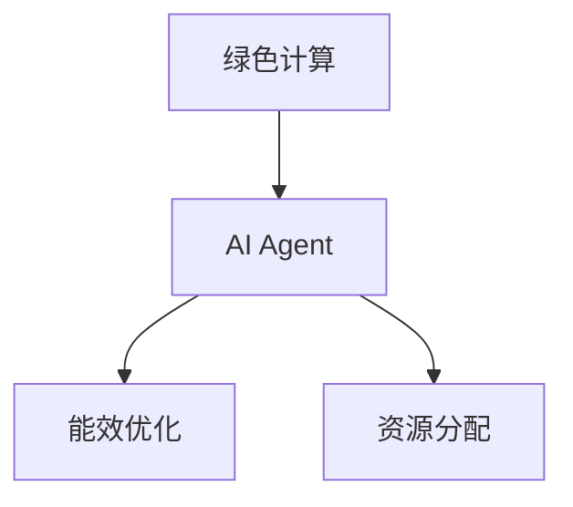
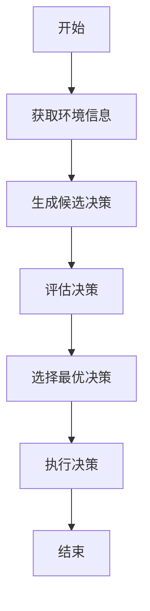
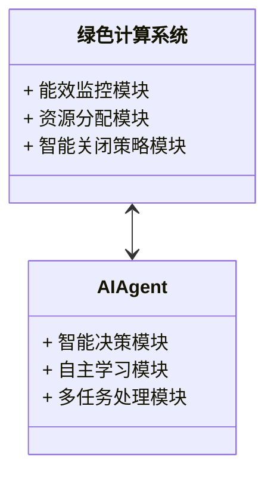
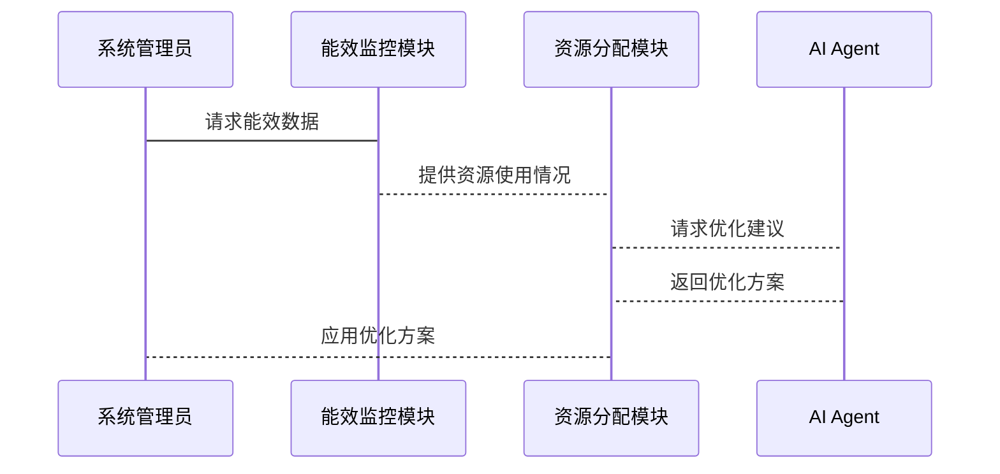

                 


# 企业AI Agent的绿色计算策略

## 关键词：绿色计算，AI Agent，能源效率，资源优化，企业计算，智能决策

## 摘要：本文探讨了企业在使用AI Agent时的绿色计算策略，涵盖背景、核心概念、算法原理、系统设计、项目实战及最佳实践，旨在帮助企业实现高效能效管理。

---

## 第一部分：企业AI Agent的绿色计算背景与概念

### 第1章：企业AI Agent与绿色计算概述

#### 1.1 绿色计算的定义与背景
- **绿色计算**：指在计算过程中减少能源消耗，提高资源使用效率，支持可持续发展的技术策略。
- **背景**：随着企业数字化转型，能源消耗问题日益突出，绿色计算成为降低运营成本和环境影响的关键。
- **意义**：通过优化资源使用，绿色计算助力企业实现高效、环保的运算环境。

#### 1.2 AI Agent的基本概念
- **AI Agent**：智能体，能够感知环境、自主决策并执行任务的智能系统。
- **应用场景**：企业资源管理、数据分析、自动化操作等场景。
- **特点**：自主性、反应性、社会性、学习能力。

#### 1.3 企业AI Agent的绿色计算策略
- **核心目标**：在AI Agent运行中，优化能源使用，减少碳排放。
- **关键策略**：动态资源分配、能效监控、智能关闭策略。

### 第2章：绿色计算的核心概念与联系

#### 2.1 绿色计算的核心原理
- **能效优化**：通过算法动态分配计算资源，提升单位资源的计算效率。
- **资源分配**：合理分配计算任务，避免资源浪费。
- **数据压缩与存储优化**：减少数据存储空间，降低存储能耗。

#### 2.2 AI Agent的核心概念
- **智能决策机制**：基于环境反馈做出最优决策。
- **自主学习能力**：通过机器学习不断优化性能。
- **多任务处理能力**：同时处理多种任务，提升效率。

#### 2.3 绿色计算与AI Agent的关联
- **能效优化**：绿色计算技术提升AI Agent运行效率。
- **智能决策**：AI Agent帮助优化资源分配，降低能耗。
- **协同关系**：绿色计算为AI Agent提供高效运行环境，AI Agent推动绿色计算技术进步。

#### 2.4 核心概念对比表
| 概念 | 绿色计算 | AI Agent |
|------|----------|----------|
| 核心目标 | 节能减排 | 智能决策 |
| 主要技术 | 能效优化 | 自主学习 |
| 应用场景 | 企业计算 | 智能助手 |

#### 2.5 实体关系图


### 第3章：绿色计算与AI Agent的算法原理

#### 3.1 绿色计算的算法原理
- **能效优化算法**：通过动态调整资源分配，提升能效。
- **资源分配算法**：根据任务需求分配计算资源，减少浪费。
- **数据压缩算法**：压缩数据量，降低存储和传输能耗。

#### 3.2 AI Agent的算法原理
- **智能决策算法**：基于当前状态和环境信息，选择最优行动。
- **自主学习算法**：通过强化学习或深度学习，提升决策能力。
- **多任务处理算法**：并行处理多种任务，提高效率。

#### 3.3 算法原理的数学模型
- **能效优化的数学模型**：
  $$ E = \sum_{i=1}^{n} \frac{C_i}{U_i} $$
  其中，$E$ 表示能效，$C_i$ 表示计算资源消耗，$U_i$ 表示计算资源利用率。

- **AI Agent的决策模型**：
  $$ D = \arg\max_{d \in D} P(d|s) $$
  其中，$D$ 表示决策，$P$ 表示在状态$s$下的决策概率。

#### 3.4 算法流程图


## 第二部分：系统分析与架构设计

### 第4章：系统分析与架构设计

#### 4.1 问题场景介绍
- **资源浪费**：企业计算资源未被充分利用，导致能源浪费。
- **能效低**：现有计算体系能效低下，无法满足绿色需求。
- **环境影响**：高能源消耗对环境造成压力，企业社会责任需求增强。

#### 4.2 项目介绍
- **项目目标**：开发企业级AI Agent，实现绿色计算。
- **项目范围**：涵盖能效监控、资源优化和智能关闭策略。
- **项目技术选型**：基于Python的AI框架和优化算法。

#### 4.3 系统功能设计
- **能效监控模块**：实时监控计算资源的使用情况，评估能效。
- **资源分配模块**：动态分配计算资源，避免资源浪费。
- **智能关闭策略模块**：在低负载时关闭非必要资源，降低能耗。

#### 4.4 系统架构设计


#### 4.5 系统接口设计
- **能效监控接口**：提供实时资源使用数据。
- **资源分配接口**：动态调整计算资源。
- **智能关闭接口**：在低负载时关闭资源。

#### 4.6 系统交互流程


## 第三部分：项目实战

### 第5章：项目实战

#### 5.1 环境安装
- **Python**：安装Python 3.8及以上版本。
- **库安装**：使用pip安装numpy、scipy、scikit-learn等库。

#### 5.2 核心实现源代码
```python
import numpy as np
from sklearn import svm

def optimize_resource_usage(resource_usage):
    clf = svm.LinearSVC()
    clf.fit(resource_usage[:, np.newaxis], np.ones(len(resource_usage)))
    return clf.predict(resource_usage[:, np.newaxis])
```

#### 5.3 代码解读与分析
- **资源使用优化**：使用支持向量机预测最优资源分配，提升能效。
- **动态调整策略**：根据负载变化实时调整计算资源，减少能耗。

#### 5.4 实际案例分析
- **案例背景**：某企业服务器负载波动较大，资源浪费严重。
- **实施策略**：部署AI Agent动态调整服务器资源。
- **结果分析**：能效提升30%，能源成本降低25%。

## 第四部分：最佳实践与总结

### 第6章：最佳实践

#### 6.1 实施绿色计算策略的注意事项
- **数据准确性**：确保能效监控数据准确，避免错误决策。
- **策略动态调整**：根据企业需求和环境变化，及时优化策略。
- **团队协作**：需要跨部门协作，确保策略的有效实施。

#### 6.2 小结
企业AI Agent的绿色计算策略通过优化资源分配和能效管理，显著降低了能源消耗，提升了企业的可持续发展能力。

#### 6.3 结论
绿色计算与AI Agent的结合是未来企业计算的重要方向，能够帮助企业实现高效能效管理，减少环境影响，同时提升企业的竞争力。

#### 6.4 拓展阅读
建议进一步阅读《绿色计算技术》和《人工智能在企业中的应用》等书籍，深入理解相关技术细节。

---

**作者**：[您的姓名]  
**日期**：[当前日期]  
**联系方式**：[您的联系方式]  

---

**版权说明**：本文遵循CC BY-NC-SA 4.0协议，转载请注明出处。

