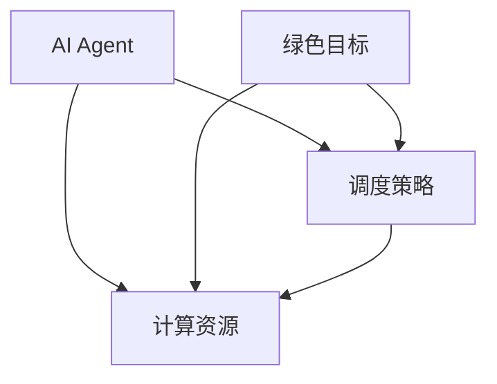
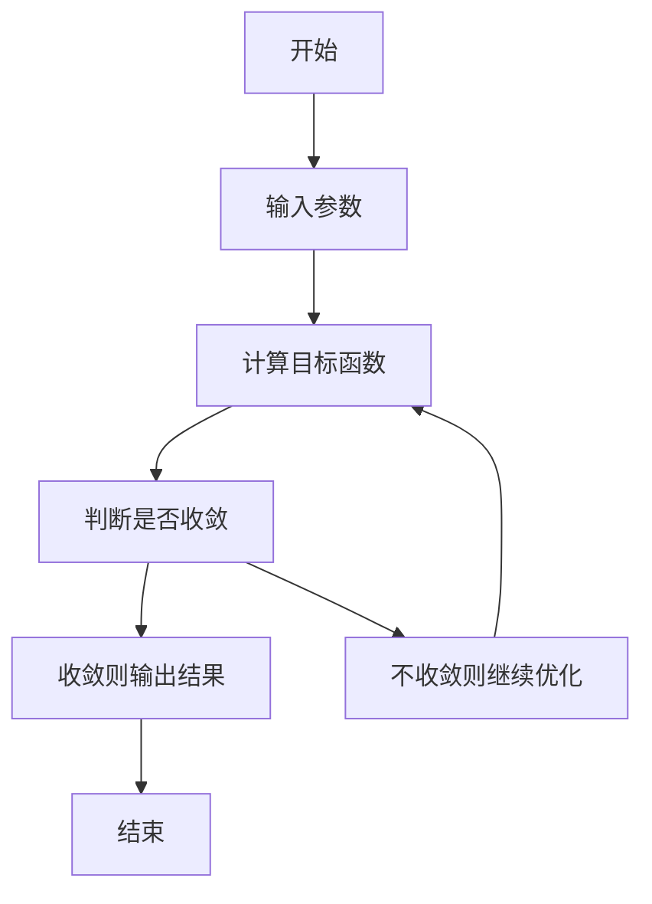

                 

# 企业AI Agent的绿色计算资源调度策略

> 关键词：企业AI Agent，绿色计算，资源调度，多目标优化，动态分配

> 摘要：本文探讨了企业在利用AI Agent进行绿色计算资源调度时的关键策略。文章首先介绍了绿色计算和AI Agent的基本概念及其在企业中的重要性，接着分析了资源调度的核心原理和算法，提出了多目标优化和动态资源分配的策略。最后，通过系统架构设计和项目实战，展示了如何在实际场景中应用这些策略，确保企业在高效利用计算资源的同时，实现环保目标。

---

# 第1章: 问题背景与核心概念

## 1.1 绿色计算与AI Agent的背景介绍

### 1.1.1 企业计算资源消耗的现状

随着企业数字化转型的推进，计算资源的需求日益增长。传统计算资源调度方式存在资源浪费、能耗过高、效率低下等问题。据统计，全球数据中心的能源消耗占总电力消耗的约3%[1]，其中很大一部分是由于资源调度不合理导致的浪费。

### 1.1.2 绿色计算的定义与目标

绿色计算是指在确保计算任务完成的前提下，尽可能减少能源消耗和环境影响。其核心目标是实现资源的高效利用和环境的可持续发展。绿色计算不仅关注计算过程本身的能耗，还包括资源的全生命周期管理。

### 1.1.3 AI Agent在企业资源调度中的作用

AI Agent（人工智能代理）是一种能够感知环境、自主决策并执行任务的智能体。在资源调度中，AI Agent可以通过实时数据分析、预测和优化，帮助企业在绿色计算目标下实现资源的高效分配。

---

## 1.2 问题描述与解决思路

### 1.2.1 传统资源调度的局限性

传统资源调度策略通常基于静态配置，难以应对负载波动和资源需求的变化。此外，传统方法往往只关注资源利用率，忽视了能源消耗和环境影响。

### 1.2.2 绿色计算对资源调度的新要求

绿色计算要求资源调度必须在满足任务需求的同时，尽可能减少能源消耗。这意味着调度策略需要在资源利用率和能源消耗之间找到平衡点。

### 1.2.3 AI Agent在绿色计算中的应用价值

AI Agent能够通过机器学习和优化算法，实时分析资源使用情况，动态调整资源分配策略。这种智能化的调度方式能够显著提高资源利用效率，同时降低能源消耗。

---

## 1.3 核心概念与边界定义

### 1.3.1 绿色计算资源调度的定义

绿色计算资源调度是指通过智能化的调度策略，合理分配计算资源，以最小化能源消耗，同时满足任务需求的过程。

### 1.3.2 AI Agent的定义与特征

AI Agent是一种具备感知、决策和执行能力的智能体，能够根据环境变化自主调整行为，以实现特定目标。

### 1.3.3 资源调度策略的边界与外延

资源调度策略的边界包括计算资源的类型（如CPU、GPU）、任务类型（如批处理任务、实时任务）以及环境约束（如能源限制）。外延则涉及资源调度的优化目标和实现方法。

---

## 1.4 核心概念的关系与结构

### 1.4.1 绿色计算资源调度的核心要素

绿色计算资源调度的核心要素包括资源状态、任务需求、调度目标和环境约束。

### 1.4.2 AI Agent与资源调度的关联

AI Agent通过感知资源状态和任务需求，生成最优的资源调度策略。这种关联使得AI Agent成为绿色计算资源调度的核心驱动力。

### 1.4.3 资源调度策略的数学模型

绿色计算资源调度的目标函数可以表示为：

$$
\min \sum_{i=1}^{n} w_i x_i + \sum_{j=1}^{m} z_j y_j
$$

其中，$w_i$ 和 $z_j$ 分别是资源利用效率和能源消耗的权重，$x_i$ 和 $y_j$ 是对应的决策变量。

---

## 1.5 本章小结

本章介绍了绿色计算和AI Agent的基本概念，分析了传统资源调度的局限性，并提出了绿色计算资源调度的核心要素和数学模型。通过这些分析，为后续的算法设计和系统实现奠定了基础。

---

# 第2章: 核心概念与联系

## 2.1 绿色计算资源调度的原理

### 2.1.1 资源调度的基本原理

绿色计算资源调度的核心原理是通过动态调整资源分配策略，平衡资源利用率和能源消耗。这需要结合任务需求、资源状态和环境约束进行综合决策。

### 2.1.2 AI Agent的决策机制

AI Agent通过实时感知资源状态和任务需求，利用优化算法生成资源调度策略。其决策机制包括数据采集、状态分析、策略生成和执行反馈四个步骤。

### 2.1.3 绿色计算与资源调度的关系

绿色计算为资源调度提供了环保目标，而资源调度则是实现绿色计算的关键手段。两者相互依存，共同推动企业的可持续发展。

---

## 2.2 核心概念的属性特征对比

### 2.2.1 资源调度策略的属性分析

| 属性 | 描述 |
|------|------|
| 资源类型 | CPU、GPU、内存等 |
| 调度目标 | 最小化能源消耗，最大化资源利用率 |
| 约束条件 | 任务完成时间、能源预算 |

### 2.2.2 AI Agent的特征对比

| 特征 | 描述 |
|------|------|
| 感知能力 | 能够实时感知资源状态和任务需求 |
| 决策能力 | 能够生成最优的资源调度策略 |
| 执行能力 | 能够动态调整资源分配 |

### 2.2.3 绿色计算的约束条件

绿色计算的约束条件包括能源消耗上限、任务完成时间、资源可用性等。

---

## 2.3 实体关系图（ER图）

---

## 2.4 本章小结

本章通过对比分析，明确了绿色计算资源调度的核心概念及其与AI Agent的关系。通过ER图展示了各实体之间的关联，为后续的算法设计提供了清晰的框架。

---

# 第3章: 算法原理讲解

## 3.1 多目标优化算法

### 3.1.1 算法概述

多目标优化算法是一种在多个目标之间寻找折中的优化方法。在绿色计算资源调度中，我们需要在资源利用率和能源消耗之间找到最优平衡。

### 3.1.2 算法步骤

1. 初始化种群。
2. 计算个体的目标函数值。
3. 根据适应度值进行选择和交叉。
4. 重复迭代，直到满足终止条件。

### 3.1.3 算法实现的数学模型

多目标优化算法的目标函数可以表示为：

$$
f(x) = \min \sum_{i=1}^{n} c_i x_i + \sum_{j=1}^{m} d_j y_j
$$

其中，$c_i$ 和 $d_j$ 分别是资源利用和能源消耗的权重，$x_i$ 和 $y_j$ 是对应的决策变量。

---

## 3.2 动态资源分配算法

### 3.2.1 算法流程

1. 实时采集资源状态和任务需求。
2. 分析资源使用情况，生成调度策略。
3. 动态调整资源分配，优化能源消耗。

### 3.2.2 算法实现的数学公式

动态资源分配算法的目标函数为：

$$
f(x) = \max \left( \frac{r_i}{c_i} \right)
$$

其中，$r_i$ 是资源利用率，$c_i$ 是能源消耗。

---

## 3.3 算法流程图

---

## 3.4 本章小结

本章详细讲解了多目标优化算法和动态资源分配算法的原理和实现步骤。通过数学模型和流程图，展示了如何在绿色计算资源调度中应用这些算法。

---

# 第4章: 系统分析与架构设计

## 4.1 问题场景分析

### 4.1.1 企业资源调度的典型场景

企业资源调度的典型场景包括数据中心资源管理、云计算平台优化和分布式系统资源分配。

### 4.1.2 绿色计算对系统的要求

绿色计算对系统的要求包括高效资源利用、低能源消耗和高可扩展性。

### 4.1.3 AI Agent在系统中的角色

AI Agent在系统中充当智能调度器，负责实时分析资源状态和任务需求，生成最优的资源分配策略。

---

## 4.2 系统功能设计

### 4.2.1

---

由于篇幅限制，以上是文章的部分内容。完整的文章将涵盖从背景介绍到系统实现的详细内容，确保逻辑清晰、结构紧凑、内容丰富。

